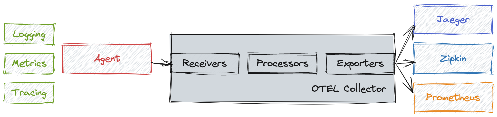
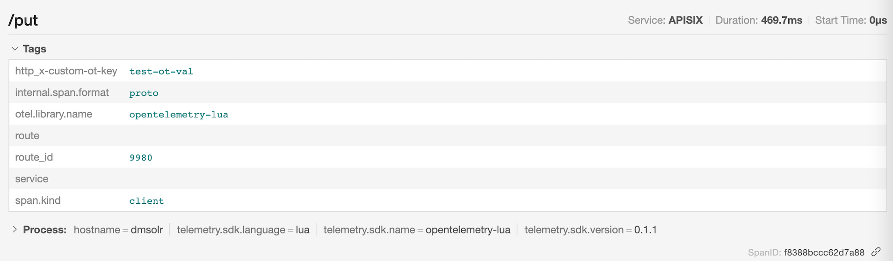
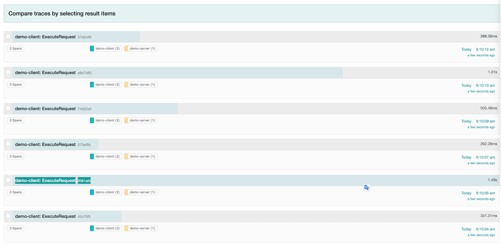
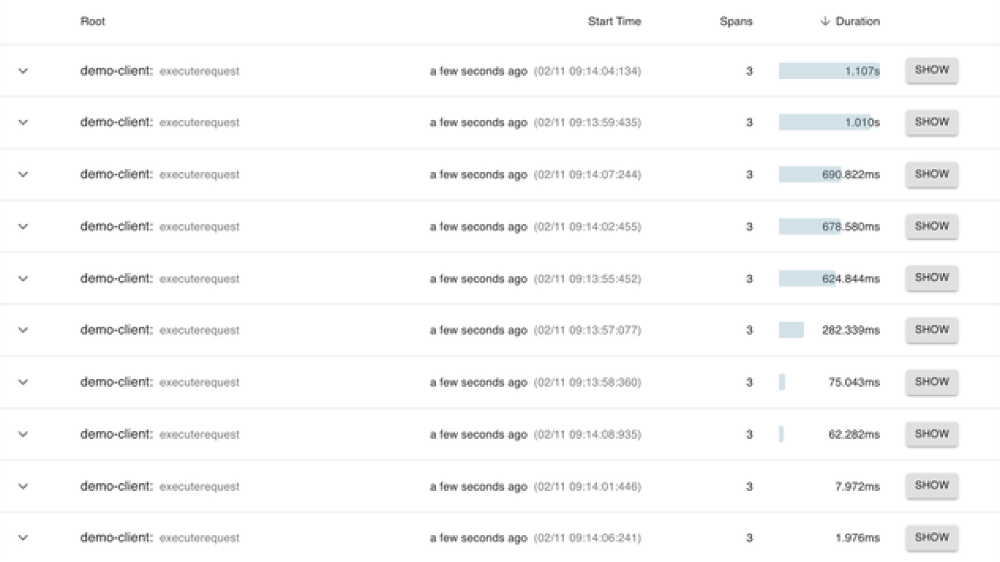
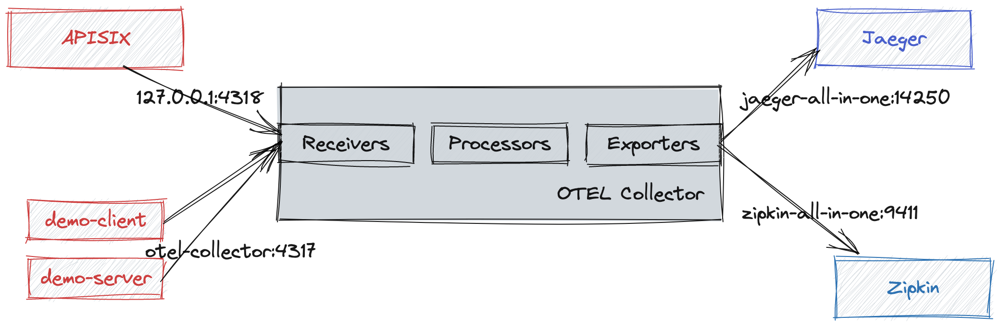
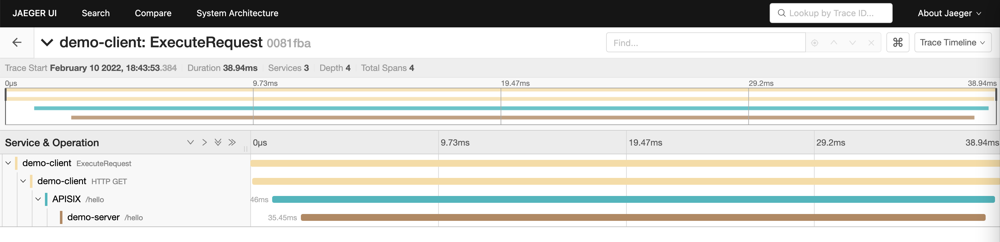
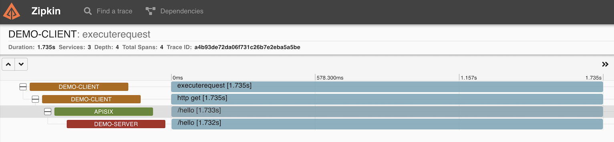
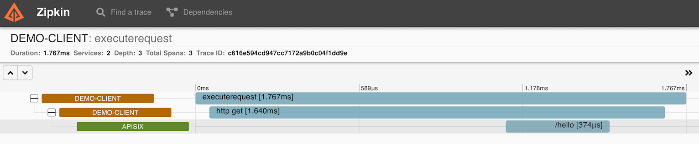
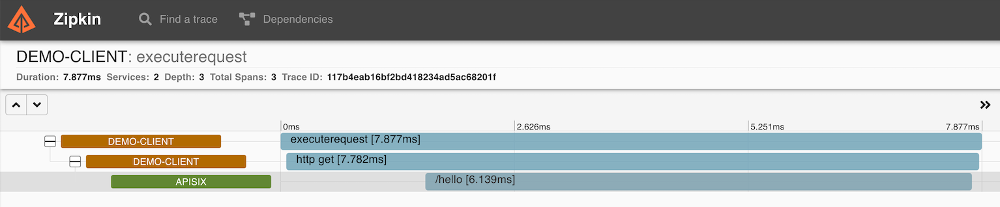

This article introduces the Apache APISIX's `opentelemetry` plugin concept and
how to enable and deploy the plugin.

## Background Information

OpenTelemetry is an open source telemetry data acquisition and processing
system. It not only provides various SDKs for application side telemetry data
collection and reporting, but also provides data collection side for data
receiving, processing, and exporting. Export to any or more OpenTelemetry
backends, such as Jaeger, Zipkin, and OpenCensus. You can view the list of
plugins that have adapted the OpenTelemetry Collector in the
[registry](/ecosystem/registry/?s=collector).



## Plugin Introduction

The `opentelemetry` plugin of Apache APISIX implements Tracing data collection
and sends it to OpenTelemetry Collector through HTTP protocol. Apache APISIX
starts to support this feature in v2.13.0.

One of OpenTelemetry's special features is that the agent/SDK of OpenTelemetry
is not locked with back-end implementation, which gives users flexibilities on
choosing their own back-end services. In other words, users can choose the
backend services they want, such as Zipkin and Jaeger, without affecting the
application side.

The `opentelemetry` plugin is located on the agent side. It integrates the
OpenTelemetry agent/SDK and adopts its features in Apache APISIX. It can collect
traced requests, generate `trace`, and forward them to the OpenTelemetry
Collector. It supports the `trace` protocol, and it will support the `logs` and
`metrics` protocols of OpenTelemetry in the next version.

## Enable the Plugin

You need to enable `opentelemetry` plugin and modify collector configuration in
`conf/config.yaml` configuration file.

We assume that you have already deployed the OpenTelemetry Collector on the same
node as the APISIX and enabled the
[OTLP HTTP Receiver](https://github.com/open-telemetry/opentelemetry-collector/blob/main/receiver/otlpreceiver/README.md).

> Need help completing deployment of the OpenTelemetry Collector? See the
> scenario [Example](#example) below.

The default port of the OTLP HTTP Receiver is `4318`, and the address of the
`collector` is the HTTP Receiver address of the OpenTelemetry Collector. For
related fields, see the
[Apache APISIX documentation](https://apisix.apache.org/docs/apisix/next/plugins/opentelemetry/).

A typical configuration might look like this:

```yaml
plugins:
  ... # Other plugins that have been enabled
  - opentelemetry
plugin_attr:
  ...
  opentelemetry:
    trace_id_source: x-request-id
    resource:
      service.name: APISIX
    collector:
      address: 127.0.0.1:4318 # OTLP HTTP Receiver address
      request_timeout: 3
```

### Method 1: Enable the Plugin for a Specific Route

In order to show the test effect more conveniently, `sampler` is temporarily set
to full sampling in the example to ensure that `trace` data is generated after
each request is traced, so that you can view `trace` related data on the Web UI.
You can also set relevant parameters according to the actual situation.

```shell
curl http://127.0.0.1:9080/apisix/admin/routes/1 \
  -H 'X-API-KEY: edd1c9f034335f136f87ad84b625c8f1' \
  -X PUT -d '
{
    "uri": "/get",
    "plugins": {
        "opentelemetry": {
            "sampler": {
                "name": "always_on"
            }
        }
    },
    "upstream": {
        "type": "roundrobin",
        "nodes": {
            "httpbin.org:80": 1
        }
    }
}'
```

### Method 2: Enable the Plugin Globally

You can also enable `opentelemetry` plugin through the Apache APISIX Plugins
feature. After the global configuration is complete, you still need to create
the route, otherwise it will not be possible to test.

```shell
curl 'http://127.0.0.1:9080/apisix/admin/global_rules/1' \
-H 'X-API-KEY: edd1c9f034335f136f87ad84b625c8f1' \
-X PUT -d '{
    "plugins": {
        "opentelemetry": {
            "sampler": {
                "name": "always_on"
            }
        }
    }
}'
```

### Method 3: Customize Labels for Span through additional_attributes

For the configuration of `sampler` and `additional_attributes`, see the
[Apache APISIX documentation](https://apisix.apache.org/docs/apisix/next/plugins/opentelemetry/#attributes),
where `additional_attributes` is a series of `Key:Value` pairs, you can use it
to customize the label for Span, and can follow Span to display on the Web UI.
Add `route_id` and `http_x-custom-ot-key` to the span of a route through
`additional_attributes`, see the following configuration:

```shell
curl http://127.0.0.1:9080/apisix/admin/routes/1001 \
  -H 'X-API-KEY: edd1c9f034335f136f87ad84b625c8f1' \
  -X PUT -d '
{
    "uri": "/put",
    "plugins": {
        "opentelemetry": {
            "sampler": {
                "name": "always_on"
            },
            "additional_attributes":[
                "route_id",
                "http_x-custom-ot-key"
            ]
        }
    },
    "upstream": {
        "type": "roundrobin",
        "nodes": {
            "httpbin.org:80": 1
        }
    }
}'
```

## Test and Verify the Plugin

You can enable `opentelemetry` plugin in any of the above three methods. The
following example uses the example of method three to create a route. After the
creation is successful, see the following commands to access the route:

```shell
curl -X PUT -H `x-custom-ot-key: test-ot-val` http://127.0.0.1:9080/put
```

After the access is successful, you can see the details of the span similar to
`/put` in the Jaeger UI, and you can see that the custom tags in the route are
displayed in the Tags list: `http_x-custom-ot-key` and `route_id`.



You need to note that the `additional_attributes` configuration is set to take
values from Apache APISIX and NGINX variables as `attribute` values, so
`additional_attributes` must be a valid Apache APISIX or NGINX variable. It also
includes HTTP Header, but when fetching http*header, you need to add
`http*`as the prefix of the variable name. If the variable does not exist, the`tag`
will not be displayed.

## Example

This scenario example deploys Collector, Jaeger, and Zipkin as backend services
by simply modifying the OpenTelemetry Collector example, and starts two sample
applications (Client and Server), where Server provides an HTTP service, and
Client will cyclically call the server provided by the server. HTTP interface,
resulting in a call chain consisting of two spans.

### Step 1: Deploy OpenTelemetry

The following uses `docker compose` as an example. For other deployments, see
[Getting Started](/docs/collector/getting-started/).

You can see the following command to deploy[^1]:

```shell
git clone https://github.com/open-telemetry/opentelemetry-collector-contrib.git
cd opentelemetry-collector-contrib/examples/demo
docker compose up -d
```

Visit <http://127.0.0.1:16886> (Jaeger UI) or <http://127.0.0.1:9411/zipkin>
(Zipkin UI) in your browser. If it can be accessed normally, the deployment is
successful.

The following screenshots show an example of successful access.





### Step 2: Configure the Test Environment

The Apache APISIX service is introduced, and the topology of the final
application is shown in the following figure.


The Trace data reporting process is as follows. Among them, since Apache APISIX
is deployed separately and not in the network of docker-compose, Apache APISIX
accesses the OTLP HTTP Receiver of OpenTelemetry Collector through the locally
mapped port (`127.0.0.1:4138`).



You need to make sure you have enabled the `opentelemetry` plugin and reload
Apache APISIX.

You can see the following example to create a route and enable
the`opentelemetry` plugin for sampling:

```shell
curl http://127.0.0.1:9080/apisix/admin/routes/1 \
-H 'X-API-KEY: edd1c9f034335f136f87ad84b625c8f1' \
-X PUT -d '
{
  "uri": "/hello",
  "plugins": {
      "opentelemetry": {
          "sampler": {
            "name": "always_on"
          }
      }
  },
  "upstream": {
      "type": "roundrobin",
      "nodes": {
          "127.0.0.1:7080": 1
      }
  }
}'
```

Modify the `./examples/demo/otel-collector-config.yaml` file to add the OTLP
HTTP Receiver.

```yaml
receivers:
otlp:
  protocols:
    grpc:
    http: ${ip:port} # add OTLP HTTP Receiver，default port is 4318
```

Modify `docker-compose.yaml` file.

You need to modify the configuration file, change the interface address of
Client calling Server to the address of Apache APISIX, and map the ports of OTLP
HTTP Receiver and Server services to local.

The following example is the complete `docker-compose.yaml` after the
configuration is modified:

```yaml
version: '2'
services:
  # Jaeger
  jaeger-all-in-one:
    image: jaegertracing/all-in-one:latest
    ports:
      - '16686:16686' # jaeger ui port
      - '14268'
      - '14250'

  # Zipkin
  zipkin-all-in-one:
    image: openzipkin/zipkin:latest
    ports:
      - '9411:9411'

  # Collector
  otel-collector:
    image: ${OTELCOL_IMG}
    command: ['--config=/etc/otel-collector-config.yaml', '${OTELCOL_ARGS}']
    volumes:
      - ./otel-collector-config.yaml:/etc/otel-collector-config.yaml
    ports:
      - '1888:1888' # pprof extension
      - '8888:8888' # Prometheus metrics exposed by the collector
      - '8889:8889' # Prometheus exporter metrics
      - '13133:13133' # health_check extension
      - '4317' # OTLP gRPC receiver
      - '4318:4318' # Add OTLP HTTP Receiver port mapping
      - '55670:55679' # zpages extension
    depends_on:
      - jaeger-all-in-one
      - zipkin-all-in-one

  demo-client:
    build:
      dockerfile: Dockerfile
      context: ./client
    environment:
      - OTEL_EXPORTER_OTLP_ENDPOINT=otel-collector:4317
      - DEMO_SERVER_ENDPOINT=http://172.17.0.1:9080/hello # APISIX address
    depends_on:
      - demo-server

  demo-server:
    build:
      dockerfile: Dockerfile
      context: ./server
    environment:
      - OTEL_EXPORTER_OTLP_ENDPOINT=otel-collector:4317
    ports:
      - '7080:7080' # Map the Server port to the host
    depends_on:
      - otel-collector

  prometheus:
    container_name: prometheus
    image: prom/prometheus:latest
    volumes:
      - ./prometheus.yaml:/etc/prometheus/prometheus.yml
    ports:
      - '9090:9090'
```

It should be noted that `demo-client.environment.DEMO_SERVER_ENDPOINT` needs to
be changed to your Apache APISIX address, and ensure that it can be accessed
normally in the container.

Of course, you can also deploy Apache APISIX through `docker-compose.yaml`. For
details, see [Installation via Docker](https://hub.docker.com/r/apache/apisix).

### Step 3: Verify the Outputs

After the redeployment is completed, you can access the Jaeger UI or Zipkin UI
to see that the Span of APISIX is included in the Trace, as shown below:





When demo-server is not instrumented, you can still getting visibility of the
demo-server behavior by enabling this plugin. Although this is not a typical
case, it is a poor-man substitute of a real instrumentation of demo-server and
provides a lot of value.



When the request does not reach the demo-server, the output would not include
the span of demo-server.



## Disable the Plugin

If you do not need trace collection of a route temporarily, you only need to
modify the route configuration and delete the part of `opentelemetry` under
`plugins` in the configuration.

If you enabled `opentelemetry` globally by binding Global Rules, you can remove
the configuration of the `opentelemetry` global plugin.

Note that disabling the `opentelemetry` plugin only results in disconnecting the
APISIX span, the client and server spans will remain connected.

## Summary

After Apache APISIX integrates OpenTelemetry, it can easily connect with many
Trace systems on the market. Apache APISIX is also actively cooperating with
communities to create a more powerful ecosystem.

Apache APISIX is also currently working on additional plugins to support
integration with more services, if you're interested, feel free to
[start a discussion](https://github.com/apache/apisix/discussions) on GitHub, or
communicate via the
[mailing list](https://apisix.apache.org/docs/general/join/#subscribe-to-the-mailing-list).

_A version of this article was [originally posted][] on the Apache APISIX blog._

[^1]: {}

[originally posted]: {}
