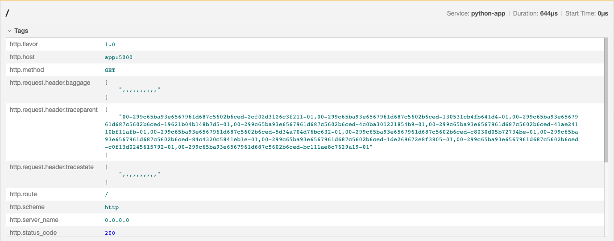

OpenTelemetry is here to help us find the root cause of issues in our software
quickly. We recently had an issue that we were able to fix by using one feature
of OpenTelemetry to identify the root cause of bug in another feature.

In this blog post, we want to share this interesting experience with you. By
that, you will learn that minor differences in the language-specific
implementations can have interesting implications and that you have a feature
for java & python, which is here to help you to debug context propagation
issues.

## The issue

### Describe the bug

For the blog post [Learn how to instrument nginx with OpenTelemetry][] we
created a small sample app that had a frontend application in Node.JS, that
called an nginx, which acted as a reverse proxy for a backend application in
python.

Our goal was to create a re-usable `docker-compose` that would not only show
people how to instrument nginx with OpenTelemetry, but also how a distributed
trace crossing the webserver would look like.

While Jaeger showed us a trace flowing from the frontend application down to the
nginx, the connection between nginx and python app was not visible: we had two
disconnected traces.

This came as a surprise, because in a prior test with a Java application as
backend we were able to see traces going from nginx to that downstream
application.

### Steps to reproduce

Follow the instructions on how you can [put nginx between two services][].
Replace the java-based application with a python application, e.g. put following
three files into the `backend` folder instead:

- `app.py`:

  ```python
  import time

  import redis
  from flask import Flask

  app = Flask(__name__)
  cache = redis.Redis(host='redis', port=6379)

  def get_hit_count():
    retries = 5
    while True:
        try:
            return cache.incr('hits')
        except redis.exceptions.ConnectionError as exc:
            if retries == 0:
                raise exc
            retries -= 1
            time.sleep(0.5)

  @app.route('/')
  def hello():
    count = get_hit_count()
    return 'Hello World! I have been seen {} times.\n'.format(count)
  ```

- `Dockerfile`:

  ```Dockerfile
  FROM python:3.10-alpine
  WORKDIR /code
  ENV FLASK_APP=app.py
  ENV FLASK_RUN_HOST=0.0.0.0
  RUN apk add --no-cache gcc musl-dev linux-headers
  COPY requirements.txt requirements.txt
  RUN pip install -r requirements.txt
  RUN opentelemetry-bootstrap -a install
  EXPOSE 5000
  COPY . .
  CMD ["opentelemetry-instrument", "--traces_exporter", "otlp_proto_http", "--metrics_exporter", "console", "flask", "run"]
  ```

- `requirements.txt`:

  ```txt
  flask
  redis
  opentelemetry-distro
  opentelemetry-exporter-otlp-proto-http
  ```

Update the `docker-compose.yml` with the following:

```yaml
version: '2'
services:
  jaeger:
    image: jaegertracing/all-in-one:latest
    ports:
      - '16686:16686'
  collector:
    image: otel/opentelemetry-collector:latest
    command: ['--config=/etc/otel-collector-config.yaml']
    volumes:
      - ./otel-collector-config.yaml:/etc/otel-collector-config.yaml
  nginx:
    image: nginx-otel
    volumes:
      - ./opentelemetry_module.conf:/etc/nginx/conf.d/opentelemetry_module.conf
      - ./default.conf:/etc/nginx/conf.d/default.conf
  backend:
    build: ./backend
    image: backend-with-otel
    environment:
      - OTEL_EXPORTER_OTLP_ENDPOINT=http://collector:4318/v1/traces
      - OTEL_EXPORTER_OTLP_PROTOCOL=http/protobuf
      - OTEL_SERVICE_NAME=python-app
  redis:
    image: 'redis:alpine'
  frontend:
    build: ./frontend
    image: frontend-with-otel
    ports:
      - '8000:8000'
    environment:
      - OTEL_EXPORTER_OTLP_ENDPOINT=http://collector:4318/
      - OTEL_EXPORTER_OTLP_PROTOCOL=http/protobuf
      - OTEL_SERVICE_NAME=frontend
```

Spin up that environment by running `docker-compose up` and send some requests
to the frontend with `curl localhost:8000`

### What did you expect to see?

In the jaeger UI at [localhost:16686][] you would expect to see traces going
from the `frontend` through nginx down to the `python-app`.

### What did you see instead?

In the jaeger UI at [localhost:16686][] you will see two traces, one going from
the `frontend` down to nginx, and another one only for the `python-app`.

## The solution

### The hints

Since the setup worked with a java application in the backend, we knew that the
problem was either caused by the python application or by the combination of the
nginx instrumentation and the python application.

We could quickly rule out that the python application alone was the issue:
trying out a simple Node.JS application as backend, we got the same result: two
traces, one from frontend to nginx, another one for the Node.JS application
alone.

With that, we knew that we had a propagation issue: the trace context was not
transferred successfully from nginx down to the python and Node.JS application.

### The analysis

Knowing that the issue does not occur with java and that it is likely a broken
propagation, we knew what we had to do: we needed to see the trace headers.

Gladly, the instrumentations for [Java][] and [Python][] have a feature that
allows us to capture [HTTP request & response headers][] as span attributes
easily.

By providing a comma-separated list of HTTP header names via the environment
variables `OTEL_INSTRUMENTATION_HTTP_CAPTURE_HEADERS_SERVER_REQUEST` and
`OTEL_INSTRUMENTATION_HTTP_CAPTURE_HEADERS_SERVER_RESPONSE` we can define which
HTTP headers we want to capture. In our case we put all potential propagation
headers:

```console
OTEL_INSTRUMENTATION_HTTP_CAPTURE_HEADERS_SERVER_REQUEST=tracestate,traceparent,baggage,X-B3-TraceId
```

In our `docker-compose`-based example we simply can add it to the definition of
our backend service:

```yaml
backend:
  build: ./backend
  image: backend-with-otel
  environment:
    - OTEL_EXPORTER_OTLP_ENDPOINT=http://collector:4318/v1/traces
    - OTEL_EXPORTER_OTLP_PROTOCOL=http/protobuf
    - OTEL_SERVICE_NAME=python-app
    - OTEL_INSTRUMENTATION_HTTP_CAPTURE_HEADERS_SERVER_REQUEST=tracestate,traceparent,baggage,X-B3-TraceId
```

Once again we ran `docker-compose up` to bring up our sample app and we send
some request with `curl localhost:8080` to the frontend application.

In Jaeger we still see that the traces are disconnected. However, when we look
into one of those traces, we can see the collected request headers from nginx to
backend:



There it is! The trace headers (`baggage`, `traceparent`, `tracestate`) are send
as multiple header fields: the nginx module added the value of each of those
headers again and again, and since having multi value headers is covered by
[RFC7230][], this didn't lead to an issue immediately.

We tested the capability to correlate from nginx to a downstream service with a
Java application. And, without reading into the source code of the OTel Java
SDK, it looks like that Java is flexible in taking a `traceparent` with multiple
values, even though such format is invalid per the W3C Trace Context
specification. So propagation from nginx to the Java service worked, while in
contrast, Python (and other languages) do not provide that flexibility and
propagation from nginx to the downstream service silently fails.

Note, that we are not suggesting that the other languages should have the same
flexibility as Java has with reading `traceparent` or vice-versa: the bug lives
in the nginx module and we need to fix that.

### The fix

To fix our problem we [added some checks to the nginx module][], that make sure
that the trace headers are only set once.

This fix is contained in the [v1.0.1 release of the otel-webserver-module][].
This means you can update the `Dockerfile` to install the nginx module like the
following:

```Dockerfile
FROM nginx:1.18
ADD https://github.com/open-telemetry/opentelemetry-cpp-contrib/releases/download/webserver%2Fv1.0.1/opentelemetry-webserver-sdk-x64-linux.tgz /opt
RUN cd /opt ; tar xvfz opentelemetry-webserver-sdk-x64-linux.tgz
RUN cd /opt/opentelemetry-webserver-sdk; ./install.sh
ENV LD_LIBRARY_PATH=$LD_LIBRARY_PATH:/opt/opentelemetry-webserver-sdk/sdk_lib/lib
RUN echo "load_module /opt/opentelemetry-webserver-sdk/WebServerModule/Nginx/ngx_http_opentelemetry_module.so;\n$(cat /etc/nginx/nginx.conf)" > /etc/nginx/nginx.conf
COPY default.conf /etc/nginx/conf.d
COPY opentelemetry_module.conf /etc/nginx/conf.d
```

[learn how to instrument nginx with opentelemetry]: /blog/2022/instrument-nginx/
[put nginx between two services]:
  /blog/2022/instrument-nginx/#put-nginx-between-two-services
[localhost:16686]: http://localhost:16686/
[http request & response headers]:
  /docs/reference/specification/trace/semantic_conventions/http/#http-request-and-response-headers
[rfc7230]: https://httpwg.org/specs/rfc7230.html#field.order
[added some checks to the nginx module]:
  https://github.com/open-telemetry/opentelemetry-cpp-contrib/pull/204
[v1.0.1 release of the otel-webserver-module]:
  https://github.com/open-telemetry/opentelemetry-cpp-contrib/releases/tag/webserver%2Fv1.0.1
[java]:
  /docs/instrumentation/java/automatic/agent-config/#capturing-http-request-and-response-headers
[python]: /docs/instrumentation/python/automatic/
