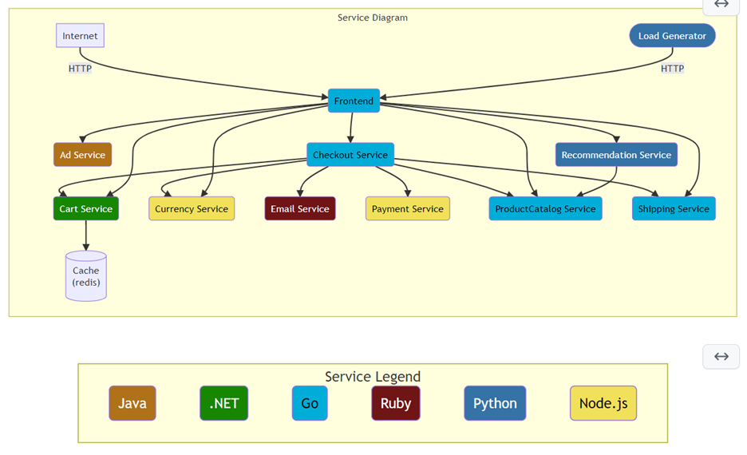

As OpenTelemetry matures, users are increasingly looking for best practice
guides on how to onboard their services to the new paradigm or demo applications
so that they can try out the new tools themselves.

Multiple vendors have written their own demo applications but are wholly
responsible for the development & ongoing support. The existing demos are all
feature incomplete in their own ways with missing languages, restrictions on
backend choice, & they’re overly reliant on instrumentation libraries.

The OpenTelemetry Community Demo application is intended to be a ‘showcase’ for
OpenTelemetry API, SDK, and tools in a “production-ish” cloud native
application. The overall goal of this application is not only to provide a
canonical ‘demo’ of OpenTelemetry components, but also to act as a framework for
further customization by end-users, vendors, and other stakeholders.

## Project Goals

* Provide developers with a robust sample application they can use
in learning OpenTelemetry instrumentation.
* Provide observability vendors with a
single, well-supported, demo platform that they can further customize or simply
use OOB.
* Provide the OpenTelemetry community with a living artifact that
demonstrates the features and capabilities of OTel APIs, SDKs, and tools.
* Provide OpenTelemetry maintainers and working groups a platform to demonstrate
new features/concepts ‘in the wild’

## Current State

As a starting point, we have selected a fork of the popular GCP
microservices demo. Our first feature additions have been to simplify local
deployment by consolidating the project onto a single docker compose file,
updating the documentation, & replacing a pre-existing service with a Ruby
example. Otherwise the pre-existing feature set from the GCP demo remains the
same:

* 10 application microservice with support for 6 languages (C#, Go, Java, Node.js,
Python, & Ruby)
  * Ruby support was added within the last 2 weeks of publishing
date
* Designed to work on docker locally
* Uses redis cache
* Auto-instrumentation using instrumentation libraries Tracing support for the gRPC, Redis, & HTTP
libraries
* Jaeger visualizations for distributed traces OpenTelemetry collector
* Always on sampling (100% of telemetry is submitted) Synthetic load generation

## Current Architecture

## Upcoming New Features

We have a lot of exciting improvements that are planned or in progress to turn
this application into the canonical example of the full power of OpenTelemetry.

* Language examples for C++, Erlang/elixir, PHP, & Rust
* Extend support to Metrics & Logs for all GA SDKs
* Visualization component to consume Metrics
* Implement multiple instrumentation techniques
* Auto-instrumentation using the agent in a sidecar
* Manual instrumentation of all signals
* Additional instrumentation libraries where needed
* Demonstrate the ability to add Baggage & other custom tags
* Continue to build on other cloud-native technologies
Kubernetes \
gRPC \
OpenFeature \
etc. \
* An enhanced OpenTelemetry collector gateway capabilities for ingestion,
  transformation, and export
* Probability based sampling
* Feature flag service to demonstrate various scenarios like fault injection &
  how to emit telemetry from a feature flag reliant service

## Future Architecture

## Going Forward

We’re still at the beginning of our journey but there’s great momentum behind this project. If you’re interested in contributing we’d love your support. There are links in our GitHub repo on how to get involved & you can track our overall progress from there.

## Interesting Links
