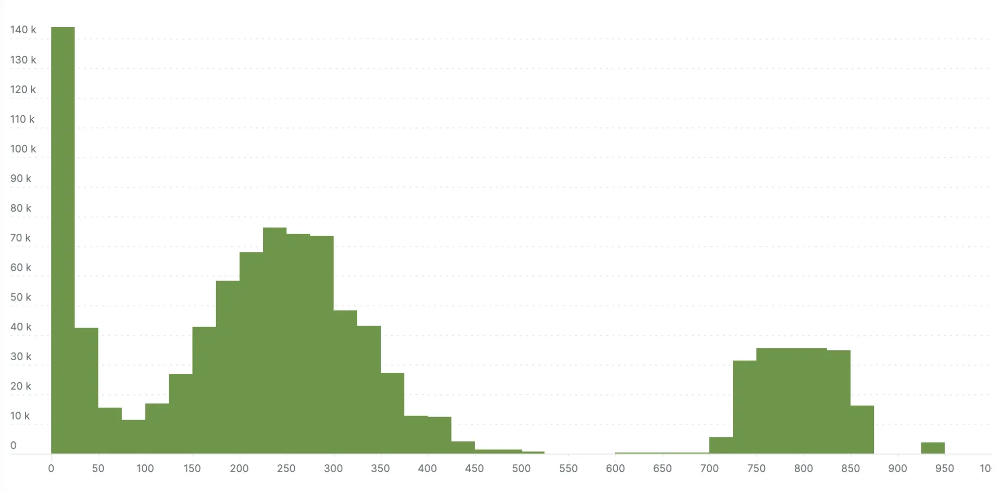

Histograms are a powerful tool in the observability tool belt. OpenTelemetry
supports histograms because of their ability to efficiently capture and transmit
distributions of measurements, enabling statistical calculations like
[percentiles](https://en.wikipedia.org/wiki/Percentile).

In practice, histograms come in several flavors, each with its own strategy for
representing buckets and bucket counts. The first stable metric release for
OpenTelemetry included explicit bucket histograms, and now OpenTelemetry is
introducing a new exponential bucket histogram option. This exciting new format
automatically adjusts buckets to reflect measurements and is more compressed to
send over the wire. This blog post dives into the details of exponential
histograms, explaining how they work, the problem they solve, and how to start
using them now.

## Intro to metrics in OpenTelemetry

Before talking about exponential bucket histograms, let's do a quick refresher
on some general OpenTelemetry metrics concepts. If you're already up to speed,
skip ahead to [Anatomy of a histogram](#anatomy-of-a-histogram).

Metrics represent aggregations of many measurements. We use them because it's
often prohibitively expensive to export and analyze measurements individually.
Imagine the cost of exporting the time of each request for an HTTP server
responding to one million requests per second! Metrics aggregate measurements to
reduce data volume and retain a meaningful signal.

Like tracing (and someday soon logs), OpenTelemetry metrics are broken into the
[API][] and [SDK][]. The API is used to instrument code. Application owners can
use the API to write custom instrumentation specific to their domain, but more
commonly they install prebuilt instrumentation for their library or framework.
The SDK is used to configure what happens with the data collected by the API.
This typically includes processing it and exporting it out of process for
analysis, often to an observability platform.

The API entry point for metrics is the [meter provider][]. It provides meters
for different scopes, where a scope is just a logical unit of application code.
For example, instrumentation for an HTTP client library would have a different
scope and therefore a different meter than instrumentation for a database client
library. You use meters to obtain instruments. You use instruments to report
measurements, which consist of a value and set of attributes. This Java code
snippet demonstrates the workflow:

```java
OpenTelemetry openTelemetry = // declare OpenTelemetry instance
Meter meter = openTelemetry.getMeter("my-meter-scope");
DoubleHistogram histogram =
    meter
        .histogramBuilder("my-histogram")
        .setDescription("The description")
        .setUnit("ms")
        .build();
histogram.record(10.2, Attributes.builder().put("key", "value").build());
```

The SDK provides implementations of meter provider, meter, and instruments. It
aggregates measurements reported by instruments and exports them as metrics
according to the application configuration.

There are currently six types of [instruments][] in OpenTelemetry metrics:
counter, up down counter, histogram, async counter, async up down counter, and
async gauge. Carefully consider which instrument type to select, since each
implies certain information about the nature of the measurements it records and
how they are analyzed. For example, use a counter when you want to count things
and when the sum of the things is more important than their individual values
(such as tracking the number of bytes sent over a network). Use a histogram when
the distribution of measurements is relevant for analysis. For example, a
histogram is a natural choice for tracking response times for HTTP servers,
because it's useful to analyze the distribution of response times to evaluate
SLAs and identify trends. To learn more, see the guidelines for [instrument
selection][].

I mentioned earlier that the SDK aggregates measurements from instruments. Each
instrument type has a default aggregation strategy (or simply [aggregation][])
that reflects the intended use of the measurements as implied by the instrument
type selection. For example, counters and up down counters aggregate to a sum of
their values. Histograms aggregate to a histogram aggregation. (Note that
histogram is both a [type of instrument][] and an
[aggregation][histogram-aggregation].)

## Anatomy of a histogram

What is a histogram? Putting OpenTelemetry aside for a moment, we're all
somewhat familiar with histograms. They consist of buckets and counts of
occurrences within those buckets.

For example, a histogram could track the number of times a particular number was
rolled with the sum of two six-sided dice, with one bucket for each possible
outcome, from 2-12. Over a large number of rolls, you expect the 7 bucket to
have the highest count because you are more likely to roll a combined total of
7, and the 2 and 12 buckets to have the least because these are the least likely
rolls, as shown in this example histogram.


OpenTelemetry has two types of histograms. Let's start with the relatively
simpler [explicit bucket histogram][]. It has buckets with boundaries explicitly
defined during initialization. For example, if you configure it with boundaries
_[0,5,10]_, there are _N+1_ buckets with boundaries _(-∞, 0],(0,5],(5,10],
(10,+∞]_. Each bucket tracks the number of occurrences of values within its
boundaries. Additionally, the histogram tracks the sum of all values, the count
of all values, the maximum value, and the minimum value. See the
[opentelemetry-proto][explicit bucket histogram proto] for the complete
definition.

Before we talk about the second type of histogram, pause and think about some of
the questions you can answer when data is structured like this. Assuming you're
using a histogram to track the number of milliseconds it took to respond to a
request, you can determine:

- The number of requests.
- The minimum, maximum, and average request latency.
- The percentage of requests that had latency less than a particular bucket
  boundary. For example, if buckets boundaries are _[0,5,10]_, you can take the
  sum of the counts of buckets _(-∞,0],(0,5],(5,10]_, and divide by the total
  count to determine the percentage of requests that took less than 10
  milliseconds. If you have an SLA that 99% of requests must be resolved in more
  than 10 milliseconds, you can determine whether or not you met it.
- Patterns, by analyzing the distribution. For example, you might find that most
  requests resolve quickly but a small number of requests take a long time and
  bring down the average.

The second type of OpenTelemetry histogram is the [exponential bucket
histogram][]. Exponential bucket histograms have buckets and bucket counts, but
instead of explicitly defining the bucket boundaries, the boundaries are
computed based on an exponential scale. More specifically, each bucket is
defined by an index _i_ and has bucket boundaries _(base\*\*i, base\*\*(i+1)]_,
where _base\*\*i_ means that _base_ is raised to the power of _i_. The base is
derived from a scale factor that is adjustable to reflect the range of reported
measurements and is equal to _2\*\*2\*\*-scale_. Bucket indexes must be
continuous, but a non-zero positive or negative offset can be defined. For
example, at scale 0, _base = 2\*\*2\*\*-0 = 2_ , and the bucket boundaries for
indexes _[-2,2]_ are defined as _(.25,.5],(.5,1],(1,2],(2,4],(4,8]_. By
adjusting the scale, you can represent both large and small values. Like
explicit bucket histograms, exponential bucket histograms also track the sum of
all values, the count of all values, the maximum value, and the minimum value.
See the [opentelemetry-proto][exponential bucket histogram proto] for the
complete definition.

## Why use exponential bucket histograms

On the surface, exponential bucket histograms don't seem very different from
explicit bucket histograms. In reality, their subtle differences yield
dramatically different results.

**Exponential bucket histograms are a more compressed representation.** Explicit
bucket histograms encode data with a list of bucket counts and a list of _N-1_
bucket boundaries, where _N_ is the number of buckets. Each bucket count and
bucket boundary is an 8-byte value, so an _N_ bucket explicit bucket histogram
is encoded as _2N-1_ 8-byte values.

In contrast, bucket boundaries for exponential bucket histograms are computed
based on a scale factor and an offset defining the starting index of the
buckets. Each bucket count is an 8-byte value, so an _N_ bucket exponential
bucket histogram is encoded as _N+2_ 8-byte values (_N_ bucket counts and 2
constants). Of course, both of these representations are commonly compressed
when sent over a network, so further size reduction is likely, but exponential
bucket histograms contain fundamentally less information.

**Exponential bucket histograms are basically configuration-free.** Explicit
bucket histograms need an explicitly defined set of bucket boundaries that need
to be configured somewhere. A [default set][explicit bucket histogram] of
boundaries is provided, but use cases of histograms vary wildly enough that it's
likely you'll need to adjust the boundaries to better reflect your data. The
view API helps, with mechanisms to select specific instruments and redefine the
explicit bucket histogram aggregation bucket boundaries.

In contrast, the only configurable parameter of exponential bucket histograms is
the number of buckets, which defaults to 160 for positive values. The
implementation automatically chooses the scale factor, based on the range of
values recorded and the number of buckets available to maximize the bucket
density around the recorded values. I can't overstate how useful this is.

Exponential bucket histograms capture a high-density distribution of values
**automatically adjusted for the scale and range of measurements**, with no
configuration. The same histogram that captures nanosecond scale measurements is
equally good at capturing second scale measurements. They retain fidelity
regardless of scale.

Consider the scenario of capturing HTTP request time milliseconds. With an
explicit bucket histogram, you make guesses on bucket boundaries which you hope
will accurately capture the distribution of values. But if conditions change and
latency spikes, your assumptions might not hold and all values could be lumped
together. Suddenly, you've lost visibility into the distribution of data. You
know latency is high overall. But you can't know how many requests are high but
tolerable versus terribly slow. In contrast, with an exponential bucket
histogram, the scale automatically adjusts to the latency spikes to choose the
optimal range of buckets. You retain insight into the distribution, even with a
large range of measurement values.

## Example scenario: explicit bucket histograms vs. exponential bucket histograms

Let's bring everything together with a proper demonstration comparing explicit
bucket histograms to exponential bucket histograms. I've put together some
[example code][] that simulates tracking response time to an HTTP server in
milliseconds. It records one million samples to an explicit bucket histogram
with the default buckets, and to an exponential bucket histogram with a number
of buckets that produces roughly the same size of [OTLP][] -encoded,
Gzip-compressed payload as the explicit bucket defaults. Through trial and
error, I determined that ~40 exponential buckets produce an equivalent payload
size to the default explicit bucket histogram with 11 buckets. (Your results may
vary.)

I wanted the distribution of samples to reflect what we might see in an actual
HTTP server, with bands of response times corresponding to different operations.
It will look something like this example:


To achieve this, I used a variety of different probability distributions, each
corresponding to different bands in the curve, and each accounting for some
percentage of the samples.

I ran the simulation, and exported the histograms via to compare the explicit
bucket histogram to the exponential bucket histogram. The next two charts show
the results. The exponential bucket histogram has significantly more detail,
which simply isn't available with the more limited buckets of the explicit
bucket histogram.

> **Note:** These visualizations are from the New Relic platform, which I used
> because they employ me, and it's the easiest way for me to visualize
> histograms. Every platform will have its own mechanism for storing and
> retrieving histograms, which typically perform some lossy translation of
> buckets into a normalized storage format—New Relic is no exception.
> Additionally, the visualization doesn't clearly delineate buckets, which
> causes adjacent buckets with the same count to appear as a single bucket.

Here's the millisecond scale exponential bucket histogram:



Here's the millisecond scale explicit bucket histogram:


This demonstration is fairly generous to the explicit bucket histogram because I
choose to report values in an optimum range for the default buckets (for
example, 0 to 1000). The next two examples show what happens when the same
values are recorded in nanosecond precision instead of milliseconds (all values
are multiplied by 10<sup>6</sup>). This is where the no-configuration
autoscaling nature of exponential bucket histograms really shines. Left with the
default explicit bucket boundaries, all the samples fall into a single bucket
with the explicit bucket histogram. The exponential variety loses some
definition compared to the millisecond version in the previous example, but you
can still see the response time bands.

Here's the nanosecond scale exponential bucket histogram:


Here's the nanosecond scale explicit bucket histogram:


## Next steps

Exponential bucket histograms are a powerful new tool for metrics. While
implementations are still in progress at the time of publishing this post,
you'll definitely want to enable them when you're using OpenTelemetry metrics.

If you're using [opentelemetry-java][] (and eventually other languages), the
easiest way to enable exponential bucket histograms is by setting the
[environment variable][] with this command:

```shell
export OTEL_EXPORTER_OTLP_METRICS_DEFAULT_HISTOGRAM_AGGREGATION=exponential_bucket_histogram
```

For instructions on enabling in other languages, check the relevant
documentation on [instrumentation][] or [github.com/open-telemetry][].

_A version of this article was [originally posted][] on the New Relic blog._

[originally posted]: {}

[percentiles]: https://en.wikipedia.org/wiki/Percentile
[api]: /docs/reference/specification/metrics/api/
[sdk]: /docs/reference/specification/metrics/sdk/
[meter provider]: /docs/reference/specification/metrics/api/#meterprovider
[instruments]: /docs/reference/specification/metrics/api/#instrument
[instrument selection]:
  /docs/reference/specification/metrics/supplementary-guidelines/#instrument-selection
[aggregation]: /docs/reference/specification/metrics/sdk/#aggregation
[type of instrument]: /docs/reference/specification/metrics/api/#histogram
[histogram-aggregation]:
  /docs/reference/specification/metrics/sdk/#histogram-aggregations
[explicit bucket histogram]:
  /docs/reference/specification/metrics/sdk/#explicit-bucket-histogram-aggregation
[explicit bucket histogram proto]:
  https://github.com/open-telemetry/opentelemetry-proto/blob/724e427879e3d2bae2edc0218fff06e37b9eb46e/opentelemetry/proto/metrics/v1/metrics.proto#L382
[exponential bucket histogram]:
  /docs/reference/specification/metrics/sdk/#exponential-bucket-histogram-aggregation
[exponential bucket histogram proto]:
  https://github.com/open-telemetry/opentelemetry-proto/blob/724e427879e3d2bae2edc0218fff06e37b9eb46e/opentelemetry/proto/metrics/v1/metrics.proto#L463
[example code]:
  https://github.com/jack-berg/newrelic-opentelemetry-examples/commit/2681bf25518c02f4e5830f89254c736e0959d306
[otlp]: /docs/reference/specification/protocol/otlp/
[opentelemetry-java]: https://github.com/open-telemetry/opentelemetry-java
[environment variable]:
  /docs/reference/specification/metrics/sdk_exporters/otlp/
[instrumentation]: /docs/instrumentation
[github.com/open-telemetry]: https://github.com/open-telemetry
