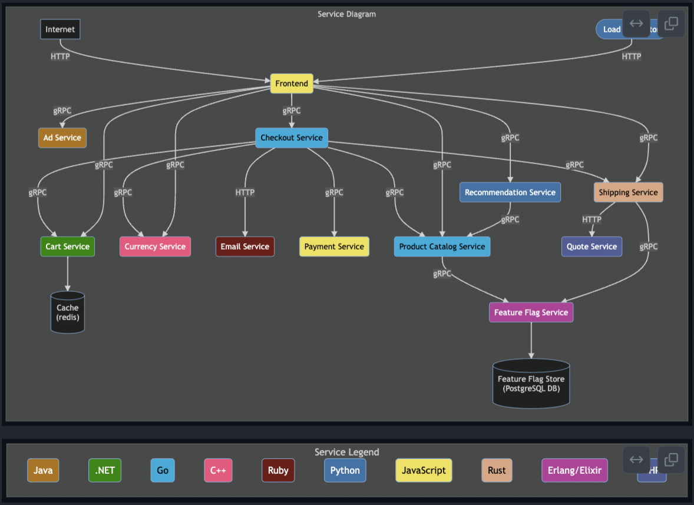
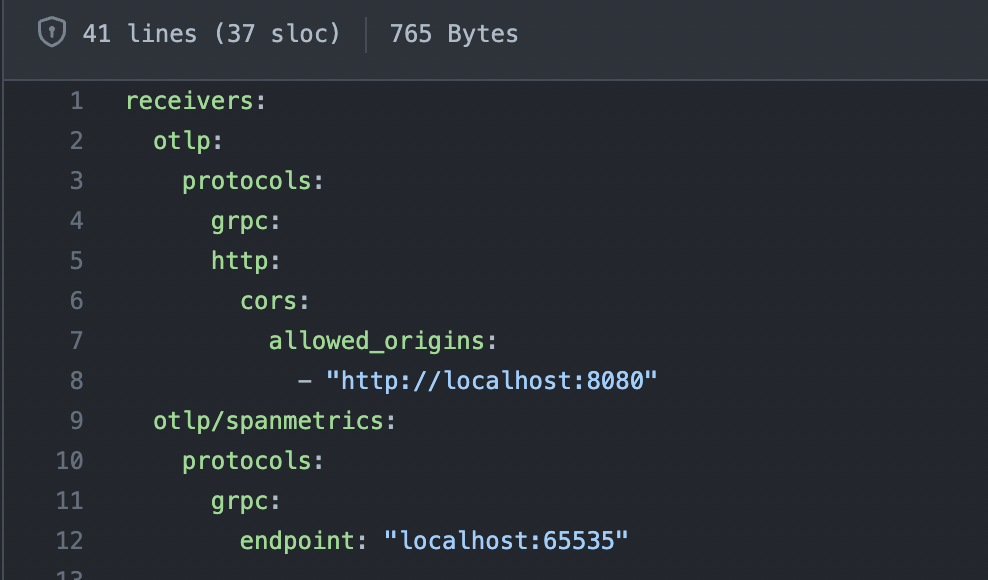

One of the OpenTelemetry Project's many Special Interest Groups (SIG) is the
OpenTelemetry Community Demo SIG which gives support to a set of instrumented
backend microservices and a web frontend app that are primarily used to showcase
how to instrument a distributed system using OpenTelemetry.

The application's main focus is to demonstrate the implementation process to
instrument an application no matter what programming language, platform, or
operating system your team is using, as well as providing different approaching
techniques (automatic and manual instrumentation, metrics, baggage). All of this
while following the standards and conventions defined by the official
OpenTelemetry Documentation. More about the specific requirements can be
[found here](https://github.com/open-telemetry/opentelemetry-demo/tree/main/docs/requirements).

My company was focused on becoming part of and embracing the OpenTelemetry
community. One of our goals this summer was to get more involved with a core
OpenTelemetry project where we could provide a meaningful contribution. The OTel
demo became the best match for achieving that goal as it would not only help the
community, but help our product as we needed a good example to test and showcase
what can be done with our tool.

The first thing we did was to get in contact with Carter Socha, the organizer of
the OTel Demo SIG. Carter was really welcoming and helped us identify where our
contributions could be the most impactful. We started looking at
[the issue created by Austin Parker](https://github.com/open-telemetry/opentelemetry-demo/issues/39)
referencing a complete front-end overhaul that would involve moving the
application away from Go (SSR) to an architecture that included a browser-side
client (CSR), as well as improving the overall style, theme, and user
experience.

A fun aspect of the work was the request to move the store from a ‘normal’ store
to an astronomy store to match the OpenTelemetry project’s overall branding.

Once we got confirmation and the green light from the rest of the OTel Demo SIG
team then my team started working on the different changes included as part of
the application frontend architecture overhaul.

## OpenTelemetry Demo Application Description and Tech Stack

The demo app is an astronomy webstore that has the basic functionality to
purchase online products such as a shopping cart, currency selector, product
listing, and payment & checkout. It also includes features to display
promotional items (ads) and related products depending on the context of the
user. The demo stack includes a set of multiple microservices built in different
languages, one for each of the following programming languages:

1. Go
2. PHP
3. C++
4. .NET
5. Ruby
6. Python
7. Node.js
8. Rust
9. Elixir

Every microservice has a specific goal and can communicate with others by using
a global GRPC definition. Persistent information is saved into a Postgres
database and there are outbound services that connect with third-party services
to trigger events (such as confirmation emails). All of the microservices,
including the front end, are connected to the same Open Telemetry collector
instance, which uses Jaeger as one of the data stores for the traces and spans.

The front end was constituted by a Golang SSR application which sent the
complete HTML to the browser client to be displayed. Each request and form call
was redirecting the user back to the server so the new piece of information was
shown.

## Web App Styling Improvements, Theme Updates, and User Experience Redesign

Before starting the development process, the frontend application wasn’t
matching the theme that OpenTelemetry had been using in terms of colors,
products, and overall user experience. In addition, the demo lacked a real
frontend (browser side) application as the current implementation was a Go SSR
application.

The first task at hand was to bring the demo to the modern age by updating the
design, color schemes, and user experience. Olly Babiak walked into the fray to
help us achieve this by creating a modernized version of the application. It
included an improved way to display the products landing page, an updated
product details page, a mini cart, and a fully compatible mobile version of the
application.

Now we had an application design that would match the rest of the OpenTelemetry
themes and colors and look more like the OpenTelemetry.io website.

## Frontend Application Architecture Overhaul

We worked on an initial proposal that included the following bullet points:

- Framework and tooling (Scaffolding, I/O, styling, UI library)
- Code Architecture and structure (Directories, coding patterns)
- Instrumentation
- Deployment & Distribution
- Testing (E2E, unit test)

This proposal was presented to the OpenTelemetry Demo SIG duringone of the
weekly Monday meetings and we were given the green light to move ahead. As part
of the changes, we decided to use Next.js to not only work as the primary
frontend application but also to work as an aggregation layer between the
frontend and the GRPC backend services.

As you can see in the Diagram, the application has two major connectivity
points, one coming from the browser side (REST) to connect to the Next.js
aggregation layer and the other from the aggregation layer to the backend
services (GRPC).

## OpenTelemetry Instrumentation

The next big thing we worked on was having a way to instrument both sides of the
Next.js application. To accommodate this we had to connect the same application
twice to the same open telemetry collector that was being used by all of the
other microservices.

For the backend side, a simple solution was designed that involved using the
[official GRPC exporter](https://www.npmjs.com/package/@opentelemetry/exporter-trace-otlp-grpc)
in combination with the
[Nodejs SDK](https://www.npmjs.com/package/@opentelemetry/sdk-node).

You can find the full
[implementation here](https://github.com/open-telemetry/opentelemetry-demo/blob/main/src/frontend/utils/telemetry/Instrumentation.js).
The basic instrumentation includes auto instrumentation for most of the commonly
used
[libraries and tools for Node.js](https://www.npmjs.com/package/@opentelemetry/auto-instrumentations-node).
But as part of having a better example for users, a manual instrumentation piece
was added in the form of a route middleware that would catch the incoming HTTP
request and create a span based on it, including the context propagation. The
[implementation can be found here](https://github.com/open-telemetry/opentelemetry-demo/blob/main/src/frontend/utils/telemetry/InstrumentationMiddleware.ts).

For the frontend side, it became a little bit tricky, as the
[initial Next.js render](https://nextjs.org/learn/foundations/how-nextjs-works/rendering)
comes from the server side so, in this case, we had to make sure to load the
tracer from the browser side when the Javascript code is executed.

After adding validations to check for the browser side, we then can proceed to
load the custom front-end tracing module which includes the creation of the
[web tracer provider and the automatic web instrumentations](https://github.com/open-telemetry/opentelemetry-demo/blob/main/src/frontend/utils/telemetry/FrontendTracer.ts).
The automatic web instrumentations capture the most common user interactions
such as click events, fetch requests, and page loads. Another takeaway is that
in order to allow the browser side to interact with the OTel collector there is
a configuration change that needs to be done to enable incoming CORS requests
from the web app. Having the collector receivers configuration looking similar
to this:

Once the setup is complete, by loading the application from docker and
interacting with the different features, we can start looking at the full traces
that begin from the frontend user events all the way to the backend GRPC
services.

## Contributing to OpenTelemetry was Rewarding

As a team focused on building an open source tool in the Observability space,
the opportunity to help the overall OpenTelemetry community was important to us.
In addition, having a complex microservice-based application that uses multiple
different languages and technologies is directly useful for our team. We really
enjoyed the process of making a contribution to the OpenTelemetry project and
are actively looking for more opportunities to contribute!

_Oscar Reyes and Olly Babiak also are working on Tracetest, an open source tool
that allows you to develop and test your distributed system with OpenTelemetry.
It works with any OTel compatible system and enables trace–based tests to be
created. Check it out at <https://github.com/kubeshop/tracetest>.
