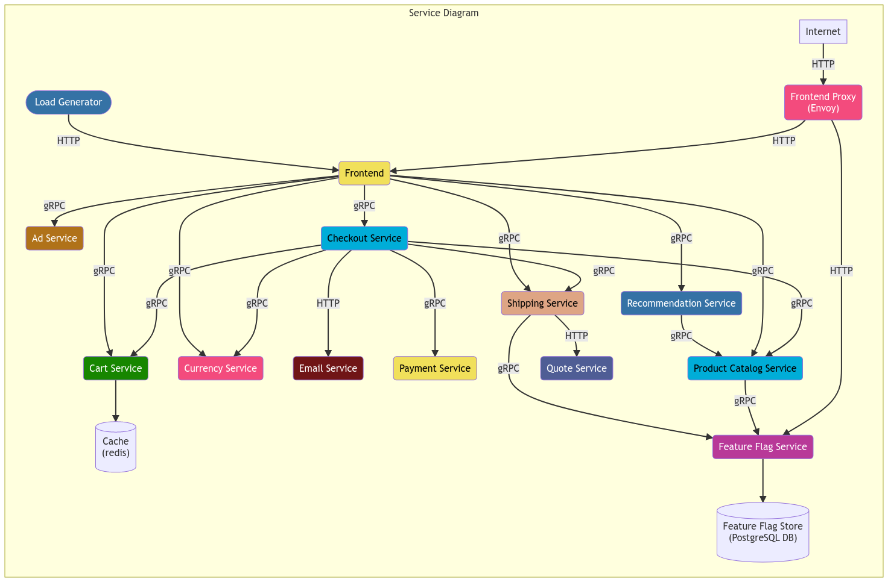
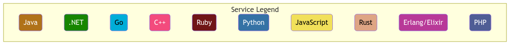
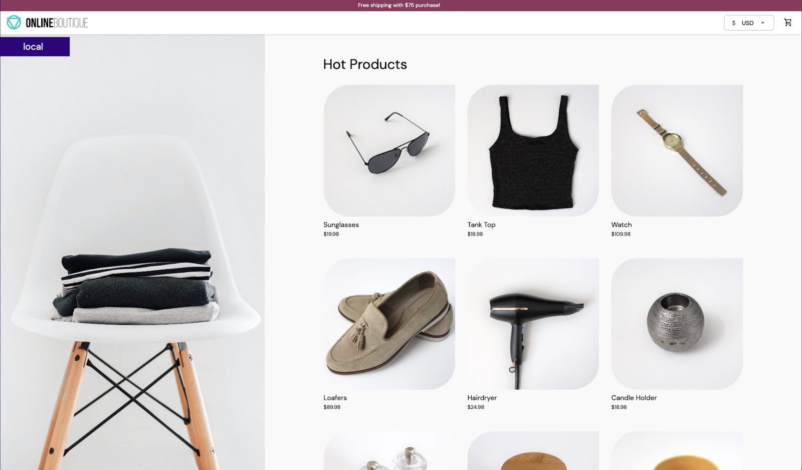
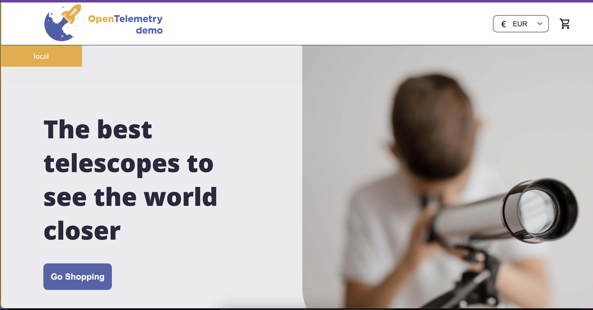
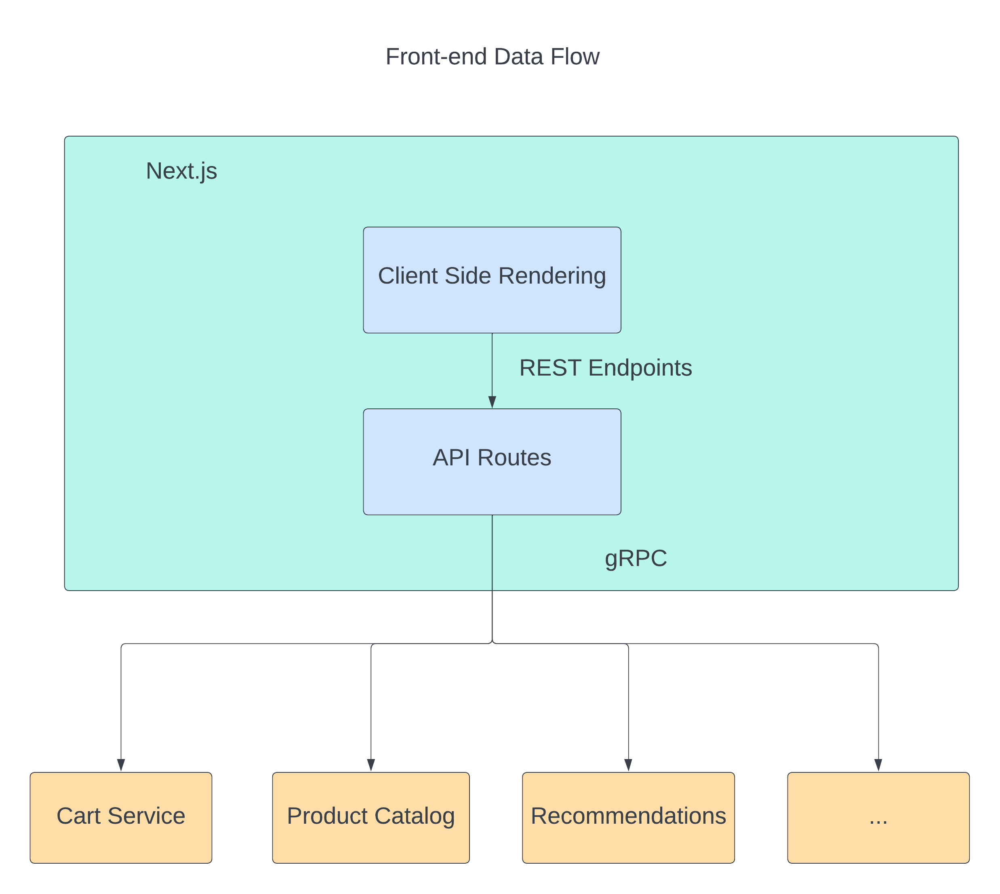
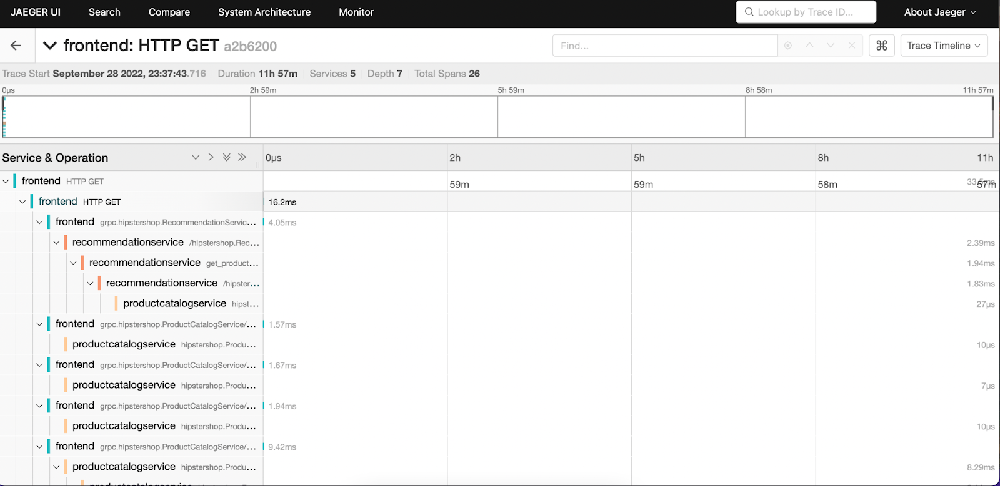

One of the OpenTelemetry Project's many Special Interest Groups (SIG) is the
[OpenTelemetry Community demo SIG](https://github.com/open-telemetry/opentelemetry-demo).
The SIG supports a set of instrumented microservices and a front-end web app
which are used to show how to instrument a distributed system with
OpenTelemetry.

The main focus of the web app is to demonstrate how to instrument an
application, no matter what programming language, platform or OS it uses. The
web app also shows different instrumentation techniques: automatic and manual,
metrics, and baggage. All while following the standards and conventions
prescribed in the official OTel documentation. More about the specific
requirements can be [found here](/docs/demo/requirements/).

My company was focused on becoming part of and embracing the OpenTelemetry
community. One of our goals this summer was to get more involved with a core
OpenTelemetry project where we could provide a meaningful contribution. The OTel
demo was the best match for our goal, as contributing would not only help the
community, but also provide a great example to test and showcase our product
with.

The first thing we did was to get in contact with
[Carter Socha](https://github.com/cartersocha), the organizer of the OTel Demo
SIG. Carter was really welcoming and helped us identify where our contributions
could be the most impactful. We started looking at
[the issue created by Austin Parker](https://github.com/open-telemetry/opentelemetry-demo/issues/39)
referencing a complete front-end overhaul that would involve moving the
application away from Go server-side render (SSR) to an architecture that
included a browser-side client (client-side render or CSR), as well as improving
the overall style, theme, and user experience.

A fun aspect of the work was the request to move the store from a "normal" store
to an astronomy store to match the OpenTelemetry project’s overall branding.

Once we got the green light from the rest of the OTel demo SIG, then we started
working on the different changes that were part of the front-end architecture
overhaul.

## OpenTelemetry Demo Application Description and Tech Stack

The demo app is an astronomy store, with basic eCommerce features such as a
shopping cart, currency selector, payment, and checkout. It also includes the
ability to display promotions (ads) and related products depending on the user’s
context.

The demo’s stack includes multiple microservices in different languages,
covering each of the following OTel-supported languages:

- [C++](/docs/instrumentation/cpp/)
- [.NET](/docs/instrumentation/net/)
- [Erlang/Elixir](/docs/instrumentation/erlang/)
- [Go](/docs/instrumentation/go/)
- [Node.js](/docs/instrumentation/js/)
- [PHP](/docs/instrumentation/php/)
- [Python](/docs/instrumentation/python/)
- [Ruby](/docs/instrumentation/ruby/)
- [Rust](/docs/instrumentation/rust/)

Every microservice has a specific goal and can communicate with others by using
a global gRPC definition. Persistent information is saved into a postgresql
database and there are outbound services that connect with third-party services
to trigger events (such as confirmation emails). All of the microservices,
including the front-end, are connected to the same OpenTelemetry collector
instance, which uses Jaeger as one of the data stores for the tracing data.

Prior to re-architecting, the front-end consisted of a Golang SSR app, which
sent complete HTML to the browser for display. Every request and call redirected
to the server so new information was shown.

## Web App Styling Improvements, Theme Updates, and User Experience Redesign

Before starting the development process, the front-end application wasn’t
matching the theme that OpenTelemetry had been using in terms of colors,
products, and overall user experience. In addition, the demo lacked a real
front-end (browser side) application as the current implementation was a Go
application.

The first task at hand was to bring the demo to the modern age by updating the
design, color schemes, and user experience. Olly Babiak walked into the fray to
help us achieve this by creating a modernized version of the application. It
included an improved way to display the products landing page, an updated
product details page, a mini cart, and a fully compatible mobile version of the
application.

Now we had an application design that would match the rest of the OpenTelemetry
themes and colors and look more like the OpenTelemetry.io website.

## Front-end Application Architecture Overhaul

We worked on an initial proposal that included the following:

- Framework and tooling (Scaffolding, I/O, styling, UI library)
- Code Architecture and structure (Directories, coding patterns)
- Instrumentation
- Deployment & Distribution
- Testing (E2E, unit test)

This proposal was presented to the OpenTelemetry demo SIG during one of the
weekly Monday meetings and we were given the green light to move ahead. As part
of the changes, we decided to use [Next.js](https://nextjs.org/) to not only
work as the primary front-end application but also to work as an aggregation
layer between the front-end and the gRPC back-end services.

As you can see in the diagram, the application has two major connectivity
points, one coming from the browser side (REST) to connect to the Next.js
aggregation layer and the other from the aggregation layer to the back-end
services (gRPC).

## OpenTelemetry Instrumentation

The next big thing we worked was a way to instrument both sides of the Next.js
app. To do this we had to connect the app twice to the same collector used by
all the microservices.

A simple back-end solution was designed using the
[official gRPC exporter](https://www.npmjs.com/package/@opentelemetry/exporter-trace-otlp-grpc)
in combination with the
[Node.js SDK](https://www.npmjs.com/package/@opentelemetry/sdk-node).

You can find the full
[implementation here](https://github.com/open-telemetry/opentelemetry-demo/blob/main/src/frontend/utils/telemetry/Instrumentation.js).
The basic instrumentation includes auto instrumentation for most of the commonly
used
[libraries and tools for Node.js](https://www.npmjs.com/package/@opentelemetry/auto-instrumentations-node).
As part of providing a better example for users, a manual instrumentation in the
form of route middleware was added. This would catch the incoming HTTP request
and create a span based on it, including the context propagation. The
[implementation can be found here](https://github.com/open-telemetry/opentelemetry-demo/blob/main/src/frontend/utils/telemetry/InstrumentationMiddleware.ts).

The front-end was a little trickier, as the
[initial rendering is server-side](https://nextjs.org/learn/foundations/how-nextjs-works/rendering).
We had to make sure to load the tracer from the browser side when the JavaScript
code is executed.

After adding validations to check the browser side, we then loaded the custom
front-end tracing module, which included creating the
[web tracer provider and the automatic web instrumentations](https://github.com/open-telemetry/opentelemetry-demo/blob/main/src/frontend/utils/telemetry/FrontendTracer.ts).

The automatic front-end instrumentation captures the most common user actions
such as clicks, fetch requests, and page loads. In order to allow the browser
side to interact with the collector, a config change is needed: enable incoming
CORS requests from the web app.

Once the setup is complete, by loading the application from Docker and
interacting with the different features, we can start looking at the full traces
that begin from the front-end user events all the way to the back-end gRPC
services.

## Contributing to OpenTelemetry was Rewarding

As a team focused on building an open source tool in the Observability space,
the opportunity to help the overall OpenTelemetry community was important to us.
In addition, having a complex microservice-based application that uses multiple
different languages and technologies is directly useful for our team. We really
enjoyed the process of making a contribution to the OpenTelemetry project and
are actively looking for more opportunities to contribute!

_[Oscar Reyes](https://github.com/xoscar) and
[Olly Babiak](https://github.com/olha23) also are working on Tracetest, an open
source tool that allows you to develop and test your distributed system with
OpenTelemetry. It works with any OTel compatible system and enables trace–based
tests to be created. Check it out at <https://github.com/kubeshop/tracetest>._
