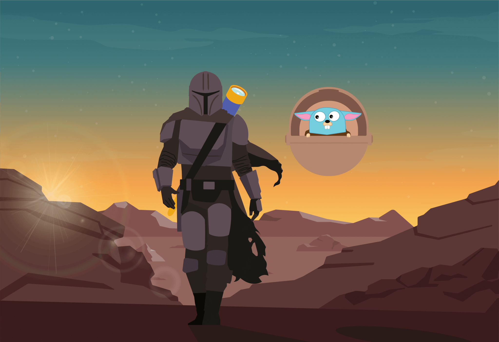
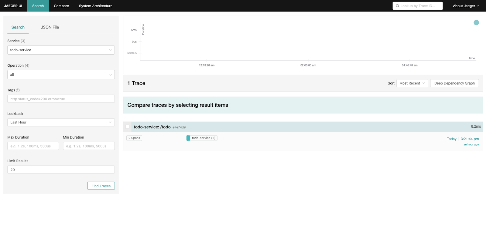
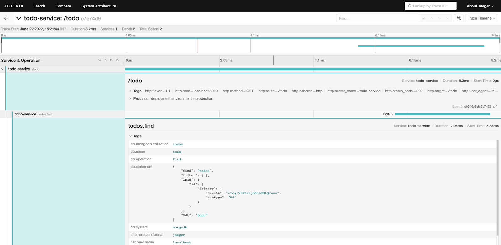

In this blog post, you will learn hands-on how to create and visualize traces
with OpenTelemetry Go without prior knowledge.

We will start with creating a simple to-do app that uses Mongo and the Gin
framework. Then, we will send tracing data to Jaeger Tracing for visualization.
You can find all the relevant files in this
[GitHub repository](https://github.com/aspecto-io/opentelemetry-examples/tree/master/go).



## Hello world: OpenTelemetry Go example

We will start by creating our to-do service and installing two libraries (Gin
and Mongo) to understand how instrumentations work.

### Step 1: Create main.go file for our to-do app

1. Install Gin and Mongo-driver

   ```shell
   go get -u github.com/gin-gonic/gin
   go get go.mongodb.org/mongo-driver/mongo
   ```

2. Set up gin and mongo to listen on “/todo”

3. Create some to-do’s to seed Mongo

   ```go
   package main
   import (
       "context"
       "net/http"
       "github.com/gin-gonic/gin"
       "go.mongodb.org/mongo-driver/bson"
       "go.mongodb.org/mongo-driver/mongo"
       "go.mongodb.org/mongo-driver/mongo/options"
   )

   var client * mongo.Client

   func main() {
       connectMongo()
       setupWebServer()
   }

   func connectMongo() {
       opts: = options.Client()
       opts.ApplyURI("mongodb://localhost:27017")
       client, _ = mongo.Connect(context.Background(), opts)
       //Seed the database with todo's
       docs: = [] interface {} {
           bson.D {
                   {
                       "id", "1"
                   }, {
                       "title", "Buy groceries"
                   }
               },
               bson.D {
                   {
                       "id", "2"
                   }, {
                       "title", "install Aspecto.io"
                   }
               },
               bson.D {
                   {
                       "id", "3"
                   }, {
                       "title", "Buy dogz.io domain"
                   }
               },
       }
       client.Database("todo").Collection("todos").InsertMany(context.Background(), docs)
   }

   func setupWebServer() {
       r: = gin.Default()
       r.GET("/todo", func(c * gin.Context) {
           collection: = client.Database("todo").Collection("todos")
           //Important: Make sure to pass c.Request.Context() as the context and not c itself - TBD
           cur, findErr: = collection.Find(c.Request.Context(), bson.D {})
           if findErr != nil {
               c.AbortWithError(500, findErr)
               return
           }
           results: = make([] interface {}, 0)
           curErr: = cur.All(c, & results)
           if curErr != nil {
               c.AbortWithError(500, curErr)
               return
           }
           c.JSON(http.StatusOK, results)
       })
       _ = r.Run(":8080")
   }
   ```

Now that our small todo app is ready, let’s introduce OpenTelemetry.

### Step 2: Install OpenTelemetry Go

We will be configuring OpenTelemetry to instrument our Go app.

1. To install the OTel SDK, run:

   ```shell
   go get go.opentelemetry.io/otel /
   go.opentelemetry.io/otel/sdk /
   ```

2. Instrument our Gin and Mongo libraries to generate traces.

3. Gin & Mongo instrumentation: Install otelgin & otelmongo

   ```shell
   go get go.opentelemetry.io/contrib/instrumentation/github.com/gin-gonic/gin/otelgin /
   go get go.opentelemetry.io/contrib/instrumentation/go.mongodb.org/mongo-driver/mongo/otelmongo
   ```

### Gin instrumentation: gin.Context

We previously discussed the idea of context propagation – the way to transfer
metadata between distributed services to correlate events in our system.

The Gin framework has its own type gin.Context which gets passed as a parameter
to an HTTP handler. However, the context that should be passed down to the mongo
operations is the standard Go library Context object, available in
gin.Context.Request.Context.

```go
//Make sure to pass c.Request.Context() as the context and not c itself
cur, findErr := collection.Find(c.Request.Context(), bson.D{})
```

So make sure that you pass the Context to the mongodb operation. Check out this
issue for more info.

We now have our todo app ready and instrumented. It’s time to utilize
OpenTelemetry to its full potential. Our ability to visualize traces is where
the true troubleshooting power of this technology comes into play.

For visualization, we’ll be using the open source Jaeger Tracing.

## Visualization with Jaeger

### OpenTelemetry Go and Jaeger Tracing: Export traces to Jaeger

[Jaeger Tracing](https://www.aspecto.io/blog/jaeger-tracing-the-ultimate-guide/)
is a suite of open source projects managing the entire distributed tracing
“stack”: client, collector, and UI. Jaeger UI is the most commonly used open
source to visualize traces.

Here’s what the setup looks like:

1. Install the Jaeger exporter

   ```shell
   go get go.opentelemetry.io/otel/exporters/jaeger
   ```

2. Create a tracing folder and a jaeger.go file

3. Add the following code to the file

   ```go
   package tracing
   import (
       "go.opentelemetry.io/otel/exporters/jaeger"
       "go.opentelemetry.io/otel/sdk/resource"
       sdktrace "go.opentelemetry.io/otel/sdk/trace"
       semconv "go.opentelemetry.io/otel/semconv/v1.4.0"
   )

   func JaegerTraceProvider()(*sdktrace.TracerProvider, error) {
       exp, err: = jaeger.New(jaeger.WithCollectorEndpoint(jaeger.WithEndpoint("http://localhost:14268/api/traces")))
       if err != nil {
           return nil, err
       }
       tp: = sdktrace.NewTracerProvider(
           sdktrace.WithBatcher(exp),
           sdktrace.WithResource(resource.NewWithAttributes(
               semconv.SchemaURL,
               semconv.ServiceNameKey.String("todo-service"),
               semconv.DeploymentEnvironmentKey.String("production"),
           )),
       )
       return tp, nil
   }
   ```

4. Go back to the main.go file and modify our code to use the
   JaegerTraceProvider function we just created

   ```go
   func main() {
       tp, tpErr: = tracing.JaegerTraceProvider()
       if tpErr != nil {
           log.Fatal(tpErr)
       }
       otel.SetTracerProvider(tp)
       otel.SetTextMapPropagator(propagation.NewCompositeTextMapPropagator(propagation.TraceContext {}, propagation.Baggage {}))
       connectMongo()
       setupWebServer()
   }
   ```

   Next, we are going to hook up the instrumentations we installed.

5. Add the Mongo instrumentation. In our connectMongo function by adding this
   line

   ```go
   opts.Monitor = otelmongo.NewMonitor()
   ```

   The function should look like this:

   ```go
   func connectMongo() {
       opts: = options.Client()
       //Mongo OpenTelemetry instrumentation
       opts.Monitor = otelmongo.NewMonitor()
       opts.ApplyURI("mongodb://localhost:27017")
       client, _ = mongo.Connect(context.Background(), opts)
       //Seed the database with some todo's
       docs: = [] interface {} {
           bson.D {
                   {
                       "id", "1"
                   }, {
                       "title", "Buy groceries"
                   }
               },
               bson.D {
                   {
                       "id", "2"
                   }, {
                       "title", "install Aspecto.io"
                   }
               },
               bson.D {
                   {
                       "id", "3"
                   }, {
                       "title", "Buy dogz.io domain"
                   }
               },
       }
       client.Database("todo").Collection("todos").InsertMany(context.Background(), docs)
   }
   ```

   Now, add the Gin instrumentation.

6. Go to the startWebServer function and add this line right after we create the
   gin instance

   ```go
   r.Use(otelgin.Middleware("todo-service"))
   ```

   The function should look like this

   ```go
   func startWebServer() {
       r: = gin.Default()
       //Gin OpenTelemetry instrumentation
       r.Use(otelgin.Middleware("todo-service"))
       r.GET("/todo", func(c * gin.Context) {
           collection: = client.Database("todo").Collection("todos")
           //make sure to pass c.Request.Context() as the context and not c itself
           cur, findErr: = collection.Find(c.Request.Context(), bson.D {})
           if findErr != nil {
               c.AbortWithError(500, findErr)
               return
           }
           results: = make([] interface {}, 0)
           curErr: = cur.All(c, & results)
           if curErr != nil {
               c.AbortWithError(500, curErr)
               return
           }
           c.JSON(http.StatusOK, results)
       })
       _ = r.Run(":8080")
   }
   ```

   For the complete `main.go` file, see below. Now we’re finally ready to export
   to Jaeger.

   ```go
   package main
   import (
       "context"
       "log"
       "net/http"
       "github.com/aspecto-io/opentelemetry-examples/tracing"
       "github.com/gin-gonic/gin"
       "go.mongodb.org/mongo-driver/bson"
       "go.mongodb.org/mongo-driver/mongo"
       "go.mongodb.org/mongo-driver/mongo/options"
       "go.opentelemetry.io/contrib/instrumentation/github.com/gin-gonic/gin/otelgin"
       "go.opentelemetry.io/contrib/instrumentation/go.mongodb.org/mongo-driver/mongo/otelmongo"
       "go.opentelemetry.io/otel"
       "go.opentelemetry.io/otel/propagation"
   )

   var client * mongo.Client

   func main() {
       //Export traces to Jaeger
       tp, tpErr: = tracing.JaegerTraceProvider()
       if tpErr != nil {
           log.Fatal(tpErr)
       }
       otel.SetTracerProvider(tp)
       otel.SetTextMapPropagator(propagation.NewCompositeTextMapPropagator(propagation.TraceContext {}, propagation.Baggage {}))
       connectMongo()
       startWebServer()
   }

   func connectMongo() {
       opts: = options.Client()
       //Mongo OpenTelemetry instrumentation
       opts.Monitor = otelmongo.NewMonitor()
       opts.ApplyURI("mongodb://localhost:27017")
       client, _ = mongo.Connect(context.Background(), opts)
       //Seed the database with some todo's
       docs: = [] interface {} {
           bson.D {
                   {
                       "id", "1"
                   }, {
                       "title", "Buy groceries"
                   }
               },
               bson.D {
                   {
                       "id", "2"
                   }, {
                       "title", "install Aspecto.io"
                   }
               },
               bson.D {
                   {
                       "id", "3"
                   }, {
                       "title", "Buy dogz.io domain"
                   }
               },
       }
       client.Database("todo").Collection("todos").InsertMany(context.Background(), docs)
   }

   func startWebServer() {
       r: = gin.Default()
       //gin OpenTelemetry instrumentation
       r.Use(otelgin.Middleware("todo-service"))
       r.GET("/todo", func(c * gin.Context) {
           collection: = client.Database("todo").Collection("todos")
           //Make sure to pass c.Request.Context() as the context and not c itself
           cur, findErr: = collection.Find(c.Request.Context(), bson.D {})
           if findErr != nil {
               c.AbortWithError(500, findErr)
               return
           }
           results: = make([] interface {}, 0)
           curErr: = cur.All(c, & results)
           if curErr != nil {
               c.AbortWithError(500, curErr)
               return
           }
           c.JSON(http.StatusOK, results)
       })
       _ = r.Run(":8080")
   }
   ```

### Export traces to Jaeger

1. Run the todo-service with `go run main.go`.
2. To generate some traces, make an HTTP GET request to
   <http://localhost:8080/todo>.
3. To view the traces, open Jaeger at <http://localhost:16686/search>.

You can now see the Jaeger UI. Select todo-service and click on Find traces. You
should see your trace on the right:



Jaeger UI displays OpenTelemetry traces in go for our todo-service By clicking
the trace, you can drill down and see more details about it that allow you to
further investigate on your own:



## Summary

That’s all folks! We hope this guide was informative and easy to follow. You can
find all files ready to use in our Github
[repository](https://github.com/aspecto-io/opentelemetry-examples/tree/master/go).

_A version of this article was [originally posted][] on the Aspecto blog._

[originally posted]: {}
