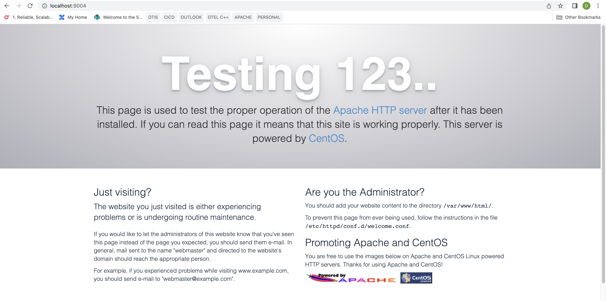
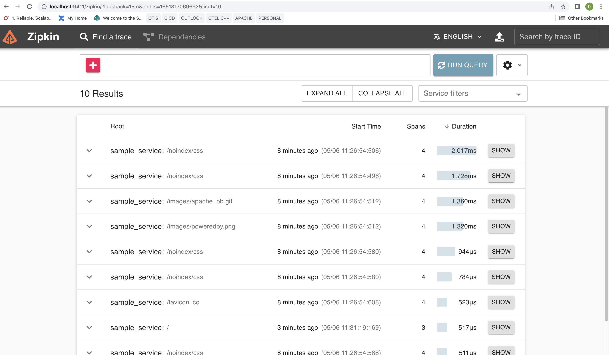
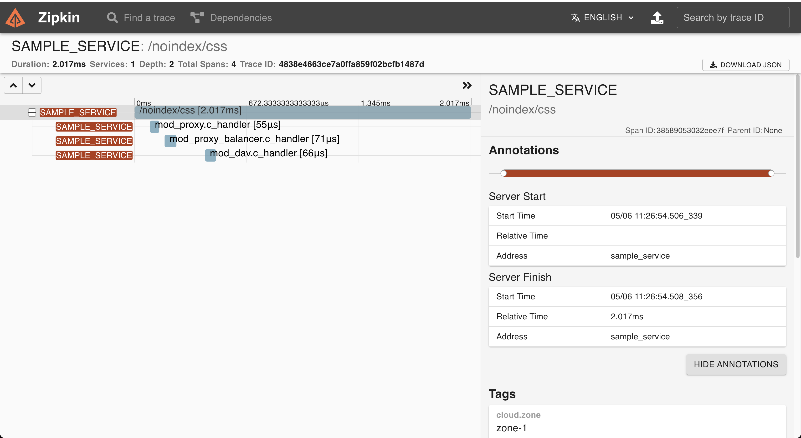
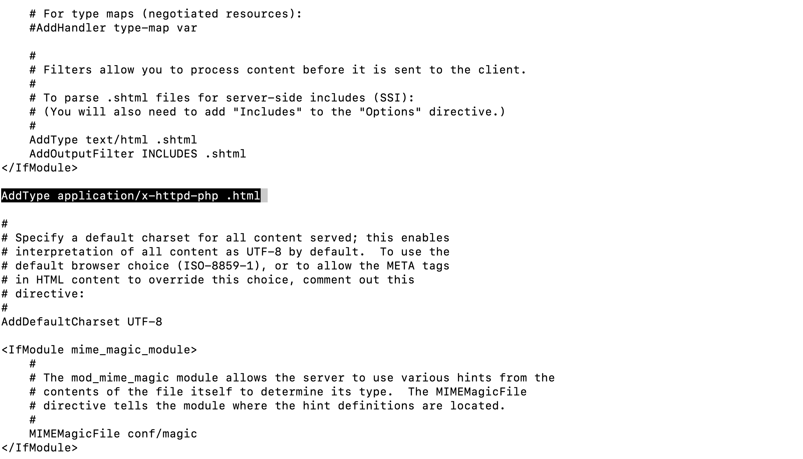
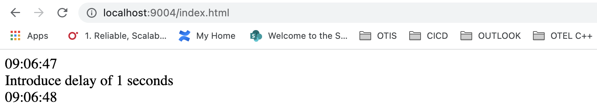
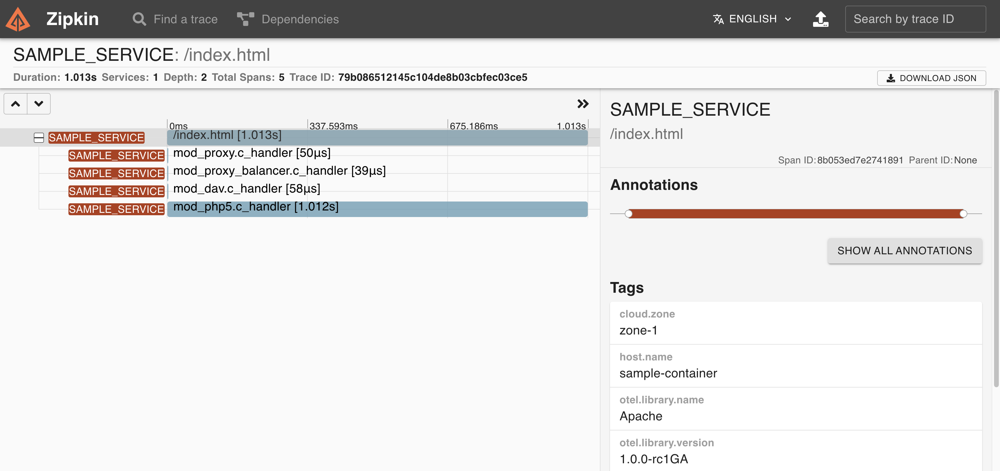
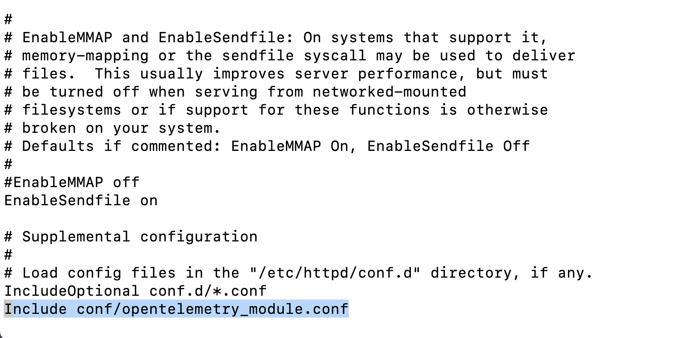
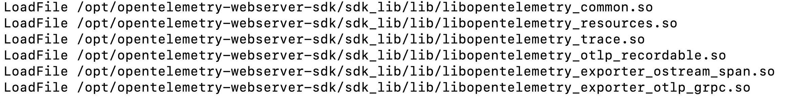
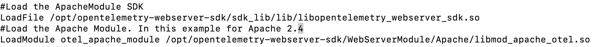
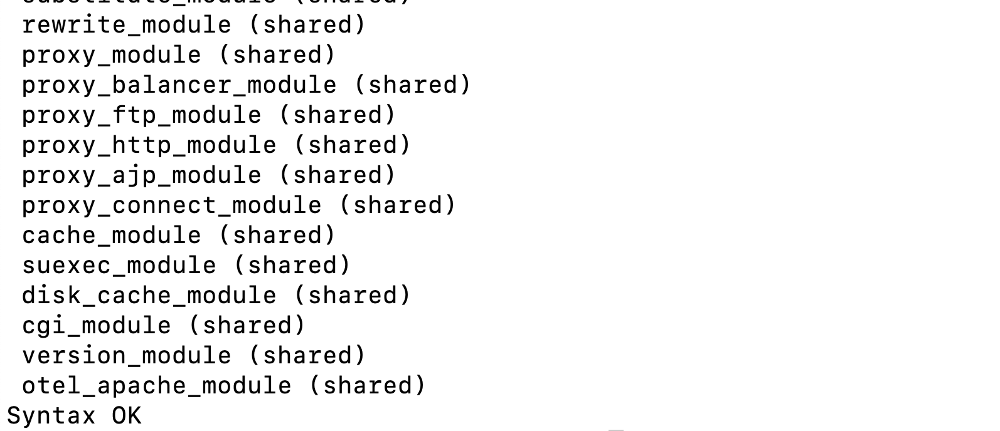

If you are using Apache HTTP Server and in dire need of some observability tool
to monitor your web server, the [OpenTelemetry Module for Apache HTTP Server][]
is the right candidate for you: it enables tracing of incoming requests to the
server and it will capture the response time of many modules (including
`mod_proxy`) involved in such an incoming request. With that you will get
hierarchical time consumption by each module. This article demonstrates the
monitoring capabilities of the OpenTelemetry Module for Apache HTTP Server and
quick guide to get started with the module.

## Getting Started with OpenTelemetry Module

### Building the module

Getting started with the OpenTelemetry module for Apache HTTP Server is pretty
simple, all you need is a docker engine and git. Download the source code from
GitHub and then build the docker image on CentOS7[^1]:

```sh
git clone https://github.com/open-telemetry/opentelemetry-cpp-contrib
cd  instrumentation/otel-webserver-module
docker compose --profile centos7 build
```

These commands download all required dependencies, builds the OpenTelemetry
module for Apache HTTP Server and installs the same on the docker image.

**Note**: The above commands might take around 1 hour to complete.

When the build is finished, run the docker image, by typing the following
command[^1]:

```sh
docker compose --profile centos7 up -d
```

The above command starts up the centos7 image in a docker container named
`webserver_centos7` along with the OpenTelemetry Collector and a Zipkin backend.

OpenTelemetry Module for Apache HTTP Server will be configured and installed in
the desired location and Apache HTTP Server will be started with the
OpenTelemetry Module.

### Viewing spans on the backend

As mentioned in [docker-compose.yml][], `webserver_centos7` listens on port
9004, Zipkin listens on port 9411 and the OpenTelemetry Collector listens on
port 4317.

To send a request to Apache HTTP Server you can either use curl from terminal
(`curl localhost:9004`), or visit [localhost:9004][] in any browser. A default
landing page saying "Testing 123..." for Apache HTTP Server on Centos will be
displayed as below:



Now, traces and spans can be seen on the Zipkin backend. To view them, visit
[localhost:9411][] in your browser and click on **Run Query** button. Following
is the screenshot from Zipkin UI showing spans emitted by the Apache HTTP
Server.



This shows a list of queries or endpoints that have been triggered to Apache
HTTP Server, such as `/noindex/css`.

To see the details click on any of the **SHOW** buttons. Below is the screenshot
from the Zipkin UI showing the span hierarchy.



The above shows that as a part of this request, `mod_proxy`,
`mod_proxy_balancer` and `mod_dav` got involved in the request processing and
time consumed in each of the modules.

## How can module level details be beneficial?

To demonstrate the benefits of module level details, we'll introduce an
artificial delay in a PHP script and see how the delay gets displayed in the
Zipkin backend. The following steps are required to be done.

- Login to the container and install the PHP module.

  ```sh
  docker exec -it webserver_centos7 /bin/bash
  yum install php -y
  ```

- Add `AddType application/x-httpd-php .html` in `/etc/httpd/conf/httpd.conf` as
  mentioned below:

  

- Create a file named as `index.html` in the `**/var/www/html**` directory and
  add the following text

  ```html
  <!doctype html>
  <html>
    <head>
      <title>PHP Test Page</title>
    </head>

    <body>
      <?php echo date('h:i:s') . "<br />"; echo "Introduce delay of 1 seconds" .
      "<br />"; sleep(1); echo date('h:i:s'); ?>
    </body>
  </html>
  ```

- Restart the server:

  ```sh
  httpd -k restart
  ```

- Now, visit [localhost:9004/index.html][]. You should see something like this:

  

- Now, traces and spans can be seen on the Zipkin backend. To view them, type
  [localhost:9411][] on the browser and click on the **Run Query** Button. To
  see the details, click on the **SHOW** button corresponding to `/index.html`.

  

- We can see that, `mod_php5.c_handler` consumes around **1 second** which
  contributes to the overall time-consumption of the request.

As the HTTP request flows through individual modules, delay in execution or
errors might occur at any of the modules involved in the request. To identify
the root cause of any delay or errors in request processing, module wise
information (such as response time of individual modules) would enhance the
debuggability of the Apache HTTP Server.

## Installing OpenTelemetry Module in Target System

To make use of the OpenTelemetry module for Apache HTTP Server, use the
following steps to extract the package and install on the target system where
Apache HTTP Server is installed.

- In order to clone the source code, execute the following

  ```sh
  git clone https://github.com/open-telemetry/opentelemetry-cpp-contrib
  cd  opentelemetry-cpp-contrib/instrumentation/otel-webserver-module
  ```

- Trigger the build command to generate the package inside the docker image[^1]

  ```sh
  docker compose --profile centos7 build
  ```

The above might take around an hour to build. This would build on Centos 7 image
as `apache_centos7`

- Once the build is complete, it's time to extract the image. We need to startup
  the container which can be done by the following command

  ```sh
  docker run -idt --name <container_name> apache_centos7 /bin/bash
  ```

The above command would run the container and can be verified using the
`docker ps` command.

- The generated package inside the container is available inside
  `/otel-webserver-module/build` directory. The same can be extracted to the
  host system as

  ```sh
  docker cp <container_name>:/otel-webserver-module/build/opentelemetry-webserver-sdk-x64-linux.tgz <target-directory>
  ```

**Note:** The above package should work on any linux distribution having
**x86-64** instruction set and glibc version greater than 2.17. At the point of
writing this blog, support for other architectures is not provided.

- Transfer the above package along with [opentelemetry_module.conf][] to the
  target system.

- Uncompress the package `opentelemetry-webserver-sdk-x64-linux.tgz` to `/opt`
  directory.

  ```sh
  tar -xvf opentelemetry-webserver-sdk-x64-linux.tgz -C /opt
  ```

- Now, install the module by executing the following

  ```sh
  cd /opt/opentelemetry-webserver-sdk
  ./install.sh
  ```

- In the case of Centos, Apache HTTP Server configuration is generally located
  in `/etc/httpd/conf/`. Hence copy the [opentelemetry_module.conf][] to
  `/etc/httpd/conf`.

- Edit the `/etc/httpd/conf/httpd.conf` and add
  `Include conf/opentelemetry_module.conf` at the end of the file as mentioned
  below:

  

- Now let’s look at opentelemetry_module.conf and its contents:

  - The below LoadFile are the dependent libraries that come with the package.

    

  - The below configuration are for the OpenTelemetry Module

    

    In the case of Apache HTTP Server 2.2, `libmod_apache_otel22.so` needs to be
    used instead of `libmod_apache_otel.so`

  - The following directive should be ON for the OpenTelemetry module to be
    enabled, else it would be disabled.

    

  - Since the module works with the Collector and sends data in OTLP format, the
    following directives are necessary.

    

    _ApacheModuleOtelExporterEndpoint_ should point to the endpoint of the
    collector

  - ServiceNamespace, ServiceName and ServiceInstanceId should be provided by
    the following directives.

    

  - All other directives are either optional and can be kept as it is for this
    guide

- To verify whether the OpenTelemetry Module is properly enabled into Apache
  HTTP Server, type `httpd -M` and look for `otel_apache_module (shared)`

  

- Now, restart the Apache HTTP Server and OpenTelemetry module should be
  instrumented.

[^1]: {}

[docker-compose.yml]:
  https://github.com/open-telemetry/opentelemetry-cpp-contrib/blob/main/instrumentation/otel-webserver-module/docker-compose.yml
[localhost:9004]: http://localhost:9004
[localhost:9004/index.html]: http://localhost:9004/index.html
[localhost:9411]: http://localhost:9411
[opentelemetry_module.conf]:
  https://github.com/open-telemetry/opentelemetry-cpp-contrib/blob/main/instrumentation/otel-webserver-module/opentelemetry_module.conf
[opentelemetry module for apache http server]:
  https://github.com/open-telemetry/opentelemetry-cpp-contrib/tree/main/instrumentation/otel-webserver-module
