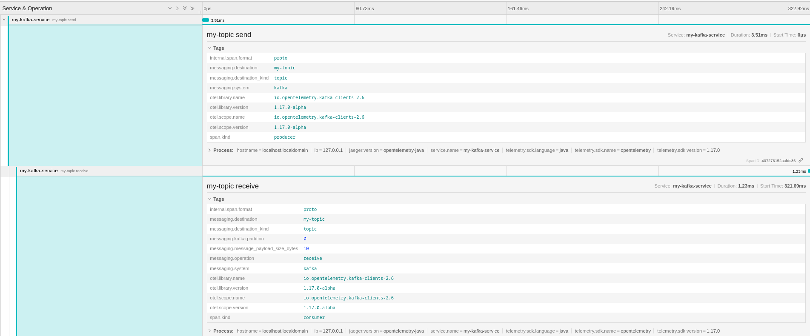
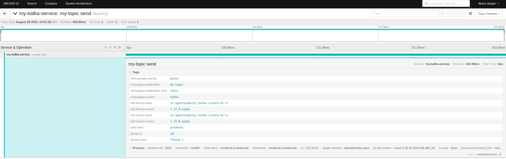
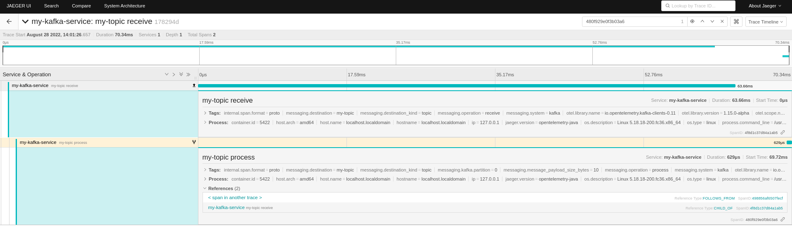

Nowadays, [Apache Kafka](https://kafka.apache.org/) is chosen as the nervous
system in a distributed environment. Different services communicate with each
other by using Apache Kafka as a messaging system but even more as en event or
data streaming platform.

Taking into account the cloud-native approach for developing microservices,
quite often [Kubernetes](https://kubernetes.io/) is also used to run the
workloads. In this scenario, you can also easily deploy and manage an Apache
Kafka cluster on top of it, by using a project like
[Strimzi](https://strimzi.io/). It takes care of the overall Kafka
infrastructure, while you can focus on developing applications which use it.

Within the overall picture, because of the distributed nature, it is quite
difficult to track how messages are moved around. This is where OpenTelemetry
comes into the picture. It provides multiple instrumentation libraries for
adding tracing to messaging based applications. Of course, there is one for
Apache Kafka clients. It also defines the specification of semantic conventions
for
[messaging systems](https://github.com/open-telemetry/opentelemetry-specification/blob/main/specification/trace/semantic_conventions/messaging.md).

But usually, the architecture can even be more complicated: having applications
not able to connect directly to the Apache Kafka cluster and talking its own
custom protocol but using a different one, like for example HTTP. In this case,
tracing how messages are produced and consumed via HTTP through Apache Kafka is
really complex. The Strimzi project provides a bridge, with the OpenTelemetry
support, for adding tracing data by using the corresponding instrumentation
library.

In this article, you will learn how it is possible to enable tracing on Apache
Kafka based client applications in different ways. We will refer to the Java
based instrumentation. You can also find all the examples in this
[repository](https://github.com/ppatierno/kafka-opentelemetry).

## Enable tracing on the Kafka clients

Let's assume you have an application using the Kafka clients API for producing
and consuming messages. In order to simplify the scenario, let's also assume you
don't want to add any additional tracing information within your business logic.
You are interested to add tracing to the Kafka related parts only. You want to
trace how the messages are produced and consumed via the Kafka clients.

In order to do so, there are two different ways:

- using an external agent running alongside your application to add tracing.
- enabling the tracing directly on the Kafka clients used by your application.

The former is actually an "automatic" approach which is about not touching your
application at all. The agent, running alongside the application, is able to
intercept messages coming in and out and adds tracing information to them.

The latter is mostly a "manual" approach which is about instrumenting your
application directly. It means adding some specific dependencies to your project
and make code changes.

## Instrumenting by using the agent

The simpler and automatic approach is by adding tracing to your application with
no changes or additions into your application code. You also don't need to add
any dependencies to OpenTelemetry specific libraries. It is possible by using
the OpenTelemetry agent you can download from
[here](https://github.com/open-telemetry/opentelemetry-java-instrumentation/releases).
This agent has to run alongside your application in order to inject the logic
for tracing messages sent and received to/from a Kafka cluster.

Run the producer application in the following way.

```shell
java -javaagent:path/to/opentelemetry-javaagent.jar \
      -Dotel.service.name=my-kafka-service \
      -Dotel.traces.exporter=jaeger \
      -Dotel.metrics.exporter=none \
      -jar kafka-producer-agent/target/kafka-producer-agent-1.0-SNAPSHOT-jar-with-dependencies.jar
```

Run the consumer application similarly.

```shell
java -javaagent:path/to/opentelemetry-javaagent.jar \
      -Dotel.service.name=my-kafka-service \
      -Dotel.traces.exporter=jaeger \
      -Dotel.metrics.exporter=none \
      -Dotel.instrumentation.messaging.experimental.receive-telemetry.enabled=true \
      -jar kafka-consumer-agent/target/kafka-consumer-agent-1.0-SNAPSHOT-jar-with-dependencies.jar
```

The agent leverages the auto-configuration SDK extension, you will see in a bit,
by setting the main parameters through system properties.

## Instrumenting the Apache Kafka clients

The OpenTelemetry project provides the `opentelemetry-kafka-clients-2.6` module
which provides tracing instrumentation for Kafka clients. First, you need to add
the corresponding dependency to your application.

```xml
<dependency>
    <groupId>io.opentelemetry.instrumentation</groupId>
    <artifactId>opentelemetry-kafka-clients-2.6</artifactId>
</dependency>
```

Depending on the exporter that you want to use for exporting tracing
information, you have to add the corresponding dependency as well. For example,
in order to use the Jaeger exporter, the dependency is the following one.

```xml
<dependency>
    <groupId>io.opentelemetry</groupId>
    <artifactId>opentelemetry-exporter-jaeger</artifactId>
</dependency>
```

In this way, you have the minimum set up for enabling the tracing on your Kafka
based application.

### Setting up the OpenTelemetry instance

The entire tracing instrumentation is handled by an `OpenTelemetry` instance in
your code. It needs to be created and registered globally in order to be made
available to the Kafka clients instrumentation library.

This can be done in two different ways:

- using an SDK extension for environment-based auto-configuration.
- using SDK builders classes for programmatic configuration.

#### Using the SDK auto-configuration

It is possible to configure a global `OpenTelemetry` instance by using
environment variables thanks to the SDK extension for auto-configuration,
enabled by adding the following dependency to your application.

```xml
<dependency>
    <groupId>io.opentelemetry</groupId>
    <artifactId>opentelemetry-sdk-extension-autoconfigure</artifactId>
</dependency>
```

When the Kafka clients instrumentation library is used, it checks if there is an
`OpenTelemetry` instance already created and registered. If it is not, the
library code checks if the SDK auto-configure module is in the classpath and in
this case initializes it for creating the `OpenTelemetry` instance
automatically. The corresponding configuration happens through environment
variables (or corresponding system properties). This is really a way to simplify
the initialization of tracing.

The main environment variables to be set are the following:

- `OTEL_SERVICE_NAME`: specify the logical service name. This is really useful
  when using a tracing UI (i.e. Jaeger UI) for showing data and it is
  recommended to set it.
- `OTEL_TRACES_EXPORTER`: the list of exporters to be used for tracing. For
  example, by using `jaeger` you also need to have the corresponding dependency
  in the application.

Instead of using the above environment variables, it is also possible to use
corresponding system properties to be set programmatically in the code or on the
command line when launching the application They are `otel.service.name` and
`otel.traces.exporter`.

#### Using the SDK builders

In order to build your own `OpenTelemetry` instance and not relying on the
auto-configuration, it is possible to do so by using the SDK builders classes
programmatically. The OpenTelemetry SDK dependency is needed in order to have
such SDK builders available in your code.

```xml
<dependency>
    <groupId>io.opentelemetry</groupId>
    <artifactId>opentelemetry-sdk</artifactId>
</dependency>
```

The following code snippet sets the main attributes like the service name, then
it configures the Jaeger exporter. Finally, it creates the `OpenTelemetry`
instance and registers it globally so that it can be used by the Kafka clients
instrumentation library.

```java
Resource resource = Resource.getDefault()
        .merge(Resource.create(Attributes.of(ResourceAttributes.SERVICE_NAME, "my-kafka-service")));

SdkTracerProvider sdkTracerProvider = SdkTracerProvider.builder()
        .addSpanProcessor(BatchSpanProcessor.builder(JaegerGrpcSpanExporter.builder().build()).build())
        .setSampler(Sampler.alwaysOn())
        .setResource(resource)
        .build();

OpenTelemetry openTelemetry = OpenTelemetrySdk.builder()
        .setTracerProvider(sdkTracerProvider)
        .setPropagators(ContextPropagators.create(W3CTraceContextPropagator.getInstance()))
        .buildAndRegisterGlobal();
```

### Using the interceptors

The Kafka clients API provides a way to "intercept" messages before they are
sent to the brokers as well as messages received from the broker before being
passed to the application. This approach is heavily used when you need to add
some logic or content to the messages right before they are sent. At same time,
it is useful to handle consumed messages right before they are passed to the
upper application layer. It fits pretty well with tracing when you need to
create or close spans on sending and receiving messages.

The Kafka clients instrumentation library provides two interceptors to be
configured to add tracing information automatically. The interceptor classes
have to be set in the properties bag used to create the Kafka client within the
application.

Use the `TracingProducerInterceptor` for the producer in order to create a
"send" span automatically, each time a message is sent.

```java
props.setProperty(ProducerConfig.INTERCEPTOR_CLASSES_CONFIG, TracingProducerInterceptor.class.getName());
```

Use the `TracingConsumerInterceptor` for the consumer in order to create a
"receive" span automatically, each time a message is received.

```java
props.setProperty(ConsumerConfig.INTERCEPTOR_CLASSES_CONFIG, TracingConsumerInterceptor.class.getName());
```

### Wrapping the clients

The other way is by wrapping the Kafka client with a tracing enabled one.

On the producer side, assuming you have a `Producer<K, V>` instance, you can
wrap it in the following way.

```java
KafkaTelemetry telemetry = KafkaTelemetry.create(GlobalOpenTelemetry.get());
Producer<String, String> tracingProducer = telemetry.wrap(producer);
```

Then use the `tracingProducer` as usual for sending messages to the Kafka
cluster.

On the consumer side, assuming you have a `Consumer<K, V>` instance, you can
wrap it in the following way.

```java
KafkaTelemetry telemetry = KafkaTelemetry.create(GlobalOpenTelemetry.get());
Consumer<String, String> tracingConsumer = telemetry.wrap(this.consumer);
```

Then use the `tracingConsumer` as usual for receiving messages from the Kafka
cluster.

## Instrumentation in action

In order to practice with the instrumentation of Kafka clients by using the
provided examples, first of all you need an Apache Kafka cluster. The easiest
way is to download it from the
[official website](https://kafka.apache.org/downloads) and running just one
ZooKeeper node together with one Kafka broker. You can follow the
[quick start](https://kafka.apache.org/documentation/#quickstart) to have such a
cluster up and running in a few minutes. Analyzing tracing information is also
simpler if using a Web UI, for example the one provided by Jaeger. Even in this
case downloading it from the
[official website](https://www.jaegertracing.io/download/) and running it
locally is really simple.

When the environment is ready, the first try is about running the producer and
consumer applications instrumented by using interceptors or wrappers. Just
sending one message and consuming it provides the following tracing.



As you can see the "send" and "receive" spans are both in the same trace and the
"receive" span is defined as `CHILD_OF` the "send" one. You can also see that
the semantic defines some specific messaging related tags on the spans with the
`messaging.` prefix. This semantic is not actually right because the send
operation doesn't depend on the receive (which is the meaning of `CHILD_OF`
relationship). It is anyway going to change, per this GitHub
[discussion](https://github.com/open-telemetry/opentelemetry-specification/discussions/2695)
and the new messaging semantic conventions that is going to be stabilized via
this new
[OTEP (OpenTelemetry Enhancement Proposal)](https://github.com/open-telemetry/oteps/pull/192).
The goal is to have the "send" and "receive" spans in two different traces but
linked together with a `FOLLOW_FROM` relationship.

This approach is more reflected when using the agent with the "send" span living
in its own trace as following.



On the receiving side, there are also a "receive" and "process" spans referring
to the producer one.



## Conclusion

Apache Kafka is just one of the messaging platforms that can be used for
microservices communication in a distributed system. Monitoring how the messages
are exchanged and troubleshooting problems is really complex. This is where the
OpenTelemetry project comes into the picture to put tracing in your hands. In
this article, we saw how the Kafka clients instrumentation library makes really
simple to add tracing information to your Kafka based applications. You can get
more information about how producers and consumers are behaving and keeps track
of each message from one end to the other. So ... what else? Give it a try!

## References

- [Apache Kafka](https://kafka.apache.org/)
- Strimzi
  - [Website](https://strimzi.io/)
  - [GitHub](https://github.com/strimzi)
  - [Bridge](https://github.com/strimzi/strimzi-kafka-bridge)
- [Kubernetes](https://kubernetes.io/)
