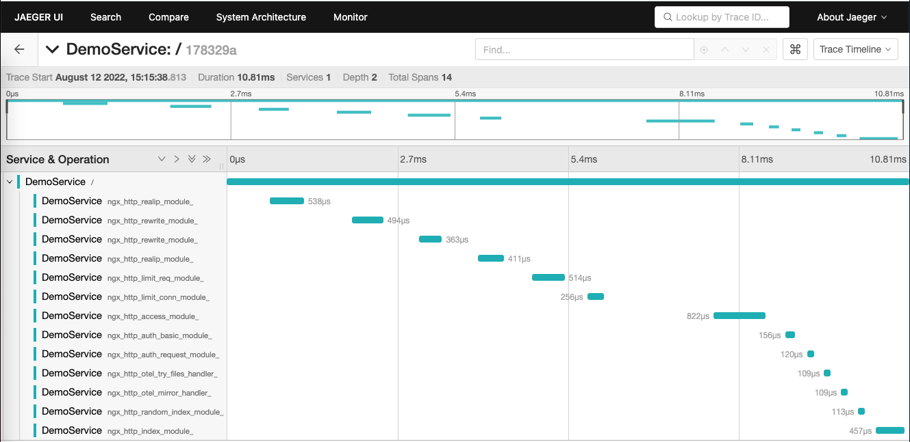
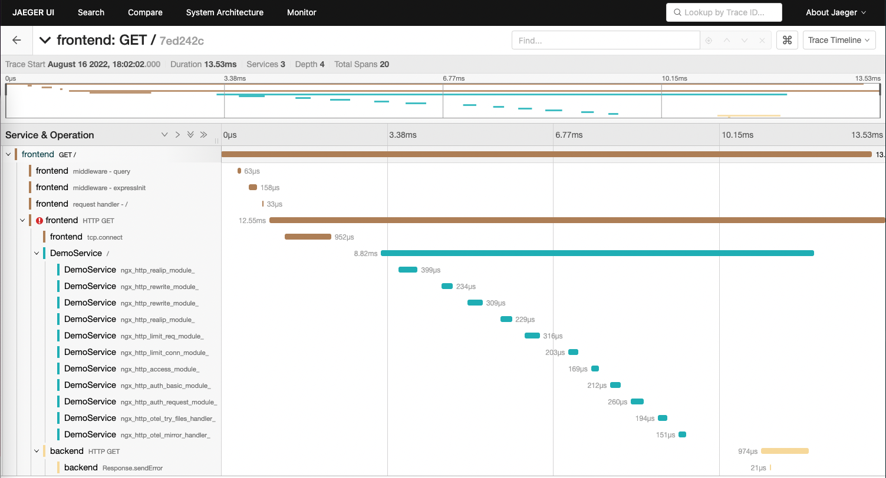

Apache HTTP Server and NGINX are the most popular web servers. It's most likely
that you are using one of them in your application. In a [previous blog post][],
you learned how to use the OpenTelemetry Module for Apache HTTP Server to add
observability to Apache HTTP Server. In this blog post, you will learn how you
can get observability for NGINX!

## Install the module for NGINX

In the following, you are going to use docker to run a NGINX server with the
`ngx_http_opentelemetry_module.so` enabled and configured. Of course, you can
use the same set of commands used in the `Dockerfile` below to configure a NGINX
server on a bare-metal machine.

Start from an empty directory. Create a file called `Dockerfile` and copy the
following content into it:

```Dockerfile
FROM nginx:1.18
RUN apt-get update ; apt-get install unzip
ADD https://github.com/open-telemetry/opentelemetry-cpp-contrib/releases/download/webserver%2Fv1.0.0/opentelemetry-webserver-sdk-x64-linux.tgz.zip /opt
RUN cd /opt ; unzip opentelemetry-webserver-sdk-x64-linux.tgz.zip; tar xvfz opentelemetry-webserver-sdk-x64-linux.tgz
RUN cd /opt/opentelemetry-webserver-sdk; ./install.sh
ENV LD_LIBRARY_PATH=$LD_LIBRARY_PATH:/opt/opentelemetry-webserver-sdk/sdk_lib/lib
RUN echo "load_module /opt/opentelemetry-webserver-sdk/WebServerModule/Nginx/ngx_http_opentelemetry_module.so;\n$(cat /etc/nginx/nginx.conf)" > /etc/nginx/nginx.conf
COPY opentelemetry_module.conf /etc/nginx/conf.d
```

What this `Dockerfile` does:

- Pull a base image with NGINX 1.18 pre-installed
- Install `unzip`
- Download the [opentelemetry-webserver-sdk-x64-linux] package
- Unpack the package, put it into `/opt` & run `./install.sh`
- Add the dependencies at `/opt/opentelemetry-webserver-sdk/sdk_lib/lib` to the
  library path (`LD_LIBRARY_PATH`)
- Tell NGINX to load the `ngx_http_opentelemetry_module.so`
- Add the configuration of the modules to NGINX.

Next, create another file called `opentelemetry_module.conf` and copy the
following content into it:

```nginx
NginxModuleEnabled ON;
NginxModuleOtelSpanExporter otlp;
NginxModuleOtelExporterEndpoint localhost:4317;
NginxModuleServiceName DemoService;
NginxModuleServiceNamespace DemoServiceNamespace;
NginxModuleServiceInstanceId DemoInstanceId;
NginxModuleResolveBackends ON;
NginxModuleTraceAsError ON;
```

This will enable the OpenTelemetry and apply the following configuration:

- Send spans via OTLP to localhost:4317
- Set the attributes `service.name` to `DemoService`, `service.namespace` to
  `DemoServiceNamespace` and the `service.instance_id` to `DemoInstanceId`
- Report traces as errors, so you will see them in the NGINX log

To learn all the settings available, see the [full list of directives][].

With the `Dockerfile` and NGINX config in place, build your docker image and run
the container:

```console
$ docker build -t nginx-otel --platform linux/amd64 .
$ docker run --platform linux/amd64 --rm -p 8080:80 nginx-otel
...
2022/08/12 09:26:42 [error] 69#69: mod_opentelemetry: ngx_http_opentelemetry_init_worker: Initializing Nginx Worker for process with PID: 69
```

With the container up and running, send requests to NGINX using, for example,
`curl localhost:8080`.

Since the configuration above has `NginxModuleTraceAsError` set to `ON` and you
will see your traces dump to the error log of NGINX:

```log
2022/08/12 09:31:12 [error] 70#70: *3 mod_opentelemetry: startMonitoringRequest: Starting Request Monitoring for: / HTTP/1.1
Host, client: 172.17.0.1, server: localhost, request: "GET / HTTP/1.1", host: "localhost:8080"
2022/08/12 09:31:12 [error] 70#70: *3 mod_opentelemetry: startMonitoringRequest: WebServer Context: DemoServiceNamespaceDemoServiceDemoInstanceId, client: 172.17.0.1, server: localhost, request: "GET / HTTP/1.1", host: "localhost:8080"
2022/08/12 09:31:12 [error] 70#70: *3 mod_opentelemetry: startMonitoringRequest: Request Monitoring begins successfully , client: 172.17.0.1, server: localhost, request: "GET / HTTP/1.1", host: "localhost:8080"
2022/08/12 09:31:12 [error] 70#70: *3 mod_opentelemetry: otel_startInteraction: Starting a new module interaction for: ngx_http_realip_module, client: 172.17.0.1, server: localhost, request: "GET / HTTP/1.1", host: "localhost:8080"
2022/08/12 09:31:12 [error] 70#70: *3 mod_opentelemetry: otel_payload_decorator: Key : tracestate, client: 172.17.0.1, server: localhost, request: "GET / HTTP/1.1", host: "localhost:8080"
2022/08/12 09:31:12 [error] 70#70: *3 mod_opentelemetry: otel_payload_decorator: Value : , client: 172.17.0.1, server: localhost, request: "GET / HTTP/1.1", host: "localhost:8080"
2022/08/12 09:31:12 [error] 70#70: *3 mod_opentelemetry: otel_payload_decorator: Key : baggage, client: 172.17.0.1, server: localhost, request: "GET / HTTP/1.1", host: "localhost:8080"
2022/08/12 09:31:12 [error] 70#70: *3 mod_opentelemetry: otel_payload_decorator: Value : , client: 172.17.0.1, server: localhost, request: "GET / HTTP/1.1", host: "localhost:8080"
2022/08/12 09:31:12 [error] 70#70: *3 mod_opentelemetry: otel_payload_decorator: Key : traceparent, client: 172.17.0.1, server: localhost, request: "GET / HTTP/1.1", host: "localhost:8080"
2022/08/12 09:31:12 [error] 70#70: *3 mod_opentelemetry: otel_payload_decorator: Value : 00-987932d28550c0a1c0a82db380a075a8-fc0bf2248e93dc42-01, client: 172.17.0.1, server: localhost, request: "GET / HTTP/1.1", host: "localhost:8080"
2022/08/12 09:31:12 [error] 70#70: *3 mod_opentelemetry: otel_startInteraction: Interaction begin successful, client: 172.17.0.1, server: localhost, request: "GET / HTTP/1.1", host: "localhost:8080"
2022/08/12 09:31:12 [error] 70#70: *3 mod_opentelemetry: otel_stopInteraction: Stopping the Interaction for: ngx_http_realip_module, client: 172.17.0.1, server: localhost, request: "GET / HTTP/1.1", host: "localhost:8080"
```

## Viewing spans in Jaeger

At this point the telemetry data generated by NGINX is not send to an
OpenTelemetry Collector or any other observability backend. You can easily
change that by creating a `docker-compose` file, that starts the NGINX server,
the collector and Jaeger:

Create a file called `docker-compose.yml` and add the following content:

```yaml
version: '3.8'
services:
  jaeger:
    image: jaegertracing/all-in-one:latest
    ports:
      - '16686:16686'
  collector:
    image: otel/opentelemetry-collector:latest
    command: ['--config=/etc/otel-collector-config.yaml']
    volumes:
      - ./otel-collector-config.yaml:/etc/otel-collector-config.yaml
  nginx:
    image: nginx-otel
    volumes:
      - ./opentelemetry_module.conf:/etc/nginx/conf.d/opentelemetry_module.conf
    ports:
      - 8080:80
```

Create a file called `otel-collector-config.yaml` containing the following:

```yaml
receivers:
  otlp:
    protocols:
      grpc:
      http:
exporters:
  jaeger:
    endpoint: jaeger:14250
    tls:
      insecure: true
service:
  pipelines:
    traces:
      receivers: [otlp]
      exporters: [jaeger]
```

Before spinning up the containers, update line 3 in `opentelemetry_module.conf`
to have the right exporter endpoint:

```yaml
NginxModuleEnabled ON; NginxModuleOtelSpanExporter otlp;
NginxModuleOtelExporterEndpoint collector:4317;
```

You don't need to rebuild your docker image, because the `docker-compose.yaml`
above loads the `opentelemetry_module.conf` as a file volume on container
startup.

Get everything up and running[^1]:

```sh
docker compose up
```

In another shell, create some traffic:

```sh
curl localhost:8080
```

In your browser open [localhost:16686][] and search for traces from
`DemoService` and drill into one of them.



You will see one span for each NGINX module being executed during the request.
With that you can easily spot issues with certain modules, for example, a
rewrite going mad.

## Put NGINX between two services

Of course, NGINX is rarely used as a standalone solution! Most of the time it is
used as a reverse proxy or load balancer in front of another service. And, there
might be a service calling NGINX to reach that down stream service.

Add two more services to the running example:

- A Node.js service called `frontend` that sits at the front and calls the NGINX
- A Java service called `backend` that sits behind the NGINX

Update the `docker-compose` file to contain those 2 services and to overwrite
the `default.conf` in NGINX:

```yaml
version: '3.8'
services:
  jaeger:
    image: jaegertracing/all-in-one:latest
    ports:
      - '16686:16686'
  collector:
    image: otel/opentelemetry-collector:latest
    command: ['--config=/etc/otel-collector-config.yaml']
    volumes:
      - ./otel-collector-config.yaml:/etc/otel-collector-config.yaml
  nginx:
    image: nginx-otel
    volumes:
      - ./opentelemetry_module.conf:/etc/nginx/conf.d/opentelemetry_module.conf
      - ./default.conf:/etc/nginx/conf.d/default.conf
  backend:
    build: ./backend
    image: backend-with-otel
    environment:
      - OTEL_TRACES_EXPORTER=otlp
      - OTEL_METRICS_EXPORTER=none
      - OTEL_EXPORTER_OTLP_ENDPOINT=http://collector:4318/
      - OTEL_EXPORTER_OTLP_PROTOCOL=http/protobuf
      - OTEL_SERVICE_NAME=backend
  frontend:
    build: ./frontend
    image: frontend-with-otel
    ports:
      - '8000:8000'
    environment:
      - OTEL_EXPORTER_OTLP_ENDPOINT=http://collector:4318/
      - OTEL_EXPORTER_OTLP_PROTOCOL=http/protobuf
      - OTEL_SERVICE_NAME=frontend
```

Create the `default.conf` that will pass requests to NGINX down to the backend
service:

```nginx
server {
    listen       80;
    location / {
        proxy_pass http://backend:8080;
    }
}
```

Create two empty folders `backend` and `frontend`.

In the frontend folder, create a simple Node.js app:

```javascript
const opentelemetry = require('@opentelemetry/sdk-node');
const {
  getNodeAutoInstrumentations,
} = require('@opentelemetry/auto-instrumentations-node');
const {
  OTLPTraceExporter,
} = require('@opentelemetry/exporter-trace-otlp-http');

const initAndStartSDK = async () => {
  const sdk = new opentelemetry.NodeSDK({
    traceExporter: new OTLPTraceExporter(),
    instrumentations: [getNodeAutoInstrumentations()],
  });

  await sdk.start();
  return sdk;
};

const main = async () => {
  try {
    const sdk = await initAndStartSDK();
    const express = require('express');
    const http = require('http');
    const app = express();
    app.get('/', (_, response) => {
      const options = {
        hostname: 'nginx',
        port: 80,
        path: '/',
        method: 'GET',
      };
      const req = http.request(options, (res) => {
        console.log(`statusCode: ${res.statusCode}`);
        res.on('data', (d) => {
          response.send('Hello World');
        });
      });
      req.end();
    });
    app.listen(8000, () => {
      console.log('Listening for requests');
    });
  } catch (error) {
    console.error('Error occurred:', error);
  }
};

main();
```

To finalize the frontend service, create an empty `Dockerfile` with the
following content:

```Dockerfile
FROM node:16
WORKDIR /app
RUN npm install @opentelemetry/api @opentelemetry/auto-instrumentations-node @opentelemetry/exporter-trace-otlp-http @opentelemetry/sdk-node express
COPY app.js .
EXPOSE 8000
CMD [ "node", "app.js" ]
```

For the backend service, you are going to use Tomcat with the OpenTelemetry Java
agent installed. For this, create a `Dockerfile` like the following in the
`backend` folder

```Dockerfile
FROM tomcat
ADD https://github.com/open-telemetry/opentelemetry-java-instrumentation/releases/latest/download/opentelemetry-javaagent.jar javaagent.jar
ENV JAVA_OPTS="-javaagent:javaagent.jar"
CMD ["catalina.sh", "run"]
```

As you can see, the `Dockerfile` downloads and adds the OpenTelemetry Java agent
for you automatically.

You should now have the following files in your top level directory:

- ./default.conf
- ./docker-compose.yml
- ./Dockerfile
- ./opentelemetry_module.conf
- ./otel-collector-config.yaml
- ./backend/Dockerfile
- ./frontend/Dockerfile
- ./frontend/app.js

With everything in place, you can now start the demo environment[^1]:

```sh
docker compose up
```

Within a few moments you should have five docker containers up and running:

- Jaeger
- OpenTelemetry Collector
- NGINX
- Frontend
- Backend

Send a few requests to the frontend with `curl localhost:8000` and then check
the Jaeger UI in your browser at [localhost:16686]. You should see traces going
from frontend to NGINX to backend.

The frontend trace should indicate an error, since NGINX is forwarding the
`Page Not Found` from Tomcat.



## What's next?

You should now be able to apply what you have learned from this blog post to
your own installation of NGINX. We would love to hear about your experience! If
you run into any problems, [create an issue][].

[^1]: {}

[create an issue]:
  https://github.com/open-telemetry/opentelemetry-cpp-contrib/issues
[full list of directives]:
  https://github.com/open-telemetry/opentelemetry-cpp-contrib/tree/main/instrumentation/otel-webserver-module#configuration-1
[localhost:16686]: http://localhost:16686
[opentelemetry-webserver-sdk-x64-linux]:
  https://github.com/open-telemetry/opentelemetry-cpp-contrib/releases/download/webserver%2Fv1.0.0/opentelemetry-webserver-sdk-x64-linux.tgz.zip
[previous blog post]: /blog/2022/instrument-apache-httpd-server/
