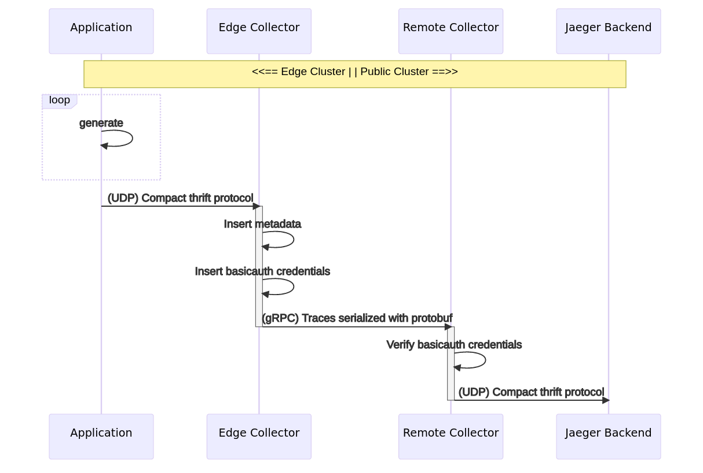
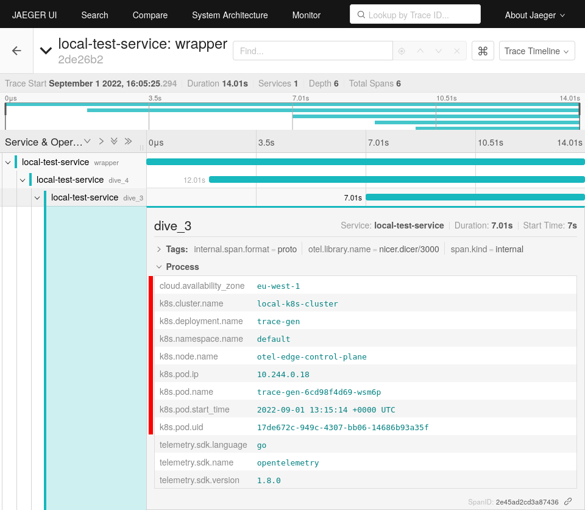

Exposing an [OpenTelemetry Collector](/docs/collector/) currently requires a
number of configuration steps. The goal of this blog post is to demonstrate
`how to establish a secure communication` between two collectors in different
kubernetes clusters.

Details of CRDs and dependency installations are not covered by this post.

## Overview

When it comes to making collectors publicly accessible, the first thing that
comes to mind is the secure transmission of user data via TLS. However,
authentication to the server is at least as important to prevent unauthorized
services from sending data.

The OpenTelemetry Collector supports different authentication methods. The most
used are probably:

1. TLS Authentification
2. OpenID Connect (OIDC-Authentication)
3. HTTP Basic Authentication

This article focuses on **HTTP Basic Authentication** for simplicity. It is
intended to show how a secure setup can be operated without key management or
further third party services.

For more information about TLS configuration I would like to refer to the
article
[How TLS provides identification, authentication, confidentiality, and integrity](https://www.ibm.com/docs/en/ibm-mq/9.1?topic=tls-how-provides-identification-authentication-confidentiality-integrity)
and the Collector
[TLS-Config](https://github.com/open-telemetry/opentelemetry-collector/blob/v0.58.0/config/configtls/README.md)
description on Github.

If you are interested in using an external authentication provider, I advise you
to have a look at the article
[Securing your OpenTelemetry Collector](https://medium.com/opentelemetry/securing-your-opentelemetry-collector-1a4f9fa5bd6f)
by Juraci Paixão Kröhling on this topic. He explains how OpenTelemetry
collectors can be secured using the
[OIDC-Authenticator extension](https://github.com/open-telemetry/opentelemetry-collector-contrib/tree/v0.58.0/extension/oidcauthextension),
and how [Keycloak](https://www.keycloak.org/) can be configured as an
authentication provider.

### Basic Authentication

The HTTP Basic Authentication mechanism is quite simple. An HTTP user agent
(e.g., a web browser) provides a username and password combination on every
request. Transmitted credentials are included in the HTTP header by the key
`Authorization` when the connection is established. As a value the
authentication method `basic` is mentioned first, followed by the encoded
crendentials. Note that the credential form is `username:password`.

In the following example, `dXNlci0xOjEyMzQK` is the encoding for a combination
of `username=user-1` and `password=1234`. Note to encode or decode base64
values, you can use

```YAML
# HTTP Header key: value pair
Authorization: Basic <credentials-base64-encoded>

# example: user: user-1 password: 1234
Authorization: Basic dXNlci0xOjEyMzQK
```

You can easily create your own user password combination using the
[base64 cli tool](https://linux.die.net/man/1/base64).

```bash
# encode
$ echo "user-1:1234" | base64
dXNlci0xOjEyMzQK

# decode
$ echo "dXNlci0xOjEyMzQK" | base64 -d
user-1:1234
```

### Data flow

The following graph illustrates the target topology. The goal is to transfer
traces generated by a
[test application](https://github.com/frzifus/jaeger-otel-test/pkgs/container/jaeger-otel-test)
via a dedicated collector to a publicly accessible cluster. The receiving
collector uses the transmitted
['Basic' HTTP Authentication](https://datatracker.ietf.org/doc/html/rfc7617)
credentials to check whether the sender is authorized to store data. Finally,
transmitted traces are stored in a
[Jaeger in-memory](https://www.jaegertracing.io/docs/1.37/deployment/#memory)



## Prerequisites

Interfaces and behavior may change in the future. Therefore, the versions used
in this setup are mentioned in brackets.

- A Kubernetes[v1.23.3] cluster with a public address with
  [ingress-nginx-controller](https://docs.nginx.com/nginx-ingress-controller/)[v1.2.1]
  installed.
- A Kubernetes[v1.23.3] edge cluster to create a test cluster. Using
  [Kind](https://kind.sigs.k8s.io/) is recommended.
- Installed [OpenTelemetry Operator](/docs/collector/getting-started)[v0.58.0]
  on both ends.
- Installed
  [Jaeger Operator](https://www.jaegertracing.io/docs/1.37/operator/)[v1.37.0]
  on your public cluster.
- Installed [cert-manager](https://cert-manager.io/)[v1.9.1] on your public
  cluster.

## Remote cluster configuration

Since all components except the Jaeger backend depend on a following component,
we begin by deploying the backend.

```yaml
apiVersion: jaegertracing.io/v1
kind: Jaeger
metadata:
  name: my-in-memory
```

In the next step we create an OpenTelemetry Collector using the
`OpenTelemetryCollector` CRD. The most important entries are `mode`, `image` and
the configured basicauth extension. In the manifest below the mode `deployment`
was chosen to guarantee that at least one collector pod is available for
processing incoming information. Furthermore the default collector image was
overwritten with the
[contrib version](https://github.com/open-telemetry/opentelemetry-collector-contrib#opentelemetry-collector-contrib).
This is necessary because the
[core version](https://github.com/open-telemetry/opentelemetry-collector) does
not contain the
[basicauth](https://github.com/open-telemetry/opentelemetry-collector-contrib/tree/v0.58.0/extension/basicauthextension)
extension. This extension was configured with the name `basicauth/server` and
registered in `otlp/basicauth`. As
[otlp exporter](https://github.com/open-telemetry/opentelemetry-collector/tree/v0.58.0/exporter/otlpexporter)
endpoint the jaeger inmemory service was configured.

```yaml
apiVersion: opentelemetry.io/v1alpha1
kind: OpenTelemetryCollector
metadata:
  name: otel-collector-app
spec:
  mode: deployment
  image: otel/opentelemetry-collector-contrib:0.58.0
  config: |
    extensions:
      basicauth/server:
        htpasswd:
          inline: |
            <REPLACE: your backend credentials, e.g.: "user-1:1234">

    receivers:
      otlp/basicauth:
        protocols:
          grpc:
            auth:
              authenticator: basicauth/server

    exporters:
      otlp/jaeger:
        endpoint: my-in-memory-collector:4317
        tls:
          insecure: true
          insecure_skip_verify: true

    service:
      extensions: [basicauth/server]
      pipelines:
        traces:
          receivers: [otlp/basicauth]
          exporters: [otlp/jaeger]
```

After a successful installation, a pod for the Jaeger backend and the
OpenTelemetry collector should be created in the selected namespace.

```bash
NAME                                            READY   STATUS    RESTARTS   AGE
my-in-memory-6c5f5f87c5-rnp99                   1/1     Running   0          4m
otel-collector-app-collector-55cccf4b7d-llczt   1/1     Running   0          3m
```

Also the following services should be available:

```bash
NAME                                      TYPE        CLUSTER-IP      EXTERNAL-IP   PORT(S)                                                    AGE
my-in-memory-agent                        ClusterIP   None            <none>        5775/UDP,5778/TCP,6831/UDP,6832/UDP                         7m
my-in-memory-collector                    ClusterIP   10.245.43.185   <none>        9411/TCP,14250/TCP,14267/TCP,14268/TCP,4317/TCP,4318/TCP    7m
my-in-memory-collector-headless           ClusterIP   None            <none>        9411/TCP,14250/TCP,14267/TCP,14268/TCP,4317/TCP,4318/TCP    7m
my-in-memory-query                        ClusterIP   10.245.91.239   <none>        16686/TCP,16685/TCP                                         7m
otel-collector-app-collector              ClusterIP   10.245.5.134    <none>        4317/TCP                                                    5m
otel-collector-app-collector-headless     ClusterIP   None            <none>        4317/TCP                                                    5m
otel-collector-app-collector-monitoring   ClusterIP   10.245.116.38   <none>        8888/TCP                                                    5m

```

Finally, cert-manager is configured to automatically request TLS certificates
from [lets encrypt](https://letsencrypt.org/) and make it available to the
Ingress TLS configuration. The following `ClusterIssuer` and `Ingress` entries
expose the `otel-collector-app-collector` service. Note that you'll need to
replace values for the `email` and `host` fields.

```yaml
apiVersion: cert-manager.io/v1
kind: ClusterIssuer
metadata:
  name: letsencrypt
  namespace: cert-manager
spec:
  acme:
    server: https://acme-v02.api.letsencrypt.org/directory
    email: your-email-address-here@example.com # REPLACE
    privateKeySecretRef:
      name: letsencrypt
    solvers:
    - http01:
        ingress:
          class: nginx
---
apiVersion: networking.k8s.io/v1
kind: Ingress
metadata:
  name: ingress-otel
  annotations:
    kubernetes.io/ingress.class: nginx
    nginx.ingress.kubernetes.io/backend-protocol: GRPC
    cert-manager.io/cluster-issuer: letsencrypt
spec:
  tls:
    - hosts:
      - your-host # REPLACE your domain endpoint, e.g., traces@example.com
      secretName: letsencrypt
  rules:
  - host: your-host # REPLACE your domain endpoint, e.g., traces@example.com
    http:
      paths:
      - pathType: Prefix
        path: "/"
        backend:
          service:
            name: otel-collector-app-collector
            port:
              number: 4317
```

### Edge Cluster configuration

In order to be able to determine the origin of the transmitted traces, the
span-tags are extended by identifying metadata with the help of the
[k8sattributes processor](https://github.com/open-telemetry/opentelemetry-collector-contrib/tree/v0.58.0/processor/k8sattributesprocessor).
K8sattribute processor is available in the OpenTelemetry Collector contrib
version. In the next step we create a service account with the necessary
permissions. If you want to learn more about the k8s metadata, you can read this
post "[Improved troubleshooting using k8s metadata](/blog/2022/k8s-metadata)".

```yaml
apiVersion: rbac.authorization.k8s.io/v1
kind: ClusterRole
metadata:
  name: attributes-role
rules:
  - apiGroups:
      - ''
    resources:
      - pods
    verbs:
      - get
      - list
      - watch
---
apiVersion: rbac.authorization.k8s.io/v1
kind: ClusterRoleBinding
metadata:
  name: attributes-rolebinding
roleRef:
  apiGroup: rbac.authorization.k8s.io
  kind: ClusterRole
  name: attributes-role
subjects:
  - kind: ServiceAccount
    name: attributes-account
---
apiVersion: v1
kind: ServiceAccount
metadata:
  name: attributes-account
```

Let's have a quick look on the most important edge collector settings. A
`daemonset` is used as deployment mode to ensure that one collector instance per
node exists. The `basicauth` extension contains `username` and `password` to
identify itself to the exposed remote collector. More container and node
specific information are provided by the `k8sattributes` processor via the
kubernetes
[kubernetes downward-api](https://kubernetes.io/docs/concepts/workloads/pods/downward-api/).
What is not covered is the cluster availability zone and the cluster name. To be
able to identify the reported spans later, they are inserted manually with the
help of the `resource` processor. Last, the OTLP exporter endpoint has also been
given a placeholder value that must be replaced with your remote cluster domain.

```yaml
apiVersion: opentelemetry.io/v1alpha1
kind: OpenTelemetryCollector
metadata:
  name: otel-collector-app
spec:
  mode: daemonset
  image: otel/opentelemetry-collector-contrib:0.58.0
  serviceAccount: attributes-account
  env:
    - name: KUBE_NODE_NAME
      valueFrom:
        fieldRef:
          apiVersion: v1
          fieldPath: spec.nodeName

  config: |
    extensions:
      basicauth/client:
        client_auth: # credentials must be consistent with those of the receiving collector.
          username: <REPLACE: your basicauth username, e.g.: "user-1">
          password: <REPLACE: your basicauth password, e.g.: "1234">

    receivers:
      otlp:
        protocols:
          grpc:

    processors:
      resource:
        attributes:
        - key: cloud.availability_zone
          value: <REPLACE: your availability zone, e.g.: "eu-west-1">
          action: insert
        - key: k8s.cluster.name
          value: <REPLACE: your cluster name, e.g.: "edge-cluster-1">
          action: insert
      k8sattributes:
        filter:
          node_from_env_var: KUBE_NODE_NAME

    exporters:
      otlp:
        endpoint: "<REPLACE: your domain endpoint, e.g.: "traces.example.com:443">"
        auth:
          authenticator: basicauth/client
      logging:

    service:
      extensions: [basicauth/client]
      pipelines:
        traces:
          receivers: [otlp]
          processors: [k8sattributes]
          exporters: [otlp,logging]
```

After a successful installation, a `daemonset` with the name
`otel-collector-app-collector` should have been created. This ensures that each
cluster node has a local collector instance up and running.

### Deploy trace generator to generate test data

```yaml
apiVersion: apps/v1
kind: Deployment
metadata:
  name: trace-gen
spec:
  selector:
    matchLabels:
      app: trace-gen
  template:
    metadata:
      labels:
        app: trace-gen
    spec:
      containers:
        - name: trace-gen
          image: ghcr.io/frzifus/jaeger-otel-test:latest
          args:
            [
              '-otel.agent.host=otel-collector-app-collector',
              '-otel.agent.port=4317',
            ]
          env:
            - name: OTEL_SERVICE_NAME
              value: 'local-test-service'
```

## Testing

Now spans generated in the edge cluster should be extended with origin metadata.
These are then transferred to the remote cluster and stored in the Jaeger
backend. Jaeger itself provides a UI for inspecting transmitted data.

An easy way to reach the UI is by port forwarding to your local system.

```bash
$ kubectl port-forward deployments/my-in-memory 16686
Forwarding from 127.0.0.1:16686 -> 16686
```



## Conclusion

Configurations like `Ingress`, `ClusterIssuer` and `OpenTelemetryCollector` on
client and server side have to be configured manually. Depending on installed
kubernetes components, the configurations differ a lot. Overall the
configuration is very error-prone. In the future the exposing of the collector
should be simplified with the help of the OpenTelemetry operator. If you are
interested in the development, you can follow
[Github issue #902](https://github.com/open-telemetry/opentelemetry-operator/issues/902)
to stay updated.

## References

- [Securing your OpenTelemetry Collector](https://medium.com/opentelemetry/securing-your-opentelemetry-collector-1a4f9fa5bd6f)
- [Jaeger Tracing](https://www.jaegertracing.io/docs/)
- [OpenTelemetry-Collector](/docs/collector/)
  - Distributions:
    [contrib](https://github.com/open-telemetry/opentelemetry-collector-contrib#opentelemetry-collector-contrib),
    [core](https://github.com/open-telemetry/opentelemetry-collector)
  - Extensions:
    [basicauth](https://github.com/open-telemetry/opentelemetry-collector-contrib/tree/v0.58.0/extension/basicauthextension),
    [oidc](https://github.com/open-telemetry/opentelemetry-collector-contrib/tree/v0.58.0/extension/oidcauthextension)
  - Processors:
    [resource](https://github.com/open-telemetry/opentelemetry-collector-contrib/tree/v0.58.0/processor/resourceprocessor),
    [k8sattributes](https://github.com/open-telemetry/opentelemetry-collector-contrib/tree/v0.58.0/processor/k8sattributesprocessor)
  - Exporters:
    [otlp](https://github.com/open-telemetry/opentelemetry-collector/tree/v0.58.0/exporter/otlpexporter),
    [logging](https://github.com/open-telemetry/opentelemetry-collector/tree/v0.58.0/exporter/loggingexporter)
- [Test-Application](https://github.com/frzifus/jaeger-otel-test/pkgs/container/jaeger-otel-test)
- [Basic HTTP Authentication](https://datatracker.ietf.org/doc/html/rfc7617)
- [Kubernetes Downward-API](https://kubernetes.io/docs/concepts/workloads/pods/downward-api/)
- [Let’s Encrypt](https://letsencrypt.org/)
- [Ingress nginx gRPC example](https://kubernetes.github.io/ingress-nginx/examples/grpc/)
- [OpenTelemetry-Collector TLS-Config](https://github.com/open-telemetry/opentelemetry-collector/blob/v0.58.0/config/configtls/README.md)
- [How TLS provides identification, authentication, confidentiality, and integrity](https://www.ibm.com/docs/en/ibm-mq/9.1?topic=tls-how-provides-identification-authentication-confidentiality-integrity)
