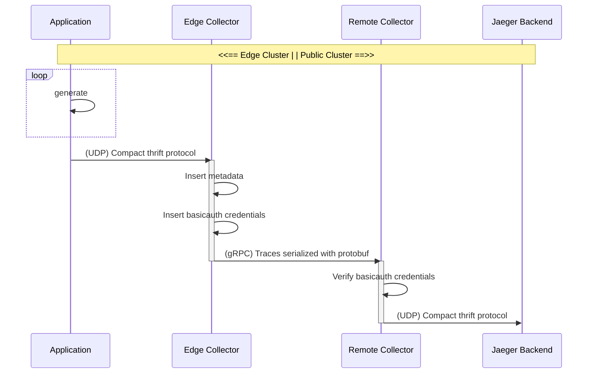

```mermaid
sequenceDiagram
    participant Application
    participant Edge Collector
    participant Remote Collector
    participant Jaeger Backend


    Note over Application,Jaeger Backend: <<== Edge Cluster | | Public Cluster ==>>

    loop
        Application->>Application: generate
    end

    Application->>Edge Collector: (UDP) Compact thrift protocol
    activate Edge Collector
    Edge Collector->>Edge Collector: Insert metadata
    Edge Collector->>Edge Collector: Insert basicauth credentials
    Edge Collector->>Remote Collector: (gRPC) Traces serialized with protobuf
    deactivate Edge Collector
    activate Remote Collector
    Remote Collector->>Remote Collector: Verify basicauth credentials
    Remote Collector->>Jaeger Backend: (UDP) Compact thrift protocol
    deactivate Remote Collector

```
