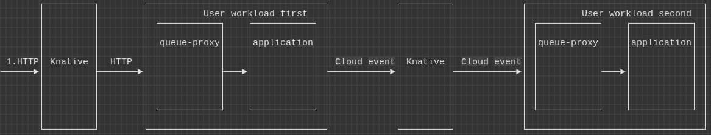

In this article, you will learn how distributed tracing works in Knative and we
will explore how the OpenTelemetry project can make tracing support in this
environment easier. We will explore Knative under the hood to understand what
distributed tracing capabilities it provides out-of-the-box and which parts of
the system need additional instrumentation.

## About Knative

Knative is a serverless platform built on top of Kubernetes as a set of
`CustomResourceDefinitions` (CRDs). The project is split into two logical parts:

- serving - facilitates the creation, deployment and scaling of
  workload/services
- eventing - facilitates event-driven communication between workloads to enable
  loosely coupled architectures

In this article we will not cover Knative fundamentals, please refer to the
[Knative documentation](https://knative.dev/docs/) to get familiar with the
project.

### Knative data flow

Before we deep dive into tracing let's take a look at a data flow example. It
will help us to understand Knative architecture and which parts of the system
need to be instrumented in order to understand the timing characteristics of the
request or transaction. On the diagram below there are two user workloads (first
and second) and an incoming request marked as (1. HTTP) that goes to use
workload first and then to the workload second as a cloud event message.



There are two important facts about this diagram:

1. all the traffic goes through queue-proxy sidecar
2. all traffic goes through Knative component(s). The Knative components in the
   diagram are abstract. It can be a Knative activator service, Knative event
   broker, dispatcher etc.

From the telemetry perspective, the purpose of queue-proxy is similar to
istio-proxy from Istio service mesh. It is a proxy that intercepts all traffic
going to the workload and it emits telemetry data for any communication going to
or from the workload.

## Distributed tracing in Knative

The Knative project comes with a solid distributed tracing integration. Major
parts of the system are already instrumented and the system creates trace data
for transactions/requests that go to user workloads.

Internally at the moment, Knative uses OpenCensus instrumentation libraries that
export data in Zipkin format. The inter-process context propagation uses
[Zipkin B3](https://github.com/openzipkin/b3-propagation) and
[W3C Trace-Context](https://www.w3.org/TR/trace-context/) standards. The Zipkin
B3 propagation format is most likely used for legacy reasons to allow trace
context propagation with older workloads instrumented with older technology. As
a best practice, use the standard W3C Trace-Context which is natively used by
the OpenTelemetry project.

Now let's take a look at an example trace with two workloads (first and second).
The workflow is similar to the diagram from the previous section: the first
service receives an HTTP call and sends a cloud event to the second service. The
full demo source code can be found in
[pavolloffay/knative-tracing](https://github.com/pavolloffay/knative-tracing).


The trace shows the following services interacting: activator, first workload,
broker-ingress, imc-dispatcher, broker-filter, activator, and second workload.
There are many services, right? A simple interaction of two workloads resulted
in a trace that shows many Knative internal components. From the observability
perspective, this is great because it can show issues in the infrastructure and
additionally show cost associated with Knative request processing.

Let's briefly example the data flow. The incoming HTTP request first goes
through an activator service that is responsible for scaling up a workload, then
its execution reaches the first workload. The first workload sends a cloud event
which goes through the broker and dispatcher and finally reaches the second
workload.

Now let's take a closer look at the user workloads. The first service is a
Golang service with a single REST API endpoint. The endpoint implementation
creates a cloud event and sends it to the broker. Let's take a look at important
facts from the observability perspective:

- REST API is instrumented with OpenTelemetry. This allows us to link traces
  started in the Knative activator service with spans created in the workload
  and further link it with outbound spans - e.g. to calls to the second service.
- The workload is using instrumented
  [Cloudevents client/SDK](https://github.com/cloudevents/sdk-go/tree/main/observability/opentelemetry/v2) -
  similarly to the previous point it allows us to continue the trace in the
  outbound request (in this scenario to the second service).

How is the trace-context (`traceId`, `spanId`, `sampled` flag) being propagated
in our example applications? The trace-context is propagated in HTTP headers
both for incoming HTTP requests into the first service and as well for cloud
events sent to the second service. The trace-context is not attached directly to
the event extensions/attributes.

Follows log output with request headers from the first service:

```nocode
2022/02/17 12:53:48 Request headers:
2022/02/17 12:53:48 	X-B3-Sampled: [1]
2022/02/17 12:53:48 	X-B3-Spanid: [af6c239eb7b39349]
2022/02/17 12:53:48 	X-B3-Traceid: [5f2c4775e0e36efc1d554a0b6c456cc1]
2022/02/17 12:53:48 	X-Forwarded-For: [10.244.0.12, 10.244.0.5]
2022/02/17 12:53:48 	Accept-Language: [en,fr;q=0.9,de;q=0.8,sk;q=0.7]
2022/02/17 12:53:48 	Cookie: [_ga=GA1.2.260863911.1644918876]
2022/02/17 12:53:48 	Accept: [text/html,application/xhtml+xml,application/xml;q=0.9,image/avif,image/webp,image/apng,*/*;q=0.8,application/signed-exchange;v=b3;q=0.9]
2022/02/17 12:53:48 	K-Proxy-Request: [activator]
2022/02/17 12:53:48 	Upgrade-Insecure-Requests: [1]
2022/02/17 12:53:48 	User-Agent: [Mozilla/5.0 (X11; Fedora; Linux x86_64) AppleWebKit/537.36 (KHTML, like Gecko) Chrome/98.0.4758.80 Safari/537.36]
2022/02/17 12:53:48 	X-Request-Id: [ee2797b5-1ee9-408e-b1ff-d5e5431977e6]
2022/02/17 12:53:48 	Cache-Control: [max-age=0]
2022/02/17 12:53:48 	X-Forwarded-Proto: [http]
2022/02/17 12:53:48 	Traceparent: [00-5f2c4775e0e36efc1d554a0b6c456cc1-af6c239eb7b39349-01]
2022/02/17 12:53:48 	Accept-Encoding: [gzip, deflate]
2022/02/17 12:53:48 	Forwarded: [for=10.244.0.12;proto=http]
2022/02/17 12:53:48 Response headers:
2022/02/17 12:53:48 	Traceparent: [00-5f2c4775e0e36efc1d554a0b6c456cc1-1cf3f827eba96bf2-01]
2022/02/17 12:53:48
```

Now let's take a look at logging from the second service which exposes API to
consume Knative events. The event API in this case is just an HTTP endpoint
which is a cloud event implementation detail:

```nocode
2022/02/17 13:39:36 Event received: Context Attributes,
  specversion: 1.0
  type: httpbody
  source: github/com/pavolloffay
  id: fad4139c-b3fb-48b2-b0f4-fee44addc5f1
  time: 2022-02-17T13:39:34.426355726Z
  datacontenttype: text/plain
Extensions,
  knativearrivaltime: 2022-02-17T13:39:34.491325425Z
Data,
  hello from first, traceid=5f2c4775e0e36efc1d554a0b6c456cc1
```

We see that the trace context is not directly present in the event object.
However, it is encoded in the incoming transport message - HTTP headers.

### Future improvements

In the previous section, it was mentioned that the Knative serving and eventing
components are instrumented with OpenCensus SDK. The instrumentation will change
in the future to OpenTelemetry which is tracked in
[knative/eventing/#3126](https://github.com/knative/eventing/issues/3126) and
[knative/pkg#855](https://github.com/knative/pkg/issues/855). The SDK change
might not have an immediate impact on the user, however, it will enable users to
start natively reporting data in OpenTelemetry format (OTLP).

Another recently merged change is the addition of
[Cloudevents semantic attributes into the OpenTelemetry specification](/docs/specs/otel/trace/semantic_conventions/cloudevents).
The document standardizes attributes related to CloudEvents. The screenshot
below is from the demo application that is still not using the standardized
attribute names:


### Configuration

Tracing in Knative can be easily enabled. Please follow the
[official documentation](https://knative.dev/docs/) for a step-by-step guide.
Let's briefly describe the process here:

1. Deploy a tracing system that can ingest tracing data in Zipkin format -
   Zipkin, Jaeger, or OpenTelemetry collector
2. Enable tracing in
   [Knative eventing](https://knative.dev/docs/eventing/accessing-traces/)
3. Enable tracing in
   [Knative serving](https://knative.dev/docs/serving/accessing-traces/)

In the beginning, I recommended using 100% sampling rate configuration to
capture trace data for all traffic in the cluster. This will help to avoid any
issues with sampling, do not forget to change this configuration once moving to
the production environment.

## Conclusion

We have learned what distributed tracing capabilities Knative project provides
out-of-the-box and which parts need more work from the user. Generally speaking
Knative emits rich tracing data, however, as always the user is responsible to
instrument the workload and make sure trace-context is propagated from inbound
to outbound requests or events. This is exactly the same situation as
implementing distributed tracing in service meshes.

OpenTelemetry can help to instrument the user workload and correctly propagate
the trace-context. Depending on the language, the user can initialize
instrumentation libraries explicitly in the code or even
[dynamically inject OpenTelemetry auto-instrumentation into the workload](https://medium.com/opentelemetry/using-opentelemetry-auto-instrumentation-agents-in-kubernetes-869ec0f42377).

## References

- [Knative docs](https://knative.dev/docs/)
  - [Knative serving tracing config](https://knative.dev/docs/serving/accessing-traces/)
  - [Knative eventing tracing config](https://knative.dev/docs/eventing/accessing-traces/)
- [Cloud events](https://cloudevents.io)
- [Zipkin B3](https://github.com/openzipkin/b3-propagation)
- [W3C Trace-Context](https://www.w3.org/TR/trace-context/)
- [OpenTelemetry instrumentation for Cloudevents Golang SDK](https://github.com/cloudevents/sdk-go/tree/main/observability/opentelemetry/v2)
- [Cloudevents OpenTelemetry attributes](/docs/specs/otel/trace/semantic_conventions/cloudevents/)
- [Knative tracing demo](https://github.com/pavolloffay/knative-tracing)
