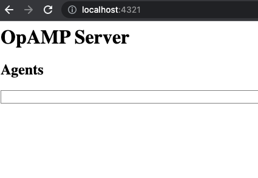
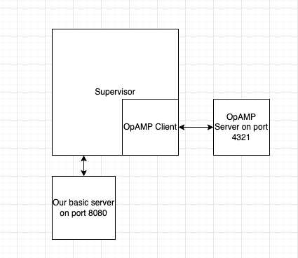
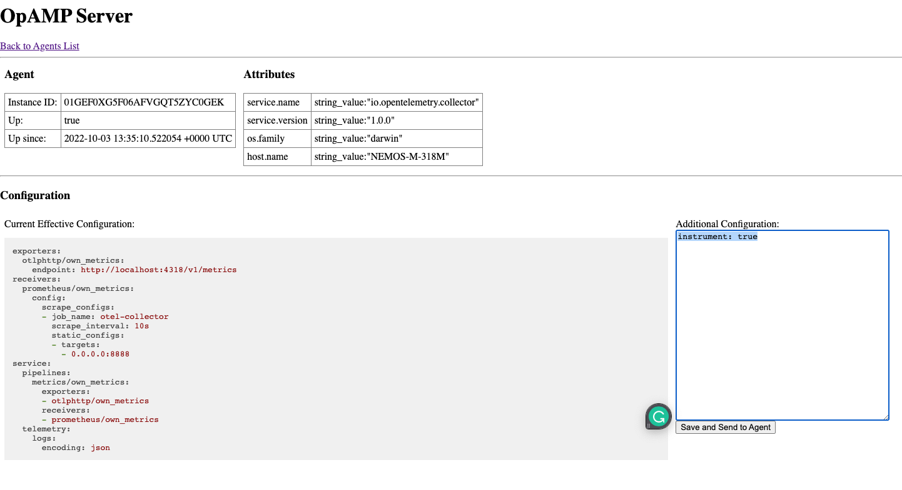

How verbose should your service telemetry be? Should a service output all
traces, metrics, and logs 100% of the time? How much of the service traffic
should be sampled? I would like to suggest the answer of “it depends”. Desired
telemetry data differs in a service lifecycle from development to continuous
deployment. It changes when clients face an error or a service has been thrown
into a major scale.

It is possible to change a service telemetry configuration or sampling rate.
Usually, it requires only a minimal code change and a deployment process. It
might not seem a lot, but whenever facing a change like this across an entire
system, we tend to avoid it. Instead, it is common to collect as much data as
possible, which causes an issue by itself. Can we dynamically modify service
telemetry without those barriers? Thanks to
[OpAMP](https://github.com/open-telemetry/opamp-go) protocol and the people
behind it, I believe that the answer is about to change.

OpAMP stands for
[Open Agent Management Protocol](https://github.com/open-telemetry/opamp-spec/blob/main/specification.md).
It aims at managing large fleets of data collection agents, and its GoLang
[implementation](https://github.com/open-telemetry/opamp-go/) is at the Beta
stage. It allows configuration changes as well as package downloads. It defines
the communication between the OpAMP server and OpAMP client but does not assume
any particular client-agent relationship giving it a lot of flexibility.

In the following example, we’ll create a simple GoLang server, instrument it,
and then control it with an OpAMP server and supervisor. We won’t dive into
OpAMP implementation itself, but rather focus on its implications using these
examples.

First, consider this basic go server:

```go
package main

import (
	"fmt"
	"log"
	"net/http"
)

func httpHandler(w http.ResponseWriter, r *http.Request) {
	fmt.Fprintf(w, "Hi! This action could create a trace!")
}

func main() {
	handler := http.HandlerFunc(httpHandler)
	http.Handle("/", handler)
	fmt.Println("Starting server on port 8080")
	log.Fatal(http.ListenAndServe(":8080", nil))
}
```

Next, add a basic configuration file named `effective.yaml`. Place it in the
same folder as our main.go file with this configuration:

```yaml
instrument: false
```

Let’s add a basic configuration handler to our server:

```go
package main

import (
   "fmt"
   "gopkg.in/yaml.v3"
   "io/ioutil"
   "log"
   "net/http"
   "path/filepath"
)

type configurations struct {
   Instrument bool
}

func httpHandler(w http.ResponseWriter, r *http.Request) {
   fmt.Fprintf(w, "Hi! This action could create a trace!")
}

func main() {
   filename, _ := filepath.Abs("./effective.yaml")
   yamlFile, _ := ioutil.ReadFile(filename)

   var config configurations
   yaml.Unmarshal(yamlFile, &config)

   handler := http.HandlerFunc(httpHandler)
   http.Handle("/", handler)
   fmt.Println("Starting server on port 8080")
   log.Fatal(http.ListenAndServe(":8080", nil))
}
```

Next, let's wrap our handler with instrumentation and condition it with our
configuration file. Something like this:

```go
package main

import (
   "context"
   "fmt"
   "go.opentelemetry.io/contrib/instrumentation/net/http/otelhttp"
   "go.opentelemetry.io/otel"
   "go.opentelemetry.io/otel/exporters/stdout/stdouttrace"
   sdktrace "go.opentelemetry.io/otel/sdk/trace"
   "go.opentelemetry.io/otel/trace"
   "gopkg.in/yaml.v3"
   "io/ioutil"
   "log"
   "net/http"
   "os"
   "path/filepath"
)

type configurations struct {
   Instrument bool
}

var tracer trace.Tracer

func newConsoleExporter() (sdktrace.SpanExporter, error) {
   return stdouttrace.New(
      stdouttrace.WithWriter(os.Stdout),
      stdouttrace.WithPrettyPrint(),
   )
}

func httpHandler(w http.ResponseWriter, r *http.Request) {
   fmt.Fprintf(w, "Hi! This action could create a trace!")
}

func setHandler(handler http.Handler, config configurations) http.Handler {
   if config.Instrument {
      return otelhttp.NewHandler(handler, "instrumentation activated by OpAMP")
   }
   return http.HandlerFunc(httpHandler)
}

func main() {
   filename, _ := filepath.Abs("./effective.yaml")
   yamlFile, _ := ioutil.ReadFile(filename)

   var config configurations
   yaml.Unmarshal(yamlFile, &config)

   exp, _ := newConsoleExporter()
   tp := sdktrace.NewTracerProvider(sdktrace.WithBatcher(exp))
   defer func() { _ = tp.Shutdown(context.Background()) }()

   otel.SetTracerProvider(tp)

   tracer = tp.Tracer("ControlledOpAMPAgentDemo")
   handler := http.HandlerFunc(httpHandler)
   http.Handle("/", setHandler(handler, config))
   fmt.Println("Starting server on port 8080")
   log.Fatal(http.ListenAndServe(":8080", nil))
}
```

Build and run this app:

```shell
go build .
go run .
```

Open a browser and visit <http://localhost:8080>. Nothing special will be shown.
It’s time to add some OpAMP. Git clone
[opamp-go](https://github.com/open-telemetry/opamp-go) and run the server with:

```shell
cd internal/examples/server
go run .
```

Visit <http://localhost:4321> to verify that the server is running. Notice that
no agent is displayed:



Next, edit internal/examples/supervisor/bin/supervisor.yaml to point at our
agent. It should look like this:

```yaml
server:
  endpoint: ws://127.0.0.1:4320/v1/opamp
agent:
  executable: <absolute|relative path to previous build>
```

Then open a new terminal and run the following command:

```shell
cd internal/examples/supervisor/bin
go build -o ./supervisor ../main.go
./supervisor
```

We have now a system consisting of OpAMP server supervisor and our server



Via the supervisor we can now see our agent running at <http://localhost:4321>.
Select it and pass `instrument: true` to its configurations.



You can see the changes over the supervisor console log:

```console
Received remote config from server, hash=0008886301f3ccb3520216823cfa09a.
Effective config changed.
Config is changed. Signal to restart the agent.
Restarting the agent with the new config.
Stopping agent process, PID=19206
Agent process PID=19206 successfully stopped.
Starting agent <agent path>
Agent process started, PID=19506
```

Finally, visit <http://localhost:8080>. Traces should now appear in
`internal/examples/supervisor/bin/agent.log`.

```text
Starting server on port 8080
{
   "Name": "instrumentation activated by OpAMP server",
   "SpanContext": {
      "TraceID": "d2f76958023624d4c1def3f44899b6d4",
      "SpanID": "085510f551dc31a1",
      "TraceFlags": "01",
      "TraceState": "",
      "Remote":false
   ...
```

These lines are the trace itself!

To sum up, we have here a server that controls whether our service will generate
traces. Try setting it off using the `instrument: false` configuration.

This is a very basic implementation. Wrapping a system above OpAMP could perform
as an instrumentation orchestrator. The starting point is being able to
externally add and match tailor-made dynamic telemetry for your system. Imagine
what AI can achieve on this type of system. It could collect metrics over the
entire system, automatically and dynamically adding trace/log collections onto
any detected bottlenecks. Using this protocol enables many new possibilities, I
believe it has the potential to change how we think about telemetry.
