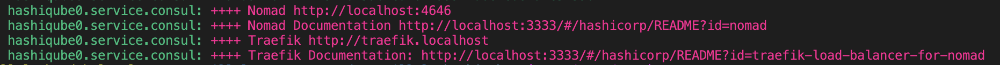

Y’all… I’m so excited, because I finally got to work on an item on my tech
bucket list. Last week, I began the process of translating
[OpenTelemetry (OTel) Demo App](https://github.com/open-telemetry/opentelemetry-demo)’s
[Helm Charts](https://github.com/open-telemetry/opentelemetry-helm-charts/tree/main/charts/opentelemetry-demo)
to [HashiCorp](https://hashicorp.com) [Nomad][] job
specs. Today I’ll be talking about how to run the OpenTelemetry Demo App on
Nomad, using my favorite Hashi-in-a-box tool,
[HashiQube](https://rubiksqube.com/#/).

Let’s do this!


## Deployment

### Assumptions

Before we move on, I am assuming that you have a basic understanding of:

- **[Nomad][]**. If not, head on over to my
  [Nomad intro post](https://storiesfromtheherd.com/just-in-time-nomad-80f57cd403ca).
  [This blog post](https://danielabaron.me/blog/nomad-tips-and-tricks/) by
  [Daniela Baron](https://danielabaron.me) is also great.
- **Observability (o11y) and [OpenTelemetry](https://opentelemetry.io) (OTel)**.
  If not, check out this
  [Observability primer](/docs/concepts/observability-primer/)

### Pre-Requisites

In order to run the example in this tutorial, you’ll need the following:

- [Docker](https://docker.com) (version 20.10.21 at the time of this writing)
- [Vagrant](https://vagrantup.com) (version 2.3.1 at the time of this writing)

### Tutorial Repos

Below are the repos that we’ll be using for today’s tutorial:

- My modified [HashiQube Repo](https://github.com/avillela/hashiqube) (fork of
  [servian/hashiqube](https://github.com/servian/hashiqube)). If you’re curious,
  you can see what modifications I’ve made
  [here](https://github.com/avillela/hashiqube).
- My [Nomad Conversions](https://github.com/avillela/nomad-conversions) repo

### HashiQube Setup

Before you start, just a friendly reminder that HashiQube by default runs
[Nomad][], [Vault](https://www.vaultproject.io), and
[Consul](https://consul.io) on Docker. In addition, we’ll be deploying 21 job
specs to Nomad. This means that we’ll need a decent amount of CPU and RAM, so
please make sure that you have enough resources allocated in your Docker
desktop. For reference, I’m running an M1 Macbook Pro with 8 cores and 32 GB
RAM. My Docker Desktop Resource settings are as follows:

- **CPUs:** 3
- **Memory:** 9.5GB
- **Swap:** 3GB

Here’s a screenshot of my Docker Preferences Resources settings, if you need a
visual:


For more, check out the Docker docs on how to change your resources settings for
[Mac](https://docs.docker.com/desktop/settings/mac/),
[Windows](https://docs.docker.com/desktop/settings/windows/), and
[Linux](https://docs.docker.com/desktop/settings/linux/).

#### 1- Update /etc/hosts

We use the [Traefik](https://traefik.io) load-balancer to expose our services,
which we access as subdomains of localhost. In order ensure that we can access
our Traefik-exposed services (and also the Traefik dashboard itself, you’ll need
to add the following entries to `/etc/hosts` on your host machine:

```
127.0.0.1   traefik.localhost
127.0.0.1   otel-demo.localhost
```

#### 2- Provision a Local Hashi Environment with HashiQube

Start HashiQube by following the detailed instructions
[here](https://github.com/avillela/hashiqube#quickstart).

> **NOTE:** Be sure to check out the
> [Gotchas](https://github.com/avillela/hashiqube#gotchas) section, if you get
> stuck.

Once everything is up and running (this will take several minutes, by the way),
you’ll see this in the tail-end of the startup sequence, to indicate that you
are good to go:



You can now access the apps using the URLs below:

- **Vault:** <http://localhost:8200>
- **Nomad:** <http://localhost:4646>
- **Consul:** <http://localhost:8500>
- **Traefik:** <http://traefik.localhost>

Don’t forget to download and install the
[Nomad CLI](https://developer.hashicorp.com/nomad/downloads) and the
[Vault CLI](https://developer.hashicorp.com/vault/downloads).

If you need to SSH into HashiQube, open up a new terminal window on your host
machine and run the following command:

```shell
vagrant ssh
```

#### 3- Deploy the OTel Demo App

We’re finally ready to deploy the OTel Demo App!

First, let’s clone the repo, and go to our working directory:

```shell
git clone https://github.com/avillela/nomad-conversions.git
cd nomad-conversions
```

Next, let’s enable
[Memory Oversubscription](https://developer.hashicorp.com/nomad/docs/commands/operator/scheduler/set-config#memory-oversubscription)
in Nomad. This is a one-time setting.

```shell
nomad operator scheduler set-config -memory-oversubscription true
```

Memory Oversubscription allows Nomad to use more memory than is allotted to the
job. For example, consider this setting in the `resources` stanza:

```hcl
resources {
   cpu    = 55
   memory = 1024
   memory_max = 2048
}
```

We’ve allocated 55Mz of processing power to our job (`cpu` setting), along with
1024MB RAM (`memory` setting). In this case, when Memory Oversubscription is
enabled, and the job requires more memory than the allotted 1024MB, Nomad will
allocate as much as 2048MB RAM to the job (`memory_max` setting). Note that if
Memory Oversubscription is not enabled,Nomad will ignore the `memory_max`
setting.

Next, let’s deploy the services:

```shell
nomad job run -detach otel-demo-app/jobspec/traefik.nomad
nomad job run -detach otel-demo-app/jobspec/redis.nomad
nomad job run -detach otel-demo-app/jobspec/ffspostgres.nomad
nomad job run -detach otel-demo-app/jobspec/otel-collector.nomad
nomad job run -detach otel-demo-app/jobspec/adservice.nomad
nomad job run -detach otel-demo-app/jobspec/cartservice.nomad
nomad job run -detach otel-demo-app/jobspec/currencyservice.nomad
nomad job run -detach otel-demo-app/jobspec/emailservice.nomad
nomad job run -detach otel-demo-app/jobspec/featureflagservice.nomad
nomad job run -detach otel-demo-app/jobspec/paymentservice.nomad
nomad job run -detach otel-demo-app/jobspec/productcatalogservice.nomad
nomad job run -detach otel-demo-app/jobspec/quoteservice.nomad
nomad job run -detach otel-demo-app/jobspec/shippingservice.nomad
nomad job run -detach otel-demo-app/jobspec/checkoutservice.nomad
nomad job run -detach otel-demo-app/jobspec/recommendationservice.nomad
nomad job run -detach otel-demo-app/jobspec/frontend.nomad
nomad job run -detach otel-demo-app/jobspec/loadgenerator.nomad
nomad job run -detach otel-demo-app/jobspec/frontendproxy.nomad
nomad job run -detach otel-demo-app/jobspec/grafana.nomad
nomad job run -detach otel-demo-app/jobspec/jaeger.nomad
nomad job run -detach otel-demo-app/jobspec/prometheus.nomad
```

Since we’re running the jobs in
[detached mode](https://developer.hashicorp.com/nomad/docs/commands/job/run#detach),
Nomad won’t wait to start the next job until the current one has deployed
successfully. This means that your output will look something like this:

```
Job registration successful
Evaluation ID: d3eaa396-954e-241f-148d-6720c35f34bf
Job registration successful
Evaluation ID: 6bba875d-f415-36b7-bfeb-2ca4b9982acb
Job registration successful
Evaluation ID: 16dc8ef8-5e26-68f4-89b6-3d96b348775b
Job registration successful
Evaluation ID: 34de0532-a3b5-8691-bf18-51c0cc030573
Job registration successful
Evaluation ID: 7310e6a2-9945-710b-1505-c01bd58ccd35
...
```

A reminder that the `Evaluation ID` values will be different on your machine.

#### 4- See it in Nomad!

As things are deploying, you can mozy on over to the Nomad UI at
<http://localhost:4646> to see how things are coming along:


It will take some time for all of the services to come up (sometimes up to 10
minutes), especially since Nomad needs to download the images and initialize the
services, so be patient! Since some services depend on other services in order
to run, you may see services in limbo or some going up and down for a while, per
the above screen capture. DON’T PANIC! IT WILL ALL BE OKAY!!

Once all of the jobs are up and running, you’ll see everything look green, like
this:


You can also head on over to Consul at <http://localhost:8500> to see the health
of the services:


By default, unhealthy services show up at the top, with a red “x” next to them.
Since we don’t see any nasty red “x”s in the above screen shot, we know that our
services are lookin’ good!

#### 5- Access the OTel Demo App

The OTel Demo App uses [Envoy](https://www.envoyproxy.io) to expose a number of
front-end services: the Webstore, [Jaeger](https://www.jaegertracing.io/),
[Grafana](https://grafana.com/), Load Generator, and Feature Flag. These are all
managed by the
[frontendproxy](https://github.com/avillela/nomad-conversions/blob/main/otel-demo-app/jobspec/frontendproxy.nomad)
service. Traefik makes the
[frontendproxy](https://github.com/avillela/nomad-conversions/blob/main/otel-demo-app/jobspec/frontendproxy.nomad)
service available via the `otel-demo.localhost` address.

This is configured via the code snippet below, in the `service` stanza of
[frontendproxy.nomad](https://github.com/avillela/nomad-conversions/blob/cefe9b9b12d84fb47be8aa5fc67b1b221b7b599b/otel-demo-app/jobspec/frontendproxy.nomad#L19-L24):

```hcl
tags = [        "traefik.http.routers.frontendproxy.rule=Host(`otel-demo.localhost`)",
    "traefik.http.routers.frontendproxy.entrypoints=web",
    "traefik.http.routers.frontendproxy.tls=false",
    "traefik.enable=true",
]
```

Note that the `Host` is set to `otel-demo.localhost`.

The services are accessed via the URLs below.

**Webstore:** <http://otel-demo.localhost/>


Go ahead and explore the amazing selection of telescopes and accessories, and
buy a few. 😉🔭

**Jaeger UI:** <http://otel-demo.localhost/jaeger/ui/>


In the screen capture above, we can see a sample Trace from the
[checkoutservice](https://github.com/avillela/nomad-conversions/blob/main/otel-demo-app/jobspec/checkoutservice.nomad).

**Grafana:** <http://otel-demo.localhost/grafana/>


The Demo App comes bundled with a two Grafana dashboards, which showcase Metrics
emitted with OpenTelemetry.

**Feature Flags UI:** <http://otel-demo.localhost/feature/>


**Load Generator UI:** <http://otel-demo.localhost/loadgen/>


## Gotchas

While I think I’ve managed to iron out a lot of the kinks as far as running the
OTel Demo App in Nomad, I have run into a few hiccups when deploying the
services.

### Services sometimes can’t connect to the Collector

Although all of the services appear to start up properly, in some cases, some
services appear to be unable to connect to the OTel Collector. I haven’t quite
figured out why this is happening, so for now, I just restart
[otel-collector.nomad](https://github.com/avillela/nomad-conversions/blob/main/otel-demo-app/jobspec/otel-collector.nomad).
If things are looking a little weird in the Webapp UI (like missing products or
currency), I also restart
[frontend.nomad](https://github.com/avillela/nomad-conversions/blob/main/otel-demo-app/jobspec/frontend.nomad).
Usually a good indicator that services aren’t sending telemetry to the Collector
is to look at the number of services showing up in Jaeger. You should see 14
services, including the `jaeger-query` service.


### Low memory on host machine

Yup…as beefy as my machine is, I do also sometimes run low on memory on my host
machine. It probably doesn’t help that I have a zillion tabs open in Chrome and
Safari. Plus, let’s face it: HashiQube + 21 jobs in Nomad can be a bit memory
intensive. I’ve made a few tweaks to the memory settings in HashiQube and Docker
to try to minimize memory issues, but in case the Memory Monster gets you, I
suggest closing browsers and other apps, and re-opening them to free up some
memory. And if this does happen to you, please let me know!

## A Work in Progress

Please bear in mind that this project is a work in progress. If you have any
suggestions for improvement, or would like to collaborate further on the Nomad
jobspecs, please [hit me up](https://www.linkedin.com/in/adrianavillela/)!

## Final Thoughts

Well, there you have it, folks! You now have an example of how to deploy
[OpenTelemetry Demo App](/docs/demo/kubernetes-deployment/) (a
multi-micro-service app running OpenTelemetry) to HashiCorp Nomad. Main
highlights:

- We used [HashiQube](https://github.com/avillela/hashiqube) to stand up a local
  HashiCorp environment in Docker via Nomad so that we could run the OTel Demo
  App in Nomad using [Traefik](https://traefik.io) as our load balancer.
- We saw the OTel Demo App in action, by accessing the following services
  exposed through the
  [frontendproxy](https://github.com/avillela/nomad-conversions/blob/cefe9b9b12d84fb47be8aa5fc67b1b221b7b599b/otel-demo-app/jobspec/frontendproxy.nomad):
  [Webstore](http://otel-demo.localhost/),
  [Grafana](http://otel-demo.localhost/grafana/),
  [Jaeger](http://otel-demo.localhost/jaeger/ui),
  [Feature Flags UI](http://otel-demo.localhost/feature/),and the
  [Load Generator UI](http://otel-demo.localhost/loadgen/).

Before I wrap this up, I do want to give a HUGE shoutout to
[Luiz Aoqui](https://www.linkedin.com/in/luizaoqui/) of HashiCorp, who helped me
tweak my Nomad jobspecs, and to
[Riaan Nolan](https://www.linkedin.com/in/riaannolan/), for his continued work
on HashiQube. (Aside, both
[Luiz](https://oncallmemaybe.com/episodes/opentelemetry-nomad-with-luiz-aoqui-of-hashicorp)
and
[Riaan](https://oncallmemaybe.com/episodes/adventures-in-open-source-software-with-riaan-nolan-of-servian)
were my guests on the [On-Call Me Maybe Podcast](https://oncallmemaybe.com)!)

I will now leave you with a picture of Phoebe the rat, peering out of a pink
basket. Doesn’t she look cute? 🥰


Peace, love, and code. 🦄 🌈 💫

---

Have questions about the OTel Demo App on Nomad? Feel free to connect through
[Mastodon](https://hachyderm.io/@adrianamvillela) or
[LinkedIn](https://www.linkedin.com/in/adrianavillela).

---

The OpenTelemetry community is always looking for contributions!
[Join us](https://github.com/open-telemetry/community)! If you're on Mastodon,
be sure to follow
[OpenTelemetry on Mastodon](https://fosstodon.org/@opentelemetry)

[Nomad]: https://www.nomadproject.io
