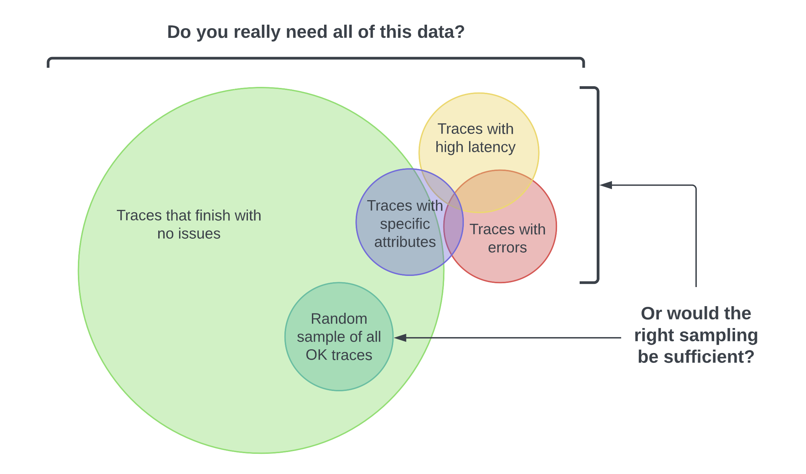
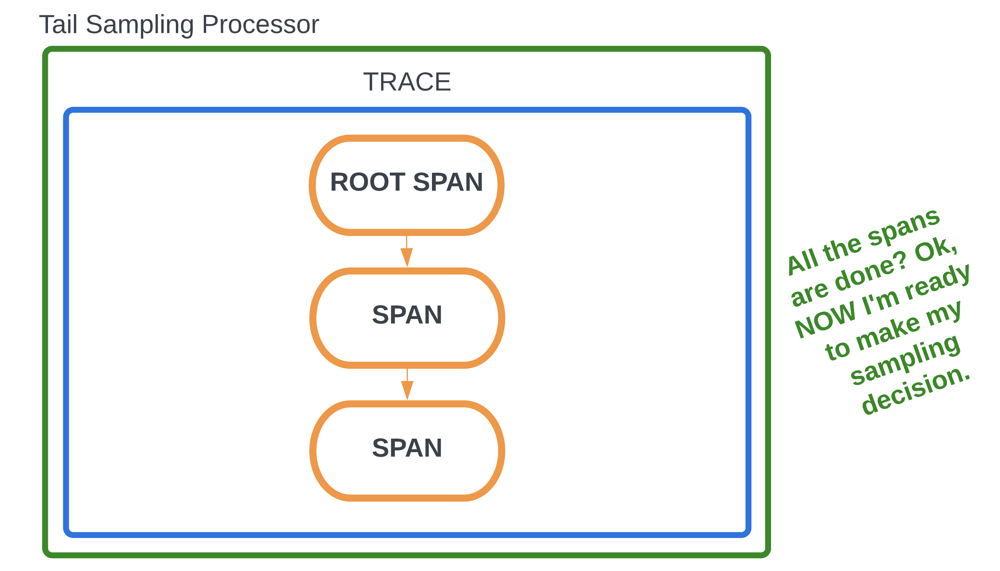
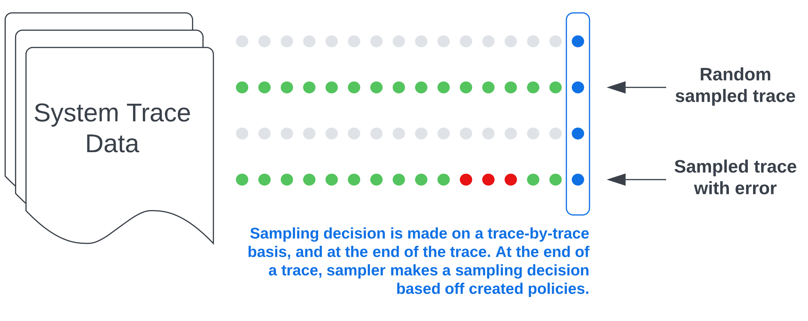
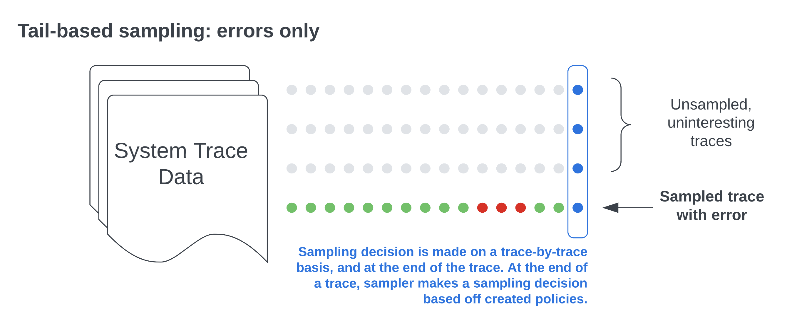

---
title:
  'Tail Sampling with OpenTelemetry: Why it’s useful, how to do it, and what to
  consider'
linkTitle: Tail Sampling
date: 2022-09-26
author: '[Reese Lee](https://github.com/reese-lee)'
canonical_url: https://newrelic.com/blog/best-practices/open-telemetry-tail-sampling
cSpell:ignore: unsampled
---

Tail sampling is useful for identifying issues in your distributed system while
saving on observability costs. In this post, you’ll learn how to implement tail
sampling using the OpenTelemetry Collector. I will also share some general and
OpenTelemetry-specific concerns to consider as you develop your sampling
strategy.

## What is sampling, and why should you do it?

With distributed tracing, you observe requests as they move from one service to
another in a distributed system. It’s superbly practical for a number of
reasons, such as understanding your service connections and diagnosing latency
issues, among many other benefits. If distributed tracing is a new topic for
you, make sure to read this post on distributed tracing and sampling.

However, if the majority of all your requests are successful 200s and finish
without latency or errors, do you really need all that data? Here’s the
thing—you don’t always need a ton of data to find the right insights. _You just
need the right sampling of data._



The idea behind sampling is to control the spans you send to your observability
backend, resulting in lower ingest costs. Different organizations will have
their own reasons for not just _why_ they want to sample, but also _what_ they
want to sample. You might want to customize your sampling strategy to:

- **Manage costs**: You risk incurring heavy charges from the relevant cloud
  provider or vendor if you’re exporting and storing all your spans.
- **Focus on interesting traces**: For example, your frontend team may only want
  to see traces with specific user attributes.
- **Filter out noise**: For example, you may want to filter out health checks.

## What is tail-based sampling?

Tail-based sampling is where the decision to sample a trace happens _after_ all
the spans in a request have been completed. This is in contrast to head-based
sampling, where the decision is made at the _beginning_ of a request when the
root span begins processing. Tail-based sampling gives you the option to filter
your traces based on specific criteria, which isn’t an option with head-based
sampling.



Tail sampling lets you see only the traces that are of interest to you. You also
lower data ingest and storage costs because you’re only exporting a
predetermined subset of your traces. For instance, as an app developer, I may
only be interested in traces with errors or latency for debugging.

## How to implement tail sampling in the OpenTelemetry Collector

To use tail sampling in OpenTelemetry, you need to implement a component called
the
[tail sampling processor](https://github.com/open-telemetry/opentelemetry-collector-contrib/tree/main/processor/tailsamplingprocessor).
This component samples traces based on a set of policies that you can choose
from and define. **First, to ensure that you’re capturing all spans, use either
the default sampler or the AlwaysOn sampler in your SDKs.**

Now, let’s walk through a sample configuration of the tail-sampling processor,
aptly placed in the `processors` section of the collector configuration file:

```yaml
processors:
  tail_sampling:
    decision_wait: 10s
    num_traces: 100
    expected_new_traces_per_sec: 10
    policies:
      [
        {
          name: errors-policy,
          type: status_code,
          status_code: { status_codes: [ERROR] },
        },
        {
          name: randomized-policy,
          type: probabilistic,
          probabilistic: { sampling_percentage: 25 },
        },
      ]
```

- `tail_sampling` is the name of the processor you’ll use to implement tail
  sampling.
- The first three lines are optional configurable settings:
  - `decision_wait` is the time, in seconds, after the first span of a trace is
    created before the sampling decision is made. The default is 30 seconds.
  - `num_traces` is the number of traces to be kept in memory. The default is
    50,000.
  - `expected_new_traces_per_sec` is the expected number of new traces, which
    helps in allocating data structures. The default is 0.
- `policies` is where you define your sampling policies. There is no default,
  and this is the only required section of the processor configuration. In this
  case, two policies are defined:
  - `status_code`, which is named `errors-policy`, since this example will
    filter traces with the status code `ERROR`.
  - `probabilistic`, which is named `randomized-policy`. In addition to
    filtering all traces with errors, there will also be a randomized sampling
    of 25% of traces without errors.

The next image is an example of what you might see in your backend if you
implement this sample configuration.



The blue dots and rectangle on the right side indicate that the sampling
decision occurs at the end of a trace when all the spans for a given request
have been completed. The green dots represent sampled spans while the gray dots
represent unsampled spans. Finally, the red dots represent spans where errors
were detected. With this configuration, you’ll get all traces with errors as
well as a random sampling of other traces based on the rate we’ve configured.

If you want to just sample based on a specific filter such as errors, you could
remove the probabilistic policy. But having a random sampling of all other
traces can help surface other issues and give you a broader view of your
software’s performance and behavior. Here’s what you'll see with only the status
code policy defined.



You also have the flexibility to add other policies. Here are a few examples:

- `always_sample`: Sample all traces.
- `latency`: Sample based on the duration of the trace. For example, you could
  sample all traces that take longer than 5 seconds.
- `string_attribute`: Sample based on string attribute values, both exact and
  regular expression value matches are supported. For example, you could sample
  based on specific custom attribute values.

## Potential issues with tail sampling

- **Potentially unpredictable costs**: While sampling generally helps manage
  data ingest and storage costs, you may occasionally have spikes in activity.
  For example, if you’re sampling traces with latency and you experience severe
  network congestion, your tracing solution will export a high number of traces
  with latency issues, leading to an unexpected spike in costs during this
  period. However, this is also why tail sampling exists— so we can quickly see
  these kinds of problems and act on them.
- **Performance**: If you are storing telemetry data locally, you will need to
  store spans until sampling decisions are completed. This can consume resources
  from your application if it’s stored locally, or additional network bandwidth
  if not.
- **Figuring out the right policies**: Also, while you don’t necessarily need a
  ton of data to get the right insights, you do need the right sampling, and
  figuring that out can be challenging. You’ll have to ask a lot of questions,
  such as: what does the baseline for a healthy request look like? How many
  resources are you able to set aside for tail sampling? Otherwise, you may
  inadvertently filter out requests that could otherwise reveal issues in your
  system, or consume more resources than you originally expected.
- **Establishing a wait period for tail sampling**: Another challenge with tail
  sampling is that it’s hard to predict when a trace will actually be finished.
  Since a trace is essentially a graph of spans where the child spans reference
  their parents, a new span could be added at any given time. To resolve this,
  you can establish an acceptable period of time to wait before making a
  sampling decision. The assumption here is that a trace should be complete
  within the configured period, but it means that you risk potentially losing
  interesting spans that complete outside that time window, which can result in
  fragmented traces. Fragmented traces occur when spans are missing and can
  create gaps in visibility.

## Limitations of OpenTelemetry

There are also some limitations to consider that are related to OpenTelemetry.
Note that some of these limitations also apply more broadly to any client-hosted
tail-based sampling solution, not just OpenTelemetry.

First, you have to stand up a collector. While the collector can ultimately be
quite practical in terms of centralizing configuration and processing data, it’s
one more piece in your system to implement and maintain. Furthermore, for tail
sampling to work, **all the spans of a particular trace have to be processed in
the same collector**, which leads to scalability challenges.

For a simple setup, one collector will suffice, and no load balancing is needed.
However, the more requests that are being held in memory, the more memory you’ll
need, and you’ll also need additional processing and computing power to look at
each span attribute. **As your system grows, you can’t do all this with just a
single collector, which means you have to think about your
[collector deployment pattern](https://www.youtube.com/watch?v=WhRrwSHDBFs) and
load balancing.**

Since one collector is insufficient, you have to implement a two-layer setup in
which the collector is deployed in an agent-collector configuration. You also
need each collector to have a full view of the traces it receives. This means
that all spans with the same trace ID need to go to the same collector instance,
or you’ll end up with fragmented traces. You can use a
[load-balancing exporter](https://github.com/open-telemetry/opentelemetry-collector-contrib/blob/main/exporter/loadbalancingexporter/README.md)
if you're running multiple instances of the agent/collector with the tail
sampling processor. This exporter ensures that all spans with the same trace ID
end up in the same agent/collector. But there may be additional overhead with
implementing this exporter, such as configuring it.

Another limitation to consider is that since OpenTelemetry does not propagate
metadata that would let a backend re-weight counts – for example, P95, P99, and
total events – **you’re only getting a look at the measurements of sampled data,
not accurate measurements in regards to _all_ data**. Let’s say you’ve
configured your sampler to keep 25% of all traces. If the backend doesn’t know
it’s only operating on 25% of all data, any measurement it produces will be
inaccurate. One way to get around this is to attach metadata to your spans that
tells the backend what the sample rate is, that will allow the backend to then
accurately measure things such as total span count for a given period of time.
The Sampling SIG is currently working on this concept.

Finally, as OpenTelemetry is still an evolving project, many components are
under active development, including the tail sampling processor and the
collector. For the tail sampling processor, there is currently an
[open issue](https://github.com/open-telemetry/opentelemetry-collector-contrib/issues/1797)
in the
[collector-contrib repository](https://github.com/open-telemetry/opentelemetry-collector-contrib)
to discuss the future of this processor that centers around replacing it with
separate processors, so that the chain of events is well-defined and understood.
One of the main issues the community is trying to figure out is whether using
separate processors to do tail sampling will be more performant than just the
tail sampling processor. It's important to note that nothing will be released
without a backward-compatible solution. For the collector, there are limited
options to monitor the collector, which is critical for troubleshooting. See
[here](https://github.com/open-telemetry/opentelemetry-collector/blob/main/docs/troubleshooting.md#observability)
for more information.

_A version of this article was [originally posted][] on the New Relic blog._

[originally posted]: {}
