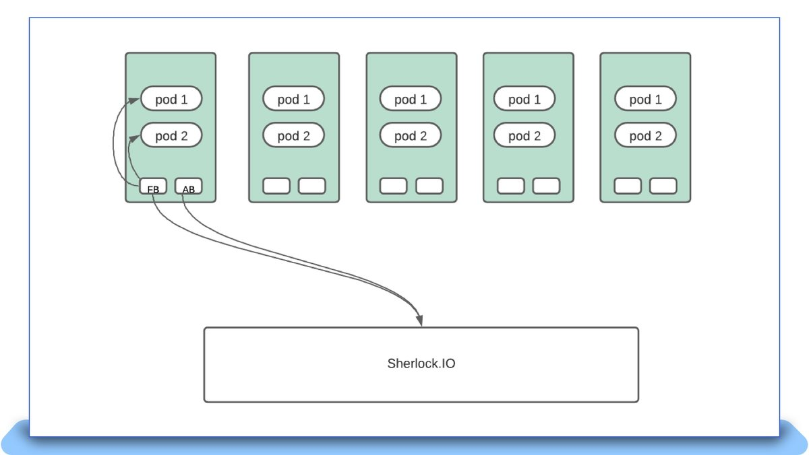
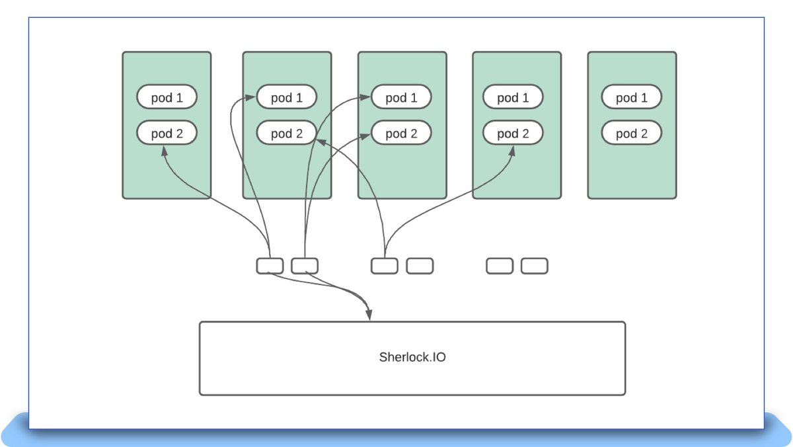
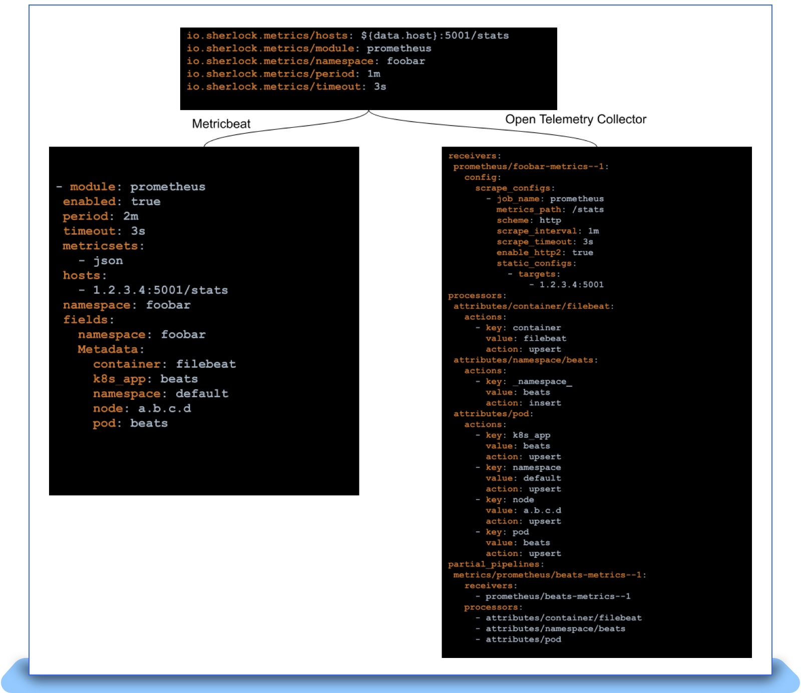

eBay makes a crucial pivot to OpenTelemetry to better align with industry
standards for Observability.

## Introduction

Observability provides the eyes and ears to any organization. A major benefit to
observability is in preventing the loss of revenue by efficiently surfacing
ongoing issues in critical workflows that could potentially impact customer
experience. The Observability landscape is an ever-changing one and recent
developments in the OpenTelemetry world forced us to rethink our strategy in
order to pivot to using it. eBay’s observability platform Sherlock.io provides
developers and Site Reliability Engineers (SREs) with a robust set of
cloud-native offerings to observe the various applications that power the eBay
ecosystem. Sherlock.io supports the three pillars of observability — metrics,
logs and traces. The platform’s metricstore is a clustered and sharded
implementation of the Prometheus storage engine. We use the Metricbeat agent to
scrape around 1.5 million Prometheus endpoints every minute, which are ingested
into the metricstores. These endpoints along with recording rules result in
ingesting around 40 million samples per second. The ingested samples result in 3
billion active series being stored on Prometheus. As a result, eBay’s
observability platform operates at an uncommonly massive scale, which brings
with it new challenges.

As an observability platform provider, eBay was one of the first companies to
use agents to scrape metric endpoints and tail log files. As we have discussed
in
[previous blog posts](https://tech.ebayinc.com/engineering/beats-ebay-collectbeat-a-journey-where-company-and-community-come-together/),
we have heavily relied on the [Elastic Beats](https://github.com/elastic/beats)
offering to accept signals into the platform. Beats is a lightweight shipper of
operational data like metrics and logs. For five years, from 2016 to 2020, we
ran both Filebeat and Metricbeat as DaemonSets on all our Kubernetes clusters.
DaemonSets allow users to deploy a given workload on every node on a Kubernetes
cluster. However, an experiment performed during an internal hack week provided
some surprising conclusions and led to us reconsidering our usage of DaemonSets.
In this blog post, we discuss some of the problems we ran into, especially for
metrics scraping, and how we evolved our own solution. We will also discuss in
detail about how we have been navigating the evolving open-source landscape with
regards to licensing and how we intend to align with OpenTelemetry as an
initiative.

## Metrics Instrumentation

Metrics instrumentation at eBay has more or less been standardized on Prometheus
endpoints. Endpoints from various applications are exposed as a result of a
variety of instrumentation practices such as (but not limited to):

- Official Prometheus clients (including Java, Go, Python and others)
- [Micrometer](https://micrometer.io/)
- OTel SDK with Prometheus exporter
- Custom code that emits a Prometheus endpoint when requested

Frameworks offered by eBay’s platform engineering group bake in an
instrumentation client and also expose various metric endpoints that represent
server-side, client-side and DB client metrics. Depending on the nature of the
application, Prometheus endpoints can be exposed, which require scraping. The
application owner can also expose an endpoint of their own to instrument their
business KPIs.

## Autodiscover

Most of the applications that power the eBay ecosystem run on Tess, eBay’s
internal Kubernetes provider. eBay runs hundreds of Tess-powered Kubernetes
clusters, and an application can run on any number and combination of those
clusters. Application owners can choose to onboard their application metrics
along with the metrics that are freely available from the framework-level
instrumentation. Our agents need to know exactly which endpoints are being
exposed by the currently running Kubernetes Pod. In order to provide the agent
this information, we helped enrich the Beats platform to perform a task called
“[hints based autodiscover](https://www.elastic.co/guide/en/beats/filebeat/current/configuration-autodiscover-hints.html).”
Autodiscover is a Beats construct that allows a dynamic source like the
Kubernetes API server to deliver to the agent information such as:

- What is the endpoint that needs scraping?
- What kind of endpoint — Dropwizard, Prometheus, Foobar, something else — is
  it?
- How often should it be scraped?
- Is there any other additional information that the agent should be aware of,
  like an SSL certificate?

With more and more complex discovery patterns required, we worked with the Beats
open-source community to enhance the power of autodiscover for our specific
needs. Some of the features we contributed include:

- [Discovering multiple sets of configurations](https://github.com/elastic/beats/pull/18883):
  Conventional annotation-based scraping is very limiting in that it only allows
  the user to provide simple configurations for the scrape manager to target.
  Given that each endpoint can have dynamic needs like varied processing and
  scrape intervals, we enhanced autodiscover to accept more than one set of
  configurations.
- [Discovering targets from namespace annotations](https://github.com/elastic/beats/pull/16321):
  The prescribed method to announce scrape targets calls for adding annotations
  to the Pod spec. However, adding them there would mean that a change would
  incur a Pod restart. This is undesirable if the change is intended for a
  metric that is being instrumented on the framework and is available on every
  deployed application. To avoid restarting all Pods, we added support for
  autodiscover to additionally look at namespace-level annotations.

These features make Beats Autodiscover one of the more versatile and
feature-rich discovery mechanisms for identifying targets deployed on Kubernetes
clusters.

## Limitations of Metrics Scraping via DaemonSets

Our first attempt to run Metricbeat at scale involved running it as DaemonSets
on each and every Kubernetes cluster. Each Pod was given one CPU and 1GB of
memory to handle all metrics exposed on that node. When Metricbeat starts up, it
requests the API server for all the namespaces on that cluster along with Pods
deployed on the node it runs on. With this information, for each Pod, it creates
configurations by collating annotations on the Pod and the Pod’s namespace. Some
of the observations we observed as a result include:

- Resource fragmentation: Given that we run N beats per N node cluster, if a
  single Beat pipeline takes up 50MB of bootstrapping cost, we essentially waste
  50\*N MB of resources. That adds up to 150GB on a 3000 node Kubernetes
  cluster!
- OOM issues when large endpoints are polled: We have seen customers expose
  endpoints as large as 150,000 entries per endpoint. Some gigantic endpoints
  like "kube-state-metrics" reach three million entries, and generate 600MB of
  data with each poll. Scraping becomes unreliable when such use cases land on a
  node.

The following diagram represents how any Beats instance, like Metricbeat,
Filebeat and Auditbeat, would interface with the Sherlock.io platform when
deployed as a DaemonSet:

 {.border-0}

## Moving To Cluster Local Scrapes

During work on an unrelated project, we took the shortcut of running Metricbeat
as a single instance for all targets across the cluster. When we observed the
total CPU plus memory usage for running Metricbeat, the numbers were simply
stunning. We saw the following during the deployment:

- Number of Kubernetes nodes: 2851
- CPU usage: 29 cores
- Memory usage: 57GB
- Ingest rate: 238K samples per second
- Endpoints monitored per node: 4
- Average memory usage per node monitored: 20MB
- Average CPU usage per node monitored: 0.01 cores

A single metricbeat instance monitoring a similar amount of endpoints on a node
in DaemonSet mode was consuming about 200MB (10x) and approximately 0.6 cores
(60x). Across the cluster, that would accumulate to 570GB and around 1700 CPUs.
The overall savings by moving to a cluster local instance was roughly 90%.

This forced us to rethink the approach of handling scrapes. Running a single
instance for an entire cluster would mean that when the instance goes through an
upgrade or failure, 100% of scrapes would be down at that point in time. In
order to mitigate failures, we deployed Metricbeat as a statefulset with N
replicas. The entire list of pods are sharded N-ways based on the number of
Metricbeat instances, and each instance monitors its assigned shard:

`xxHash(pod uid) % statefulset_size == instance number`

Each instance makes a full scan against the API server, but ignores everything
except what it alone is supposed to monitor. This model works well for
Metricbeat, as it primarily scrapes Prometheus endpoints, and this activity can
happen outside of the Tess node. A large 3000 node Kubernetes cluster has as
many as 30 instances with higher number of CPUs and memory allowing it to scrape
substantially larger endpoints than it would as a daemon on the node. If one
Metricbeat instance goes through a restart, scraping blips only for endpoints
that are monitored by that instance alone, the failure percentage is reduced to
1/Nth of the total number of instances.

The new deployment pattern can be visualized as follows:

 {.border-0}

## Decoupling Autodiscover

While moving to cluster local scrapes got us to scale much higher than when
using DaemonSets, the model had room for improvement. A new set of problems
arose, especially on larger clusters, with higher Pod density. Given that every
Metricbeat instance has to scan all Pods and pick the ones that it needs to
monitor, depending on how many Pods are present in a given cluster, it can take
a very long time to do the initial scan. This became extremely problematic
during roll-outs when a new Metricbeat Pod would take as long as 10 minutes to
restart scrapes once it came back up. Depending on the number of instances, this
technique also puts undue strain on the API server due to the number of WATCHes
placed against it for the various resources Metricbeat requests.

After further evaluation, we decided to move Autodiscover out of the agent and
into its own control loop. The control loop would:

- Implement a similar parser to the Beats autodiscover logic;
- Discover all the agents that can do the work of scraping;
- Pick one of these agents;
- And pass a configuration to the selected agent to monitor the target.

The control loop would make important decisions like shuffling workloads around
in the event of agent crashes, agent over-allocation and other failure
scenarios. Given that the logic to parse annotations has been decoupled from the
agent, it is very simple to generate configurations for any agent as long as
there exists a mapping between a feature that Beats exposes versus the new
agent.

## Advent of OpenTelemetry

In 2019, the Open Tracing and Open Census communities agreed to join forces and
bring about OpenTelemetry. The OpenTelemetry initiative set out with a goal to
provide vendor agnostic APIs, SDKs and tools for ingesting, transforming and
sending data to any Observability backend. Investing in such an initiative
seemed a natural fit to how we consume Open Source at eBay, given our choice of
Kubernetes, which also provides vendor-agnostic APIs to manage containers on the
cloud. In 2021, we started experimenting with distributed tracing to figure out
how it might be useful for our developers.

At the time, looking at the OpenTelemetry Collector codebase, we saw significant
potential in some of its features, including defined types for metrics, logs and
traces, and usage of the Prometheus scrape manager to collect metrics from
OpenMetrics endpoints. We chose OpenTelemetry Collector, along with the
OpenTelemetry SDK, for our adoption of distributed tracing. It only made sense
that we should subsequently figure out how we would move metrics and logs
collection into the OpenTelemetry Collector. This wouldn’t be an easy effort,
given that we need to plug all feature gaps, build relationships with a new open
source community and swap a massive metrics collection infrastructure without
downtime. In the beginning of 2022, we began the difficult undertaking of moving
metrics scraping into OpenTelemetry Collector.

## The Migration

Given that we decoupled our discovery logic from the agent, actual migration
only meant that we needed to generate configurations that the OpenTelemetry
Collector could understand. These configurations had to be pushed every time a
new Pod is spun up and cleaned up when that Pod dies. However, the OpenTelemetry
Collector has a crucial gap: it can’t dynamically reload configurations. The
OpenTelemetry Collectors have the notion of “pipelines” that define how a metric
needs to be received, processed and exported. To facilitate dynamic reloading of
pipelines, we came up with a “filereloadreceiver” that can look at a directory
consisting of files describing “partial pipelines” that plug into the overall
pipeline of the collector. Each Pod that requires metrics scraping has a partial
pipeline that the autodiscover controller generates and pushes into the
collector. Yet another complex exercise during this process was the creation of
a mapping table between every feature that we depended on in the Beats platform
and the OpenTelemetry Collector. For example, fields in Beats would translate to
using the attribute processor on OpenTelemetry. With such mappings and the
filereloadreceiver in place, we were able to generate new configurations for the
OpenTelemetry Collector as follows.

 {.border-0}

As shown above, we were able to keep the end user contract of Pod/Namespace
annotations the same and simply swap the agent under the hood. This greatly
simplified the actual task of rolling out the new agent. The final obstacle
involved mismatches in semantics between Elastic Beats, OpenTelemetry and
sometimes even the Prometheus scrape manager. This is where we spent months
before we could finally replace all of Metricbeat in production. Some of the
discrepancies we saw and helped patch up on the OpenTelemetry Collector project
include:

- [Align sanitizing labels and metric names that start with “\_” with Prometheus](https://github.com/open-telemetry/opentelemetry-collector-contrib/pull/7112)
- [Ability to disable label sanitization](https://github.com/open-telemetry/opentelemetry-collector-contrib/pull/8270)
- [Correctly handle metric names starting with “:”](https://github.com/open-telemetry/opentelemetry-collector-contrib/pull/14158)
- [Ability to extract pod labels using regexes](https://github.com/open-telemetry/opentelemetry-collector-contrib/pull/9525)

These issues proved difficult to catch, and sometimes only surfaced when we
attempted to upgrade a Kubernetes cluster to use OpenTelemetry Collector. Once
we hit such an issue, rollback was the only option and we were forced to go back
to the drawing board. One partial solution involved writing a comparison script
that can scrape an endpoint using Metricbeat and OpenTelemetry Collector,
simultaneously ingest them nto the metricstore and compare the metricname and
labels to ensure that the scrapes are on par with each other. This greatly
improved our confidence in moving forward.

Sometimes moving forward simply means dropping support for certain features. We
did just that with support for dropwizard metrics and had users migrate away
from the same. Outside of semantic differences, we are also actively working on
adding features that we feel are critical for the project, like
[supporting Exemplars](https://github.com/open-telemetry/opentelemetry-collector-contrib/pull/14132).

After months of hard work and support from the community, we are happy to
announce that we have fully decommissioned Metricbeat and replaced it with
OpenTelemetry Collector. We are busy working on doing the same for Filebeat at
this point and early performance benchmarks are very promising. We have so far
made 10+ contributions to the project, but it is just the start to a very
fruitful collaboration.

## Conclusion

Over the past five years, we at eBay have encountered several spikes in demand
that forced us to rethink conventional wisdom. We started off with DaemonSets,
and saw that it was cost-prohibitive and unreliable at scale. We moved to a
cluster local model which cut the cost of agents by about 90 percent, but we had
redundancies in the amount of work being done on the API server and the agents
themselves. We decoupled the discovery, moved it into a control loop that
performs scheduling and made the agents into stateless processes that can accept
scrape targets. Given the growing maturity of OpenTelemetry we pivoted to using
OpenTelemetry Collector for metrics and are actively working towards doing the
same for logs. We will continue to learn from running agents at scale and keep
pivoting as needed. We will continue to work with the OpenTelemetry community as
it continues to pave the way for standardization within the Observability
ecosystem. Now that we’re using OpenTelemetry, we can provide our developers
with an industry-approved open standard to send telemetry into Sherlock.io. As
the community grows to offer support for newer features like profiling, we will
adopt them into the platform to benefit our developer community.

## Credits

A lot of these optimizations/directional changes would not be possible without
the many thought leaders who have been involved in these activities:

- [Premendra Singh](https://github.com/premendrasingh)
- [Peter Deng](https://github.com/newly12)
- [Aishwarya Yandapalli](https://github.com/aishyandapalli)
- [Santanu Bhattacharya](https://www.linkedin.com/in/santanubayarea)
- [John Feldmeier](https://www.linkedin.com/in/johnfeldmeier)
- [Rami El-Charif](https://www.linkedin.com/in/ramielcharif)

We are extremely grateful to both the Elastic Beats community of the past and
the present Open Telemetry community for supporting and working with us as we
strive to build world-class Observability offerings for our eBay developer
community.

Elastic community:

- [Monica Sarbu](https://twitter.com/monicasarbu)
- [Tudor Golubenco](https://twitter.com/tudor_g)
- [Nicolas Ruflin](https://twitter.com/ruflin)
- [Steffen Siering](https://twitter.com/ursobln)
- [Carlos Pérez-Aradros](https://twitter.com/exekias)
- [Andrew Kroh](https://twitter.com/Krohbird)
- [Christos Markou](https://www.linkedin.com/in/christos-markou-a6542ab4)
- [Jaime Soriano Pastor](https://www.linkedin.com/in/jaimesorianopastor/)

Open Telemetry Collector community:

- [Tigran Nigaryan](https://github.com/tigrannajaryan)
- [Bogdan Drutu](https://github.com/bogdandrutu)
- [David Ashpole](https://github.com/dashpole)
- [Anthony Mirabella](https://github.com/Aneurysm9)
- [Juraci Paixão Kröhling](https://github.com/jpkrohling)
- [Albert Teoh](https://github.com/albertteoh)

_A version of this article was [originally posted][] on the eBay Tech Blog._

[originally posted]: {}
