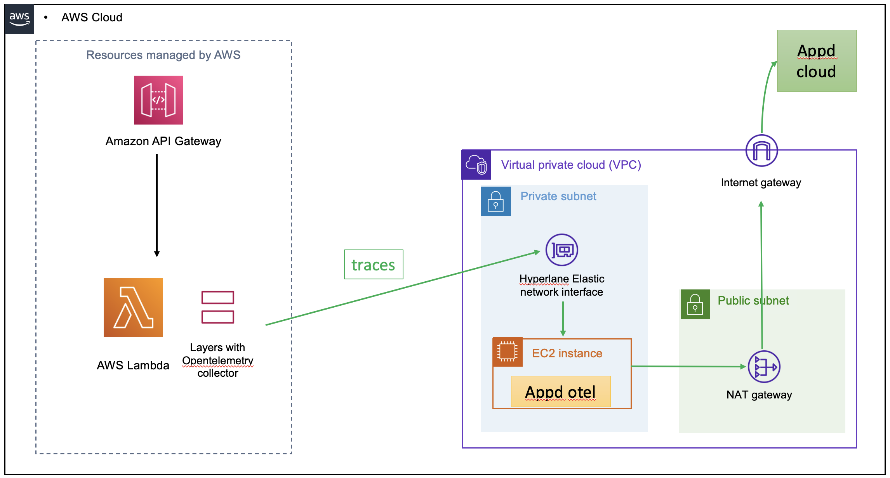
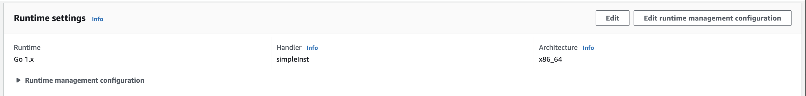
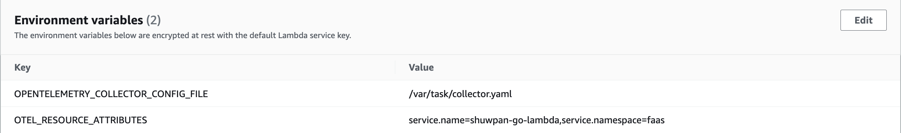
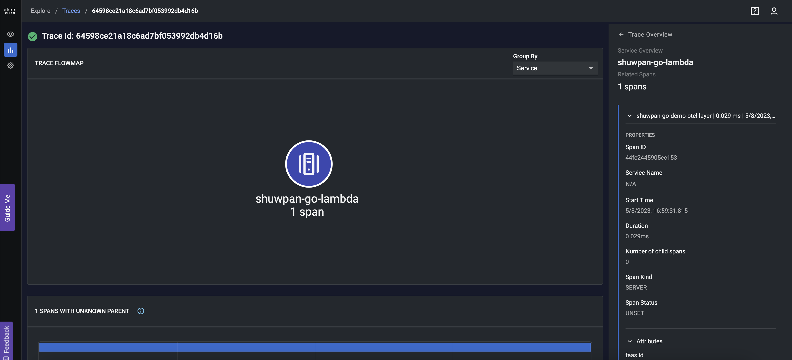
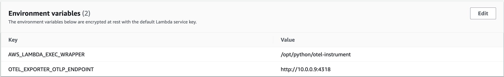

Recently, the OpenTelemetry community relased pre-built Lambda layers.
https://opentelemetry.io/docs/faas/. This blog post will show you an example for
how to set it up with Appdynamics opentelemetry collector and AppDynamics Cloud.

Here is the architectural diagram for this setup:



## Detail steps

### Api gateway and EC2 Instance

- Please refer to aws official doc for api gateway setup:
  https://docs.aws.amazon.com/apigateway/latest/developerguide/getting-started.html
- Please refer to aws official doc for ec2 setup:
  https://aws.amazon.com/ec2/getting-started/
- For Appdynamic opentelemetry collector setup:
  https://docs.appdynamics.com/appd-cloud/en/infrastructure-monitoring/host-monitoring/appdynamics-distribution-of-opentelemetry-collector-linux-settings

Note: Make sure your ec2's security-group allow ingress traffic from 4317 and
4318

### Lambda and Layer

I am using golang in this example. Use your favoriate golang editor to create
lambda function code.

```golang
package main

import (
    "context"
    "fmt"

    "github.com/aws/aws-lambda-go/lambda"
    "go.opentelemetry.io/contrib/instrumentation/github.com/aws/aws-lambda-go/otellambda"
    "go.opentelemetry.io/contrib/instrumentation/github.com/aws/aws-lambda-go/otellambda/xrayconfig"
    "go.opentelemetry.io/contrib/propagators/aws/xray"
    "go.opentelemetry.io/otel"
)

type MyEvent struct {
    Name string `json:"name"`
}

func HandleRequest(ctx context.Context, name MyEvent) (string, error) {
    return fmt.Sprintf("Hello %s!", name.Name), nil
}

func main() {
    ctx := context.Background()

    tp, err := xrayconfig.NewTracerProvider(ctx)
    if err != nil {
        fmt.Printf("error creating tracer provider: %v", err)
    }

    defer func(ctx context.Context) {
        err := tp.Shutdown(ctx)
        if err != nil {
            fmt.Printf("error shutting down tracer provider: %v", err)
        }
    }(ctx)

    otel.SetTracerProvider(tp)
    otel.SetTextMapPropagator(xray.Propagator{})

    lambda.Start(otellambda.InstrumentHandler(HandleRequest, xrayconfig.WithRecommendedOptions(tp)...))
}
```

Provide a config file to pipe data to appd collector. Here on my setup, my appd
collector ec2 is running at `10.0.0.9`. Insecure communication is used for
demoing purpose, please use a more secure way to communicate in Production.

```yaml
receivers:
  otlp:
    protocols:
      grpc:
      http:

exporters:
  logging:
    loglevel: debug
  otlphttp:
    endpoint: 'http://10.0.0.9:4318'
  otlp:
    endpoint: '10.0.0.9:4317'
    tls:
      insecure: true

service:
  pipelines:
    traces:
      receivers: [otlp]
      exporters: [otlphttp, otlp, logging]
```

Zip and upload your function to aws. My function is in a file called
`simpleInst.go`. Replace that with you file name.

```
GOOS=linux GOARCH=amd64 go build -o simpleInst simpleInst.go

zip simpleInst.zip simpleInst collector.yaml
```



Add env variable to pickup config. `OPENTELEMETRY_COLLECTOR_CONFIG_FILE`
`/var/task/collector.yaml`. Note: here I also added `service.name` to identify
my service



Add the opentelemetry layer to your function. You can find all the versions
here: https://github.com/open-telemetry/opentelemetry-lambda/releases

```
arn:aws:lambda:us-west-2:184161586896:layer:opentelemetry-collector-amd64-0_1_0:1
```

## Result

Trigger execution of your lambda. Then log in to your appd cloud account. You
can filter trace by id or name etc and observe the trace we just generated.



## Extra

For python and other auto-instrumentable languages, oss community provide a way
to directly talk to a collector outside.
https://opentelemetry.io/docs/faas/lambda-auto-instrument/ Below is the
environment variable setup for a python lambda function. Same as above my appd
collector is running at `10.0.0.9`



## Summary

In summary, oss layer setup is pretty straight forward and just slightly
different from setting up aws layer. Hope this step by step blog post can help
you quickly get started with oss layer to fullfill your observasion needs. Have
fun.
