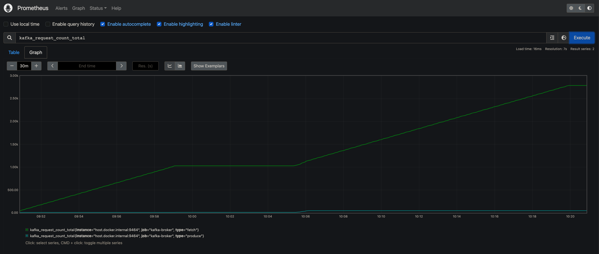
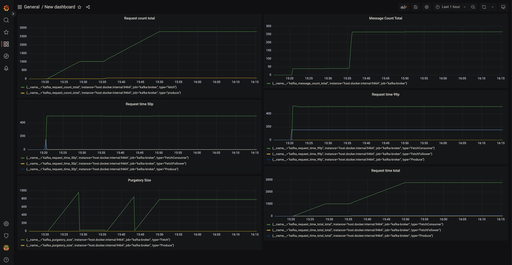
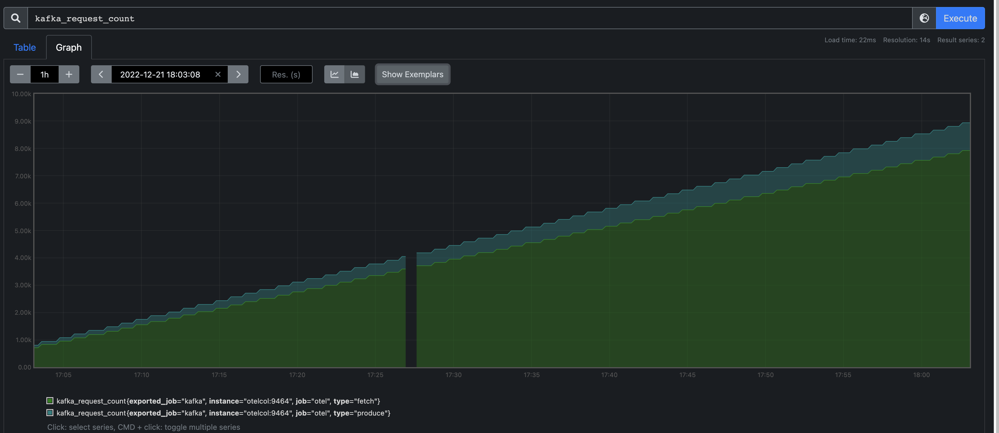
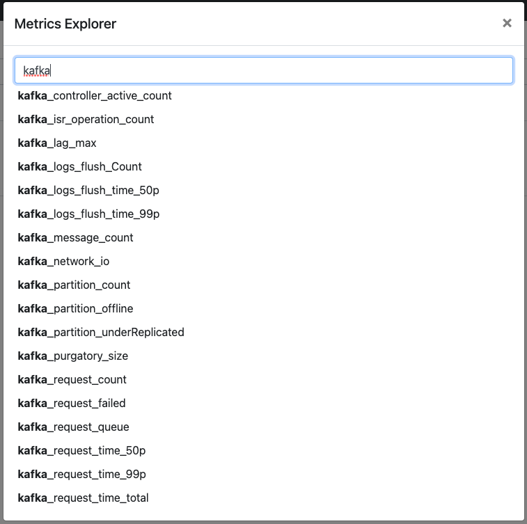

[JMX](https://www.oracle.com/technical-resources/articles/javase/jmx.html) (Java
Management Extensions) is a technology that provides a way to manage and monitor
Java-based applications. Detailed information about the performance and resource
usage of the application can be derived from JMX metrics. This data can help you
identify trends or potential issues with the application and take action to
address them before they become serious problems. If there are any problems, we
can diagnose them with the help of metrics collected, and fine-tune the system
for optimal performance.

With the addition of the
[JMX Metric Insight](https://github.com/open-telemetry/opentelemetry-java-instrumentation/tree/main/instrumentation/jmx-metrics)
module into the
[OpenTelemetry Javaagent](https://github.com/open-telemetry/opentelemetry-java-instrumentation),
we don't need to deploy a separate service just to collect JMX metrics for
monitoring our application. The agent can now natively collect and export
metrics exposed by application servers through local
[MBeans](https://docs.oracle.com/javase/tutorial/jmx/mbeans/index.html)
available within the instrumented application. The required MBeans and
corresponding metrics can be described using a YAML configuration file. The
individual metric configurations allow precise metric selection and
identification. JMX Metric Insight comes with a number of predefined
configurations containing curated sets of JMX metrics for popular application
servers or frameworks, such as:

- [ActiveMQ](https://github.com/open-telemetry/opentelemetry-java-instrumentation/blob/main/instrumentation/jmx-metrics/javaagent/activemq.md)
- [Hadoop](https://github.com/open-telemetry/opentelemetry-java-instrumentation/blob/main/instrumentation/jmx-metrics/javaagent/hadoop.md)
- [Jetty](https://github.com/open-telemetry/opentelemetry-java-instrumentation/blob/main/instrumentation/jmx-metrics/javaagent/jetty.md)
- [Kafka Broker](https://github.com/open-telemetry/opentelemetry-java-instrumentation/blob/main/instrumentation/jmx-metrics/javaagent/kafka-broker.md)
- [Tomcat](https://github.com/open-telemetry/opentelemetry-java-instrumentation/blob/main/instrumentation/jmx-metrics/javaagent/tomcat.md)
- [WildFly](https://github.com/open-telemetry/opentelemetry-java-instrumentation/blob/main/instrumentation/jmx-metrics/javaagent/wildfly.md)

You can also provide your own metric definitions, through one or more YAML
files. The YAML file syntax documentation is available
[here](https://github.com/open-telemetry/opentelemetry-java-instrumentation/tree/main/instrumentation/jmx-metrics/javaagent#configuration-files).

## Observe Kafka Broker metrics

Let's observe the health of our Kafka Broker by exporting the predefined set of
metrics using the JMX Metric Insight module and export it to Prometheus.

Kafka can be installed on macOS using Homebrew with the following steps:

```shell
brew install kafka
```

To start Zookeeper:

```shell
zookeeper-server-start /usr/local/etc/kafka/zookeeper.properties
```

### Attach the OpenTelemetry Java instrumentation agent

Before starting the Kafka broker, attach the OpenTelemetry Java instrumentation
agent to Kafka Broker by providing options in the KAFKA_OPTS environment
variable. You can download the latest release of the agent from
[here](https://github.com/open-telemetry/opentelemetry-java-instrumentation/releases).

```shell
export KAFKA_OPTS="-Dapplication.name=my-kafka-app
-Dotel.metrics.exporter=prometheus
-Dotel.exporter.prometheus.port=9464
-Dotel.service.name=my-kafka-broker
-Dotel.jmx.target.system=kafka-broker
-javaagent:/path/to/opentelemetry-javaagent.jar"
```

Now we can start the Kafka Broker:

```shell
kafka-server-start /usr/local/etc/kafka/server.properties
```

The Kafka broker should be up and running now. To test the installation, we can
create a topic and use the Kafka console producer and console consumer. Create
Kafka Topic:

```shell
kafka-topics --create --bootstrap-server localhost:9092 --replication-factor 1 --partitions 1 --topic my-test-topic
```

Start Kafka console producer to produce messages to the topic we created:

```console
$ kafka-console-producer --broker-list localhost:9092 --topic test
>First message
>Second message
```

Now we will start the Kafka console consumer which will consume messages from
the topic from the beginning:

```console
$ kafka-console-consumer --bootstrap-server localhost:9092 --topic test --from-beginning
First message
Second message
```

If we are able to see the two messages received by the consumer, that verifies
that our Kafka installation is working as expected.

### Export metrics to Prometheus

The metrics can be exported by any of the supported metric exporters, to a
backend of your choice. The full list of exporters and their configuration
options can be found
[here](https://github.com/open-telemetry/opentelemetry-java/blob/main/sdk-extensions/autoconfigure/README.md#exporters).
For instance, you can export the metrics to an OTel collector using the OTLP
exporter, perform some processing and then consume the metrics on a backend of
your choice. In this example for the sake of simplicity, we are directly
exporting the metrics to Prometheus.

We will visualize the metrics on a Grafana dashboard using Prometheus as the
data source. In this demo, we’ll deploy Prometheus on Docker. We can create a
`prometheus.yml` file containing this minimal configuration:

```yaml
global:
  scrape_interval: 10s
  evaluation_interval: 10s

scrape_configs:
  - job_name: my-kafka-broker
    scrape_interval: 5s
    static_configs:
      - targets: [host.docker.internal:9464]
```

Then run the command below to deploy Prometheus on Docker:

```shell
docker run -d \
    -p 9090:9090 \
    -v path/to/prometheus.yml:/etc/prometheus/prometheus.yml \
    prom/prometheus
```

The Prometheus container should be running now. You can now navigate to
<http://localhost:9090> and explore the Prometheus dashboard. Here we are
viewing the metric `kafka_request_count_total` on Prometheus.



More installation options for Prometheus can be found
[here](https://prometheus.io/docs/prometheus/latest/installation/).

### View the metrics on a Grafana Dashboard

Now, we are going to visualize the Prometheus metrics in a Grafana dashboard. To
do that, first, pull the Grafana docker image using the following command:

```shell
docker run -d -p 3000:3000 grafana/grafana
```

You can now navigate to <http://localhost:3000> and explore the Grafana home
page. Click on Add Data Source and select Prometheus. Add the HTTP URL, default
is <http://localhost:9090>. After that we can create new Dashboards, with
multiple options of visualizations to choose from (Graph, Singlestat, Gauge,
Table, Text, etc). We can then create new panels and add any metric we would
like to observe. Here is an example dashboard consisting of 6 panels, we are
observing a metric in each panel. We can observe the health of our Kafka Broker
in real time on this dashboard.



## JMX Metric Insight in the OTel demo application

You can also explore the official
[OpenTelemetry Astronomy shop demo application](https://github.com/open-telemetry/opentelemetry-demo).
The
[message queue service](https://github.com/open-telemetry/opentelemetry-demo/tree/main/src/kafka)
which connects the checkout service with the accounting and fraud detection
services is based on Kafka and utilizes the JMX Metric Insight module to export
Kafka broker metrics out of the box. You can head to the
[documentation](/docs/demo/services/kafka/).





## Further Capabilities of the module

In this example, we have only observed a few metrics from the predefined set
available for Kafka Broker. Not all metrics exposed by Kafka are part of the
set, so if your requirement is a metric not covered in this predefined set, fret
not! The module provides you with the option to create your custom metric
definition yaml files, so you can observe any metric exposed as an MBean
attribute. To get a peek into the structure of the yaml file, We can take a look
at a segment of the
[kafka-broker.yaml](https://github.com/open-telemetry/opentelemetry-java-instrumentation/blob/main/instrumentation/jmx-metrics/javaagent/src/main/resources/jmx/rules/kafka-broker.yaml):

```yaml
---
rules:
  - bean: kafka.server:type=BrokerTopicMetrics,name=MessagesInPerSec
    mapping:
      Count:
        metric: kafka.message.count
        type: counter
        desc: The number of messages received by the broker
        unit: '{messages}'
```

Each file can consist of multiple rules. Each rule can identify a set of one or
more MBeans, by the object name. In this example
`kafka.server:type=BrokerTopicMetrics,name=MessagesInPerSec` identifies a unique
MBean. We are interested in the attribute `Count` of this MBean, which is
specified under `mapping`. The metric reported will have the name
`kafka.message.count`, instrument type will be `counter` which indicates the
metric is a monotonic sum. It's unit will be `{messages}`. We have also provided
a description of the metric. This yaml segment is simple, to try out more
configuration options, you can head to the
[documentation](https://github.com/open-telemetry/opentelemetry-java-instrumentation/blob/main/instrumentation/jmx-metrics/javaagent/README.md)
to understand and try out all the features of the module.

Lastly, if you feel some metrics are important to be in the predefined sets of
metrics, or in general if you have any idea for enhancement of the module, feel
free to contribute to the
[repository](https://github.com/open-telemetry/opentelemetry-java-instrumentation).
