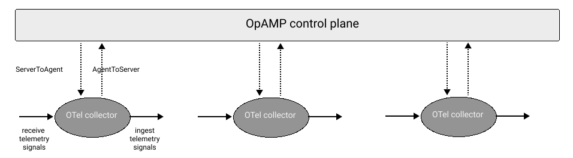
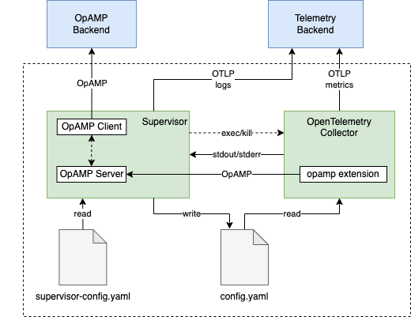
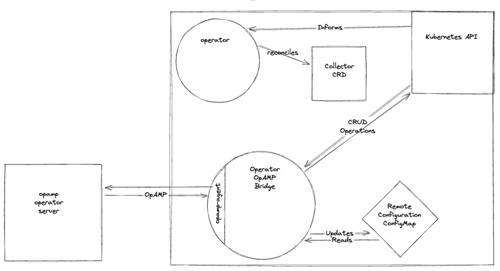

[Open Agent Management Protocol (OpAMP)](/docs/collector/management/) is the
emerging open standard to manage a fleet of telemetry agents at scale. In 2022,
Splunk donated OpAMP to the OpenTelemetry (OTel) project, with initial feedback
from observIQ, based on observIQ’s custom protocol used in BindPlane. The
[OpAMP specification](https://github.com/open-telemetry/opamp-spec/blob/main/specification.md)
defines a network protocol for remote management of fleets of agents. These
agents can really be anything, from telemetry agents such as the
[OpenTelemetry Collector](/docs/collector/) to
[Fluent Bit](https://fluentbit.io/) to custom agents you might use in your
environment.

In OpAMP, we distinguish between the server side, usually hosted in a control
plane, and the client side, implemented in the respective agent you want to
manage. For example, using OpAMP to manage a fleet of OpenTelemetry Collectors,
may look something like shown in the following:

The collectors report their status to and receive configuration from an OpAMP
control plane. The OpAMP protocol is vendor-agnostic and generic (not OTel
specific), so an OpAMP server can remotely monitor and manage a fleet of
different agents. OpAMP currently supports, amongst other things:

- Agents, such as the OpenTelemetry Collector, can report their properties, for
  example, type and version, or also the host operating system details to the
  Server (OpAMP control plane).
- The Server can push configurations to Agents and ensures that said
  configurations are applied, for example through reloading the Agent.
- You can ingest the Agent's own telemetry (logs and metrics) into an
  [OTLP](/docs/specs/otlp/)-compliant observability backend.
- Secure auto-updating capabilities for both upgrading and downgrading of the
  Agents.
- Built-in connection credentials management, including client-side TLS
  certificate revocation and rotation.

Now that we have a rough idea of what OpAMP is and what it supports, let’s have
a look at how it is implemented in the OpenTelemetry Collector.

In discussions with OTel end-users and collector contributors we found that they
want to use OpAMP both as an collector extension, with limited functionality, as
well as as an (collector-external) supervisor that implements a broader set of
OpAMP capabilities.

{} If you want to dive deeper here, we
suggest you read the
[OpAMP for OpenTelemetry Collector document](https://github.com/open-telemetry/opentelemetry-collector-contrib/tree/main/cmd/opampsupervisor/specification)
which describes how to implement both options while minimizing code
duplication.{}

The main idea to support both modes is to implement an extension in the
collector with a minimal set of OpAMP capabilities. This collector extension can
be used on its own, and can also be used to create an external Supervisor that
uses said extension as a helper and implements the remaining OpAMP capabilities
on top of what the extension implements:

Let us start with a closer look at the collector OpAMP extension and then we
move on to the OpAMP Supervisor.

## OpAMP extension

The
[OpenTelemetry Collector OpAMP extension](https://github.com/open-telemetry/opentelemetry-collector-contrib/pull/16594)
will implement an OpAMP client within the collector and will be used in both the
standalone and supervised models for managing a collector instance through
OpAMP. The functionality for the OpAMP extension while working with the
Supervisor has been defined as part of the Supervisor's design document, where
the extension will largely be tasked with providing bootstrapping information to
the Supervisor and communicating the collector's effective configuration.

## OpAMP supervisor

The OpAMP Supervisor will exist as a separate binary that runs an OpenTelemetry
Collector instance and implements an OpAMP client to relay configuration from an
OpAMP server to the collector by merging remote and local configuration sources
into a file that the collector can then use on startup. The supervised model of
managing the collector will also allow for downloading additional binaries
through the OpAMP protocol, allowing for downloading additional files as well as
updating the collector.

In addition, if the OpAMP Server sends the Supervisor a "bad" configuration and
the collector fails to start, since it is running as a separate process, the
Supervisor can communicate this with the OpAMP server to notify it of the
situation. On top of implementing an OpAMP client, the Supervisor will also
implement an OpAMP server where it will communicate with the OpAMP extension
running in the collector to receive information about the Collector. We defined
the Supervisor's functionality in a
[design document](https://github.com/open-telemetry/opentelemetry-collector-contrib/tree/main/cmd/opampsupervisor/specification)
and based on it we contributed an initial implementation to the
[opentelemetry-collector-contrib repository](https://github.com/open-telemetry/opentelemetry-collector-contrib/tree/main/cmd/opampsupervisor)
with a backlog of issues created to guide further development.

## OpAMP in Kubernetes

In OTel we have dedicated support for Kubernetes as a compute platform via the
[OpenTelemetry Operator for Kubernetes](/docs/kubernetes/operator/). In this
context, we're also working on OpAMP support in Kubernetes which will be
available through a
[bridge component](https://docs.google.com/document/d/1M8VLNe_sv1MIfu5bUR5OV_vrMBnAI7IJN-7-IAr37JY/)
to be deployed by the OpenTelemetry Operator:

{} Currently, we don't have support for
deployment via Helm chart, however, if you'd like to contribute to this, you're
welcome to contribute.{}

The OpAMP bridge is a binary developed by the OTel
[SIG Kubernetes Operator](https://docs.google.com/document/d/1Unbs2qp_j5kp8FfL_lRH-ld7i5EOQpsq0I4djkOOSL4/)
and is responsible for maintaining pools of OpenTelemetry Collector resources in
a Kubernetes cluster. The bridge acts as a client for an OpAMP operator server,
reporting the effective configuration of the collector pools and enables the
remote configuration of pools of collectors. In the future, the bridge will
report richer information about the collector pools running in Kubernetes
through enhanced status and improved health checks. You can also extend the
bridge to support the remote configuration of Instrumentation resources. The
bridge’s image is already built and released with the OpenTelemetry Operator. In
addition, we're working on a convenience
[Custom Resource Definition (CRD)](https://github.com/open-telemetry/opentelemetry-operator/blob/main/apis/v1alpha1/opentelemetrycollector_types.go)
which will enable you to easily deploy the bridge into a Kubernetes cluster.

## What’s next?

The community has been working on OpAMP now for more than a year and users are
excited about the opportunities it promises to deliver. If you’re around at
[KubeCon NA in Chicago, USA](https://events.linuxfoundation.org/kubecon-cloudnativecon-north-america/)
between Nov 6 and 9 2023, consider visiting us at the OpenTelemetry maintainers
booth or find us at any of the many observability-related events such as the
[Observability day](https://events.linuxfoundation.org/kubecon-cloudnativecon-north-america/co-located-events/observability-day/).
We’re super interested to learn from you about non-OTel collectors use cases and
requirements as well. For now, if you’re a vendor and implementing the OpAMP
spec please provide feedback and as an end-user you may wish to try out the
reference implementation of the Server, Supervisor and a simple UI by following
the steps in the [OpAMP entry in the OTel docs](/docs/collector/management/) or
maybe even dive deep into the
[Supervisor code (in Go)](https://github.com/open-telemetry/opentelemetry-collector-contrib/tree/main/cmd/opampsupervisor)
in the OTel collector.
