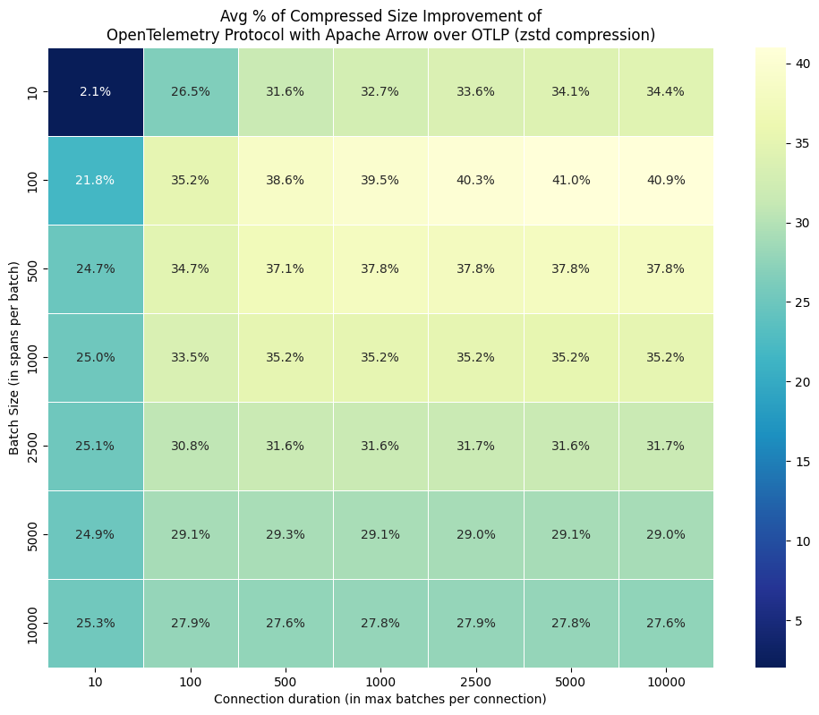
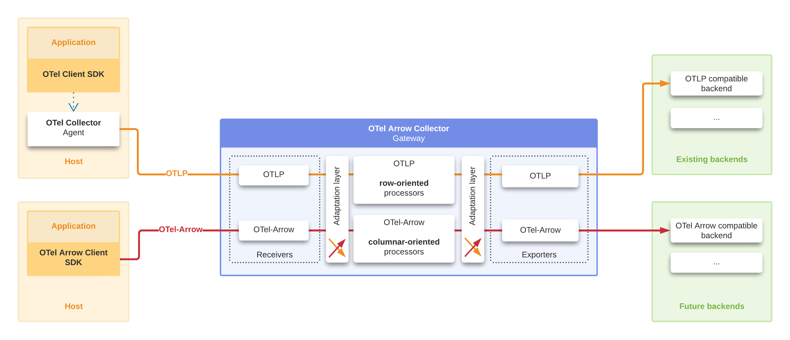

---
title:
  Achieve a 10x Reduction in Telemetry Traffic Using OpenTelemetry Protocol with
  Apache Arrow
linkTitle: OpenTelemetry Protocol with Apache Arrow
date: 2023-11-01
author: >-
  [Laurent Quérel](https://github.com/lquerel) (F5), [Joshua
  MacDonald](https://github.com/jmacd) (ServiceNow)
cSpell:ignore: Quérel zstd
---

We are thrilled to unveil the **OpenTelemetry Protocol with Apache Arrow**,
which is based on [Apache Arrow](https://arrow.apache.org/), a columnar-oriented
memory format used for developing analytics applications. This integration
facilitates a reduction in telemetry data traffic by a factor of 10 after
compression, offering a 40% improvement over the best existing OpenTelemetry
Protocol (OTLP) configurations with [Zstandard (zstd)](http://www.zstd.net/)
compression enabled. As a result, this new protocol emerges as an optimal choice
for transporting telemetry data over the internet. We are also excited to
announce the release of a new pair of receiver/exporter in the
[opentelemetry-collector-contrib](https://github.com/open-telemetry/opentelemetry-collector-contrib/)
repository that supports this protocol. This protocol, designed to complement
the OTLP protocol in situations with substantial telemetry data volumes, has
been under discussion and development for two years. It represents a
collaborative effort between [F5](https://f5.com),
[ServiceNow Cloud Observability](https://www.servicenow.com/products/observability.html)
, and numerous technical leaders from the OpenTelemetry community (see
[donation](https://github.com/open-telemetry/community/issues/1332)). The
compression benefits are significant, demonstrating a **40% improvement
compression efficiency** for the majority of workloads and even greater
enhancements for workloads that contain multivariate metrics, which share
attributes. One of the highlights of the OpenTelemetry Protocol with Apache
Arrow integration is its seamless adaptability. In a typical deployment,
incorporating OpenTelemetry Protocol with Apache Arrow doesn't necessitate any
substantial changes. Users simply need to redeploy a new version of the
OpenTelemetry Collector with a slightly tweaked configuration.

This new protocol will serve as the cornerstone for future advancements in
telemetry data processing and will generally foster enhanced integration with
modern telemetry backends.

## Why a new protocol?

The growth in telemetry data is undeniable and rapid. This surge is attributed
to several factors:

- Proliferation of devices and sensors
- Shift from monolithic application deployment to more granular forms like
  containers and serverless functions
- Increasing reliance on data-driven and AI-driven technologies

As telemetry data becomes increasingly distributed, workloads become
location-agnostic, spanning data centers, clouds, and the edge. This
distribution amplifies the urgency to optimize telemetry transport across the
internet. As the ecosystem transforms, the imperative to optimize and align the
components of a telemetry pipeline end-to-end becomes more pronounced.

Enter the OpenTelemetry Protocol with Apache Arrow, a pivotal solution crafted
to meet this growing demand.

Historically, when telemetry data volumes were moderate, their wire
representation didn’t pose significant concerns. Such data was typically
encapsulated as structured objects using diverse serialization frameworks. Until
recently, OpenTelemetry primarily supported either JSON or, more commonly, a
protobuf-based binary format for metrics, logs, and traces. This choice,
particularly with protobuf, offers a good balance between simplicity, data
representation efficiency, and performance, especially when transmitting low to
medium volumes of complex telemetry objects across the network.

On the backend, however, this data is typically stored in a columnar format to
optimize compression ratio, data retrieval, and processing efficiency (see fig 1
to compare row vs columnar data representation). Transitioning to an end-to-end
columnar representation throughout the pipeline streamlines the interface
between telemetry transport and backend. Additionally, it reduces the network
bandwidth required for telemetry data transmission. The OpenTelemetry Protocol
with Apache Arrow utilizes this columnar representation for metrics, logs, and
traces, leading to significant savings in network expenses.

Fig 1: Memory representations: row vs columnar data.

To further optimize the transmission of batches of OTel entities, this new
protocol uses gRPC streams to efficiently leverage dictionary encoding. Much of
the textual data between batches is redundant; attribute names and values are
frequently repeated. Apache Arrow supports dictionary encoding and a
stream-oriented protocol allows us to send only the deltas of those dictionaries
between consecutive batches. These techniques enhance the protocol's
compressibility.

Another area of inefficiency is the way the OTel data model handles multivariate
metrics. Currently, there's an absence of a streamlined approach to report a
batch of metrics with shared attributes without redundantly replicating these
attributes. In specific scenarios, this redundancy places an undue strain on
both the network bandwidth and overall resource utilization. Our newly designed
protocol addresses this by offering an enhanced representation of multivariate
metrics. In certain scenarios, we've seen compression improvements of up to 7x
compared to OTLP, all without modifications on the client side. Future client
SDKs could be implemented to seamlessly expose this enhancement, potentially
leading to even better results for applications.

The following heatmap represents, for different combinations of batch sizes and
connection durations (expressed as the number of batches per stream), the
additional percentage of compression gain between this new protocol and OTLP,
both compressed with zstd. The data used here comes from a traffic of spans
captured in a production environment. The gains are substantial in most cases.
It is even interesting to note that these gains compared to OTLP+zstd are more
significant for moderate-sized batches (e.g., 100 and 1000 spans per batch),
which makes this protocol also interesting for scenarios where the additional
latency introduced by batching must be minimized. There is hardly any scenario
where micro-batches (e.g., 10 spans per batch) make the overhead of the Arrow
schema prohibitive, and the advantage of a columnar representation becomes
negligible. In other cases, this initial overhead is very quickly offset after
just the first few batches. The columnar organization also lends itself better
to compression. For very large batch sizes, zstd does an excellent job as long
as the compression window is sufficiently large, but even in this case, the new
protocol remains superior. As previously mentioned, these compression gains can
be higher for traffic predominantly containing multivariate metrics.

The advancements don't end there. In a subsequent phase of this project, we aim
to leverage the columnar layout to significantly enhance data processing speeds
within an expanded OpenTelemetry Collector architecture that natively supports a
new Arrow-based pipeline. Based on our proof of concept, we anticipate at least
an order of magnitude improvement in data processing speed with this updated
collector.

These different sources of inefficiency and misalignment are the rationale
behind our support for the new OpenTelemetry Protocol with Apache Arrow as an
alternative to the existing OpenTelemetry Protocol. Our decision to leverage the
well known Apache Arrow project for this new columnar representation offers
numerous advantages. Apache Arrow is very efficient and well adopted in the
database, data stream processing spaces. Its rich ecosystem boasts a range of
powerful libraries and tools, from Parquet bridges to query engines such as
DataFusion. Such resources can expedite the introduction of innovative features,
aligning OpenTelemetry more closely with modern data pipelines that are
increasingly pivoting towards Apache Arrow.

A specification for this protocol (OTEP 0156) can be found
[here](https://github.com/open-telemetry/oteps/blob/main/text/0156-columnar-encoding.md).
A reference implementation of the encoding/decoding function can be accessed
[here](https://github.com/open-telemetry/otel-arrow). Additionally, the new pair
of OTel receiver/exporter that supports this protocol is available in the
[contrib repository](https://github.com/open-telemetry/opentelemetry-collector-contrib).

## How can I leverage the OpenTelemetry Protocol with Apache Arrow in my deployment?

In the initial phase of this project, our primary goal is to optimize
communication between two collectors. This is commonly observed in setups where
telemetry traffic is funneled through one or multiple collectors before being
relayed across the internet for backend processing. Given the increased
complexity of the OpenTelemetry Protocol with Apache Arrow compared to the
original OTLP, its containment between two collectors offers an easier target to
hit and reduces potential disruptions to the broader ecosystem. Existing client
SDKs, processors, receivers and exporters can continue to work seamlessly. Only
the exporter and the receiver between the two collectors need to be
reconfigured. The immediate benefit will be a reduction in network bandwidth,
leading to direct savings on network costs (up to 7x for metrics, 2x for logs,
and traces). For a comprehensive breakdown of this deployment, click here [add
link].

As is often the case, there isn't a one-size-fits-all solution. Deployments with
limited resources or those generating minimal telemetry should stick with the
standard collector based on OTLP. Moreover, OpenTelemetry Protocol with Apache
Arrow necessitates the support of bi-directional gRPC streams and some degree of
batching to fully benefit from the columnar representation. This can make the
solution unsuitable in certain specific scenarios. It's also worth noting that,
during this phase of the project, a slight increase in CPU and memory usage is
expected in the collector. This is due to the overhead of automatically
translating OTLP objects to OpenTelemetry Protocol with Apache Arrow objects.
However, this overhead will be completely eliminated in the subsequent phase of
the project.

We value our users a lot so a validation framework has been developed to reduce
errors and mitigate the risk of regression. We've utilized a telemetry data
generator to test encoding and decoding processes, specifically converting
between OTLP and OpenTelemetry Protocol with Apache Arrow, and vice versa.
Additionally, a flexible comparator has been put in place to semantically
compare the original OTLP request, produced by the generator, with the resulting
OTLP request after the encoding/decoding process. This approach has enabled us
to address numerous edge cases and rectify several critical bugs. To pinpoint
the origins of potential issues, our evaluation took place at two distinct
levels: firstly, a foundational one where we interacted directly with the core
encoding/decoding mechanisms, sidestepping both collector integration and
network communications; and secondly, at the collector level, providing a
thorough review of the entire pipeline, which encompassed network interactions.

To strengthen the decoding methods against ill-formed (whether intentional or
not) OpenTelemetry Protocol with Apache Arrow messages, we deliberately
introduced anomalies into the OpenTelemetry Protocol with Apache Arrow message
prior to decoding. Our objective was to ensure the decoding methods would
respond with an error message, rather than crash, when encountering invalid
inputs.

Beyond these automated procedures, ServiceNow Cloud Observability took further
steps by deploying the experimental collector across various staging
environments. This was done to assess both the collector's behavior and the
protocol's resilience when confronted with real traffic. Not only did these
deployments result in enhancements to our automated validation framework, but
they also substantiated our benchmark findings.

While we've diligently worked to identify and address regressions and issues, we
recognize the complex and varied nature of real-world scenarios. Thus, we
encourage the community to evaluate this new protocol across diverse deployment
situations and traffic loads, starting with the least sensitive environments.
Your deployments and feedback will assist us in further strengthening this
project.

To facilitate this testing phase, we have also improved the file exporter to
save and anonymize the data in a compressed format. We have developed tools to
enable the analysis and replay of this anonymized traffic in order to identify
either bugs or sources of inefficiency. This approach recently played an
important role in improving the logic that defines the best Arrow schemas to use
for a given traffic. During an experiment in a production environment, we
noticed a degradation in the compression rate after one million spans. Upon
analysis, we were able to identify the source of the problem and adjust the
protocol to ensure that this type of degradation is no longer observed (see this
[PR](https://github.com/open-telemetry/otel-arrow/pull/82)).

## Next

In the future, we plan to focus on fully integrating OpenTelemetry Protocol with
Apache Arrow throughout the ecosystem. The proposed developments are as follows
(not necessarily in order of priority):

- **Development of Schema-First Client SDKs generator with native support for
  OpenTelemetry Protocol with Apache Arrow and multivariate metrics**: Aimed at
  optimizing scenarios with high telemetry producers.
- **Introduction of a new pipeline type in the Collector**: This will introduce
  a new generation of receiver, processor, and exporter, each designed
  specifically for consuming and/or producing OpenTelemetry Protocol with Apache
  Arrow messages. By streamlining communication between components, we expect to
  enhance data processing efficiency. Significant acceleration is anticipated as
  conversions to and from OTLP, as well as the serialization and deserialization
  of telemetry batches, will be bypassed.
- **Leveraging SIMD-based data processing engines from the Apache Arrow
  ecosystem**: This will further accelerate telemetry data processing and expand
  the range of data processing capabilities.
- **Consideration of adding Parquet exporters**: Made possible by the existing
  bridge between Apache Arrow and [Apache Parquet](https://parquet.apache.org/).
- The broader community is also anticipated to develop more streamlined
  exporters to better integrate with specific telemetry backends.

## Conclusion

We're excited to witness the testing and benchmarking of this new protocol by
the community. In our view, this represents a significant milestone for the
OpenTelemetry community, with even more thrilling developments on the horizon.

For those keen on delving into the intricacies of integrating OpenTelemetry with
Apache Arrow, we recommend reading these two articles featured on the Apache
Arrow Blog
[[1](https://arrow.apache.org/blog/2023/04/11/our-journey-at-f5-with-apache-arrow-part-1/),
[2](https://arrow.apache.org/blog/2023/06/26/our-journey-at-f5-with-apache-arrow-part-2/)].
You will find a presentation of the various approaches to effectively represent
the hierarchical and dynamic objects that are the OTel metrics, logs, and
traces.

We would like to express our gratitude to our employers, F5 and ServiceNow Cloud
Observability, for allowing us to spearhead and execute this project.
Additionally, our thanks extend to the numerous OTel technical leaders for their
invaluable assistance.

## Links

- OpenTelemetry Protocol with Apache Arrow Specification -
  [OTEP 0156](https://github.com/open-telemetry/oteps/blob/main/text/0156-columnar-encoding.md)
- Receiver
  [documentation](https://github.com/open-telemetry/otel-arrow/blob/main/collector/receiver/otelarrowreceiver/README.md).
- Exporter
  [documentation](https://github.com/open-telemetry/otel-arrow/blob/main/collector/exporter/otelarrowexporter/README.md).
- OpenTelemetry Protocol with Apache Arrow (encoder/decoder)
  [repository](https://github.com/open-telemetry/otel-arrow).
