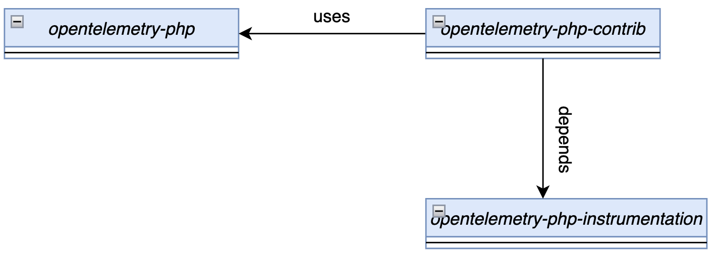
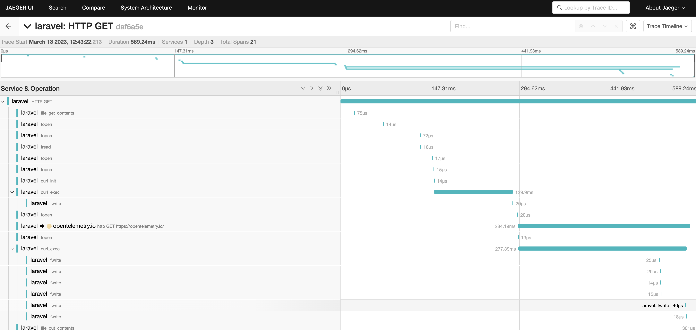

Automatic Instrumentation is a process of adding tracing capabilities into user
application without modyfing its source code. There are several techniques to do
that, but all of them more or less work in the same way by injecting additional
code into original one during compile time, link time, run-time or by extending
the operating system in case of [ebpf](https://ebpf.io/). This blogpost presents
method used by Opentelemetry PHP auto-instrumentation.

## Prerequisites

To use the
[PHP auto-instrumentation](https://github.com/open-telemetry/opentelemetry-php-instrumentation),
you'll need three things:

- PHP 8.0 or higher. The PHP auto-instrumentation uses the Observability API
  introduced in PHP 8.0.
- [Composer]((https://getcomposer.org/download/)
- A C Compiler must be available on your machine

### Background on the PHP 8.0 Observability API

[Observability API](https://www.datadoghq.com/blog/engineering/php-8-observability-baked-right-in/)
allows you to register and execute additional code (function) before and after
an original one without introducing additional performance penalties in other
areas. Before PHP 8.0, the most common technique for adding tracing capabilities
was altering the `zend_execute_ex` function (a monkey patching kind technique).
However, this can lead to performance problems, stack overflows at runtime, and
a general application overhead that may not be desirable. Another approach
considered in the past was plugging into the AST and modifying it during
compilation time, but there are not known production ready traces that use this
technique.

### Observability API from auto-instrumentation perspective

At the moment of this writing,
[observability API](https://github.com/php/php-src/blob/PHP-8.0/Zend/zend_observer.h)
is used by
[c extension](https://github.com/open-telemetry/opentelemetry-php-instrumentation)
and exposes one function with the following interface:

```php
function hook(
    ?string $class,
    string $function,
    ?\Closure $pre = null,
    ?\Closure $post = null,
): bool {}
```

This function can be used from user application in order to add additional
functionality executed before and after the observed function. The below code
snippet shows how to instrument dummy `helloworld` function:

```php
function helloWorld() {
  echo 'helloWorld';
}

\OpenTelemetry\Instrumentation\hook(null, 'helloWorld',
    static function (?string $class, array $params, ?string $classname, string $functionname, ?string $filename, ?int $lineno)
    {
      echo 'before';
    },
    static function (mixed $object, array $params, mixed $return, ?Throwable $exception)
    {
      echo 'after';
    }
);
```

In the same way, we have implemented tracing support for some of the most
important `interfaces/libraries/frameworks` that are parts of
[Contrib](https://github.com/open-telemetry/opentelemetry-php-contrib/tree/main/src/Instrumentation)
repo. Each `auto-instrumentation` package uses above `hook` function in order to
register and provide tracing functionality. One missing thing, not mentioned yet
is an `API` `SDK` used to create traces and other necessary components. This is
the responsibility of the opentelemetry-php
[main](https://github.com/open-telemetry/opentelemetry-php) repo which is
foundation for everything.



## How to use it

All components necessary for auto-instrumentation can be installed manually,
however we invested time to lower the barrier to entry and have created an
installer that can do that for you. This section will show how auto-instrument a
simple php `laravel` application created from scratch.

The first step is to create a demo application. Here we use the popular
[laravel](https://laravel.com/docs/10.x/installation) framework:

```sh
composer create-project laravel/laravel example-app
```

Next, install
[opentelemetry-instrumentation-installer](https://packagist.org/packages/open-telemetry/opentelemetry-instrumentation-installer).

```sh
cd example-app
composer require open-telemetry/opentelemetry-instrumentation-installer
```

Opentelemetry instrumentation installer works in two modes:

- basic (installs everything with most recent version)
- advanced (gives control to the user)

After installation, run `install-otel-instrumentation` with either `basic` or
`advanced` switch as below.

```sh
./vendor/bin/install-otel-instrumentation basic
```

The final step is to run your application with `run-with-otel-instrumentation`:

```sh
./vendor/bin/run-with-otel-instrumentation php -S localhost:8080 -t public public/index.php
```

The run-with-otel-instrumentation isn't magic: everything it does can be done by
hand by setting environment variables and running your application normally. It
is a convenience tool for rapidly testing out open-telemetry against an
application with a working default configuration.

```sh
./vendor/bin/run-with-otel-instrumentation php -S localhost:8080 -t public public/index.php
```

Now, as a result of triggering request to <http://localhost:8080> you should see
following result in
[Jaeger](https://www.jaegertracing.io/docs/1.42/getting-started/)



## Current status and next steps

We have all necessary components in place:

- APIs and SDK as a foundation and implementation of opentelemetry
  specification.
- C extension as a foundation for auto-instrumentation.
- Auto Instrumentation support (WIP) for most important and popular libraries
  and frameworks.
- Development tools that can help lower barrier for users and developers
  interested in instrumenting arbitrary code.
- [Documentation](https://opentelemetry.io/docs/instrumentation/php/automatic/)

One of our goals is to increase awareness of this work and involve more people
that will help us improve it, extend coverage and fix bugs.

Please try it out and give us feedback. If you encounter any problems, you can
open an
[issue](https://github.com/open-telemetry/opentelemetry-php/issues/new/choose).
Questions? Feel free to reach out to us in the CNCF
[#otel-php](https://cloud-native.slack.com/archives/C01NFPCV44V) Slack channel,
or come to our SIG meeting, which you can find on the
[OTel public calendar](https://calendar.google.com/calendar/embed?src=google.com_b79e3e90j7bbsa2n2p5an5lf60%40group.calendar.google.com).
