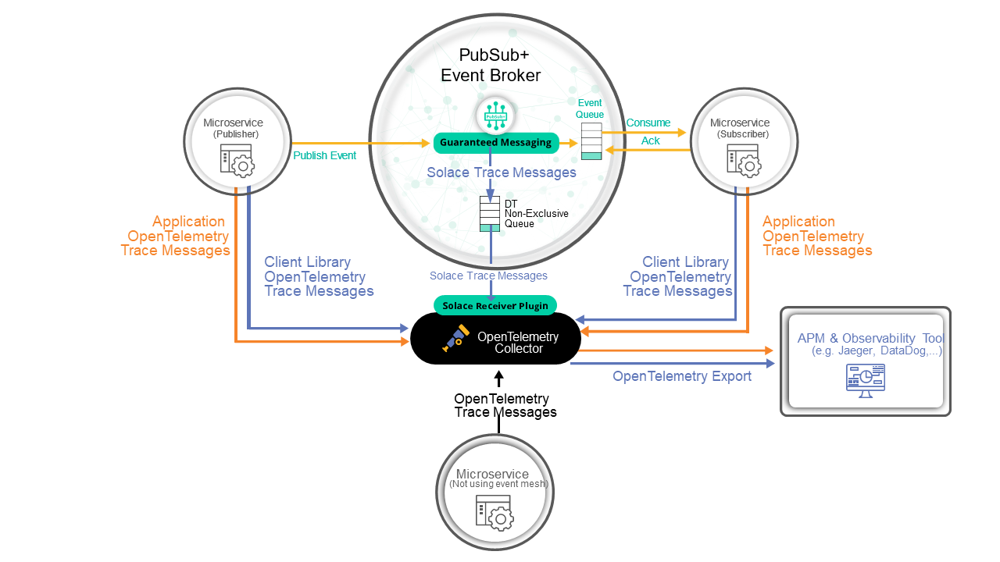
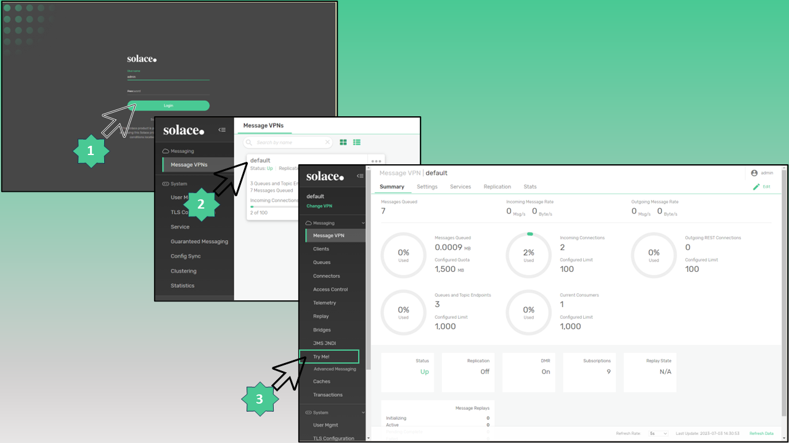
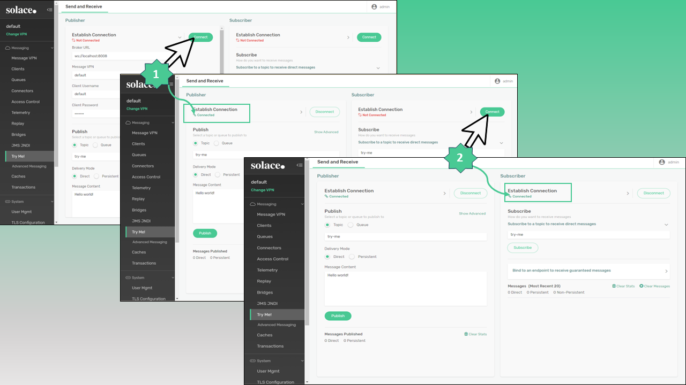
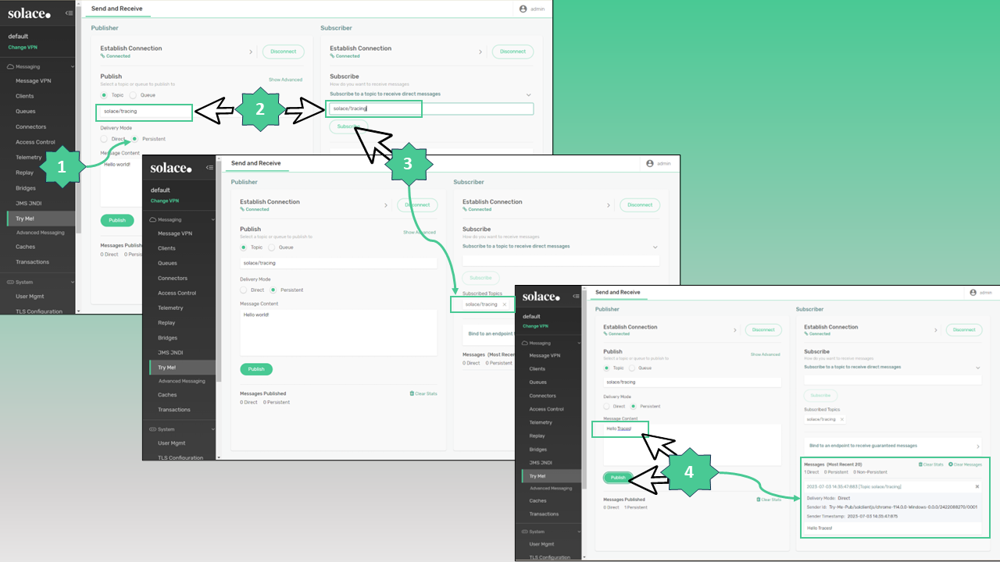
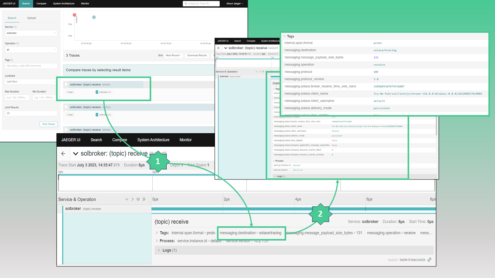
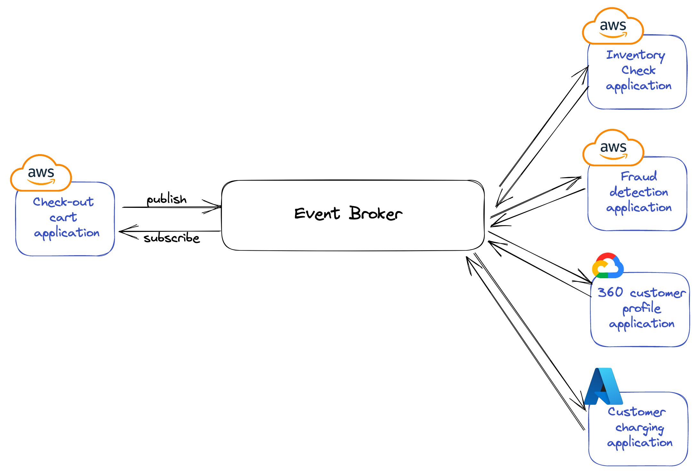
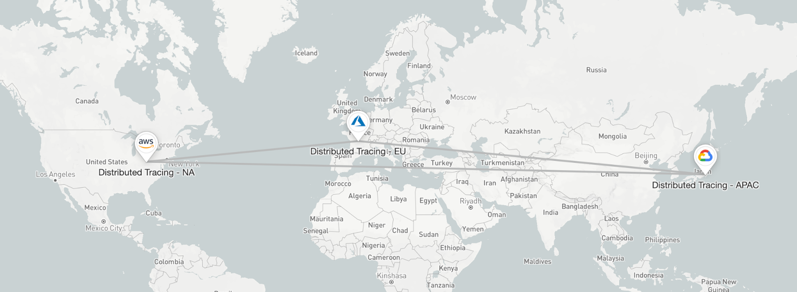

With contributions from [Tamimi Ahmad](https://github.com/tamimiGitHub) (Solace)

## Overview

In an increasingly event-driven world, enterprises are deploying more messaging
middleware solutions comprised of networks message broker nodes. These networks
route event-related messages between applications in disparate physical
locations, clouds or even geographies. Until now, IT departments have provided
solutions for tracing the application tier activity from these events. However,
as messaging networks become increasingly more complex, how do enterprises gain
visibility into the routing activity from **within** the messaging components?

In this blog post, we discuss Event-Driven Architecture (EDA), the challenges of
observability in this domain and show how an EDA based on the Solace PubSub+
Event Mesh delivers complete end-to-end OpenTelemetry-compliant Distributed
Tracing.

## Introduction to Event Driven Architecture (EDA) and the Challenges of Traceability

### What is EDA ?

**Event-driven architecture** is defined as a software design pattern in which
decoupled applications can asynchronously publish and subscribe to events via an
**event broker** (modern messaging-oriented-middleware).

Event-driven architecture is a way of building enterprise IT systems that lets
information flow between applications, microservices, and connected devices in a
real-time manner as events occur throughout the business.

By introducing an event broker as the middleman in the system, event-driven
architecture enables what’s called **loose coupling** of applications, meaning
applications and devices don’t need to know where they are sending information,
or where information they’re consuming comes from.

For more on the business need and benefits of EDA, see
[Solace's Complete Guide to Event-Driven Architecture.](https://solace.com/what-is-event-driven-architecture/)

### The importance of observability in Modern Event-Driven Businesses

When functioning in an event-driven capacity, a business will inevitably deploy
more event brokers to support the volume and complexity of their constantly
changing business and traffic needs. These brokers could be distributed across
many physical locations (locally or geographically), different cloud providers
in several regions, or a combination of both on-premises and cloud.

As the business evolves in both scale and routing sophistication, it becomes
more critical to have visibility into exactly how messages are being processed
by the underlying message brokering topology. Without observability at the
broker / routing tier of the EDA, here are some questions an enterprise can not
answer:

- Where are messages routed - point to point, across geographies and regions, or
  from on-premises to cloud?
- Are messages processed successfully?
- How does message processing track against key metrics and performance
  indicators?
- Are messages delayed by insufficient resources?
- What type of messages end up in an error state due to misrouting, permissions
  or content?
- How do messages get tracked against other business or regulatory
  requirements - eg., geographical data sovereignty, sensitive data exposure,
  time to process, etc?

## An approach: OpenTelemetry-based Distributed Tracing within a Solace Event Mesh

[The Solace PubSub+ Platform](https://docs.solace.com/Get-Started/Solace-PubSub-Platform.htm?utm_source=web&utm_medium=referral&utm_id=cncf_2023&utm_content=blog)
is a complete event streaming and management platform for the real-time
enterprise.

At the core of the Solace PubSub+ Platform is the
[Solace PubSub+ Event Broker](https://docs.solace.com/Software-Broker/SW-Broker-Set-Up/Setting-Up-SW-Brokers.htm?utm_source=web&utm_medium=referral&utm_id=cncf_2023&utm_content=blog).
The Solace PubSub+ Event Broker efficiently transfers event-driven information
between applications, IoT devices and user interfaces running in cloud,
on-premises, and hybrid environments. The Solace PubSub+ Event Broker uses open
APIs and protocols like AMQP, JMS, MQTT, REST and WebSocket. It's available for
installation into all public clouds, private clouds as well as on-premises
environments.

As mentioned above, supporting your successful EDA-driven business requires a
network of interconnected message brokers such as the Solace PubSub+ Event
Broker. Solace calls these large scale deployments an
["Event Mesh"](https://docs.solace.com/Get-Started/understanding-event-meshes.htm?utm_source=web&utm_medium=referral&utm_id=cncf_2023&utm_content=blog).

While other brokers can be configured and networked together, there is a lack of
routing and telemetry of messages from within and across these broker networks.
As a result, the message routing details are a black box in any distributed
tracing scenario. As a matter of fact, most distributed tracing focuses solely
on application, microservice or API-based instrumentation.

As we've been discussing, to fully trace their activity in an Event-Driven
world, businesses need the ability to provide tracing at the event routing
level. So in addition to application and API tracing, the Solace PubSub+ Event
Broker delivers the innovation of generating traces directly from the broker. As
a result, organizations using a Solace-based Event Mesh will be able to see how
events are received, routed, delivered or even failed by each node of the mesh.

## Distributed Tracing in action with the Solace PubSub+ Event Broker

### Basic Components of Distributed Tracing based on a single Solace PubSub+ Event Broker

The above diagram shows the basic components of Distributed Tracing for a single
Solace PubSub+ Event Broker:

1. **Application client program**  
   This is any piece of software that communicates with the Solace PubSub+ Event
   Broker via the Solace messaging protocol or any of the standard messaging
   protocols within the supported languages and messaging protocols.

2. **Distributed Tracing-enabled Solace PubSub+ Event Broker**  
   The core Solace PubSub+ Event Broker with Distributed Tracing 'turned on' via
   basic configuration.

3. **The Contrib distribution of the OpenTelemetry Collector**  
   A version of the OpenTelemetry Collector that contains the
   [Solace Receiver](https://github.com/open-telemetry/opentelemetry-collector-contrib/tree/main/receiver/solacereceiver).

4. **OpenTelemetry-compliant observability Back-end**  
   An observability tool/product that consumes OpenTelemetry traces (eg.,
   Jaeger, DataDog, Dynatrace, etc.)

Once you have configured a single Solace PubSub+ Event Broker for Distributed
Tracing, this same configuration can be utilized for every Event Broker you
connect within an Event Mesh.

### Steps for running a Single Solace PubSub+ Event Broker with Distributed Tracing

**NOTE:**

For step-by-step instructions on setting up Distributed Tracing for a Solace
PubSub+ Event Broker with a packaged Java-based application client, please see
the Solace Codelab:
[Getting Started with Solace Distributed Tracing and Context Propagation](https://codelabs.solace.dev/codelabs/dt-otel/index.html#0?utm_source=web&utm_medium=referral&utm_id=cncf_2023&utm_content=blog)

This Codelab has much more in it than needed for purposes of this blog post, but
we will refer to specific steps for brevity.

Follow these steps to see Distributed Tracing in action with the Solace PubSub+
Event Broker the Solace 'Try-Me!' client:

1. Download Configuration files from
   [here](https://github.com/TamimiGitHub/solace-dt-demo)

   These will enable you to run the Solace PubSub+ Event Broker, OpenTelemetry
   Collector and an instance of Jaeger.

   1. `docker-compose.yaml` Docker Compose file for the 3 containers.
   1. `.env ` Environment variables for the docker containers.

   1. `solace_config_keys.env` Environment variables for configuring the Solace
      PubSub+ Event Broker.

   1. `otel-collector-config.yaml` OpenTelemetry Collector Configuration file.
      Standard configuration for the Collector as well as authentication login
      that allows it to consume tracing messages from the Solace PubSub+
      EventBroker.

1. Start up the containers

   Go to the directory where you saved the configuration files and run this
   docker command:

   `docker compose up -d`

   NOTE: This assumes you have Docker up and running. Learn more
   [here.](https://docs.docker.com/get-started/)

1. Turn on Distributed Tracing within the Solace PubSub+ Event Broker

   Steps 4 - 10 in the Solace Codelab show how to set up basic permissions and
   enable Distributed Tracing within the Solace PubSub+ Event Broker:  
   [Getting Started with Solace Distributed Tracing and Context Propagation.](https://codelabs.solace.dev/codelabs/dt-otel/index.html#0?utm_source=web&utm_medium=referral&utm_id=cncf_2023&utm_content=blog)

1. Run the built-in test client ("Try-Me!" page) that comes with the Solace
   PubSub+ Event Broker

   The Solace PubSub+ Event Broker actually includes a test client to show
   messages going through the broker. This enables quick illustration of the
   broker behavior across any protocol without having to create a separate
   external application. The following illustrates how to use the Try-Me! client
   to generate a simple persistent message that leads to the broker generating
   trace data.

   **NOTE:** This is dependant on following the steps outlined in the Solace
   Codelab.

   - Login and access the Try-Me! client

     

   - Create both a publish and subscribe connection. Make sure to use the same
     topic (**solace/tracing**) as created for the application queue in the
     Codelab.

     

   - Publish the message.

     **NOTE:** The Solace PubSub+ Event Broker does not inspect the content of
     any message, it simply passes it along. However, if you would like to see
     your content passed through, the screenshots shows how you can create your
     own custom message in the Try-Me! client.

     

   - Navigate to Jaeger and note the key broker-level telemetry shown by the
     Solace PubSub+ Event Broker-generated traces.

     If Docker is running on the same system your browser is running on, you can
     access the Jaeger UI using the following URI: http://0.0.0.0:16686/ or
     http://localhost:16686/. If Docker is running on another system in your
     network, simply replace 0.0.0.0 to the system's IP, e.g.
     http://192.168.3.166:16686/.

     

   **A NOTE on the two queues set up within the Solace PubSub+ Event Broker**

   o The queue created in the Solace Codelab (named 'q') attracts messages
   tagged with a topic of 'solace/tracing'. This is an example of a persistent
   queue within the Solace PubSub+ Event Broker. Once Distributed Tracing is
   enabled, the Solace PubSub+ Broker will generate telemetry data for messages
   published to any persistent queue. This is the queue that we use within the
   Try-Me! client.

   o This persistent queue is different than the '#telemtry-trace' queue which
   the Solace PubSub+ Event Broker uses for publishing all OpenTelemetry traces.
   It is the #telemetry-trace queue that the Contrib distribution of the
   OpenTelemetry Collector is authenticated to and listens to for trace
   telemetry data.

## The Criticality of Broker-level Observability in Real-World Scenarios

We have been discussing the importance of broker-level observability and
providing guidance for simple set-up and demonstration of this within a single
Solace PubSub+ Event Broker.

Now let's step back and see how this plays out with even the most illustrative
scenario: an Event-Driven global e-commerce system. This e-commerce system is
powered by an Event Mesh based on three, globally distributed Solace PubSub+
Event Brokers.

This scenario is described in great detail in the article
[Leveraging Datadog and Solace PubSub+ for Improved Visibility in Event-Driven Systems.](https://dzone.com/articles/datadog-solace-tracing)

The article describes an Event-Driven application based on the following logical
architecture:

This architecture is scaled to a global, multi-cloud deployment that can be
visualized in the Solace Event Portal as follows:

 Consider the points made above in the
context of this scenario. The Distributed Tracing data emitted from the Solace
PubSub+ Event Mesh will enable the business to clearly see critical errors in
development and operations such as the following:

- Why didn’t the fraud detection microservice ever receive the message it’s
  subscribed to?
- Are missing messages due to a queue reaching quota capacity?
- Are there subscription permission issues?
- What happened to any given event in the event mesh if there are multiple
  message brokers involved?
- Did my message make it to the event broker?
- How can we track the journey a message took from the customer hitting the
  purchase button all the way to the fraud detection microservice?
- Was an event misrouted based on topic definition?
- Some of our operational teams use Datadog, some use Dynatrace, some use
  Jaeger. Can we appropriately permission these solutions and create dynamic
  routing for trace messages to go to each of these Observability providers as
  the business evolves?

All of these issues can be addressed With OpenTelemetry Distributed Tracing
enabled on Solace PubSub+ Event Mesh.

## References

- [Solace Distributed Tracing Documentation](https://docs.solace.com/Features/Distributed-Tracing/Distributed-Tracing-Overview.htm#Distributed_Tracing_Overview?utm_source=web&utm_medium=referral&utm_id=cncf_2023&utm_content=blog)
- [Solace Hand-on Codelab - Getting Started with Solace Distributed Tracing and Context Propagation](https://codelabs.solace.dev/codelabs/dt-otel/index.html#0?utm_source=web&utm_medium=referral&utm_id=cncf_2023&utm_content=blog)
- [Solace on Dockerhub](https://hub.docker.com/u/solace/#!)
- [Solace APIs Samples](https://github.com/SolaceSamples)
- [Solace Community](https://solace.community/?utm_source=web&utm_medium=referral&utm_id=cncf_2023&utm_content=blog)
- [Solace OpenTelemtry Receiver (OTel collector project)](https://github.com/open-telemetry/opentelemetry-collector-contrib/tree/main/receiver/solacereceiver)
- [Jaeger: Open Source, End-to-End Distributed Tracing](https://www.jaegertracing.io/)
