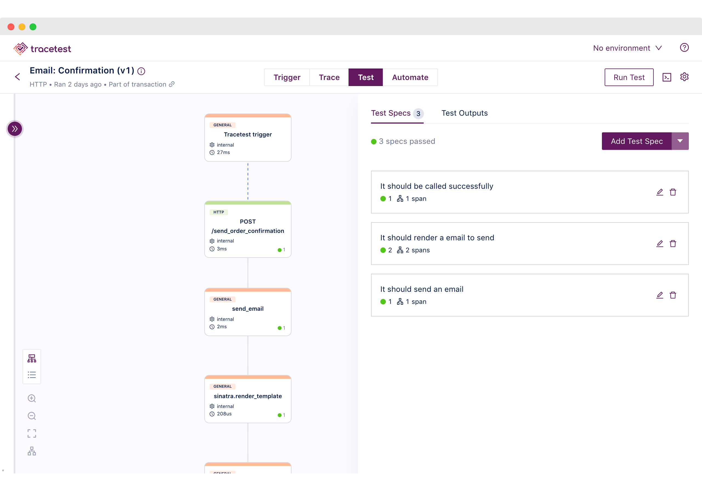

With contributions from [Adnan Rahić](https://github.com/adnanrahic) and
[Ken Hamric](https://github.com/kdhamric).

The [OpenTelemetry Demo](/ecosystem/demo/) is a system that simulates a
Telescope Shop, consisting of multiple microservices written in different
languages, each handling a specific capability of this distributed system. Its
purpose is to demonstrate how [OpenTelemetry](/) tools and SDKs can be used in
an application to obtain telemetry for monitoring results and even to
[track problems](/docs/demo/#scenarios) across multiple services.

One challenge when maintaining the demo is to add new features to the ecosystem
and guarantee that the current features and telemetry work as intended. Thinking
about this issue a few months ago, the OpenTelemetry Demo team
[started a discussion](https://github.com/open-telemetry/opentelemetry-demo/issues/873)
to prevent future system changes from having unwanted outcomes to the
microservices results and its telemetry. This resulted in
[adding trace-based tests to the demo](https://github.com/open-telemetry/opentelemetry-demo/pull/877).

This article describes how trace-based tests were added to the OpenTelemetry
demo. It discusses the challenges we faced while building it, the outcomes, and
how it can help the OpenTelemetry community test the demo and add features with
greater confidence.

## What is a trace-based test?

Trace-based testing is a type of testing that validates a system's behavior by
triggering an operation against the system and validating its result by checking
the system output with the emitted
[traces](/docs/concepts/signals/traces/) generated by the system during
this call.

This term was popularized by Ted Young in the talk
[Trace Driven Development: Unifying Testing and Observability](https://www.youtube.com/watch?v=NU-fTr-udZg)
at KubeCon North America 2018.

To perform a trace-based test, we execute an operation against the system, which
generates a trace, following these steps:

1. Trigger an operation against the system and collect its output and trace id
   generated from the operation;
2. Wait for the system to report the entire trace to the telemetry data store;
3. Collect the trace data generated by the system during the operation. This
   data should include timing information, as well as any errors or exceptions
   encountered.
4. Validate the operation output and the trace data by checking it against the
   expected results. This involves analyzing the trace data to ensure the system
   behaved as expected and the output was correct.
5. If the trace data does not match the expected results, the test should fail.
   With the trace data in hand, the developer can investigate the issue and make
   necessary changes to the system or the test.


These types of tests allow the testing of multiple components in distributed
systems simultaneously, ensuring that they work together correctly. It also
provides a way to test the system's behavior in response to real-world
conditions, such as failures or slow response times from external services.

## Creating trace-based tests for the OpenTelemetry Demo

In the OpenTelemetry Demo, we included trace-based tests to verify that system
changes do not result in unwanted outcomes in both the results and telemetry.
Our testing mainly focused on the services involved in the main workflow of the
system, which includes:

1. A user navigating to the shop;
2. Selecting a product;
3. Deciding to make a purchase;
4. And, completing the checkout process.

We structured two types of tests based on
[tests that currently exist in the demo](/docs/demo/tests/):

- Integration tests
- End-to-end tests

The tests are organized into 26 trace-based tests for 10 services, which can be
found
[here](https://github.com/open-telemetry/opentelemetry-demo/tree/main/test/tracetesting).
These trace-based tests in the `tracetesting` directory are ported from AVA and
Cypress and test both the operation outcome and the traces.

### Integration tests

The integration tests are based on [AVA](https://avajs.dev/) tests. In these
tests, we trigger endpoints in each microservice in the system, validate their
responses, and ensure that the resulting observability trace matches the
expected behavior.

One example is an
[integration test](https://github.com/open-telemetry/opentelemetry-demo/blob/main/test/tracetesting/currency-service/convert.yaml)
made against the
[currency service](https://github.com/open-telemetry/opentelemetry-demo/tree/main/src/currencyservice)
to check if the currency conversion operation is returning correctly. Here’s a
simplified YAML definition of the trace-based test:

```yaml
type: Test
spec:
  name: 'Currency: Convert'
  description: Convert a currency
  trigger:
    type: grpc
    grpc:
      protobufFile: {{protobuf file with CurrencyService definition}}
      address: {{currency service address}}
      method: oteldemo.CurrencyService.Convert
      request: |-
        {
            "from": {
              "currencyCode": "USD",
              "units": 330,
              "nanos": 750000000
            },
            "toCode": "CAD"
          }
  specs:
  - name: It converts from USD to CAD
    selector: span[name="CurrencyService/Convert" rpc.system="grpc"
            rpc.method="Convert" rpc.service="CurrencyService"]
    assertions:
    - attr:app.currency.conversion.from = "USD"
    - attr:app.currency.conversion.to = "CAD"
  - name: It has more nanos than expected
    selector: span[name="Test trigger"]
    assertions:
    - attr:response.body | json_path '$.nanos' >= 599380800
```

In the `trigger` section, we define which operation to trigger. In this case, a
call to the gRPC service with the method `oteldemo.CurrencyService.Convert` and
a given payload.

After that, in the `specs` section, we define which assertions to make against
the trace and the operation result.

We can see two types of assertions:

- The first assertion is against a trace
  [span](/docs/concepts/signals/traces/#spans) that the
  `CurrencyService` emitted. It checks if the service received a conversion
  operation from USD to CAD by checking if the
  [span attributes](/docs/concepts/signals/traces/#attributes)
  `app.currency.conversion.from` and `app.currency.conversion.to` have correct
  values;
- The second assertion is made on a trace span representing the operation
  output, where we check if the response body has an attribute `nanos` with a
  value less or equal to `599380800`.

### End-to-end tests

The end-to-end tests are based on front-end tests using
[Cypress](https://www.cypress.io/). We call the services through the API used by
the front end and check if the service interaction between them is correct. We
also verify if a trace is
[propagated](/docs/concepts/signals/traces/#context-propagation)
correctly through the services.

For these tests, we considered a scenario based on the main use case of the
demo: “_a user buying a product_” executed against the
[Front-end service](https://github.com/open-telemetry/opentelemetry-demo/tree/main/src/frontend)
APIs that execute the following operations:

- While entering the shop, the user sees:
  - Ads of shop products.
  - Recommendations of products suitable for them.
- The user opts to browse a product.
- Adds it to the shopping cart.
- Checks the cart to see if everything is correct.
- Finally complete the order, by using the checkout feature of the shopping
  cart, which will place an order, charge the user's credit card, ship the
  products and clean the shopping cart.

Since this test is a sequence of smaller tests, we created
[a transaction](https://github.com/open-telemetry/opentelemetry-demo/blob/main/test/tracetesting/frontend-service/all.yaml)
that defines the tests that will be run:

```yaml
type: Transaction
spec:
  name: 'Frontend Service'
  description: Run all Frontend tests enabled in sequence,
		simulating a process of a user purchasing products on the Astronomy store
  steps:
  - ./01-see-ads.yaml
  - ./02-get-product-recommendation.yaml
  - ./03-browse-product.yaml
  - ./04-add-product-to-cart.yaml
  - ./05-view-cart.yaml
  - ./06-checking-out-cart.yaml
```

In this sequence of tests, the last step, where the user does a checkout, is
interesting because it triggers due to the operation complexity. It coordinates
and triggers calls in almost all system services, as we can see in this Jaeger
screenshot of a trace for this operation:


In this operation, we can see inner calls to multiple services, like
[Frontend](https://github.com/open-telemetry/opentelemetry-demo/tree/main/src/frontend),
[CheckoutService](https://github.com/open-telemetry/opentelemetry-demo/tree/main/src/checkoutservice),
[CartService](https://github.com/open-telemetry/opentelemetry-demo/tree/main/src/cartservice),
[ProductCatalogService](https://github.com/open-telemetry/opentelemetry-demo/tree/main/src/productcatalogservice),
[CurrencyService](https://github.com/open-telemetry/opentelemetry-demo/tree/main/src/currencyservice),
and others.

This is a good scenario for a trace-based test where we can check if the output
is correct and the services called in this process are working correctly
together. We developed five groups of assertions, checking the main features
triggered during the checkout:

- _“The frontend has been called with success”_, checking the output of the test
  trigger;
- _“The order was placed”_, checking if the
  [CheckoutService](https://github.com/open-telemetry/opentelemetry-demo/tree/main/src/checkoutservice)
  was called and emitted spans correctly;
- _“The user was charged”_, checking if the
  [PaymentService](https://github.com/open-telemetry/opentelemetry-demo/tree/main/src/paymentservice)
  was called and emitted spans correctly;
- _“The product was shipped”_, checking if the
  [ShippingService](https://github.com/open-telemetry/opentelemetry-demo/tree/main/src/shippingservice)
  was called and emitted spans correctly;
- _“The cart was emptied”_, checking if the
  [CartService](https://github.com/open-telemetry/opentelemetry-demo/tree/main/src/cartservice)
  was called and emitted spans correctly.

The final result was the following test YAML, which triggers the Checkout
operation and validates these five groups of assertions:

```yaml
type: Test
spec:
  name: 'Frontend: Checking out shopping cart'
  description: Simulate user checking out shopping cart
  trigger:
    type: http
    httpRequest:
      url: http://{{frontend address}}/api/checkout
      method: POST
      headers:
      - key: Content-Type
        value: application/json
      body: |
        {
          "userId": "2491f868-88f1-4345-8836-d5d8511a9f83",
          "email": "someone@example.com",
          "address": {
            "streetAddress": "1600 Amphitheatre Parkway",
            "state": "CA",
            "country": "United States",
            "city": "Mountain View",
            "zipCode": "94043"
          },
          "userCurrency": "USD",
          "creditCard": {
            "creditCardCvv": 672,
            "creditCardExpirationMonth": 1,
            "creditCardExpirationYear": 2030,
            "creditCardNumber": "4432-8015-6152-0454"
          }
        }
  specs:
  - name: "The frontend has been called with success"
    selector: span[name="Test trigger"]
    assertions:
    - attr:response.status = 200
  - selector: span[name="oteldemo.CheckoutService/PlaceOrder" rpc.system="grpc"
            rpc.method="PlaceOrder" rpc.service="oteldemo.CheckoutService"]
    name: "The order was placed"
    assertions:
    - attr:app.user.id = "2491f868-88f1-4345-8836-d5d8511a9f83"
    - attr:app.order.items.count = 1
  - selector: span[name="oteldemo.PaymentService/Charge" rpc.system="grpc"
            rpc.method="Charge" rpc.service="oteldemo.PaymentService"]
    name: "The user was charged"
    assertions:
    - attr:rpc.grpc.status_code  =  0
    - attr:selected_spans.count >= 1
  - selector: span[name="oteldemo.ShippingService/ShipOrder" rpc.system="grpc"
            rpc.method="ShipOrder" rpc.service="oteldemo.ShippingService"]
    name: "The product was shipped"
    assertions:
    - attr:rpc.grpc.status_code = 0
    - attr:selected_spans.count >= 1
  - selector: span[name="oteldemo.CartService/EmptyCart" rpc.system="grpc"
            rpc.method="EmptyCart" rpc.service="oteldemo.CartService"]
    name: "The cart was emptied"
    assertions:
    - attr:rpc.grpc.status_code = 0
    - attr:selected_spans.count >= 1
```

Finally, when running these tests we have the following report, showing each
test file run in the transaction and also with the "Checkout” step described
above:

```text
✔  Frontend Service (http://tracetest-server:11633/transaction/frontend-all/run/1)
  ✔  Frontend: See Ads (http://tracetest-server: 11633/test/frontend-see-adds/run/1/test)
    ✔  It called the frontend with success and got a valid redirectUrl for each ads
    ✔  It returns two ads
  ✔  Frontend: Get recommendations (http://tracetest-server: 11633/test/frontend-get-recommendation/run/1/test)
    ✔  It called the frontend with success
    ✔  It called ListRecommendations correctly and got 5 products
  ✔  Frontend: Browse products (http://tracetest-server:11633/test/frontend-browse-product/run/1/test)
    ✔  It called the frontend with success and got a product with valid attributes
    ✔  It queried the product catalog correctly for a specific product
  ✔  Frontend: Add product to the cart (http://tracetest-server:11633/test/frontend-add-product/run/1/test)
    ✔  It called the frontend with success
    ✔  It added an item correctly into the shopping cart
    ✔  It set the cart item correctly on the database
  ✔  Frontend: View cart (http://tracetest-server:11633/test/frontend-view-cart/run/1/test)
    ✔  It called the frontend with success
    ✔  It retrieved the cart items correctly
  ✔  Frontend: Checking out shopping cart (http://tracetest-server: 11633/test/frontend-checkout-shopping-cart/run/1/test)
    ✔  It called the frontend with success
    ✔  The order was placed
    ✔  The user was charged
    ✔  The product was shipped
    ✔  The cart was emptied
```

## Running the tests and evaluating the OpenTelemetry Demo

With the completed test suite, run it by executing `make run-tracetesting` in
the demo. This will evaluate all services in the OpenTelemetry Demo.

During the development of the tests, we noticed some differences in the test
results. For example, some minor fixes were made to the Cypress tests, and some
behaviors were observed in the back-end APIs that can be tested and investigated
at a later time. You can find the details in
[this pull request](https://github.com/open-telemetry/opentelemetry-demo/pull/950)
and
[this discussion](https://github.com/open-telemetry/opentelemetry-demo/pull/905#discussion_r1207101535).

One curious case was the behavior of the
[EmailService](https://github.com/open-telemetry/opentelemetry-demo/tree/main/src/emailservice).
When building tests for the first time and calling it directly with the payload
provided by AVA tests, traces were generated for the service indicating success,
but with an HTTP `500` error, as can be seen in Jaeger.


However, running it as part of the checkout process it executed as expected, as
shown in this Jaeger screenshot:


What could have happened? By looking deeper at the telemetry and the code, we
found out that due to the nature of handling email templates on the Email
service, written in Ruby using the `snake_case` standard, instead of sending the
order details as `pascalCase` in `JSON`:

```json
{
  "email": "google@example.com",
  "order": {
    "orderId": "505",
    "shippingCost": {
      "currencyCode": "USD",
    },
        // ...
}
```

We should pass them as `snake_case`, which the Checkout service does correctly:

```json
{
  "email": "google@example.com",
  "order": {
    "order_id": "505",
    "shipping_cost": {
      "currency_code": "USD",
    },
    // ...
}
```

By doing that, we have a successful call to the service, and it evaluates
correctly as seen here:



This type of case is interesting because it could happen in other real-world
scenarios, and with the help of the tests and telemetry data, we were able to
pinpoint and solve it. In the case of
[this test](https://github.com/open-telemetry/opentelemetry-demo/blob/main/test/tracetesting/email-service/confirmation.yaml),
we opted out of using the same pattern as the Checkout service.

## Conclusion

This article discussed how trace-based tests were added to the OpenTelemetry
Demo to help ensure that changes to the system did not have unwanted outcomes on
the micro-services results and their telemetry.

With these tests, the OpenTelemetry community can add new features to the demo,
have an easy way to validate if other components did not suffer any unwanted
side effects, and still report telemetry correctly.

As a team building an open source observability tool, we value the opportunity
to contribute to the overall OpenTelemetry community. That's why we took action
on [the issue](https://github.com/open-telemetry/opentelemetry-demo/issues/873)
as soon as it was opened two months ago.
