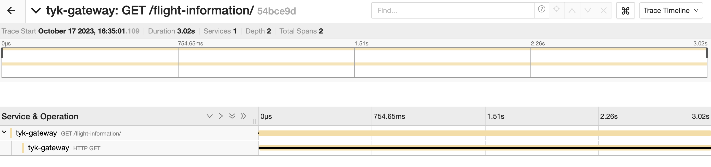
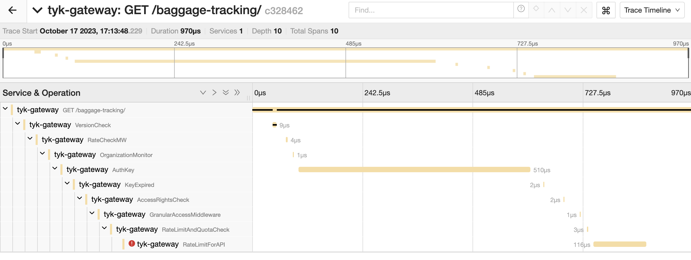

We're excited to announce that [Tyk API Gateway](https://github.com/TykTechnologies/tyk) has first-class support for OpenTelemetry, with native instrumentation built directly into the gateway. With Tyk's native OpenTelemetry support, developers and API platform teams get end-to-end observability into their API traffic, enabling faster troubleshooting and problem resolution.

## Why OpenTelemetry

API gateways, as the front-line proxies for APIs, play a crucial role in both the management and security of API traffic. A multitude of critical actions occur at the API gateway level. It is essential to monitor all requests, including those that never reach the upstream services because of rate-limiting rules, an authentication problem, or a caching mechanism. Collecting telemetry data at the API Gateway gives a clear entrance point and a complete picture of the journey of all the API consumers.

Before OpenTelemetry, Tyk Gateway already supported over 10 different formats for exporting metrics, logs, and traces. Maintaining this support demanded substantial engineering resources. OpenTelemetry streamlines this process, enabling a more efficient and standardized approach to collecting and exporting telemetry data. As a result, our users gain the flexibility to transmit their telemetry data to an even broader array of [observability tools and vendors](https://opentelemetry.io/ecosystem/vendors/).

We have now deprecated our support for OpenTracing in favor of OpenTelemetry for distributed tracing and plan to leverage OpenTelemetry to streamline the export of metrics and logs in the future.

## How to Integrate Tyk with OpenTelemetry

Starting with version 5.2, [Tyk API Gateway has native support for OpenTelemetry distributed tracing](https://tyk.io/docs/product-stack/tyk-gateway/advanced-configurations/distributed-tracing/open-telemetry/open-telemetry-overview/). Here is how to configure it, enable detailed tracing per API and instrumenting custom plugins.

### Enable OpenTelemetry at Gateway Level

Edit Tyk Gateway configuration file to enable OpenTelemetry support, like this:

{
  "opentelemetry": {
    "enabled": true
  }
}

You can also enable OpenTelemetry by setting the corresponding environment variable: TYK_GW_OPENTELEMETRY_ENABLED=TRUE.

By default, OpenTelemetry spans are exported using the gRPC protocol to localhost:4317. For more configuration options and default values, refer to the [documentation](https://tyk.io/docs/tyk-oss-gateway/configuration/#opentelemetry).

Tyk will export two spans: one for the total duration of the API call and one span for the call to the upstream service, as shown in the following screenshot from Jaeger. 

### Detailed tracing per APIs

Upon enabling OpenTelemetry at the gateway level, you gain the flexibility to activate detailed tracing for particular APIs. To do so, simply adjust the corresponding API definition and toggle the 'detailed_tracing' option to either 'true' or 'false.' The default value for this setting is 'false.'
With this configuration, Tyk will generate a span for every middleware operation carried out throughout the API request/response lifecycle. This includes actions like API version validation, authentication, authorization, rate limiting, and request and response transformation.

Here you can quickly spot an issue reported by the rate limiting middleware: 

### Instrumenting custom plugins with OpenTelemetry

Tyk supports the use of custom plugins (also called custom middleware) to extend its functionality, making it a highly flexible and customizable API gateway solution. This extensibility allows developers to tailor Tyk to their specific needs, whether it's for enhancing security, adding new authentication methods, integrating with third-party services, or implementing custom request/response transformations.

By instrumenting custom plugins with OpenTelemetry SDK or Tyk’s OpenTelemetry library implementation (wrapper of the OpenTelemetry SDK that all Tyk components are sharing for convenience), Tyk users can gain additional insights into their custom plugin behavior for better monitoring and quicker troubleshooting. More information in Tyk’s documentation: [OpenTelemetry Instrumentation in Go Plugins](https://tyk.io/docs/product-stack/tyk-gateway/advanced-configurations/plugins/otel-plugins/). 

## What's next?

Now that the [first stable release of OTel Go metric SDK has been announced](https://opentelemetry.io/blog/2023/otel-go-metrics-sdk-stable/), we will be investigating support for OpenTelemetry metrics. Stay tuned for updates and don't hesitate to [reach out on Tyk's community with any feedback](https://community.tyk.io/).
