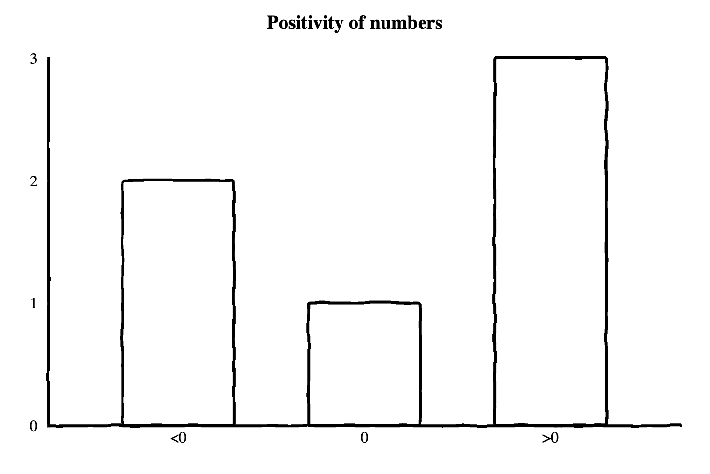

<i>Originally posted to
https://dyladan.me/histograms/2023/05/02/why-histograms/</i>

A histogram is a multi-value counter that summarizes the distribution of data points.
For example, a histogram may have 3 counters which count the
occurrences of negative, positive, and zero values respectively. Given a series
of numbers, `3`, `-9`, `7`, `6`, `0`, and `-1`, the histogram would count `2`
negative, `1` zero, and `3` positive values. A single histogram data point is
most commonly represented as a bar chart.

The above example has only 3 possible output values, but it is common to
have many more in a single histogram. A real-world application typically exports
a histogram every minute that summarizes a metric for the previous minute.
By using histograms this way, you can study how the distribution of your data changes over time.

## What are histograms for?

There are many uses for histograms, but their power comes from the ability to
efficiently answer queries about the distribution of your data. These queries
most commonly come in some form like "what was the median response time in the
last minute?" These are known as φ-quantiles, and often are abbreviated in a
shorthand like `p50` for the 50th percentile or 0.5-quantile, also known as the
median. More generally, the φ-quantile is the observation value that ranks at
number φ\*N among the N observations.

## Why are Histograms useful?

A common use-case for histograms in observability is defining
service level objectives (SLOs). One example of such an SLO might be ">=99% of
all queries should respond in less than 30ms," or "90% of all page loads should
become interactive within 100ms of first paint."

In the following chart, you can see the `p50`, `p90`, and `p99` response times
plotted for some requests over some time. From the data, you can see that 50% of
requests are served in around 20-30ms or less, 90% of requests are served in
under about 80ms, and 99% of requests are served in under around 90ms. You can
very quickly see that at least 50% of your users are receiving very fast
response times, but almost all of your users are experiencing response times
under 90ms.

## Other metric types

What if you're already defining SLOs based on other metrics?
You may have considered defining the SLOs to be based on gauges or counters.
This approach can work, but it requires defining your SLOs before understand your
data distribution and requires non-trivial implementation at collection time. It
is also inflexible; if you decide to change your SLO from 90% of requests to 99%
of requests, you have to make and release code changes, then wait for the old
data to age out and the new metric to collect enough data to make useful
queries. Because histograms model data as a distribution from start to finish,
they enable you to simply change your queries and get answers on the data you've
already collected. Particularly with exponential histograms, arbitrary
distribution queries can be made with very low relative error rates and minimal
resource consumption on both the client and the analysis backend.

The inflexibility of not using histograms for SLOs also impacts your ability to gauge impact
when your SLO is violated. For example, imagine you are collecting a gauge that
calculates the `p99` of some metric and you define an SLO based on it. When your
SLO is violated and an alert is triggered, how do you know it is really only
affecting 1% of queries, 10%, or 50%? A histogram allows you to answer that
question by querying the percentiles you're interested in. You could technically
collect additional gauges for each percentile, but that's just an ad-hoc reimplementation
of histograms anyways, so you're better off using histograms.

## Other data sources and metric types

You may ask why you would report a separate metric rather than calculating these
metrics from your existing log and trace data? While it is true that for _some_
use cases, like response times, this may be possible, it is not possible for
_all_ use cases. Even when percentiles can be calculated from existing data,
this typically requires querying a massive amount of data to answer a very
simple question. Further, if you are sampling your tracing and logs data, you
may be missing crucial information required to asses whether or not you are
meeting your SLOs.
