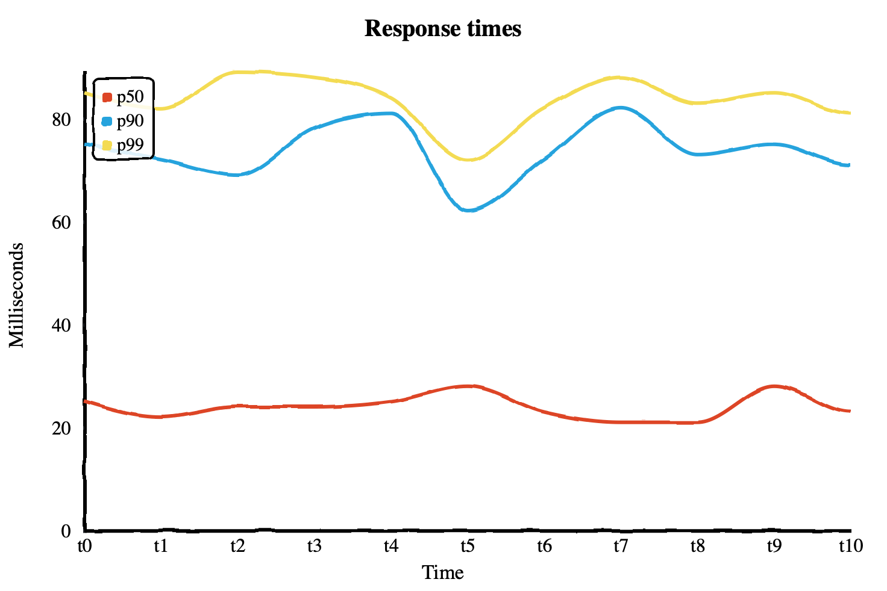

A histogram is a multi-value counter that summarizes the distribution of data
points. For example, a histogram may have 3 counters which count the occurrences
of negative, positive, and zero values respectively. Given a series of numbers,
`3`, `-9`, `7`, `6`, `0`, and `-1`, the histogram would count `2` negative, `1`
zero, and `3` positive values. A single histogram data point is most commonly
represented as a bar chart.

The above example has only 3 possible output values, but it is common to have
many more in a single histogram. A real-world application typically exports a
histogram every minute that summarizes a metric for the previous minute. By
using histograms this way, you can study how the distribution of your data
changes over time.

## What are histograms for?

There are many uses for histograms, but their power comes from the ability to
efficiently answer queries about the distribution of your data. These queries
most commonly come in some form like "what was the median response time in the
last minute?" These are known as φ-quantiles, and often are abbreviated in a
shorthand like `p50` for the 50th percentile or 0.5-quantile, also known as the
median. More generally, the φ-quantile is the observation value that ranks at
number φ\*N among the N observations.

## Why are Histograms useful?

A common use-case for histograms in observability is defining service level
objectives (SLOs). One example of such an SLO might be ">=99% of all queries
should respond in less than 30ms," or "90% of all page loads should become
interactive within 100ms of first paint."

In the following chart, you can see the `p50`, `p90`, and `p99` response times
plotted for some requests over some time. From the data, you can see that 50% of
requests are served in around 20-30ms or less, 90% of requests are served in
under about 80ms, and 99% of requests are served in under around 90ms. You can
very quickly see that at least 50% of your users are receiving very fast
response times, but almost all of your users are experiencing response times
under 90ms.

## Other metric types

What if you're already defining SLOs based on other metrics? You may have
considered defining the SLOs to be based on gauges or counters. This approach
can work, but it requires defining your SLOs before understanding your data
distribution and requires non-trivial implementation at collection time. It is
also inflexible; if you decide to change your SLO from 90% of requests to 99% of
requests, you have to make and release code changes, then wait for the old data
to age out and the new metric to collect enough data to make useful queries.
Because histograms model data as a distribution from start to finish, they
enable you to simply change your queries and get answers on the data you've
already collected. Particularly with exponential histograms, arbitrary
distribution queries can be made with very low relative error rates and minimal
resource consumption on both the client and the analysis backend.

The inflexibility of not using histograms for SLOs also impacts your ability to
gauge impact when your SLO is violated. For example, imagine you are collecting
a gauge that calculates the `p99` of some metric and you define an SLO based on
it. When your SLO is violated and an alert is triggered, how do you know it is
really only affecting 1% of queries, 10%, or 50%? A histogram allows you to
answer that question by querying the percentiles you're interested in.

Another option is to collect each quantile you're interested in as a gauge. Some
systems, like Prometheus, support this natively using a metric type sometimes
called a summary. Summaries can work, but they suffer the same inflexibility as
gauges and counters, requiring you to decide ahead of time which quantiles to
collect. They also cannot be aggregated, meaning that a `p90` cannot be
accurately calculated from two separate hosts each reporting their own `p90`.

## Other data sources and metric types

You may ask, "why would I report a separate metric rather than calculating it
from my existing log and trace data?" While it is true that for _some_ use
cases, like response times, this may be possible, it is not necessarily possible
for _all_ use cases. Even when quantiles can be calculated from existing data,
you may run into other problems. You need to be sure your observability backend
is able to query and analyze a large amount of existing data on-line or index
and analyze it at ingestion time. If you are sampling your logs and traces or
employing a data retention policy that ages data out, you need to be sure those
things are not affecting derived metrics, or that they are properly re-weighted,
or you risk not being able to accurately asses your SLOs. Depending on your
sampling strategy, it may not even be possible. Using histograms is a way to
avoid these subtle problems if they apply to you.

_A version of this article was [originally posted][] to the author's blog._

[originally posted]: {}
