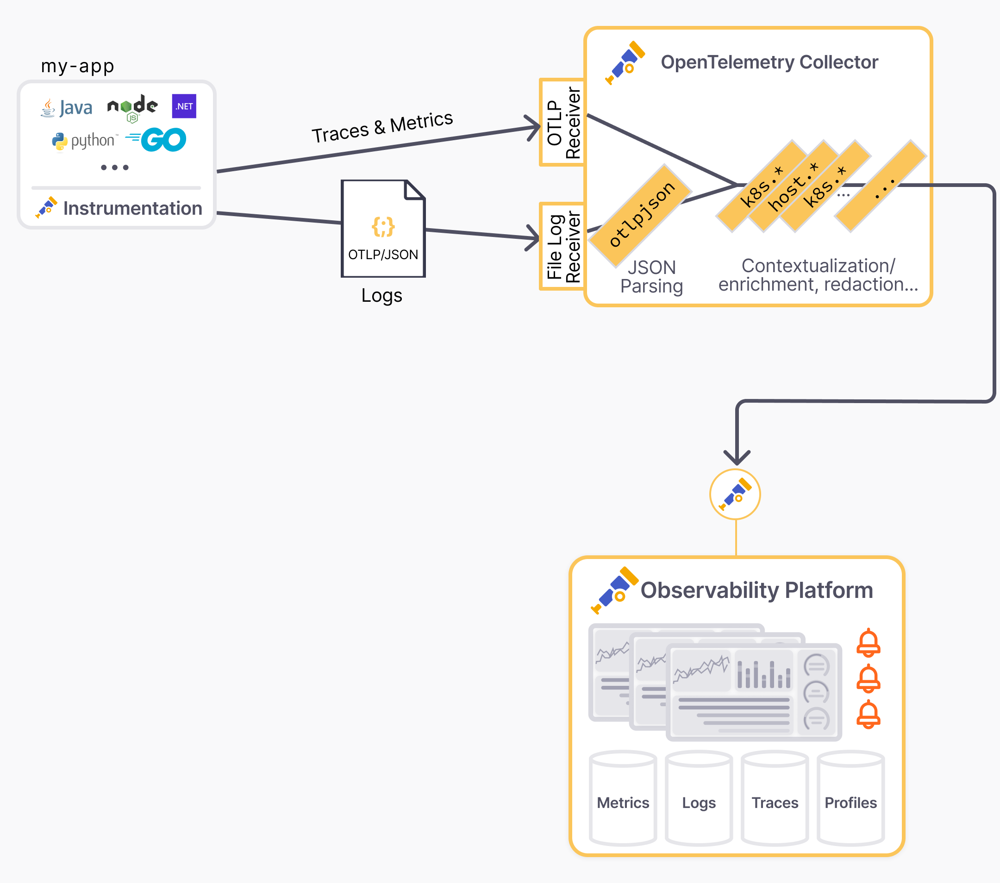

## Problem

The currently recommended way to send Java logs with OpenTelemetry is to use the OTLP protocol. However some use cases require outputting logs to files or stdout, due to organizational constraints or reliability practices that require usage of files for logs.

A common idea to collect logs centrally is to use existing unstructured logs, parse them with regular expressions, and enrich them with a few contextual attributes.

Regular expression parsing has turned out to be an anti-pattern because, even if the first steps are easy, the structuring of all the fields of log lines, including line break support for exceptions, and unplanned log format changes, proves to be very complicated and fragile. With unstructured logs and regular expressions, it's only a matter of time until parsing errors happen.

## Solution

Fortunately, the OpenTelemetry Java Instrumentation agent has just introduced a turnkey solution to convert logs from popular frameworks like SLF4J/Logback or Log4j2 into OTel compliant JSON logs on stdout with all the resource and logs attributes.

And by turnkey, we really mean it:

* No code or dependency changes in the code, just a few configurations changes that don't differ from typical of production deployment requirements  
* No complex field mapping in the log collector, just use the [OTLP/JSON connector](https://github.com/open-telemetry/opentelemetry-collector-contrib/tree/main/connector/otlpjsonconnector) to ingest the payload  
* Out of the box correlation between logs, traces, and metrics

## Reference architecture

The deployment architecture looks like the following:



## Set by step setup

Steps

* There is nothing to change in the code, continue to use your favorite logging library including getting the best of templated logs, mapped diagnostic context, and structured logging.

```java
Logger logger = org.slf4j.LoggerFactory.getLogger(MyClass.class);
...
MDC.put("customerId", cusomerId);

logger.info("Order {} successfully placed", orderId);

logger.atInfo().
   .addKeyValue("orderId", orderId)
   .addKeyValue("outcome", "success")
   .log("placeOrder");
```

* Export the logs captured by the OTel Java instrumentation to stdout using the OTel JSON format (aka [OTLP/JSON](https://opentelemetry.io/docs/specs/otlp/#json-protobuf-encoding))

```bash
# Tested with opentelemetry-javaagent v2.10.0

export OTEL_LOGS_EXPORTER="experimental-otlp/stdout"
```

* Activate the auto instrumentation of the logging framework with the desired contextual attributes  by the OTel Java auto instrumentation (configuration parameters [for Logback](https://github.com/open-telemetry/opentelemetry-java-instrumentation/tree/main/instrumentation/logback/logback-appender-1.0/javaagent), [for Log4j](https://github.com/open-telemetry/opentelemetry-java-instrumentation/tree/main/instrumentation/log4j/log4j-appender-2.17/javaagent)). Note that the logging framework instrumentation configuration flags are optional but strongly recommended.

```bash
# Tested with opentelemetry-javaagent v2.10.0
#
# Details on -Dotel.logback-appender.* params on documentation page:
# https://github.com/open-telemetry/opentelemetry-java-instrumentation/tree/main/instrumentation/logback/logback-appender-1.0/javaagent

java -javaagent:/path/to/opentelemetry-javaagent.jar \
     -Dotel.instrumentation.logback-appender.experimental-log-attributes=true \
     -Dotel.instrumentation.logback-appender.experimental.capture-key-value-pair-attributes=true \
     -Dotel.instrumentation.logback-appender.experimental.capture-mdc-attributes=* \
     -jar /path/to/my-app.jar

```

* Launch the Java application and verify that OTLP/JSON logs are outputted to stdout

```json
{"resourceLogs":[{"resource":{"attributes":[{"key":"deployment.environment.name","value":{"stringValue":"staging"}},{"key":"service.instance.id","value":{"stringValue":"6ad88e10-238c-4fb7-bf97-38df19053366"}},{"key":"service.name","value":{"stringValue":"checkout"}},{"key":"service.namespace","value":{"stringValue":"shop"}},{"key":"service.version","value":{"stringValue":"1.1"}}]},"scopeLogs":[{"scope":{"name":"com.mycompany.checkout.CheckoutServiceServer$CheckoutServiceImpl","attributes":[]},"logRecords":[{"timeUnixNano":"1730435085776869000","observedTimeUnixNano":"1730435085776944000","severityNumber":9,"severityText":"INFO","body":{"stringValue":"Order order-12035 successfully placed"}, "attributes":[{"key":"customerId","value":{"stringValue":"customer-49"}},{"key":"thread.id","value":{"intValue":"44"}},{"key":"thread.name","value":{"stringValue":"grpc-default-executor-1"}}],"flags":1,"traceId":"42de1f0dd124e27619a9f3c10bccac1c","spanId":"270984d03e94bb8b"}]}],"schemaUrl":"https://opentelemetry.io/schemas/1.24.0"}]}
```

* Configure the OpenTelemetry Collector to ingest the OTLP/JSON logs:


Source: [https://www.otelbin.io/s/69739d790cf279c203fc8efc86ad1a876a2fc01a](https://www.otelbin.io/s/69739d790cf279c203fc8efc86ad1a876a2fc01a)

```yaml
# tested with otelcol-contrib v0.112.0

receivers:
  filelog/otlp-json-logs:
    # start_at: beginning # for testing purpose, use "start_at: beginning"
    include: [/path/to/my-app.otlpjson.log]
  otlp:
    protocols:
      grpc:
      http:

processors:
  batch:
  resourcedetection:
    detectors: ["env", "system"]
    override: false

connectors:
  otlpjson:

service:
  pipelines:
    logs/raw_otlpjson:
      receivers: [ filelog/otlp-json-logs ]
      # (i) no need for processors before the otlpjson connector
      # Declare processors in the shared "logs" pipeline below
      processors: []
      exporters: [otlpjson]
    logs:
      receivers: [otlp, otlpjson]
      # TODO change processors if needed
      processors: [resourcedetection, batch]
      # TODO remove "debug" for production deployments
      exporters: [otlphttp, debug]
    # TODO add "traces" and "metrics" pipelines

exporters:
  debug:
    verbosity: detailed
  # Exporter to the OTLP backend like `otlphttp`
  otlphttp:
```

* Verify the logs collected by the OTel Collector checking the output of the OTel Collector Debug exporter

```log
2024-11-01T10:03:31.074+0530	info	Logs	{"kind": "exporter", "data_type": "logs", "name": "debug", "resource logs": 1, "log records": 1}
2024-11-01T10:03:31.074+0530	info	ResourceLog #0
Resource SchemaURL: https://opentelemetry.io/schemas/1.24.0
Resource attributes:
     -> deployment.environment.name: Str(staging)
     -> service.instance.id: Str(6ad88e10-238c-4fb7-bf97-38df19053366)
     -> service.name: Str(checkout)
     -> service.namespace: Str(shop)
     -> service.version: Str(1.1)
ScopeLogs #0
ScopeLogs SchemaURL:
InstrumentationScope com.mycompany.checkout.CheckoutServiceServer$CheckoutServiceImpl
LogRecord #0
ObservedTimestamp: 2024-11-01 04:24:45.776944 +0000 UTC
Timestamp: 2024-11-01 04:24:45.776869 +0000 UTC
SeverityText: INFO
SeverityNumber: Info(9)
Body: Str(Order order-12035 successfully placed)
Attributes:
     -> customerId: Str(cust-12345)
     -> thread.id: Int(44)
     -> thread.name: Str(grpc-default-executor-1)
Trace ID: 42de1f0dd124e27619a9f3c10bccac1c
Span ID: 270984d03e94bb8b
Flags: 1
	{"kind": "exporter", "data_type": "logs", "name": "debug"}
```

* Verify the logs in the OpenTelemetry backend  
* After this end to end ingestion pipeline works, don't forget to:
  * Make the OTel Collector configuration production ready including removing the "debug" exporter from the "logs" pipeline  
  * Disable the file and console exporters of the application logging framework (e.g. `logback.xml`) while continuing to use the logging configuration to filter logs: the OTel Java agent will output JSON logs in stdout, stop emitting them through the logging framework. However, keep using the logging framework config to specify the log levels

```xml
<!-- tested with logback-classic v1.5.11 -->
<configuration>
  <logger name="com.example" level="debug"/>
  <root level="info">
    <!-- No appender as the OTel Agent emits otlpjson logs through stdout -->
   <!-- 
      IMPORTANT enable a console appender to troubleshoot cases were 
      logs are missing in the OTel backend
    -->
  </root>
</configuration>
```

## How to implement this when apps output logs to stdout on Kubernetes or Docker

Supporting Kubernetes and Container specifics requires a standard parsing step in the pipeline without specific mapping configuration.

* Introduce the OTel Collector File Log Receiver's [`container`](https://github.com/open-telemetry/opentelemetry-collector-contrib/blob/main/pkg/stanza/docs/operators/container.md) parser to handle containers logging specifics  
  * Replace `<<namespace>>`, `<<pod_name>>`, and `<<container_name>>` by the desired values or use a broader [glob pattern](https://pkg.go.dev/v.io/v23/glob) like `*`

```yaml
receivers:
  filelog/otlp-json-logs:
    # start_at: beginning # for testing purpose, use "start_at: beginning"
    include: [/var/log/pods/<<namespace>>_<<pod_name>>_*/<<container_name>>/]
    include_file_path: true       
    operators:
    - type: container
      add_metadata_from_filepath: true

  otlp:
    protocols:
      grpc:
      http:

processors:
  batch:
  resourcedetection:
    detectors: ["env", "system"]
    override: false

connectors:
  otlpjson:

service:
  pipelines:
    logs/raw_otlpjson:
      receivers: [ filelog/otlp-json-logs ]
      # (i) no need for processors before the otlpjson connector
      # Declare processors in the shared "logs" pipeline below
      processors: []
      exporters: [otlpjson]
    logs:
      receivers: [otlp, otlpjson]
      # TODO change processors if needed
      processors: [resourcedetection, batch]
      # TODO remove "debug" for production deployments
      exporters: [otlphttp, debug]
    # TODO add "traces" and "metrics" pipelines

exporters:
  debug:
    verbosity: detailed
  # Exporter to the OTLP backend like `otlphttp`
  otlphttp:

```

