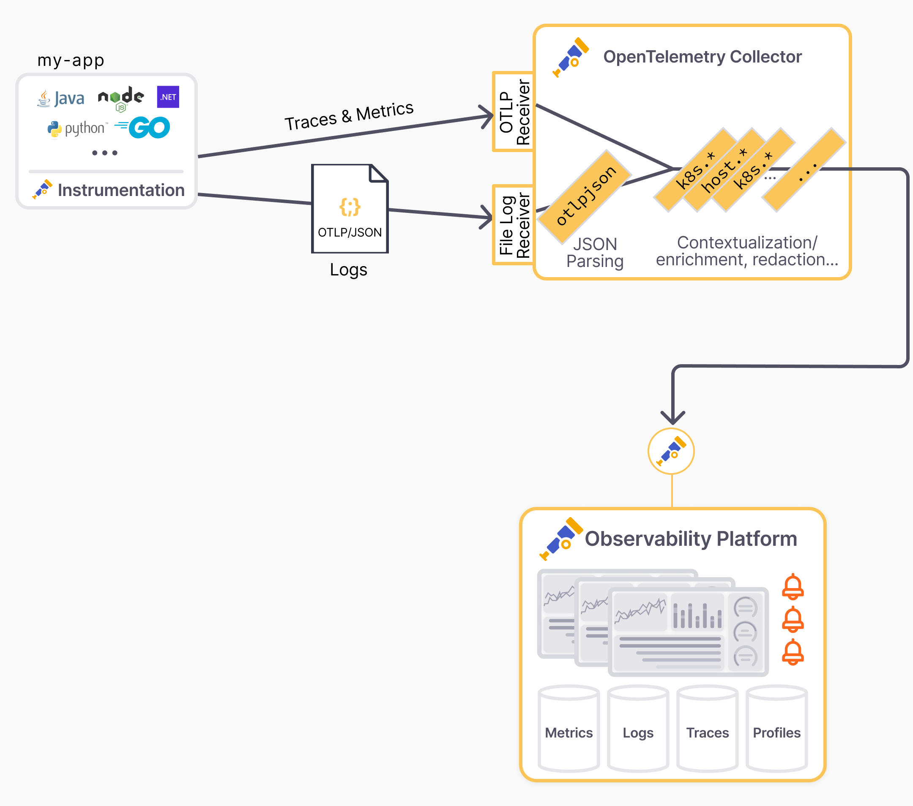

If you want to get logs from your Java application ingested into an
OpenTelemetry-compatible logs backend, the easiest and recommended way is using
an OpenTelemetry protocol (OTLP) exporter. However, some scenarios require logs
to be output to files or stdout due to organizational or reliability needs.

A common approach to centralize logs is to use unstructured logs, parse them
with regular expressions, and add contextual attributes.

However, regular expression parsing is problematic. They become complex and
fragile quickly when handling all log fields, line breaks in exceptions, and
unexpected log format changes. Parsing errors are inevitable with this method.

## Native solution for Java logs

The OpenTelemetry Java Instrumentation agent and SDK now offer an easy solution
to convert logs from frameworks like SLF4J/Logback or Log4j2 into OTel-compliant
JSON logs on stdout with all resource and log attributes.

This is a true turnkey solution:

- No code or dependency changes, just a few configuration adjustments typical
  for production deployment.
- No complex field mapping in the log collector. Just use the
  [OTLP/JSON connector](https://github.com/open-telemetry/opentelemetry-collector-contrib/tree/main/connector/otlpjsonconnector)
  to ingest the payload.
- Automatic correlation between logs, traces, and metrics.

This blog post shows how to set up this solution step by step.

- In the first part, we'll show how to configure the Java application to output
  logs in the OTLP/JSON format.
- In the second part, we'll show how to configure the OpenTelemetry Collector to
  ingest the logs.
- Finally, we'll show a Kubernetes-specific setup to handle container logs.



## Configure Java application to output OTLP/JSON logs

{}

Blog post instructions can easily get outdated. In case of issues, check this
[sample application deployed on Kubernetes](https://github.com/open-telemetry/opentelemetry-java-examples/blob/main/logging-k8s-stdout-otlp-json/README.md),
which is continuously updated and tested against the latest versions.

{}

No code changes needed. Continue using your preferred logging library, including
templated logs, mapped diagnostic context, and structured logging.

```java
Logger logger = org.slf4j.LoggerFactory.getLogger(MyClass.class);
...
MDC.put("customerId", customerId);

logger.info("Order {} successfully placed", orderId);

logger.atInfo().
   .addKeyValue("orderId", orderId)
   .addKeyValue("outcome", "success")
   .log("placeOrder");
```

Export the logs captured by the OTel Java instrumentation to stdout using the
OTel JSON format (aka [OTLP/JSON](/docs/specs/otlp/#json-protobuf-encoding)).
Configuration parameters for
[Logback](https://github.com/open-telemetry/opentelemetry-java-instrumentation/tree/main/instrumentation/logback/logback-appender-1.0/javaagent)
and
[Log4j](https://github.com/open-telemetry/opentelemetry-java-instrumentation/tree/main/instrumentation/log4j/log4j-appender-2.17/javaagent)
are optional but recommended.

```bash
# Tested with opentelemetry-javaagent v2.10.0
#
# Details on -Dotel.logback-appender.* params on documentation page:
# https://github.com/open-telemetry/opentelemetry-java-instrumentation/tree/main/instrumentation/logback/logback-appender-1.0/javaagent

java -javaagent:/path/to/opentelemetry-javaagent.jar \
     -Dotel.logs.exporter=experimental-otlp/stdout \
     -Dotel.instrumentation.logback-appender.experimental-log-attributes=true \
     -Dotel.instrumentation.logback-appender.experimental.capture-key-value-pair-attributes=true \
     -Dotel.instrumentation.logback-appender.experimental.capture-mdc-attributes=* \
     -jar /path/to/my-app.jar
```

The `-Dotel.logs.exporter=experimental-otlp/stdout` JVM argument and the
environment variable `OTEL_LOGS_EXPORTER="experimental-otlp/stdout"` can be used
interchangeably.

{}

The OTLP logs exporter is experimental and subject to change. Check the
[Specification PR](https://github.com/open-telemetry/opentelemetry-specification/pull/4183)
for the latest updates.

{}

Verify that OTLP/JSON logs are outputted to stdout. The logs are in the
OTLP/JSON format, with a JSON object per line. The log records are nested in the
`resourceLogs` array. Example:

<details>
  <summary> <code>{"resourceLogs":[{"resource" ...}]}</code> </summary>

```json
{
  "resourceLogs": [
    {
      "resource": {
        "attributes": [
          {
            "key": "deployment.environment.name",
            "value": {
              "stringValue": "staging"
            }
          },
          {
            "key": "service.instance.id",
            "value": {
              "stringValue": "6ad88e10-238c-4fb7-bf97-38df19053366"
            }
          },
          {
            "key": "service.name",
            "value": {
              "stringValue": "checkout"
            }
          },
          {
            "key": "service.namespace",
            "value": {
              "stringValue": "shop"
            }
          },
          {
            "key": "service.version",
            "value": {
              "stringValue": "1.1"
            }
          }
        ]
      },
      "scopeLogs": [
        {
          "scope": {
            "name": "com.mycompany.checkout.CheckoutServiceServer$CheckoutServiceImpl",
            "attributes": []
          },
          "logRecords": [
            {
              "timeUnixNano": "1730435085776869000",
              "observedTimeUnixNano": "1730435085776944000",
              "severityNumber": 9,
              "severityText": "INFO",
              "body": {
                "stringValue": "Order order-12035 successfully placed"
              },
              "attributes": [
                {
                  "key": "customerId",
                  "value": {
                    "stringValue": "customer-49"
                  }
                },
                {
                  "key": "thread.id",
                  "value": {
                    "intValue": "44"
                  }
                },
                {
                  "key": "thread.name",
                  "value": {
                    "stringValue": "grpc-default-executor-1"
                  }
                }
              ],
              "flags": 1,
              "traceId": "42de1f0dd124e27619a9f3c10bccac1c",
              "spanId": "270984d03e94bb8b"
            }
          ]
        }
      ],
      "schemaUrl": "https://opentelemetry.io/schemas/1.24.0"
    }
  ]
}
```

</details>

## Configure the Collector to ingest the OTLP/JSON logs



```yaml
# tested with otelcol-contrib v0.112.0

receivers:
  filelog/otlp-json-logs:
    # start_at: beginning # for testing purpose, use "start_at: beginning"
    include: [/path/to/my-app.otlpjson.log]
  otlp:
    protocols:
      grpc:
      http:

processors:
  batch:
  resourcedetection:
    detectors: ['env', 'system']
    override: false

connectors:
  otlpjson:

service:
  pipelines:
    logs/raw_otlpjson:
      receivers: [filelog/otlp-json-logs]
      # (i) no need for processors before the otlpjson connector
      # Declare processors in the shared "logs" pipeline below
      processors: []
      exporters: [otlpjson]
    logs:
      receivers: [otlp, otlpjson]
      processors: [resourcedetection, batch]
      # remove "debug" for production deployments
      exporters: [otlphttp, debug]

exporters:
  debug:
    verbosity: detailed
  # Exporter to the OTLP backend like `otlphttp`
  otlphttp:
```

Verify the logs collected by the OTel Collector by checking the output of the
OTel Collector Debug exporter:

```log
2024-11-01T10:03:31.074+0530	info	Logs	{"kind": "exporter", "data_type": "logs", "name": "debug", "resource logs": 1, "log records": 1}
2024-11-01T10:03:31.074+0530	info	ResourceLog #0
Resource SchemaURL: https://opentelemetry.io/schemas/1.24.0
Resource attributes:
     -> deployment.environment.name: Str(staging)
     -> service.instance.id: Str(6ad88e10-238c-4fb7-bf97-38df19053366)
     -> service.name: Str(checkout)
     -> service.namespace: Str(shop)
     -> service.version: Str(1.1)
ScopeLogs #0
ScopeLogs SchemaURL:
InstrumentationScope com.mycompany.checkout.CheckoutServiceServer$CheckoutServiceImpl
LogRecord #0
ObservedTimestamp: 2024-11-01 04:24:45.776944 +0000 UTC
Timestamp: 2024-11-01 04:24:45.776869 +0000 UTC
SeverityText: INFO
SeverityNumber: Info(9)
Body: Str(Order order-12035 successfully placed)
Attributes:
     -> customerId: Str(cust-12345)
     -> thread.id: Int(44)
     -> thread.name: Str(grpc-default-executor-1)
Trace ID: 42de1f0dd124e27619a9f3c10bccac1c
Span ID: 270984d03e94bb8b
Flags: 1
     {"kind": "exporter", "data_type": "logs", "name": "debug"}
```

Verify the logs in the OpenTelemetry backend.

After the pipeline works end-to-end, ensure production readiness:

- Remove the `debug` exporter from the `logs` pipeline in the OTel Collector
  configuration.
- Disable file and console exporters in the logging framework (for example,
  `logback.xml`) but keep using the logging configuration to filter logs. The
  OTel Java agent will output JSON logs to stdout.

```xml
<!-- tested with logback-classic v1.5.11 -->
<configuration>
  <logger name="com.example" level="debug"/>
  <root level="info">
    <!-- No appender as the OTel Agent emits otlpjson logs through stdout -->
    <!--
      IMPORTANT enable a console appender to troubleshoot cases where
      logs are missing in the OTel backend
    -->
  </root>
</configuration>
```

## Configure an OpenTelemetry Collector in Kubernetes to handle container logs

To support Kubernetes and container specifics, add the built-in
[`container`](https://github.com/open-telemetry/opentelemetry-collector-contrib/blob/main/pkg/stanza/docs/operators/container.md)
parsing step in the pipeline without needing specific mapping configuration.

Replace `<<namespace>>`, `<<pod_name>>`, and `<<container_name>>` with the
desired values or use a broader [glob pattern](https://pkg.go.dev/v.io/v23/glob)
like `*`.

```yaml
receivers:
  filelog/otlp-json-logs:
    # start_at: beginning # for testing purpose, use "start_at: beginning"
    include: [/var/log/pods/<<namespace>>_<<pod_name>>_*/<<container_name>>/]
    include_file_path: true
    operators:
      - type: container
        add_metadata_from_filepath: true

  otlp:
    protocols:
      grpc:
      http:

processors:
  batch:
  resourcedetection:
    detectors: ['env', 'system']
    override: false

connectors:
  otlpjson:

service:
  pipelines:
    logs/raw_otlpjson:
      receivers: [filelog/otlp-json-logs]
      # (i) no need for processors before the otlpjson connector
      # Declare processors in the shared "logs" pipeline below
      processors: []
      exporters: [otlpjson]
    logs:
      receivers: [otlp, otlpjson]
      processors: [resourcedetection, batch]
      # remove "debug" for production deployments
      exporters: [otlphttp, debug]

exporters:
  debug:
    verbosity: detailed
  # Exporter to the OTLP backend like `otlphttp`
  otlphttp:
```

## Conclusion

This blog post showed how to collect file-based Java logs with OpenTelemetry.
The solution is easy to set up and provides a turnkey solution for converting
logs from frameworks like SLF4J/Logback or Log4j2 into OTel-compliant JSON logs
on stdout with all resource and log attributes. This JSON format is certainly
verbose, but it generally has minimal impact on performances and offers a solid
balance by providing highly contextualized logs that can be correlated with
traces and metrics.

If any of the steps are unclear or you encounter issues, check this
[sample application deployed on Kubernetes](https://github.com/open-telemetry/opentelemetry-java-examples/blob/main/logging-k8s-stdout-otlp-json/README.md),
which is continuously updated and tested against the latest versions.

Any feedback or questions? Reach out on
[GitHub](https://github.com/open-telemetry/opentelemetry-specification/pull/4183)
or on [Slack](/community/#develop-and-contribute) (`#otel-collector`).
