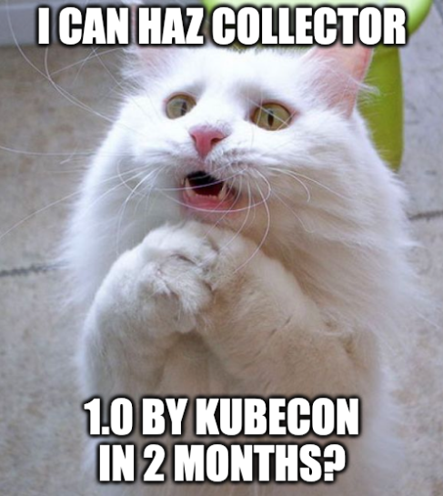

The OpenTelemetry Collector is a very popular component in OpenTelemetry that
has been under heavy development for quite some time. It is a binary that allows
many formats of telemetry to be sent to it, transformed, and emitted to a
destination. Much has been said about the Collector over the past few years in
various blog posts and talks. Here's a small list of talks about the Collector
if you haven't had the chance to learn about it:

- [Connected Observability Pipelines in the OpenTelemetry Collector](https://www.youtube.com/watch?v=uPpZ23iu6kI)
- [Telemetry Showdown: Fluent Bit Vs. OpenTelemetry Collector](https://www.youtube.com/watch?v=ykq1F_3PmJw)
- [OpenTelemetry Collector Deployment Patterns](https://www.youtube.com/watch?v=WhRrwSHDBFs)

The Collector has been a core component for organizations looking to adopt
OpenTelemetry as part of their strategy to improve the telemetry emitted by
their systems. Organizations around the world have already adopted it and
successfully process large amounts of data through pipelines as documented by
these various talks:

- [Adopting OpenTelemetry Collector @ eBay - Swapping Engines Mid Flight - Vijay Samuel , eBay](https://www.youtube.com/watch?v=tZJd6W-CIcU)
- [Ingesting 6.5 Tb of Telemetry Data Daily Through OpenTelemetry Protocol and Coll... Gustavo Pantuza](https://www.youtube.com/watch?v=aDysORX1zIs)
- [Today, Not Tomorrow: Scalable Strategies for Migrating to Open... Jason Anderson & Kevin Broadbridge](https://www.youtube.com/watch?v=iPGd9_aYu-A)
- [How and Why You Should Adopt and Expose OSS Interfaces Like OTel... - Daniel Hrabovcak & Shishi Chen](https://www.youtube.com/watch?v=D71fK2MFreI)
- [Why, How to, and Issues: Tail-Based Sampling in the OpenTelemetry Collector - Reese Lee, New Relic](https://www.youtube.com/watch?v=l4PeclHKl7I)

A few months ago, there was an
[ask from the community](https://github.com/open-telemetry/community/issues/1971)
to declare the OpenTelemetry Collector stable.

Now you might be asking yourself "Why would anyone want the Collector to be
declared stable? You just told me it's already used in production!" It's true,
the Collector and it's configuration has been fairly stable for core components
for some time. The release of the Collector v1 will signal that the
OpenTelemetry community is ready to provide long term support and not introduce
backwards incompatible changes without bumping the major version. This enables
organizations where the use of the Collector is not possible today due to
policies around using beta software to consider adopting it. Additionally, it
helps the community move along some of the work needed that will help its
graduation process in the CNCF.

The request to stabilize was met with pushback from maintainers since calling
anything 1.0 has a way of setting expectations indefinitely. This lead to a
series of discussions and meetings that brought together the maintainers of the
Collector to decide on what a 1.0 really means for the Collector.

And after a lot of back and forth, we decided on a limited scope of what we
wanted to focus on, which is a distribution of the Collector that only includes
an OTLP receiver and an OTLP exporter. It was also decided that individual Go
modules that the Collector components rely upon must also be marked as stable.
Aside from this, there were a few areas the contributors wanted to improve based
on user feedback:

- The telemetry generated by the Collector about itself:
  - Traces, metrics, and logs must be available via OTLP.
  - The configuration for the telemetry must follow the configuration schema.
- The scalability of the Collector:
  - Handling for queueing, back pressure, and errors must be improved.
  - Clear benchmarks and performance expectations for end users.
- Overall documentation.

The
[roadmap](https://github.com/open-telemetry/opentelemetry-collector/blob/main/docs/ga-roadmap.md)
was published in the Collector's repository and milestones were created to track
the work underway. To ensure the effort can be successful, the scope of the
deliverable was limited to provide:

- a clear and achievable goal
- the focus needed to not get distracted
- a signal to new contributors of where the project is focusing

There is much to do as you can see on the
[project board](https://github.com/orgs/open-telemetry/projects/83), but there
is a lot of excitement around this effort. If you're keen on helping, reach out
either by commenting on any of the open issues in GitHub, or attending the
Collector SIG call on that happens weekly on Wednesdays. For a quick overview
of the 1.0 progress you can checkout the tracking [issue](https://github.com/open-telemetry/opentelemetry-collector/issues/9375).
