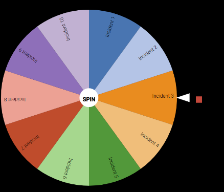

---
title:
  "Making observability fun: How we increased engineers' confidence in incident
  management using a game"
linkTitle: Skyscanner using OTel Demo
date: 2024-02-22
author: >-
  [Jordi Bisbal Ansaldo](https://github.com/jordibisbal8) (Skyscanner)
---

At [Skyscanner](https://www.skyscanner.net), as in many organisations, teams
tend to follow specific runbooks for individual failure modes. With modern and
complex distributed systems, this has the downside of most of the errors being
unknowns, which makes runbooks practically useless.

After migrating our telemetry data to the OpenTelemetry standards at Skyscanner,
we now have richer instrumentation and can rely on observability directly. As a
result, we are ready to adopt a new
[observability mindset](https://charity.wtf/2019/09/20/love-and-alerting-in-the-time-of-cholera-and-observability/),
which requires training our engineers to work effectively with the new
ecosystem. This allows them to react efficiently to any known or unknown issues,
even under pressure.

To achieve this, we believe that the best way to gain knowledge isn’t through
one-time viewings of documents or videos. Instead, it’s through practical
exercises that include situations with never-before-seen (or at least rarely
seen) problems. This helps the company reduce the time to mitigate an issue
(TTM), which starts when a first responder acknowledges the incident, until
users stop suffering from the incident.

## Environment

To begin with, we need to set up an environment that demonstrates the best
practices for monitoring and debugging using OpenTelemetry instrumentation and
observability. For this, we propose the use of the official
[OpenTelemetry Demo](/docs/demo/), which is a realistic example of a distributed
system called Astronomy Shop. Thanks to the
[OpenTelemetry Protocol](/docs/specs/otlp/) (OTLP), it allows us to simply point
the standard OTLP exporter in the Collector to
[New Relic](https://newrelic.com/), our chosen observability platform at
Skyscanner which, like other platforms, is fully embracing open standards to
ingest telemetry data.

This system contains regressions that can be injected into the platform and
helps us demonstrate the importance of Service Levels Objectives (SLOs),
tracing, logs, metrics, etc. For instance, we can observe traffic flow through
various components, as shown in the image below. Since part of the OpenTelemetry
ecosystem is open source, we can easily introduce any new features that will be
reviewed by OpenTelemetry contributors.

## Observability game day

Once the environment is set up, we can introduce the Observability Game Day, an
initiative based on the Wheel of Misfortune practices that Google uses and
describes in the [Site Reliability Engineering book](https://sre.google/books/).

This game simulates a production incident, where a moderator known as the game
master (GM) conducts the session and someone from the audience spins the wheel
and explains an incident or outage. The participants are then divided into teams
and tasked with identifying and resolving the issue as quickly as possible. If
the solution is not optimal, the GM can help by introducing a new tool or view,
which gives a different perspective on how to tackle the incident (knowledge
sharing). This exercise can be repeated multiple times for different incidents.

## Results

The Observability Game Day has already been completed by multiple Skyscanner
teams, where each team observability expert (ambassador) runs the session. The
participants have given extremely positive feedback, where 90% of the responders
say that after the Game Day, they feel more confident debugging production
systems and would love to have further sessions.

- Hugely valuable to run against real services and to compare and contrast
  different debugging methods. I'm certain everyone, regardless of skill level,
  will have got something out of the session - I know I did! Thank you for
  taking the time to set this up and promoting it for us -
  [Dominic Fraser](https://github.com/dominicfraser) (Senior Software Engineer)
- It is a really great (company-wide) initiative to get people upskilled in
  observability and OpenTelemetry/New Relic and I personally found it very
  useful, as well as a lot of fun! :D - Polly Yankova (Software Engineer)

In addition, we learned that:

1. OTLP makes it incredibly simple to integrate a standard application with an
   observability vendor. Just point it to the right endpoint and job done.
2. Our teams relied primarily on tracing data to analyse regressions that helped
   them understand the root cause faster. Tracing FTW!
3. Our front-end engineers found the Game Day lacked focus on client-side
   observability, so we decided to contribute upstream (see next steps below).
   This was my first contribution to the project, and it was a great experience!
   Maintainers were very welcoming and helped me to test and release. Thanks!

## Next steps

The next action is to run sessions for the entire company and convert them into
a Skyscanner learning course. This way, the content can be used during the
onboarding process for new joiners or even reviewed at any time as a refresher
for those who have been in the company longer. In addition, after observing
common feedback, we identified that it would be beneficial to extend the current
incidents to include more front-end-specific ones, such as incidents triggered
by browser traffic. To achieve this, we have contributed to the OpenTelemetry
Demo and enabled these features for other interested parties. For more
information, please have a look at the
[raised PR](https://github.com/open-telemetry/opentelemetry-demo/pull/1345).
