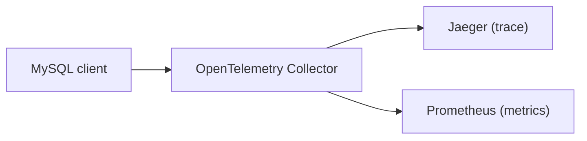
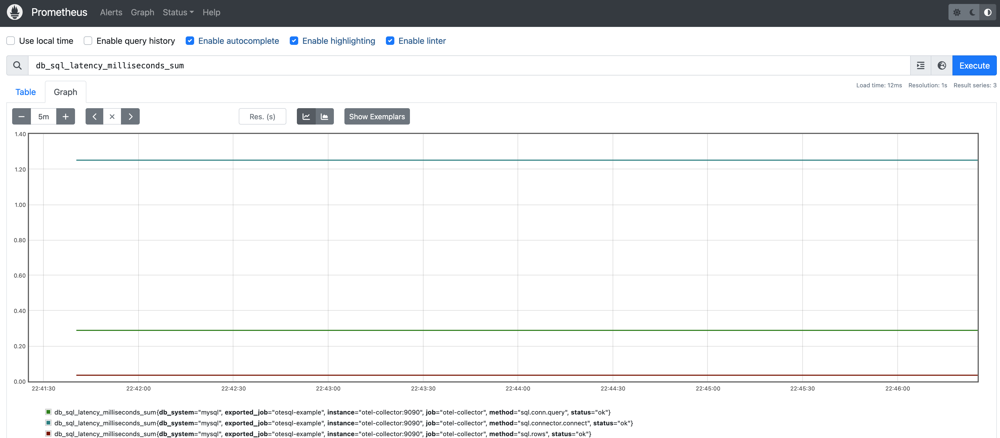
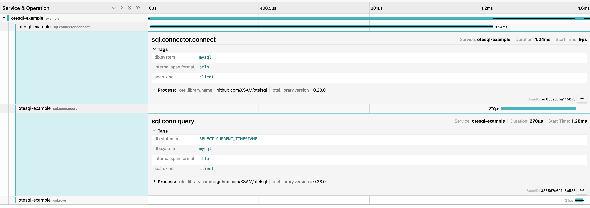
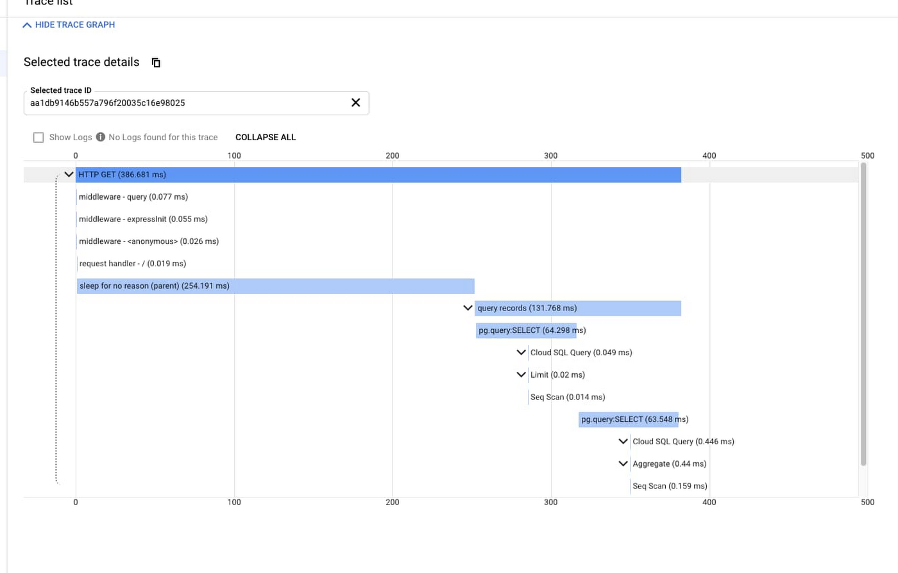

---
title:
  Getting started with otelsql, the OpenTelemetry instrumentation for Go SQL
linkTitle: Getting Started with otelsql
date: 2024-03-04
author: '[Sam Xie](https://github.com/XSAM) (Cisco)'
---

[otelsql](https://github.com/XSAM/otelsql) is an instrumentation library for the
[`database/sql`](https://pkg.go.dev/database/sql) library of the Go programming
language. It generates traces and metrics from the application when interacting
with databases. By doing that, the library allows you to identify errors or
slowdowns in your SQL queries that potentially impact the performance of your
application.

Let's go dive into how to use this library!

## Getting Started

otelsql is a wrapper layer for interfaces from `database/sql`. When users use
the wrapped database interfaces, the otelsql generates the telemetry data and
passes operations to the underlying database.

In the following example, you are going to use
[Docker Compose](https://docs.docker.com/compose/) to run the otel-collector
example from the otelsql repository. This example uses a MySQL client with the
otelsql instrumentation. The telemetry it generates will be pushed to the
OpenTelemetry Collector. Then, it shows the trace data on Jaeger and the metrics
data on a Prometheus server.

Here is the data flow:



Let's clone the otelsql repository here and run the example and take a look at
the most important lines of code.

```sh
git clone https://github.com/XSAM/otelsql.git
```

In the otelsql folder, you can also check out the git tag to `v0.29.0` (the
latest tag while writing this post) to ensure the example is runnable, as the
steps to run the example might be changed in the future.

```sh
git checkout tags/v0.29.0
```

Let's go to the folder of the otel-collector example and bring up all services.

```sh
cd example/otel-collector
docker compose up -d
```

After building images and running services, let's check the service logs to
ensure the SQL client is finished.

```sh
docker compose logs client
```

Then, we can access the Jaeger UI at [localhost:16686](http://localhost:16686)
and the Prometheus UI at [localhost:9090](http://localhost:9090) to see the
results.

Here we are viewing a trace graph on Jaeger. We can see the duration and
parameters of each operation with the database.


Here we are viewing the metric `db_sql_latency_milliseconds_sum` on Prometheus.



More otelsql generated metrics options can be found on the
[otelsql document](https://github.com/XSAM/otelsql/blob/main/README.md#metric-instruments).

## Understand the example

Let's look at the `docker-compose.yaml` file first.

```yaml
version: '3.9'
services:
  mysql:
    image: mysql:8.3
    environment:
      - MYSQL_ROOT_PASSWORD=otel_password
      - MYSQL_DATABASE=db
    healthcheck:
      test:
        mysqladmin ping -h 127.0.0.1 -u root --password=$$MYSQL_ROOT_PASSWORD
      start_period: 5s
      interval: 5s
      timeout: 5s
      retries: 10

  otel-collector:
    image: otel/opentelemetry-collector-contrib:0.91.0
    command: ['--config=/etc/otel-collector.yaml']
    volumes:
      - ./otel-collector.yaml:/etc/otel-collector.yaml
    depends_on:
      - jaeger

  prometheus:
    image: prom/prometheus:v2.45.2
    volumes:
      - ./prometheus.yaml:/etc/prometheus/prometheus.yml
    ports:
      - 9090:9090
    depends_on:
      - otel-collector

  jaeger:
    image: jaegertracing/all-in-one:1.52
    ports:
      - 16686:16686

  client:
    build:
      dockerfile: $PWD/Dockerfile
      context: ../..
    depends_on:
      mysql:
        condition: service_healthy
```

This Docker compose file contains five services. The `client` service is the
MySQL client built from Dockerfile and the source code is main.go in the example
folder. The `client` service runs after the `mysql` service is up. Then, it
initializes the OpenTelemetry client and otelsql instrumentation, make SQL
queries to the `mysql` service, and send metrics and trace data to
`otel-collector` service through the
[OpenTelemetry Protocol (OTLP)](/docs/specs/otel/protocol/).

After receiving the data, the `otel-collector` service transfers the data format
and send metrics data to the `prometheus` service, and send trace data to the
`jaeger` service.

Let's check `main.go` to see what happens in the `client` service. Here is the
main function.

```go
func main() {
	ctx, cancel := signal.NotifyContext(context.Background(), os.Interrupt)
	defer cancel()

	conn, err := initConn(ctx)
	if err != nil {
		log.Fatal(err)
	}

	shutdownTracerProvider, err := initTracerProvider(ctx, conn)
	if err != nil {
		log.Fatal(err)
	}
	defer func() {
		if err := shutdownTracerProvider(ctx); err != nil {
			log.Fatalf("failed to shutdown TracerProvider: %s", err)
		}
	}()

	shutdownMeterProvider, err := initMeterProvider(ctx, conn)
	if err != nil {
		log.Fatal(err)
	}
	defer func() {
		if err := shutdownMeterProvider(ctx); err != nil {
			log.Fatalf("failed to shutdown MeterProvider: %s", err)
		}
	}()

	db := connectDB()
	defer db.Close()

	err = runSQLQuery(ctx, db)
	if err != nil {
		log.Fatal(err)
	}

	fmt.Println("Example finished")
}
```

This `main` function is pretty straightforward. It initializes a connection with
the `otel-collector` service, which is used by the tracer provider and the meter
provider. Then, it configures the tracer provider and meter provider with the
`connection` and a shutdown method, which ensures the telemetry data can be
pushed to the `otel-collector` service correctly before exiting the application.
After finishing setting up the OpenTelemetry client, it invokes the `connectDB`
method to use the otelsql library to interact with the MySQL database. Let's
look at the details here.

```go
func connectDB() *sql.DB {
	// Connect to database
	db, err := otelsql.Open("mysql", mysqlDSN, otelsql.WithAttributes(
		semconv.DBSystemMySQL,
	))
	if err != nil {
		log.Fatal(err)
	}

	// Register DB stats to meter
	err = otelsql.RegisterDBStatsMetrics(db, otelsql.WithAttributes(
		semconv.DBSystemMySQL,
	))
	if err != nil {
		log.Fatal(err)
	}
	return db
}
```

Instead of using the [`sql.Open`](https://pkg.go.dev/database/sql#Open) method
that Go provides, we use
[`otelsql.Open`](https://pkg.go.dev/github.com/XSAM/otelsql#Open) to create an
[`sql.DB`](https://pkg.go.dev/database/sql#DB) instance. The `sql.DB` instance
returned by `otelsql.Open` is a wrapper that transfers and instruments all DB
operations to the underlying `sql.DB` instance (created by `sql.Open`). When
users send SQL queries with this wrapper, `otelsql` can see the queries and use
the OpenTelemetry client to generate telemetry.

Besides using `otelsql.Open`, `otelsql` provides three additional ways to
initialize instrumentation: `otelsql.OpenDB`, `otelsql.Register`, and
`otelsql.WrapDriver`. These additional methods cover different use cases, as
some database drivers or frameworks don't provide a direct way to create
`sql.DB`. Sometimes, you might need these additional methods to manually create
a `sql.DB` and push it to those database drivers. You can check
[examples on the otelsql document](https://pkg.go.dev/github.com/XSAM/otelsql#pkg-examples)
to learn how to use these methods.

Moving on, we use `otelsql.RegisterDBStatsMetrics` to register metrics data from
`sql.DBStats`. The metrics recording process runs in the background and updates
the value of the metric when needed after the registration, so we don't need to
worry about creating an individual thread for this.

After having an `sql.DB` wrapped by `otelsql`, we can use it to make queries.

```go
func runSQLQuery(ctx context.Context, db *sql.DB) error {
	// Create a parent span (Optional)
	tracer := otel.GetTracerProvider()
	ctx, span := tracer.Tracer(instrumentationName).Start(ctx, "example")
	defer span.End()

	err := query(ctx, db)
	if err != nil {
		span.RecordError(err)
		return err
	}
	return nil
}

func query(ctx context.Context, db *sql.DB) error {
	// Make a query
	rows, err := db.QueryContext(ctx, `SELECT CURRENT_TIMESTAMP`)
	if err != nil {
		return err
	}
	defer rows.Close()

	var currentTime time.Time
	for rows.Next() {
		err = rows.Scan(&currentTime)
		if err != nil {
			return err
		}
	}
	fmt.Println(currentTime)
	return nil
}
```

This `runSQLQuery` method creates a parent span first (it is an optional step,
it makes the query spans have a parent, and it looks good on the trace graph),
then queries the current timestamp from the MySQL database.

After this method, the `client` application finishes and exits. They are the
most important lines of code for understanding the example.

## Use the example as a playground

After understanding the example, we can use it as a playground, making it a bit
complicated to see how it will be used in a real-world scenario.

Use the following codes to replace the `runSQLQuery` method in the example.

```go
func runSQLQuery(ctx context.Context, db *sql.DB) error {
    // Create a parent span (Optional)
    tracer := otel.GetTracerProvider()
    ctx, span := tracer.Tracer(instrumentationName).Start(ctx, "example")
    defer span.End()

    runSlowSQLQuery(ctx, db)

    err := query(ctx, db)
    if err != nil {
        span.RecordError(err)
        return err
    }
    return nil
}

func runSlowSQLQuery(ctx context.Context, db *sql.DB) {
    db.QueryContext(ctx, `SELECT SLEEP(1)`)
}
```

This time, we added a new query to the example, which is a slow query that would
take 1 second to return. Let's see what could happen and how to identify this
slow query.

To make this change work, we need to rebuild the `client` service.

```sh
docker compose build client
docker compose up client
```

After the client is finished, we can check the trace graph for the trace we just
generated on Jaeger.



From this graph, we know the entire example takes 1 second to complete. The root
cause of this slowness is not related to the network latency with the database
and the timestamp query. It is the `SELECT SLEEP(1)` query that leads to the
slowness.

You can also learn about the slowness from the aggregated statistics of the
database by metrics. Such is the observability otelsql can provide so you can
learn what your application is doing with the database.

## Compatibility

You might worry about the compatibility issue with other databases and other
third-party database frameworks (like ORMs) and wonder how widely this
instrumentation can be used.

From an implementation perspective, as long as the database drivers or the
database frameworks interact with the database (any database, not just an SQL
database) through `database/sql` with context, `otelsql` should work just fine.

This is an
[example](https://github.com/ent/ent/issues/1232#issuecomment-1200405070) that
shows how otelsql works with Facebook's entity framework for Go.

## Other cool features

Now that you've experienced the main feature, let's take some time to explore
the other cool features `otelsql` provides.

### Sqlcommenter support

otelsql integrates [Sqlcommenter](https://google.github.io/sqlcommenter), an
open source ORM auto-instrumentation library that merges with OpenTelemetry by
injecting a comment into SQL statements to enable context propagation for the
database.

Using the option `WithSQLCommenter`, otelsql injects a comment for every SQL
statement it instruments.

For instance, an SQL query sent to the database

```sql
SELECT * from FOO
```

becomes

```sql
SELECT * from FOO /*traceparent='00-4bf92f3577b34da6a3ce929d0e0e4736-00f067aa0ba902b7-01',tracestate='congo%3Dt61rcWkgMzE%2Crojo%3D00f067aa0ba902b7'*/
```

Then the database that supports `Sqlcommenter` can record its operation for this
query with a specified trace and publish its trace spans to a trace store, so
you can see your application trace spans correlated with query trace spans from
the database in one place.



> Picture coming from
> [google cloud document](https://cloud.google.com/blog/products/databases/sqlcommenter-merges-with-opentelemetry).

### Custom span name

If you don't like the default span name, you can use
`otelsql.WithSpanNameFormatter` to customize the span name.

Here is the example usage:

```go
otelsql.WithSpanNameFormatter(func(ctx context.Context, method otelsql.Method, query string) string {
    return string(method) + ": " + query
})
```

Then, the span name could become `{method}: {query}`. Here is an example of the
span name:

```text
sql.conn.query: select current_timestamp
```

### Filter spans

You can use `otelsql.SpanFilter` from `otelsql.SpanOptions` to filter out spans
you don't want to generate. It is useful when you want to discard some spans.

## What's next?

You should now be able to apply what you have learned from this blog post to
your own installation of otelsql.

I would love to hear about your experience! Star `otelsql` if you find it
helpful! If you run into any problems, don't hesitate to
[reach out](https://github.com/XSAM/otelsql?tab=readme-ov-file#communication) or
[create an issue](https://github.com/XSAM/otelsql/issues).
