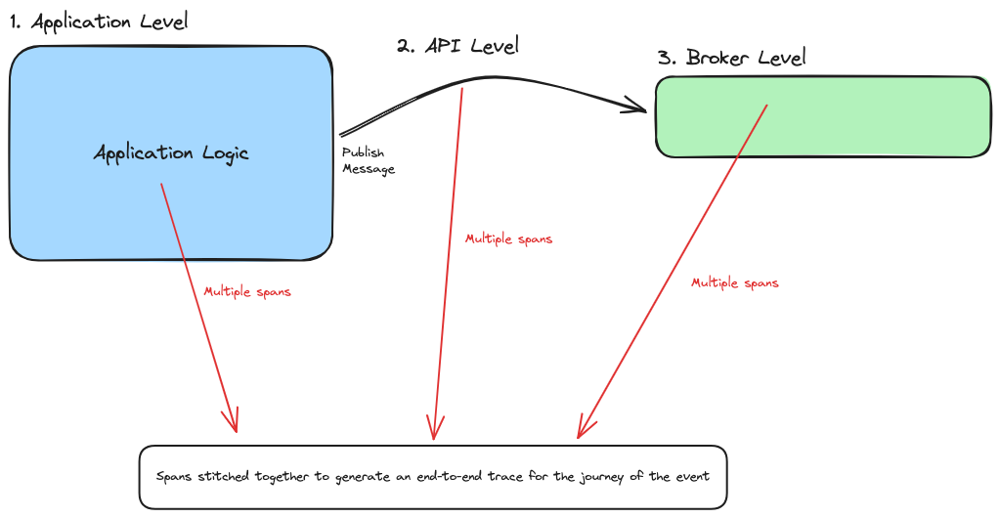
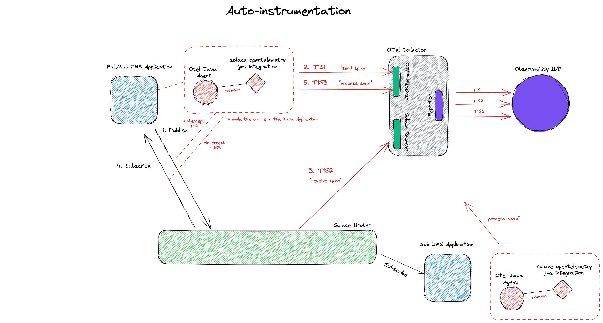

In basic terms, an Event Driven Architecture (EDA) is a distributed system composed of moving data and events between microservices in an asynchronous manner with an **event broker** acting as the central nervous system in the overall architecture. It is a software design pattern in which decoupled applications can asynchronously publish and subscribe to events via an event broker.

In an increasingly event-driven world, enterprises are deploying more messaging middleware solutions comprised of networks message broker nodes. These networks route event-related messages between applications in disparate physical locations, clouds or even geographies. As the enterprises grow in size and maturity in their EDA deployment, it gets more and more challenging to diagnose problems simply by troubleshooting an error message or looking at a log. This is where **Distributed Tracing** comes for the rescue by providing system administrators observability and the ability to trace the lifecycle of an event as it travels between microservices, different API calls, and hops within event brokers through the entire [Event Mesh](https://solace.com/what-is-an-event-mesh/?utm_source=web&utm_medium=referral&utm_id=cncf_2023&utm_content=blog)

## Problem Statement

To achieve full observability in any system, there is one very important assumption that needs to be satisfied: every component in the system MUST be able to generate information about whats happening with it and its interaction with other components. So, a transactional event that is composed of multiple hops between different systems and/or interfaces would require the release of trace information on every hop from every interface. A missing step in trace generation means an incomplete picture in the lifecycle of the transactional event. Pretty straight forward. However, complexity knocks on the door when dealing with event brokers in an EDA system. 

To understand why it's complex to instrument event broker, lets take a look at the three levels at which traces can be collected in a distributed event-driven system:

1. **Application level** - during business logic execution within the context of the microservice
1. **API level** - during communication between other components and services; whether its synchronous REST or asynchronous Event call 
1. **Event broker level** - at every hop inside the event mesh and _inside_ the event broker. 



As the business evolves in both scale and routing sophistication, it becomes more critical to have visibility into exactly how messages are being processed by the underlying message brokering topology. Without observability at the broker / routing tier, here are some questions an enterprise can not answer:

- Where are messages routed - point to point, across geographies and regions, or from on-premises to cloud?
- Are messages processed successfully?
- How does message processing track against key metrics and performance indicators?
- Are messages delayed by insufficient resources?
- What type of messages end up in an error state due to misrouting, permissions, content, or lack of storage?
- How do messages get tracked against other business or regulatory requirements - eg., geographical data sovereignty, data residency requirements, sensitive data exposure, time to process, etc?

## Where does OpenTelemetry fit within EDA Systems?

As the industry standard and vendor- and tool-agnostic framework for managing telemetry data, OpenTelemetry is the defacto goto for answering all observability related questions in the overall architecture. And in the spirit of adding more observability to the system, EDA needs OTel to solve mysteries to answer the previous questions and get a better idea on where things went wrong or needs to be improved within the path of the transactional event.

The OpenTelemetry ecosystem has reached a high level of maturity for tools and processes that generate and collect trace information at the **Application** and **API** levels. With that being said, there are still some gaps in the industry when it comes to collecting metrics from event brokers in event-driven systems on the **Event Broker** level. As stated in the semantic conventions for messaging spans in the OTel [documentation](../../../docs/specs/semconv/messaging/messaging-spans/), messaging systems are note standardized, and so, there are vendor specific customization on how to deal with trace generation from within the system. The design of event broker technologies have not historically supported OTel natively _within_ the broker, hence, leaving the broker component in the EDA system as a "Black Box" where the limits of instrumentation with a message broker is reached along the boundaries of the broker: message in and message out.

As mentioned earlier, to achieve complete visibility in a distributed EDA system, every component needs to generate trace information to the OTel collector including the message broker. To support tracing within the OTel collector and the broker, a dedicated receiver in the collector needs to translate messaging specific activities to telemetry data. To demonstrate how the messaging component in an EDA system could be instrumented, I will be using the Solace PubSub+ Event Broker as an example for the rest of the article

## Enabling Tracing on The Broker Level

The [Solace PubSub+ Event Broker](https://docs.solace.com/Software-Broker/SW-Broker-Set-Up/Setting-Up-SW-Brokers.htm?utm_source=web&utm_medium=referral&utm_id=cncf_2023&utm_content=blog) is an advanced event broker that enables real-time high-performance messaging in an EDA system running in cloud,
on-premises, and hybrid environments. In an effort to bridge the observability gap within the event broker in an EDA system, Solace has [native support in the OTel Collector](https://docs.solace.com/Features/Distributed-Tracing/Distributed-Tracing-Receiver.htm?utm_source=web&utm_medium=referral&utm_id=cncf_2023&utm_content=blog) through a solace receiver. As applications start publishing and consuming guaranteed messages to and from the Solace PubSub+ Event Broker, spans are generated from the Application and API level using OTel SDK libraries and from the broker reflecting every hop inside the broker and within the event mesh. Activities such as enqueuing from publishing, dequeuing from consuming, and acknowledgment will generate spans that are consumed by the OTel collector and processed. 


The above diagram shows the basic components of Distributed Tracing for a single Solace PubSub+ Event Broker:

1. **Application client program**

This is any piece of software that communicates with the Solace PubSub+ Event Broker via the Solace messaging protocol or any of the standard messaging protocols within the supported languages and messaging protocols.

2. **Distributed Tracing-enabled Solace PubSub+ Event Broker**

The core Solace PubSub+ Event Broker with an activated Distributed Tracing functionality

3. **The Contrib distribution of the OpenTelemetry Collector**

A version of the OpenTelemetry Collector that contains the Solace Receiver.

4. **OpenTelemetry-compliant observability Back-end**

An observability tool/product that consumes OpenTelemetry traces (eg., Jaeger, DataDog, Dynatrace, etc.)

Thanks to the standardization of trace messages using the OpenTelemetry Protocol (OTLP), after the spans are received by the Solace Receiver on the OTel collector, they are processed to standardized OTel trace messages and passed to exporters. The exporter is a component in the collector that supports sending data to the backend observability system of choice. We can now get more visibility of the lifecycle of a transactional event in an EDA system as it propagates through the event broker(s) and the different queues within.

Note that once a single Solace PubSub+ Event Broker is configured for Distributed Tracing, this same configuration can be utilized for every Event Broker you connect within an Event Mesh.

## Instrumenting using an agent: Auto-instrumentation

For Java based applications, it is common practice to dynamically inject telemetry information for any call an Application does without the need to manually change business logic by simply running an agent alongside the application. This approach is known as [automatic instrumentation](../../../docs/instrumentation/java/automatic/) and is used to capture telemetry information at the "edges" of a microservice. More details on how to download the java agent can be found [here](https://github.com/open-telemetry/opentelemetry-java-instrumentation/releases)

After installing the java agent, run the solace producing application as follows

```sh
java -javaagent:<absolute_path_to_the_jar_file>/opentelemetry-javaagent.jar \
-Dotel.javaagent.extensions=<absolute_path_to_the_jar_file>/solace-opentelemetry-jms-integration-1.1.0.jar \
-Dotel.propagators=solace_jms_tracecontext \
-Dotel.exporter.otlp.endpoint=http://localhost:4317 \
-Dotel.traces.exporter=otlp \
-Dotel.metrics.exporter=none \
-Dotel.instrumentation.jms.enabled=true \
-Dotel.resource.attributes="service.name=SolaceJMSPublisher" \
-Dsolace.host=localhost:55557 \
-Dsolace.vpn=default \
-Dsolace.user=default \
-Dsolace.password=default \
-Dsolace.topic=solace/tracing \
-jar solace-publisher.jar
```

Similarly, run the consuming application as follows

```sh
java -javaagent:<absolute_path_to_the_jar_file>/opentelemetry-javaagent.jar \
-Dotel.javaagent.extensions=<absolute_path_to_the_jar_file>/solace-opentelemetry-jms-integration-1.1.0.jar \
-Dotel.propagators=solace_jms_tracecontext \
-Dotel.traces.exporter=otlp \
-Dotel.metrics.exporter=none \
-Dotel.instrumentation.jms.enabled=true \
-Dotel.resource.attributes="service.name=SolaceJMSQueueSubscriber" \
-Dsolace.host=localhost:55557 \
-Dsolace.vpn=default \
-Dsolace.user=default \
-Dsolace.password=default \
-Dsolace.queue=q \
-Dsolace.topic=solace/tracing \
-jar solace-queue-receiver.jar
```

What happens behind the scenes is when an application uses the JMS Java API to publish or subscribe on a Solace PubSub+ Event Broker, the OTel Java Agent intercepts the call with the help of the solace otel JMS integration extension and generates spans to the OTLP receiver in the OTel collector. This generates spans on the **API level**. **Broker level** spans are generated from the Solace PubSub+ Event Broker upon arrival of message on the broker after it's enqueued on a queue. Further broker specific spans are generated and received by the Solace receiver in the collector and processed into OTel specific format. All the generated spans from the different steps are then exported to the configured exported and stitched for further processing.

The following figure illustrates the details on the inner working of the Java auto-instrumentation Agent:



The advantages of such an approach is that the java auto-instrumentation agent takes care of span generation on the API level without the need of code changes or application business logic configuration. The drawbacks to this approach however is as a developer and system administrator you can not add further customization on the different spans generated to get a more detailed picture on what's happening in the business logic of the microservice

## Instrumenting using an SDK: Manual-instrumentation

In some cases, developers want to have more control on when spans are generated and what attributes are included in the span during the business logic of the microservice, and hence, generating **Application level** traces. This is done via using the OTel SDK and broker specific APIs that supports span generation and context propagation. 

Developers can interact with the Solace PubSub+ Event Broker through APIs in multiple languages. In the following example, I will be using the latest Java API for the Solace Messaging Platform, also known as _JCSMP_, which has support for span generation and context propagation for distributed tracing. For a publishing application to support manual instrumentation directly from the business logic, the following needs to be done: 

1. Import the opentelemetry and solace libraries for context propagation 

```java
import com.solace.messaging.trace.propagation.SolaceJCSMPTextMapGetter;
import com.solace.messaging.trace.propagation.SolaceJCSMPTextMapSetter;
import com.solace.samples.util.JcsmpTracingUtil;
import com.solace.samples.util.SpanAttributes;
import com.solacesystems.jcsmp.*;
import io.opentelemetry.api.trace.Span;
import io.opentelemetry.api.trace.SpanKind;
import io.opentelemetry.api.trace.StatusCode;
import io.opentelemetry.context.Scope;
import io.opentelemetry.context.propagation.TextMapPropagator;
import io.opentelemetry.context.Context;
```

2. Extract message context, if it exists, before injecting any new context to the message

```java
final SolaceJCSMPTextMapGetter getter = new SolaceJCSMPTextMapGetter();
final Context extractedContext = JcsmpTracingUtil.openTelemetry.getPropagators().getTextMapPropagator()
                        .extract(Context.current(), message, getter);

```

3. Set the extracted context as the current context of a created span and add any attributes you want to the generated span
```java
final Span sendSpan = JcsmpTracingUtil.tracer
                      .spanBuilder(SERVICE_NAME + " " + SpanAttributes.MessagingOperation.SEND)
                      .setSpanKind(SpanKind.CLIENT)
                      .setAttribute(SpanAttributes.MessagingAttribute.DESTINATION_KIND.toString(),
                              SpanAttributes.MessageDestinationKind.TOPIC.toString())
                      .setAttribute(SpanAttributes.MessagingAttribute.IS_TEMP_DESTINATION.toString(), "true")
                      //Set more attributes as needed
                      .setAttribute("myKey", "myValue" + ThreadLocalRandom.current().nextInt(1, 3))
                      .setParent(extractedContext) // set extractedContext as parent
                      .startSpan();
```

4. Inject the new context to the message
```java
final SolaceJCSMPTextMapSetter setter = new SolaceJCSMPTextMapSetter();
final TextMapPropagator propagator = JcsmpTracingUtil.openTelemetry.getPropagators().getTextMapPropagator();
propagator.inject(Context.current(), message, setter);
```

5. Send the message to the Solace Broker

```java
producer.send(message, topic);
```

Thats it! The following figure illustrates the details on how manual instrumentation is achieved from the application level:


The advantages of such an approach is the full control over what attributes are included in the generated span and when the span is generated. A developer also has control over generating other custom spans that are not messaging related. It is however important to note that this adds further complexity in application development and the order of span generation becomes an implementation detail. 

## Conclusion

In conclusion, the Solace PubSub+ Event Broker is one of the many existing message broker technologies that could be used for communication in EDA systems. The OpenTelemetry project helps to answer observability related questions in the system from an Application and API level. Broker level instrumentation requires vendor specific customization to define the activities within the broker that result in span generation. There are two aproahces to generating spans in an EDA system: auto-instrumentation vs manual-instrumentation. Using the Solace PubSub+ Event Broker within an EDA system, you can get more visibility on what happens to the message _within_ the broker during the lifecycle of a transactional event. 

For more information on how configure a distributed tracing enabled event mesh with auto and manual instrumented applications you can take a look at this [step by step tutorial](https://codelabs.solace.dev/codelabs/dt-otel). For further resources on OpenTelemetry and how it fits in a distributed EDA system check out this short [video series](https://www.youtube.com/watch?v=jt5HLptVvbM). And if you're interested in learning more about how Solace supports open source initiatives, visit the [CNCF resources](https://solace.com/resources/cncf) page for Solace. 

Happy coding!

