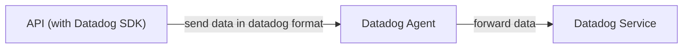
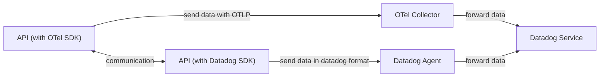
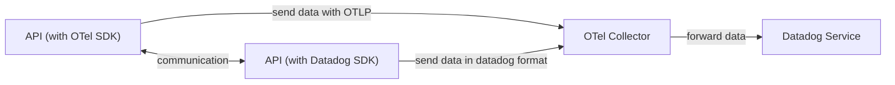
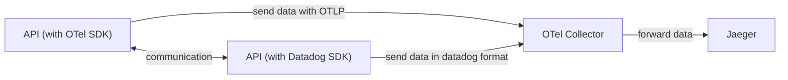
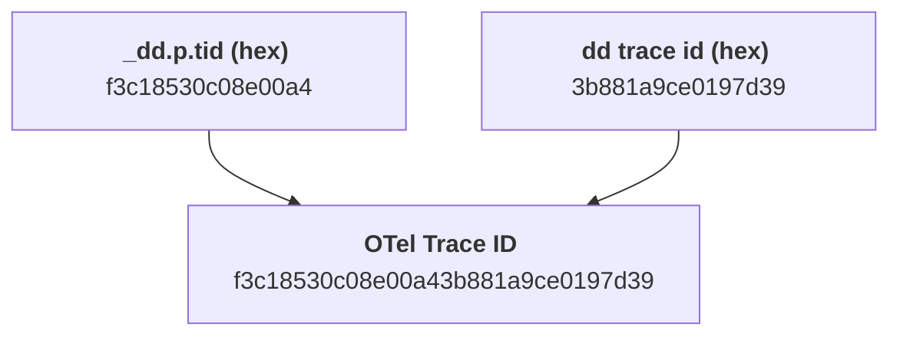
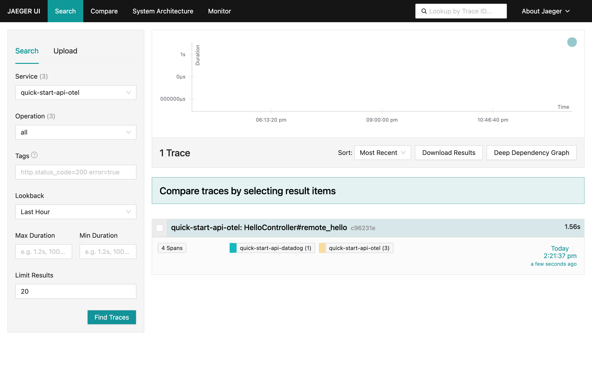
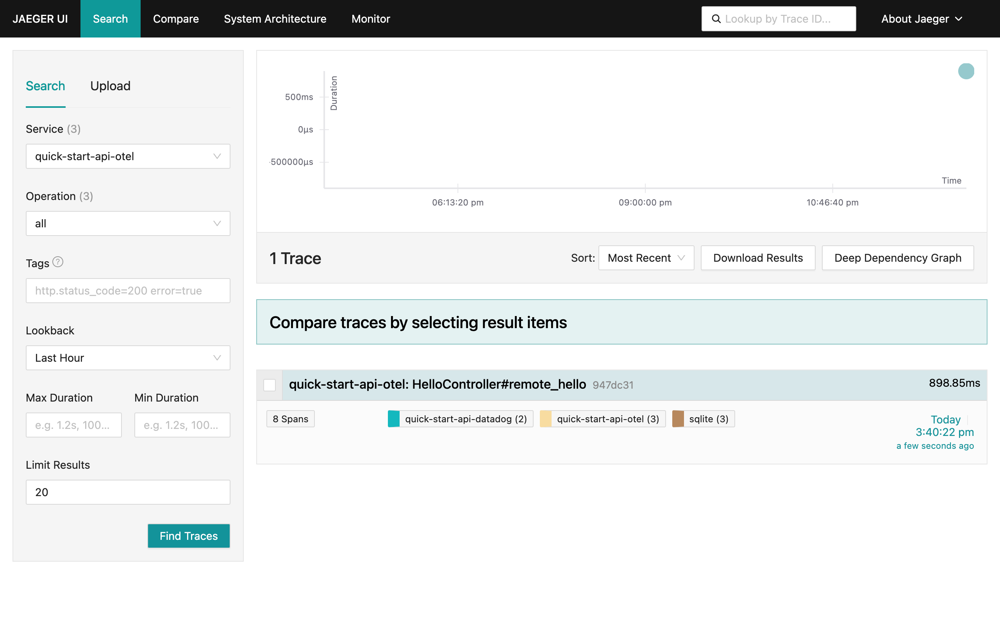

Have you ever faced challenges with telemetry data standardization from the
Datadog SDKs? The integration of Datadog SDKs with OpenTelemetry SDKs can
complicate observability systems due to inconsistent telemetry data sent to
Datadog. This inconsistency can make detailed data analysis, such as traces,
inaccessible before it's sent to Datadog, thereby complicating the setup of an
efficient observability pipeline.

This article shows how this problem starts in an observability stack and how you
can solve it with the OpenTelemetry Collector. It also shows you how to set up
an observability pipeline that accepts Datadog-instrumented apps and allows you
to receive and correlate data in OpenTelemetry stacks without sending telemetry
data for Datadog.

## The legacy SDK issue

Datadog is a monitoring and analytics platform that allows developers and IT
operators to observe the performance of their applications, servers, databases,
and tools, all in one place, being one of the major players in the observability
landscape.

To allow developers to integrate with their platform quickly, they provide a set
of SDKs that enable applications to send telemetry automatically to Datadog.
These SDKs are used for apps that were instrumented before OpenTelemetry started
to standardize how to send telemetry with the OTLP protocol. Due to that,
systems that use both Datadog SDKs and OTel SDKs can be complex in terms of
observability where their data is only available for analysis at the server
level. In this scenario, developers cannot use other OTel solutions, like
traces, to analyze data before sending it to Datadog.

## Structure an observability stack with Datadog

When you instrument an API with Datadog SDKs, you must send the telemetry to an
agent, and then this agent sends your telemetry to Datadog servers.



However, with the rise of OpenTelemetry as standard, new APIs usually centralize
the telemetry into an OpenTelemetry Collector and then send data to Datadog,
creating mixed environments where data is processed and correlated only on
Datadog servers.



To simplify this structure, we can centralize all the communication in an
OpenTelemetry Collector and set up a
[datadog receiver](https://github.com/open-telemetry/opentelemetry-collector-contrib/tree/main/receiver/datadogreceiver)
that works like an agent, receiving traces and metrics in Datadog proprietary
format:



To set up your OpenTelemetry Collector with this receiver, you must use the
[OTel Collector Contrib](https://github.com/open-telemetry/opentelemetry-collector-contrib)
distribution and add
[the `datadog` receiver](https://github.com/open-telemetry/opentelemetry-collector-contrib/blob/main/receiver/datadogreceiver/README.md)
in the configuration file:

```yaml
receivers:
  otlp:
    protocols:
      grpc:
      http:

  datadog:
    endpoint: 0.0.0.0:8126
    read_timeout: 60s

  # ...

  service:
  pipelines:
    traces:
      receivers: [otlp, datadog]
      # ...
```

## Send Datadog data to Jaeger

Using the latest proposed architecture as a head start, let’s download a demo
example that shows how to adapt this architecture to send data to Jaeger,
allowing you to run the API locally and make any observability changes needed
before publishing to production.

First, open a terminal and download the demo with the following commands:

```bash
git clone git@github.com:kubeshop/tracetest.git
cd ./examples/datadog-propagation

docker compose -f ./docker-compose.step1.yaml up -d
```

This action starts two Ruby on Rails APIs, one instrumented with
[ddtrace](https://github.com/datadog/dd-trace-rb) and another with
[OpenTelemetry SDK](https://github.com/open-telemetry/opentelemetry-ruby), both
connecting to an OpenTelemetry Collector that sends data to Jaeger:



Next, you can call the OTelSDK-instrumented API, which executes an internal
endpoint on the Datadog-instrumented API and returns an output. It is expected
that this operation generates just one trace. Try it by executing the command:

```bash
> curl http://localhost:8080/remotehello
# it returns:
# {"hello":"world!","from":"quick-start-api-otel","to":"quick-start-api-datadog"}
```

However, when accessing Jaeger locally (via the link
[http://localhost:16686/](http://localhost:16686/)), you see that **two**
disjointed traces were generated, one for each API:


To correct this problem, you need to change your stack a little bit. Read on to
learn how to apply these changes.

### Understand `trace_id` representations for Datadog and OpenTelemetry

This issue happens due to a difference in the representation of `trace_id`s in
Datadog format and OTel SDK format. Datadog considers a `trace_id` as an
unsigned Int64, while the OpenTelemetry SDK considers it as a 128-bit
hexadecimal representation:

- **Datadog TraceID (int64):** `4289707906147384633`
- **Datadog TraceID (hex):** `3b881a9ce0197d39`
- **OTelSDK TraceID (hex):** `f3c18530c08e00a43b881a9ce0197d39`

Since you have two TraceID representations, you have two Traces in Jaeger.

To propagate their traces through an OpenTelemetry stack, Datadog has an
internal representation that can be used to reconstruct a TraceID, which they
call, internally in their SDK, as `Upper TraceID`, represented by the attribute
`_dd.p.tid` appended to the first span of its trace:


Concatenating this `Upper TraceID` with Datadog’s TraceID in hexadecimal
representation (called `Lower TraceID`), you have the exact TraceID
representation for an OpenTelemetry stack:



Now, to create this representation, we will reconstruct the TraceID at the
OpenTelemetry Collector level, using the
[transform processor](https://github.com/open-telemetry/opentelemetry-collector-contrib/tree/main/processor/transformprocessor).

### Reconstruct TraceID for Datadog spans

The OTel Collector
[transform processor](https://github.com/open-telemetry/opentelemetry-collector-contrib/tree/main/processor/transformprocessor)
is a component that transforms span data as it passes through the OpenTelemetry
Collector. It can modify attributes of a span such as name, kind, attributes,
resources, and instrumentation library, among others.

In this context, the `transform processor` is used to reconstruct the TraceID
for Datadog spans to facilitate a unified tracing environment.

In the OTel Collector config, you can configure the `transform processor` as
follows:

```yaml
processors:
  # ...

  transform:
    trace_statements:
      - context: span
        statements:
          # transformation statements
          - set(cache["upper_trace_id"], attributes["_dd.p.tid"]) where
            attributes["_dd.p.tid"] != nil
          - set(cache["lower_trace_id"], Substring(trace_id.string, 16, 16))
            where cache["upper_trace_id"] != nil
          - set(cache["combined_trace_id"], Concat([cache["upper_trace_id"],
            cache["lower_trace_id"]],"")) where cache["upper_trace_id"] != nil
          - set(trace_id.string, cache["combined_trace_id"]) where
            cache["combined_trace_id"] != nil
```

Next, add four transformation statements:

- `set(cache["upper_trace_id"], attributes["_dd.p.tid"]) where attributes["_dd.p.tid"] != nil`,
  where we will capture the Upper TraceID from the `_dd.p.tid` attribute if it
  is defined and set it to a temporary cache;
- `set(cache["lower_trace_id"], Substring(trace_id.string, 16, 16)) where cache["upper_trace_id"] != nil`,
  where we will convert a Datadog TraceID into hexadecimal format (where we will
  have sixteen zeros plus the Lower TraceID). We will remove the "zeros” segment
  and grab the second half of it (this is why we have a sub string getting only
  the last 16 hex digits from the TraceID);
- `set(cache["combined_trace_id"], Concat([cache["upper_trace_id"], cache["lower_trace_id"]],"")) where cache["upper_trace_id"] != nil`,
  where we concatenate `upper_trace_id` and `lower_trace_id` into the
  OpenTelemetry TraceID;
- `set(trace_id.string, cache["combined_trace_id"]) where cache["combined_trace_id"] != nil`
  and finally we set the `trace_id` for this span with the string concatenation.

To see it working, run your example again, with a different `docker compose`
file and then execute the same API call as before:

```bash
> docker compose -f ./docker-compose.step2.yaml up -d

> curl http://localhost:8080/remotehello
# it returns:
# {"hello":"world!","from":"quick-start-api-otel","to":"quick-start-api-datadog"}
```

Looking at the Jaeger UI, you can see that the problem was partially solved. Now
you have a trace propagated between the Datadog-instrumented API and the
OpenTelemetry-instrumented API. However, all child spans generated by Datadog
are segregated in a different trace, defined only as the Lower TraceID. This
happens because `ddtrace` only sends a `_dd.p.tid` attribute for the first span
generated internally, which makes your transform statements skip the child
spans.




### Patch Datadog trace to send the Upper TraceID to every child span

Since the OpenTelemetry Collector was
[designed to process spans considering distributed systems](/docs/collector/scaling/),
there isn't have a way to maintain an internal state to replicate the
`_dd.p.tid` attribute for the child spans received by the `datadog` receiver.

You can solve this problem directly on the Datadog-instrumented API by applying
a minor patch to `ddtrace` to replicate `_dd.p.tid` to all child spans. In the
[`ddtrace` Ruby version](https://github.com/kubeshop/tracetest/blob/main/examples/datadog-propagation/quick_start_api_datadog/config/initializers/datadog.rb#L20),
the trace serialization is modified to send this data as shown:

```ruby
module Datadog
  module Tracing
    module Transport
      class SerializableTrace
        def to_msgpack(packer = nil)
          if ENV.has_key?('INJECT_UPPER_TRACE_ID')
            return trace.spans.map { |s| SerializableSpan.new(s) }.to_msgpack(packer)
          end

          upper_trace_id = trace.spans.find { |span| span.meta.has_key?('_dd.p.tid') }.meta['_dd.p.tid']
          trace.spans.each do |span|
            span.meta["propagation.upper_trace_id"] = upper_trace_id
          end

          trace.spans.map { |s| SerializableSpan.new(s) }.to_msgpack(packer)
        end
      end
    end
  end
end
```

Since it is a customization on the traces, you can opt to grab the `_dd.p.tid`
attribute and inject it in each span as the `propagation.upper_trace_id`
attribute. Then you can
[change](https://github.com/kubeshop/tracetest/blob/main/examples/datadog-propagation/collector/collector.config.step3.yaml#L18)
the `transform` processor in the OpenTelemetry Collector to consider this:

```yaml
transform:
  trace_statements:
    - context: span
      statements:
        - set(cache["upper_trace_id"], attributes["propagation.upper_trace_id"])
          where attributes["propagation.upper_trace_id"] != nil
        - set(cache["lower_trace_id"], Substring(trace_id.string, 16, 16)) where
          cache["upper_trace_id"] != nil
        - set(cache["combined_trace_id"], Concat([cache["upper_trace_id"],
          cache["lower_trace_id"]],"")) where cache["upper_trace_id"] != nil
        - set(trace_id.string, cache["combined_trace_id"]) where
          cache["combined_trace_id"] != nil
```

With these changes done, let’s run a new setup with our example:

```bash
> docker compose -f ./docker-compose.step3.yaml up -d

> > curl http://localhost:8080/remotehello
# it returns:
# {"hello":"world!","from":"quick-start-api-otel","to":"quick-start-api-datadog"}
```

Opening the Jaeger UI again, you see that the problem is solved! Now you have a
single trace between both APIs and can evaluate a process as a whole in a
developer machine.



## Final remarks

We have discussed integrating Datadog-instrumented apps in an OpenTelemetry
stack, seeing the problem of different TraceID representations for Datadog and
OpenTelemetry, which can lead to disjointed traces. To solve that we used an
OpenTelemetry Collector with a `transform` processor to reconstruct the TraceID
for Datadog spans, facilitating a unified tracing environment.

As a team focused on building an open source tool in the observability space,
the opportunity to help the overall OpenTelemetry community is important to us.
That’s why we are researching and finding new ways of collecting traces from
different tools and frameworks and making them work with the OpenTelemetry
ecosystem.

The [example sources](https://github.com/kubeshop/tracetest/tree/main/examples/datadog-propagation) used
in this article,
and [setup instructions](https://github.com/kubeshop/tracetest/blob/main/examples/datadog-propagation/README.md) are
available in the Tracetest GitHub repository.
