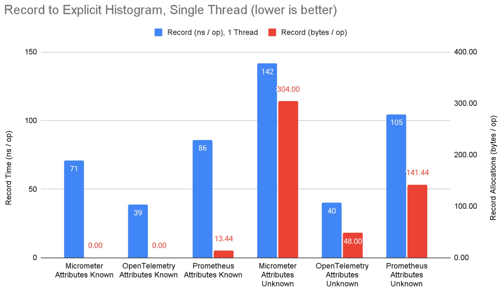
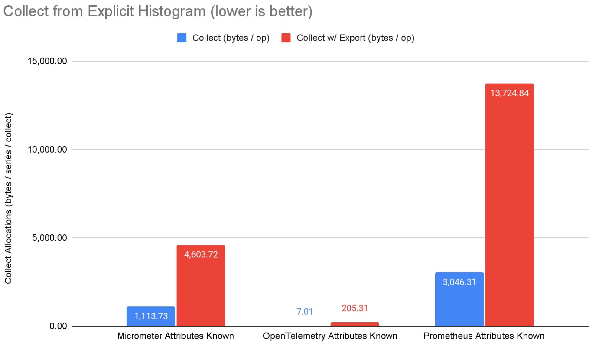

Arguably the biggest value proposition of OpenTelemetry is that it aims to be a
language agnostic, general purpose observability standard. By providing tools
for traces, metrics, and logs (and profiling coming soon!), and implementations
across many popular languages, OpenTelemetry reduces the cognitive load of
polyglot teams by providing one vocabulary and one toolkit.

While that’s all true, today I’d like to zoom in on a specific signal and
language, and talk about the performance of the [OpenTelemetry Java][] metrics
SDK.

## Metrics Primer

Metrics is an overloaded term, but in the observability space we use metrics to
aggregate many discrete measurements. When compared to exporting all individual
measurements, exporting aggregates results in a much more compact footprint in
terms of data volume. However, it forces you to give up some forms of analysis
since information is fundamentally lost in the aggregation process.

From a performance standpoint, the CPU / memory needed to record measurements is
a crucial characteristic of a metric system, since you may be recording many
millions or billions of measurements. Additionally, the CPU / memory to export
the aggregated metrics out of process is important. Although export is periodic
and not on the application “hot path”, it still consumes resources which can
cause intermittent blips in performance.

### An Example

Let’s introduce an example that we can reference during the subsequent text. One
of the most useful metrics in OpenTelemetry is
[`http.server.request.duration`](/docs/specs/semconv/http/http-metrics/#metric-httpserverrequestduration),
which records measurements of the response latency of each request served by an
HTTP server and aggregates them into a histogram. Each measurement has a variety
of attributes (or labels, or tags, or dimensions) associated with it, but let’s
focus on `http.request.method`, `http.route`, and `http.response.status_code`
for simplicity's sake. See
[HTTP semantic conventions](/docs/specs/semconv/http/http-metrics/) for complete
details. From this, you can compute throughput, average response time, min and
max response time, percentile response time (i.e. p95, p99, etc), all broken
down by HTTP method, route, response status code, and more.

To record measurements to this metric, for each request an HTTP server receives:

- Record the starting time as early as possible in the request lifecycle
  (delaying reduces the accuracy of the metric).
- Serve the request and return the response.
- Immediately when the response is returned, record the difference of the
  current time and the starting time initially recorded. This duration is the
  request latency.
- Extract the values for `http.request.method`, `http.route`, and
  `http.response.status_code` attribute keys from the request context.
- Record a measurement to the `http.server.request.duration` histogram
  instrument, consisting of the computed request latency and the attributes.

A metrics system will aggregate these measurements into separate series for each
distinct set of attribute key-value pairs (`http.request.method`, `http.route`,
`http.response.status_code`) encountered. On a periodic basis, the metrics are
collected and exported out of process. This export process can be "push based"
where the application pushes the metrics somewhere on an interval, or "pull
based" where some other process pulls (or scrapes) metrics from the application
on an interval. In OpenTelemetry, push is preferred since OTLP is a "push based"
protocol.

Suppose we have a simple HTTP server with the following operations:

- `GET /users`
- `GET /users/{id}`
- `PUT /users/{id}`

These generally return with a 200 OK HTTP status code, but it’s possible for a
404 to return (or other errors as well). Java pseudocode to record measurements
to the `http.server.request.duration` histogram might look like:

```java
// Initialize instrument
DoubleHistogram histogram = meterProvider.get("my-instrumentation-name")
    .histogramBuilder("http.server.request.duration")
    .setUnit("s")
    .setExplicitBucketBoundariesAdvice(Arrays.asList(1.0, 5.0, 10.0)) // set histogram bucket boundaries to the thresholds we care about
    .build();

// ... elsewhere in code, record a measurement for each HTTP request served
histogram.record(22.0, httpAttributes("GET", "/users", 200));
histogram.record(7.0, httpAttributes("GET", "/users/{id}", 200));
histogram.record(11.0, httpAttributes("GET", "/users/{id}", 200));
histogram.record(4.0, httpAttributes("GET", "/users/{id}", 200));
histogram.record(6.0, httpAttributes("GET", "/users/{id}", 404));
histogram.record(6.2, httpAttributes("PUT", "/users/{id}", 200));
histogram.record(7.2, httpAttributes("PUT", "/users/{id}", 200));

// Helper constants
private static final AttributeKey<String> HTTP_REQUEST_METHOD = AttributeKey.stringKey("http.request.method");
private static final AttributeKey<String> HTTP_ROUTE = AttributeKey.stringKey("http.route");
private static final AttributeKey<String> HTTP_RESPONSE_STATUS_CODE = AttributeKey.stringKey("http.response.status_code");

// Helper function
private static Attributes httpAttributes(String method, String route, int responseStatusCode) {
  return Attributes.of(
    HTTP_REQUEST_METHOD, method,
    HTTP_ROUTE, route,
    HTTP_RESPONSE_STATUS_CODE, responseStatusCode);
}
```

When it comes time to export, the aggregated metrics are serialized and sent out
of process. For our example, I’ve included a simple text encoding of the output
metrics. Real world applications will use an encoding defined by the protocol in
use, such as the prometheus text format or [OTLP](/docs/specs/otlp/).

```text
2024-05-20T18:05:57Z: http.server.request.duration:
  attributes: {"http.request.method":"GET","http.route":"/users/{id}","http.response.status_code":200}
  value: {"count":3,"sum":22.0,"min":4.0,"max":11.0,"buckets":[[1.0,0],[5.0,1],[10.0,1]]}

  attributes: {"http.request.method":"GET","http.route":"/users/{id}","http.response.status_code":404}
  value: {"count":1,"sum":6.0,"min":6.0,"max":6.0,"buckets":[[1.0,0],[5.0,0],[10.0,1]]}

  attributes: {"http.request.method":"GET","http.route":"/users","http.response.status_code":200}
  value: {"count":1,"sum":22.0,"min":22.0,"max":22.0,"buckets":[[1.0,0],[5.0,0],[10.0,0]]}

  attributes: {"http.request.method":"PUT","http.route":"/users/{id}","http.response.status_code":200}
  value: {"count":2,"sum":13.4,"min":6.2,"max":7.2,"buckets":[[1.0,0],[5.0,0],[10.0,2]]}
```

Notice how the `http.server.request.duration` metric has four distinct series
since there are four distinct combinations of values for `http.request.method`,
`http.route`, and `http.response.status_code`. Each of these series has a
histogram consisting of count (i.e. total count), sum, min, max, and an array of
pairs each containing the bucket boundaries and bucket count.

Our example is trivial, but imagine scaling this out to recording millions or
billions of measurements. The memory and serialization footprint of the
aggregated metrics is proportional to the distinct number of series, and stays
constant regardless of how many measurements are recorded. **This decoupling of
the data footprint from the number of measurements is the fundamental value of
metrics systems.**

## What makes a metric system good?

Metrics systems record measurements, and collect or export aggregated state out
of the process. Let’s examine these two operations separately.

On the **record** side, a metric system needs to:

- Find the appropriate aggregated state to update based on a measurement’s
  attributes. In some systems, the API caller can request a handle which
  directly holds a reference to the aggregated state, and there's no searching
  involved. These references are sometimes called **bound instruments**, since
  they are bound to a particular set of attributes. Often, it’s not possible to
  do this because attribute values need to be computed using application context
  (e.g. in our example the values for HTTP request attributes are resolved based
  on the result of serving the request). If the metric system doesn’t support
  bound instruments or if the attributes need to be computed with application
  context, the metric system generally needs to look up the series corresponding
  to the measurement’s attributes in a map.
- Atomically update the aggregated state, such that if a collect were to occur
  on a different thread, it would never read state that had been partially
  updated.
- Recording must be fast and thread safe. There’s an expectation that
  measurements are recorded on the application hot path, and thus the time to
  record directly impacts application SLAs. There’s an expectation that multiple
  threads may be recording measurements with the same attributes simultaneously,
  so care must be taken to ensure speed is not at the expense of correctness,
  and contention should be mitigated.
- Recording should not allocate memory. Records are happening many millions or
  billions of times. If each record allocates memory, the system would be
  exposed to GC churn that would impact the performance of the application.
  After a metrics system reaches steady state (i.e. all series have received
  measurements) recording measurements should allocate zero memory. The
  exception to this is when the attributes being recorded are not known ahead of
  time, and have to be computed from application context at the time of
  recording. However, these allocations should be minimal, and can arguably be
  attributed to the user and not the metrics system itself.

On the **collect or export side**, a metric system needs to:

- Iterate through all the distinct series (i.e. distinct attributes which
  receive measurements measurements), and read the aggregated state.
- Encode the aggregated state using some protocol to export it out of process.
  This might be the prometheus text format which is periodically pulled and read
  by another process, or something like OTLP which is periodically pushed.
- The state of each series may need to be reset, depending on whether the
  exporter requires metrics with a cumulative state which is ever increasing or
  delta state which resets after each collection.
- Collection must minimize impact to record operations. Collecting metrics means
  reading the state of aggregated metrics which are updated atomically on
  different threads than the collection. Generally, collection takes a back seat
  to record in terms of performance prioritization: collection should strive to
  minimize the time spent blocking record operation on the hot path.
- Collection should minimize memory allocations. Some allocations are inevitable
  when collecting (or maybe not.. keep reading to learn more), but they really
  ought to be minimized. If not, systems recording metrics with high cardinality
  (i.e. systems which record measurements with a large number of distinct
  attribute sets) will have high memory allocation and subsequent GC due to
  memory churn on collect. This can cause periodic performance blips which
  impact application SLAs.

In our example, we record the duration of each HTTP request the server responds
to, with a set of attributes describing that request. We lookup the series
corresponding to the attributes (and create a new series if none exists), and
atomically update the state it holds in memory (sum, min, max, bucket counts).
When we collect, we read the state of each of the four distinct series, and in
our trivial case, print out a string encoding of the information.

## OpenTelemetry Java Metrics

The OpenTelemetry Java project is a high performance metrics system, designed to
be fast and to have no (or in certain cases low) allocations on the recording
side, and very low allocation on the collection side.

Let’s look at our example and break down what’s happening behind the scenes:

```java
// Record a measurement
histogram.record(7.2, httpAttributes("PUT", "/users/{id}", 200));

// Helper constants
private static final AttributeKey<String> HTTP_REQUEST_METHOD = AttributeKey.stringKey("http.request.method");
private static final AttributeKey<String> HTTP_ROUTE = AttributeKey.stringKey("http.route");
private static final AttributeKey<String> HTTP_RESPONSE_STATUS_CODE = AttributeKey.stringKey("http.response.status_code");

// Helper function
private static Attributes httpAttributes(String method, String route, int responseStatusCode) {
  return Attributes.of(
    HTTP_REQUEST_METHOD, method,
    HTTP_ROUTE, route,
    HTTP_RESPONSE_STATUS_CODE, responseStatusCode);
```

Each time we record a measurement to our histogram instrument, we pass the
measurement value and attributes as arguments. In this example, we compute the
attributes for each request using application context, but if all the distinct
attribute sets are known ahead of time, they can and should be pre-allocated and
held in a constant `Attributes` variable, which reduces unnecessary memory
allocations. But even if attributes can’t be known ahead of time, the attribute
keys can. Here we pre-allocate constants for each `AttributeKey` that shows up
in our attributes. The OpenTelemetry Java `Attributes` implementation is
implemented very efficiently, and has been benchmarked and optimized over the
course of several years.

Internally, when we record we need to look up the aggregation state (i.e.
`AggregatorHandle` in OpenTelemetry Java terms) corresponding to the series.
Most of the heavy lifting is performed by a lookup in a
`ConcurrentHashMap<Attributes, AggregatorHandle>` but there are a couple of
details worth noting:

- The process of obtaining an `AggregatorHandle` is optimized to reduce
  contention even when a collect is occurring on a separate thread at the same
  time as a record. The only locks taken occur within ConcurrentHashMap, which
  uses multiple locks to reduce contention. We cache `Attributes` hashcodes to
  save CPU cycles on each lookup.
- The state in each `AggregatorHandle` needs to reset after each collection when
  the exporter has `AggregationTemporality=delta`. Object pooling is used to
  avoid re-allocating new `AggregatorHandle` instances each export cycle.
- There are different `AggregatorHandle` implementations for each of the
  supported [aggregations](/docs/specs/otel/metrics/sdk/#aggregation).The
  implementations have all been optimized to use low contention tools like
  compare and swap, `LongAdder`, `Atomic*`, etc where possible, and to reuse any
  data structures used to hold state across collections. The exponential
  histogram implementation uses low level bit shifting to compute buckets to
  avoid using `Math.log` - every nanosecond counts!

When we collect, we need to iterate through all the instruments, and read and
serialize the state of each `AggregatorHandle` according to whatever protocol is
used to export. Over the past year or so, we’ve done some heavy lifting to
optimize the memory allocations of the collect cycle. The optimization comes
from the recognition that metric
[exporters will never be called concurrently](/docs/specs/otel/metrics/sdk/#exportbatch).
If we periodically read metric state and send it to the exporter to serialize,
and ensure we wait until that export completes before reading metric state
again, then we can safely reuse all the data structures used to pass the metric
state to the exporter. Of course some metric readers (like the prometheus metric
reader) may read the metric state concurrently. For these, we prioritize safety
and correctness over optimized memory allocations.

The result is a configurable option unique to OpenTelemetry Java called
`MemoryMode`. `MetricReaders` (or their associated `MetricExporter`) specify
what their memory mode is based on whether they read metric state concurrently
or not. Right now you opt into the optimized memory behavior (which we call
`MemoryMode.reusable_data`) via an
[environment variable](/docs/languages/java/configuration/#properties-exporters).
In the future, the optimized memory mode will be enabled by default, since only
exceptional cases need concurrent access to the metric state. It turns out that
the objects holding the metric state (`MetricData` in OpenTelemetry Java terms)
account for virtually all of the memory allocation in the collect cycle. By
reusing these (along with other internal objects used to hold state), **we
reduced the memory allocation of the core metric SDK by over 99%**. See
[this blog post](https://medium.com/@asafmesika/optimizing-java-observability-opentelemetrys-new-memory-mode-reduces-memory-allocations-by-99-98-e0062eccdc3f)
for more details.

Next we turned our attention to OTLP serialization performance. OTLP encodes
payloads using [protobuf](https://protobuf.dev/) binary serialization. The
default implementations require you to first translate data to generated classes
representing the protobuf messages. These classes and associated serialization
logic require a large dependency
([com.google.protobuf:protobuf-java](https://mvnrepository.com/artifact/com.google.protobuf/protobuf-java/4.26.1)
is 1.7mb), and unnecessary memory allocations from the intermediate
representation. Several years ago, we hand-rolled our own OTLP serialization to
avoid these problems, but there was still room to improve: As it happens,
producing OTLP payloads requires that you know the size of the request body
before you serialize it. This requires serialization implementations to iterate
through the data twice. The first computes the payload size. The second
serializes it. Along the way, you need to do things like compute UTF-8 encodings
and store other intermediate data resulting in memory allocations. We reworked
OTLP serialization to compute the payload size and serialize it in a stateless
fashion wherever possible, and where not possible, reuse the data structures.
First released in
[opentelemetry-java:1.38.0](https://github.com/open-telemetry/opentelemetry-java/releases/tag/v1.38.0),
this behavior is configurable using the same MemoryMode option previously
discussed, and will be the default in the future. (Note: the serialization
optimization applies to OTLP trace and log serialization in addition to
metrics!)

## Benchmark: OpenTelemetry Java vs. Micrometer vs. Prometheus Java

We’ve done a lot of performance engineering in OpenTelemetry Java, but how does
it stack up against other popular metrics systems in the Java ecosystem? Let’s
compare it to two of the most popular (see
[GitHub stars](https://star-history.com/#prometheus/client_java&open-telemetry/opentelemetry-java&micrometer-metrics/micrometer&Date))
Java metric systems: micrometer and prometheus. Although
[dropwizard metrics](https://github.com/dropwizard/metrics) is also very
popular, I excluded it because its lack of dimensions makes it hard to compare
to the other systems.

Before sharing the methodology, results, and conclusions, a few notes on the
challenges of comparing benchmarks across systems:

- **There’s no standard vocabulary.** OpenTelemetry attributes are called tags
  in micrometer and labels in prometheus. Where micrometer and prometheus have a
  registry concept, OpenTelemetry has metric readers and metric exporters. I use
  OpenTelemetry terminology where conflicts exist because I’m a member of the
  OpenTelemetry project.
- **Sometimes there is no perfect apples to apples comparison.** There is no
  micrometer analog for OpenTelemetry exponential histograms. OpenTelemetry
  doesn’t support bound instruments, while micrometer and prometheus lean
  heavily into this. Prometheus and micrometer support OTLP, but OpenTelemetry
  was built for it which has some advantages.
- **Deciding what to compare.** These systems allow you to do a lot of different
  things. I was quite selective about what to benchmark, using my own subjective
  reasons for what aspects are most important. Even still, there’s a lot of raw
  data to comb through. The results include aggregate visual aids to help
  consume the data.
- **I’m not an expert on all the systems.** As a maintainer of OpenTelemetry
  Java, I know everything there is to know about how to configure and use it. I
  use micrometer and prometheus as described in the docs, but may miss some
  configuration or usage optimizations that a power user would know. I don’t
  know what I don’t know.

### Methodology

And now a description of the methodology and how to interpret the data:

- The code supporting these benchmarks is available on at
  [github.com/jack-berg/metric-system-benchmarks](https://github.com/jack-berg/metric-system-benchmarks),
  the
  [raw result data is available as a Google Sheet](https://docs.google.com/spreadsheets/d/1I2ACFAgzWaa1H5EQx99-rLTro2FHlS44gsWuQsU8Ssw/edit#gid=191407209).
- Benchmarks were run on my local machine, a MacBook Pro w/ M1 Max, 64GB ram,
  running Sonoma 14.3.1.
- There are three distinct benchmarks to compare key aspects of the system:
  - Record: compare CPU time and memory allocations to record measurements.
  - Collect: compare memory allocations to read metric state in memory (i.e. no
    export).
  - Collect and export: compare memory allocations to read metric state and push
    to OTLP receiver.
- For each benchmark, a variety of scenarios are evaluated:
  - Compare different instruments: counter, explicit bucket histogram (with
    OpenTelemetry default bucket boundaries), and exponential bucket histogram.
    Micrometer doesn’t support exponential bucket histograms.
  - Record to and collect from series corresponding to 100 distinct attribute
    sets. Each attribute set has a single key value pair, with a random 26
    character value. This reflects my intuition that the cardinality is more
    important than the contents of the attributes.
  - Compare scenarios in which attributes are known ahead of time (“Attributes
    Known” in results) and not (“Attributes Unknown” in charts), to reflect
    whether the application needs to compute attributes using application
    context. If attributes are known ahead of time, obtain bound instruments
    when supported - OpenTelemetry doesn’t support bound instruments but
    micrometer and prometheus do. If attributes are not known ahead of time,
    compute attributes at record time.
  - Run record benchmarks in both single-threaded and multi-threaded scenarios.
    For brevity, only single-thread results are shown below since the
    multi-threaded tests tended to erase the differences between the systems as
    the bottleneck shifted away from metric system implementation decisions.
- For OpenTelemetry scenarios, enable `MemoryMode=reusable_data` since we intend
  to make that the default in the near future. Disable exemplars since the
  defaults only record exemplars when a span is being recorded, and we’re
  isolating a comparison of metric systems.
- Use [JMH](https://github.com/openjdk/jmh) to run the benchmarks. Configure the
  benchmark to isolate against erroneous CPU or memory allocations. For example,
  the collection benchmarks record all the measurements ahead of time so we’re
  purely evaluating the collect process.
- The results break out graphs for each instrument type. Record operations are
  presented in one series of graphs. Collect and collect with export results are
  presented in another series of graphs.

### Results

The following graphs summarize the results for the record benchmarks:


**Figure 1:** Record to counter benchmark results.



**Figure 2:** Record to explicit bucket histogram benchmark results.


**Figure 3:** Record to exponential bucket histogram benchmark results.

The following graphs summarize the results for the collect and collect with
export benchmarks:


**Figure 4:** Collect from counter benchmark results.



**Figure 5:** Collect from explicit bucket histogram results.


**Figure 6:** Collect from exponential bucket histogram benchmark results.

### Conclusions

On the record side, micrometer and prometheus have an 11ns advantage for
counters when attributes are known ahead of time, avoiding map lookups by using
bound instruments to get direct references to aggregated state (not supported by
OpenTelemetry). Despite this, OpenTelemetry has a 32ns advantage for explicit
bucket histograms. This is likely due to micrometer and prometheus attempting to
compute more summary values than the sum, min, max, and bucket counts of
OpenTelemetry histograms. The advantage diminishes when attributes are not known
ahead of time.

When attribute values are known ahead of time, none of the systems allocate
memory when recording. This is great, and should be table stakes for any serious
metrics system. When attribute values are not known ahead of time (i.e. computed
from application context), OpenTelemetry consistently allocates less memory than
prometheus and micrometer. OpenTelemetry has clearly optimized for this scenario
where micrometer and prometheus have a focus on attribute values being known
ahead of time and bound instruments. I argue that more often than not, attribute
values will not be known ahead of time, which marginalizes any advantage from
micrometer or prometheus. Still, this is an area of potential improvement for
OpenTelemetry.

On the collect side, OpenTelemetry steals the show with extremely low memory
allocation. When collecting without export, OpenTelemetry has anywhere from
22%-99.7% fewer memory allocations than micrometer and prometheus. When
collecting and exporting over OTLP, OpenTelemetry has anywhere from 85%-98.4%
fewer memory allocations than micrometer and prometheus. Note that prometheus
directly uses the OpenTelemetry OTLP exporter library, but without the
optimization OpenTelemetry is able to achieve by being vertically integrated
(i.e. exporter and core metrics system work together to achieve optimal
results). Micrometer OTLP support translates the in-memory micrometer
representation to generated Java classes before serializing, which is convenient
but suboptimal from a performance standpoint.

Overall, these are three serious metric systems. All perform admirably on the
record side of things - a testament to the performance engineering that’s gone
into all of them. After wrapping up a long series of optimizations,
OpenTelemetry shines on the collect side of things. Its lower allocations will
benefit every application, but are especially important to applications with
high cardinality and with strict performance SLAs.

If you’re reading this and considering Java metric systems, I hope you chose
[OpenTelemetry Java][]. It’s a powerful and highly performant tool on its own,
but comes with APIs for other key observability signals, a
[rich instrumentation ecosystem](https://github.com/open-telemetry/opentelemetry-java-instrumentation/blob/main/docs/supported-libraries.md),
[implementations in a variety of other languages](/docs/languages/), and a
well-supported
[open governance structure](https://github.com/open-telemetry/community).

## Acknowledgements

Thanks to all the
[opentelemetry-java contributors](https://github.com/open-telemetry/opentelemetry-java/graphs/contributors)
who have helped us get to this point, especially the current and previous
[maintainers and approvers](https://github.com/open-telemetry/opentelemetry-java?tab=readme-ov-file#contributing).
Special shout out to [Asaf Mesika](https://github.com/asafm) who kept pushing
the bar higher.

[OpenTelemetry Java]: /docs/languages/java/
