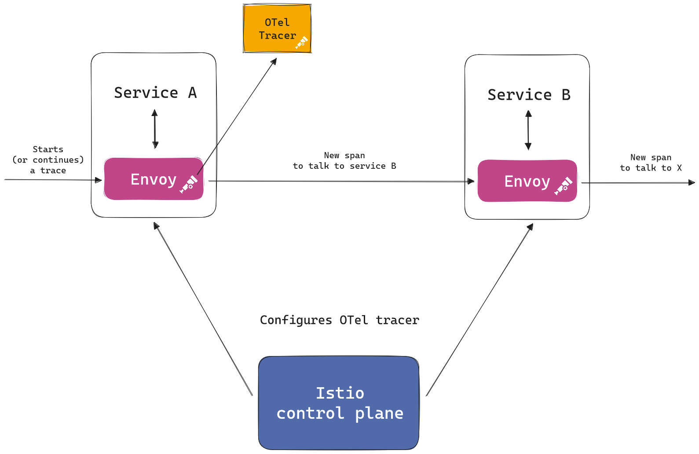
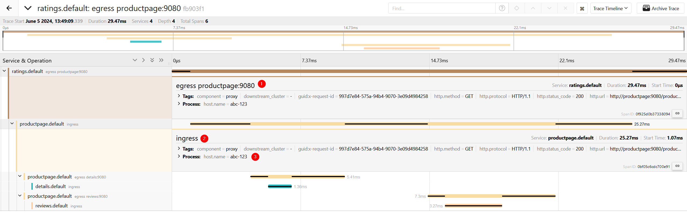

In the dynamic world of cloud-native and distributed applications, managing
microservices effectively is critical. [Kubernetes](https://kubernetes.io/) has
become the de facto standard for container orchestration, enabling seamless
deployment, scaling, and management of containerized applications.

The distributed nature of such systems, however, adds a layer of complexity in
the form of networking for in-cluster communication. Two well-known projects,
Envoy and Istio, have emerged as the foundation for the smooth management and
operation of such complex environments.

Together, these technologies empower organizations to build scalable, resilient,
and secure distributed systems.

[Istio](https://istio.io/) is a service mesh, that orchestrates communication
between microservices, providing features such as traffic management, security
and, of course observability. Istio uses the Envoy proxy as its data plane.
[Envoy](https://www.envoyproxy.io/) is a high-performance proxy, designed for
single applications/services as well as a communication bus and "universal data
plane" for service meshes.

[Envoy](https://www.cncf.io/projects/envoy/) and
[Istio](https://www.cncf.io/projects/istio/) projects are open source and part
of the [Cloud Native Computing Foundation](https://www.cncf.io/).

## Observability in Envoy and Istio

The Envoy proxy deployed by the Istio service mesh is the perfect candidate to
ensure incoming and outgoing requests are properly traced. This approach
provides distributed traces of the entire service mesh, giving an overview on
the communication between services — even when the applications themselves are
not instrumented.

Envoy offers several
[tracers](https://www.envoyproxy.io/docs/envoy/v1.29.4/api-v3/config/trace/trace)
that do the job of tracing the requests, including the
[OpenTelemetry tracer](/docs/concepts/signals/traces/#tracer).
Tracers can be configured either directly within Envoy (when using it as a
standalone component) or for all Envoy instances by using Istio.

Here is an example of how Istio and Envoy work together to trace requests:



## Introducing new OpenTelemetry tracing features in Envoy and Istio

Although Envoy already had support for exporting OpenTelemetry traces using
gRPC, it lacked support for exporting using HTTP. OpenTelemetry specifies both
transports as first-class citizens. In addition, other areas such as providing
resource attributes and configurable sampling decisions were lagging behind the
stable portions of the OpenTelemetry specification.

Starting from Envoy 1.29+ and Istio 1.21+, users now have access to the
following new features:

### OTLP HTTP exporter

The
[OpenTelemetry tracer](https://www.envoyproxy.io/docs/envoy/v1.29.4/api-v3/config/trace/v3/opentelemetry.proto)
in Envoy can now be configured to export OTLP traces using HTTP. This allows
sending telemetry to observability sinks using OTLP/HTTP, directly from Envoy
proxies.

### Resource detectors

Envoy now ships with the
[Environment Resource Detector](https://www.envoyproxy.io/docs/envoy/v1.29.4/api-v3/extensions/tracers/opentelemetry/resource_detectors/v3/environment_resource_detector.proto).
This resource detector follows the
[OTel specification](/docs/specs/otel/resource/sdk/#specifying-resource-information-via-an-environment-variable)
and allows users to further enrich the spans produced by Envoy proxies.

The [resource detector feature](https://github.com/envoyproxy/envoy/pull/29547)
not only added the environment detector, but also made it possible for any other
resource detector to be easily added with Envoy's built-in extensions feature.

### Custom samplers

Another exciting feature added to Envoy is the possibility of implementing and
configuring custom samplers. Envoy follows the
[OTel Sampler interface](/docs/specs/otel/trace/sdk/#sampler), which makes it
easy for anyone to contribute their own samplers.

Envoy ships with the
[Always On Sampler](https://www.envoyproxy.io/docs/envoy/v1.29.4/api-v3/extensions/tracers/opentelemetry/samplers/v3/always_on_sampler.proto)
which simply forwards all spans. This base implementation can be used as a
reference implementation for smarter samplers.

## Demo

It's time to see the new features in action! For this, we will use the
[Istio Bookinfo application](https://istio.io/latest/docs/examples/bookinfo/).
We will deploy it in Kubernetes and use Istio as our service mesh. Traces will
be exported to [Jaeger](https://www.jaegertracing.io/) using HTTP.

### Install Jaeger

First, start by installing the
[Jaeger operator](https://www.jaegertracing.io/docs/1.57/operator/):

```shell
kubectl create namespace observability
kubectl create -f https://github.com/jaegertracing/jaeger-operator/releases/download/v1.57.0/jaeger-operator.yaml -n observability
```

Then deploy Jaeger `all-in-one`:

```shell
kubectl apply -f - <<EOF
apiVersion: jaegertracing.io/v1
kind: Jaeger
metadata:
  name: simplest
EOF
```

### Install and configure Istio

Now, let's install Istio using
[`istioctl`](https://istio.io/latest/docs/setup/install/istioctl/)

```shell
cat <<EOF | istioctl install -y -f -
apiVersion: install.istio.io/v1alpha1
kind: IstioOperator
spec:
  meshConfig:
    enableTracing: true
    extensionProviders:
    - name: otel-tracing
      opentelemetry:
        port: 4318
        service: simplest-collector.default.svc.cluster.local
        http:
          path: "/v1/traces"
          timeout: 5s
        resource_detectors:
          environment: {}
EOF
```

This installs Istio and configures the OpenTelemetry tracing provider. We are
using the `http` exporter, and sending to the OTLP/HTTP endpoint in the Jaeger
collector. We are also enabling the environment resource detector in
`resource_detectors`.

Next, we need to enable the tracer using Istio's
[Telemetry API](https://istio.io/latest/docs/tasks/observability/telemetry/):

```shell
kubectl apply -f - <<EOF
apiVersion: telemetry.istio.io/v1alpha1
kind: Telemetry
metadata:
  name: otel-demo
spec:
  tracing:
  - providers:
    - name: otel-tracing
    randomSamplingPercentage: 100
EOF
```

And finally, we configure the `OTEL_RESOURCE_ATTRIBUTES` environment variable
for the Envoy proxies:

```shell
cat <<EOF | k apply -f -
apiVersion: networking.istio.io/v1beta1
kind: ProxyConfig
metadata:
  name: my-proxyconfig
  namespace: istio-system
spec:
  concurrency: 0
  environmentVariables:
    OTEL_RESOURCE_ATTRIBUTES: "host.name=abc-123"
EOF
```

### Deploy the application

The final step is to deploy the bookinfo application
([bookinfo.yaml](https://raw.githubusercontent.com/istio/istio/release-1.22/samples/bookinfo/platform/kube/bookinfo.yaml)):

```shell
kubectl label namespace default istio-injection=enabled
kubectl apply -f bookinfo.yaml
```

### Test it out

Let's make some requests to one of the services:

```shell
kubectl exec "$(k get pod -l app=ratings -o jsonpath='{.items[0].metadata.name}')" -c ratings -- curl -sS productpage:9080/productpage | grep -o "<title>.*</title>"
```

Then we can check it out on the Jaeger UI. There, we should see some traces!



Let's analyze the spans produced by Envoy:

1. First, we see the outgoing (egress) call from the `ratings` service to the
   `productpage` service.
2. Then we see the incoming (ingress) call in the `productpage` service.
3. We also see the `host-name` resource attribute we applied using the
   `OTEL_RESOURCE_ATTRIBUTES`. That attribute was picked up by the environment
   resource detector and added to all spans Envoy created.

Apart from this, we can see all the other downstream calls made, as all services
have the Envoy sidecar injected by Istio. We have full observability of the
calls between services, just by enabling the OTel tracer in Envoy!

## Next steps and closing

With these new additions, users gain more flexibility in exporting their traces.
They can enrich their data with resource attributes and establish the groundwork
for more intelligent sampling techniques to be added in the future.

The new features also unlock interesting use cases for other parties in the
observability space, including cloud providers and observability vendors. With
the resource detector and sampler APIs now available in Envoy, anyone can build
support for custom samplers and detectors, enhancing the usefulness of the
telemetry data generated by Envoy.

Another exciting next step for Envoy and OpenTelemetry is the adoption of the
now-stable
[HTTP semantic conventions in Envoy](https://github.com/envoyproxy/envoy/issues/30821).
This will align Envoy with all OTel SDKs that are also producing the spans
following the stable HTTP semantic conventions.

Collaborating with the Envoy and Istio community to bring more OTel features to
these projects has been a great experience. The eagerness to adopt and the
strong collaboration between OpenTelemetry and relevant CNCF projects, such as
Istio and Envoy, helps solidify OpenTelemetry's position as the de facto
standard for observability.
