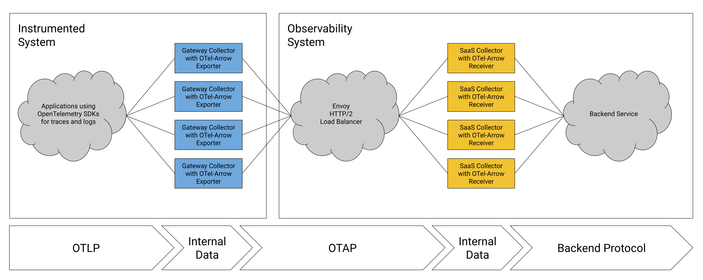

The OpenTelemetry Protocol with Apache Arrow (OTel-Arrow) project's
[exporter](https://github.com/open-telemetry/opentelemetry-collector-contrib/tree/main/exporter/otelarrowexporter)
and
[receiver](https://github.com/open-telemetry/opentelemetry-collector-contrib/tree/main/receiver/otelarrowreceiver)
components for the OpenTelemetry Collector are now included in OpenTelemetry
Collector-Contrib releases. This is a case study of our experience deploying
OpenTelemetry Collectors using OTel-Arrow components as the primary ingestion
path for internal telemetry data at ServiceNow Cloud Observability.

Since F5, Inc.’s initial contribution to the OpenTelemetry project, community
members, including those from F5, have been collaboratively working to transform
the OTel-Arrow exporter and receiver components into a reliable,
high-performance solution for transporting bulk OpenTelemetry data across costly
network links in real production environments. Using these components for our
internal telemetry, we observe compression factors in the range of 15x to 30x of
uncompressed size (15 to 30 times smaller). In a side-by-side comparison between
OpenTelemetry Protocol (“OTLP”) and OpenTelemetry Protocol with Apache Arrow for
similarly configured traces pipelines, we observe 30% improvement in
compression. Although this study specifically focused on traces data, we have
observed results for logs and metrics signals in production settings too, where
OTel-Arrow users can expect 50% to 70% improvement relative to OTLP for similar
pipeline configurations.

With our previous experimental results now validated in production, the
OpenTelemetry Protocol with Apache Arrow exporter and receiver are considered
ready for general use.

## Exporter and receiver components

[Apache Arrow](https://arrow.apache.org/) is a great technical dependency for
OpenTelemetry because these projects have many aspects in common. Like
OpenTelemetry, Apache Arrow features a shared data specification, a transport
protocol, a cross-language API specification, and community-built SDKs for
numerous runtime environments.

Apache Arrow is by now a standard in the data processing industry for
column-oriented data, popular for both interoperability and performance reasons.
Here is how we use this exciting technology to form a compression bridge between
OpenTelemetry Collectors.

The compression bridge consists of two OpenTelemetry Collectors labeled exporter
and receiver, or they could equally be two pools of load-balanced collectors.

As described in the
[OTEP 0156 design document](https://github.com/open-telemetry/opentelemetry-specification/blob/main/oteps/0156-columnar-encoding.md#mapping-otel-entities-to-arrow-records),
the exporter converts arbitrary OpenTelemetry data into an Arrow record batch.
The Arrow record batch is a block of memory, with a standardized layout, making
it possible to exchange data across address spaces and virtual process
boundaries without copying data. This "zero copy" approach is how Arrow enables
calling into foreign functions and processor-specific execution "kernels"
compiled in any language capable of operating over Arrow record batches.

Standard OpenTelemetry Protocol data is structured as a hierarchy of Resource,
Scope, and individual telemetry items. Before encoding spans, logs, and metrics,
the distinct resource and scope values are identified, deduplicated, and encoded
as separate structures in the OTel-Arrow record batch. Here we make other
optimizations, such as sorting items to improve locality in the data.

The Apache Arrow project specifies a protocol for inter-process communication
(IPC). [Arrow IPC](https://arrow.apache.org/docs/format/DissociatedIPC.html) is
a "dissociated" protocol, not tied to any particular transport method for
transmitting a sequence of Arrow record batches. Apache Arrow has an opinionated
RPC framework of its own—Arrow Flight—however it was natural, for our purposes
to leverage existing gRPC-configuration, services, authorization extensions, and
instrumentation in the OpenTelemetry Collector by embedding Arrow IPC inside
gRPC streams. This design lets us benefit from heavily optimized Arrow IPC
functions that compress and encode repeated record batches while offering
drop-in compatibility with OTLP/gRPC service configurations.

The OTel-Arrow receiver applies logic to reverse the transformation done in the
Encoder, and data equivalent to the original is reconstructed and supplied for
the next component in the OpenTelemetry Collector pipeline to consume. We
anticipate a number of future benefits that will come from using Arrow
end-to-end in OpenTelemetry, from the SDKs to the processors, but that topic is
for a future post.

## Performance and scalability

Users and service providers can benefit from using OTel-Arrow exporter and
receiver components as drop-in replacements for the OpenTelemetry Collector's
core OTLP gRPC exporter and receiver components. Users can expect network
bandwidth reduction of 30-70% relative to the best results they would otherwise
achieve using OTLP/gRPC, large batch sizes, and Zstd compression.

We understand that great compression is a benefit and that network costs are a
major factor in the total cost of observability, but users also expect
reliability, scalability, and observability of their telemetry collection
infrastructure.

We have been running the OpenTelemetry Collector using OTel-Arrow components in
a production environment at ServiceNow Cloud Observability, as the primary agent
collecting internal telemetry for over a year, and we have applied what we
learned back into improvements in the OTel-Arrow components and the
OpenTelemetry Collector itself.

Here, we briefly cover the ways we've tuned OpenTelemetry Collectors using
OTel-Arrow components to provide reliable, scalable telemetry delivery.

## OTel-Arrow exporter

The OTel-Arrow exporter and receiver pair are designed to provide equivalent
functionality to the core OTLP/gRPC exporter and receiver pair, so that users
can switch between these components. OTel-Arrow components were initially
derived from these components, and both retain support for OTLP/gRPC requests
alongside OTel-Arrow in a combined service.

The OTel-Arrow exporter component translates OpenTelemetry data, starting with a
synchronous export call carrying a batch of OpenTelemetry traces, logs, or
metrics. The export context includes standard gRPC metadata, including deadline,
trace context, and per-request headers, and all of this context passes through
the OTel-Arrow stream. After the request is dispatched to a stream, the caller
waits for either a response or the deadline to expire, then returns.

Each OTel-Arrow stream maintains internal state, including schemas,
dictionaries, and related data that can be referred to by future stream
requests. Stream requests are encoded and decoded sequentially by both
components, allowing them to maintain correct state, which limits how much data
each stream can handle. Increasing the number of exporter streams improves
throughput, but each stream has some overhead, so fewer streams are generally
better for compression results.

OTel-Arrow streams are gRPC streams, which map onto HTTP/2 streams. Stream
lifetime is determined by a number of factors, including limits negotiated by
intermediate load balancers. For its part, the OTel-Arrow exporter supports a
maximum stream lifetime configuration, which causes it to automatically restart
streams on an interval. Compression improves with longer stream lifetimes, but
with diminishing returns.

The OTel-Arrow exporter uses the Collector’s built-in configuration mechanisms
for gRPC-based exporters (for example, endpoint, headers, TLS) and it uses the
Collector’s standard exporter supports, including queue, retry, and timeout
behaviors. Because the components have so much in common, including endpoint
configuration, users can replace existing OTLP exporters in their Collector
configuration with OTel-Arrow exporters without substantial reconfiguration.

An example configuration:

```yaml
exporters:
  otelarrow:
    endpoint: collector.local:4317
    tls:
      insecure: true
    arrow:
      num_streams: 1
```

## OTel-Arrow receiver

The OTel-Arrow receiver component manages incoming OTel-Arrow streams. The
receiver coordinates an asynchronous process with per-stream reader and writer
threads. Pipeline operations are performed using independent worker threads,
enabling each stream to maximize throughput. Receivers process as much
concurrent work as possible, subject to several limits. There are two principal
configuration parameters that control memory use in an OTel-Arrow receiver.

The first limit governs total memory used by active streams, including schemas,
dictionaries, and related data. When the memory limit is reached, the receiver
terminates the stream with a resource-exhausted status code. This protects
receivers from running out of memory due to unexpectedly large stream memory
requirements.

The second limit governs the amount of data admitted into the pipeline and
covers both OTLP and OTel-Arrow data paths. When this limit is reached,
individual requests or streams either block or fail immediately, determined by a
limit on the number of concurrent waiters. Admission limits protect receivers
from running out of memory due to pipeline stalls.

We recommend use of these limits to control memory in an OTel-Arrow pipeline and
not to use the standard memory-limiter processor. There are other limits
available through standard gRPC settings that can help with memory and load
balancing, including gRPC message size limits, stream-per-connection limits, and
keep-alive limits.

When load on an individual receiver becomes too great, we recommend use of an
external HTTP/2 load balancer, in order to place limits on connection count,
stream count, and connection lifetimes.

An example configuration:

```yaml
receivers:
  otelarrow:
    protocols:
      grpc:
        max_recv_msg_size_mib: 16
      arrow:
        memory_limit_mib: 128
    admission:
      request_limit_mib: 128
```

## Batching and back-pressure in OTel-Arrow streams

Batch sizes have a major impact on compression performance. Larger batches
generally achieve better compression, but this improvement comes at a cost.
Larger batches require more memory, use more CPU, and add network and CPU
latency to a pipeline, so these factors have to be balanced. OpenTelemetry
Collector users have several options for batching available to them, which are
connected to other factors, including the available options for concurrency,
queuing, and persistence.

For a gateway collector receiving data from other sources and exporting through
an OTel-Arrow exporter, we recommend a fully synchronous request path, where
callers wait for the pipeline to acknowledge their request before they let go of
the original data. This way, when an individual stream is saturated, latency and
memory usage rise as the pipeline handles more data. This response is referred
to as “back-pressure”, analogous to pressure in a physical pipeline.
Back-pressure lets telemetry producers know when the pipeline is in trouble,
giving them an opportunity to retry on another connection, and it gives the
service operator a chance to auto-scale the number of instances to handle the
increase in load based on memory utilization.

For details, see the
[documentation on batching and back-pressure](https://github.com/open-telemetry/opentelemetry-collector-contrib/blob/main/exporter/otelarrowexporter/README.md#batching-configuration)
for the OTel-Arrow exporter.

## Performance

At ServiceNow Cloud Observability, we evaluated the OpenTelemetry Collector
operating as a gateway for internal traces and logs data. We carried out a
series of experiments using an internal traces pipeline which, after sampling,
averages 500-600 thousand spans/second written through an OTel-Arrow bridge,
exporting in the range of 250-300 MB/second of compressed data. We used the
OTel-Arrow exporter and receiver’s built-in OpenTelemetry instrumentation to
quantify the performance of the pipeline in terms of compression, failure rate,
and median latency.

The experimental setup is illustrated in the following diagram. Here, data is
depicted flowing from left to right, with OpenTelemetry-instrumented
applications producing telemetry into a deployment of gateway collectors using
the OpenTelemetry standard OTLP over gRPC, with round-robin load balancing. The
gateway collectors apply a variety of processors, including the concurrent batch
processor described above, followed by the OTel-Arrow exporter.



On the other side of the bridge, a pool of Envoy load balancers distributes the
streams across a pool of collectors running the OTel-Arrow receiver, after
terminating TLS. We use a round-robin configuration for Envoy because we found
it performs better than the least-loaded policy for balancing long-lived
streams. We configure both Envoy and the OTel-Arrow receiver’s HTTP/2
max_concurrent_streams setting to 1 to improve load balance.

The pipeline is fully synchronous, with the originating OTel SDKs and all the
intermediate pipeline stages waiting for the backend to respond to every
request. Neither pool of collectors is configured to retry. We configure the
OpenTelemetry SDKs to retry instead.

### Experimental method

Because these experiments were carried out on a live production system, and
because the OTel-Arrow bridge is part of an end-to-end pipeline with other
configured processors and a proprietary backend, among other variables, we mean
these results to demonstrate only relative improvements in compression
performance and cost advantage for bulk telemetry transport.

Each trial in the experimental results below is two hours long, with at least an
hour of runtime in the tested configuration before measurements were taken. For
the trial to be considered valid, the mean success rate must be above 99.95% and
median pipeline latency below 3 seconds. In the configurations tested, the pool
of gateway Collector instances receives approximately 35,000 spans/second and
exports approximately 7,000 spans/second per vCPU/second, after sampling. The
gateway collectors are managed by a Kubernetes horizontal pod autoscaling
policy, with a 60% target CPU utilization.

OTel-Arrow components consistently report compressed and uncompressed bytes for
both OTLP and OTel-Arrow protocols using otelcol_exporter_sent,
otelcol_exporter_sent_wire, otelcol_receiver_recv, and
otelcol_receiver_recv_wire metrics, and experimental results are reported as the
result of timeseries queries using a ServiceNow Cloud Observability metric
query. These metrics are conveniently tagged with the gRPC method name, making
it easy to monitor compression performance in production.

As an example, the exporter’s observed compression factor is calculated for each
export method using the following query:

```text
with
    uncompressed = metric otelcol_exporter_sent
        | rate
        | group_by ["method"], sum;
    compressed = metric otelcol_exporter_sent_wire
        | rate
        | group_by ["method"], sum;
join uncompressed / compressed
```

We report compression figures in terms of their reduction factor as opposed to
compression ratio, so that larger values correspond with improving performance.
Compression ratios can be computed as the mathematical inverse of the reduction
factor; for example, a factor of 20 means the result is 20 times smaller,
corresponding with a 5% compression ratio.

Version 0.105.0 of the OpenTelemetry Collector and OTel-Arrow components were
tested.

### Experiment: compression as a function of stream lifetime

In this experiment, we vary the maximum stream lifetime of the OTel-Arrow
exporter. The hypothesis is that compression improves with longer stream
durations, as reported in our initial findings, because longer streams, having
simply more data, present a greater opportunity for compression. In this
experiment, batches of 4000–5000 spans are compressed into the range of
250–300KiB in size.

Five maximum stream lifetime values were tested, ranging from 3.75 seconds to 4
minutes, and we see the expected relationship between stream lifetime and
compression. Stream lifetimes above 4 minutes were not tested simply because the
OTel-Arrow receiver as tested has a gRPC keepalive setting that limits streams
to 5 minutes of lifetime.

| Stream lifetime | Exporter Reduction Factor |
| --------------- | ------------------------- |
| 3.75s           | 15.6                      |
| 15s             | 16.3                      |
| 1m              | 16.9                      |
| 2m              | 17.2                      |
| 4m              | 17.1                      |

Similar data passing through the OTLP protocol has an average reduction factor
of 12.0.

Compression reduction factors observed by the OTel-Arrow exporter are typically
1% greater than what the receiver observes, because while they observe the same
compressed data, uncompressed size is different on each side of the bridge due
to de-duplication within the hierarchy of OTLP Resource and Scope values. For
example, in the 1 minute lifetime test where the exporter reduced the data by a
factor of 16.9, the receiver expanded the data by a factor of only 16.8 due to
the change in uncompressed size.

### Experiment: compression as a function of batch size

In a different experiment, we varied batch size parameters used in the
concurrent batch processor described above. It is well known that larger batch
sizes improve compression, while at the same time they raise memory usage and
pipeline latency. Usually, backend services have an upper limit on request size,
which caps the benefit of increasing batch size.

The OTel-Arrow bridge was compared with a similarly configured OTLP traces
pipeline. We see the OpenTelemetry Protocol with Apache Arrow improves network
bandwidth by approximately 30%.

| Batch size parameters (min, max span count) | OTel-Arrow Exporter Average Reduction Factor | OTLP Exporter Average Reduction Factor |
| ------------------------------------------- | -------------------------------------------- | -------------------------------------- |
| 1000–1250                                   | 16.4                                         | 11.9                                   |
| 2000–2500                                   | 17.2                                         | 12.0                                   |
| 4000–5000                                   | 17.7                                         | 12.2                                   |

### Experiment: differential cost comparison with OTLP

One of our hypotheses at the start of the project was that the compression
benefit for users sending bulk telemetry data would outweigh the cost of
additional compute resources taken by the encoding. We are especially interested
in this metric on the exporter side of the bridge, because it impacts the total
cost of observability for users sending telemetry to a service provider. Here,
we compare the cost of sending standard OTLP data with the cost of sending
OTel-Arrow data.

While the OTel-Arrow exporter uses somewhat more memory than its counterpart
OTLP exporter, the difference is not a substantial driver of cost because other
factors, including garbage collection, make the two exporters require similar
amounts of memory and because memory costs 10% of CPU cost for the machine size
tested.

We are interested in comparing the cost and number of vCPU/hours spent in the
two exporter configurations as well as the number of GiB/hour of telemetry sent.
It is common in cloud computing environments that the price of one vCPU/hour is
less than the cost of one GiB of egress to the public internet. We estimate that
typically, one vCPU/hour costs typically one quarter to one half the cost of one
GiB of egress.

According to this logic, the OTel-Arrow bridge makes economic sense as we
compare the difference in vCPU/hour with the difference in GiB exported. For
example, in one trial the OTel-Arrow exporter used an average 77.0 vCPU and
exported at a rate of 107 GiB/hour. In a similar trial with a similar quantity
of aggregate data, we observe the OTLP exporter used 53.7 vCPU and exported 143
GiB/hour. In most cloud compute agreements, the cost of 23 vCPU/hour is
substantially less than the cost of 36 GiB/hour, so adopting an OpenTelemetry
with Apache Arrow bridge will lower the total cost of telemetry transport.

## Summary

We reported on the performance of a number of OTel-Arrow exporter
configurations, in each case offering substantial compression benefits compared
with the OpenTelemetry OTLP encoding and without sacrificing reliability or
scalability. Using ServiceNow Cloud Observability’s internal traces and logs
data, OTel-Arrow achieves compression reduction of 15 to 30 times smaller than
uncompressed data, generally offering 30% to 50% less network bandwidth than the
OTLP protocol.

This is just a beginning for the OpenTelemetry Protocol with Apache Arrow
project. We expect to extend the benefits of Apache Arrow record batch
processing further into the OpenTelemetry Collector pipeline. We look forward to
an end-to-end OpenTelemetry Protocol with Apache Arrow pipeline with
substantially lower overall costs, where OpenTelemetry SDKs can produce this
format directly and telemetry processors can be written based on Apache Arrow
libraries.

More than that, we have shown that an OTel-Arrow bridge will lower overall
telemetry costs today. The OpenTelemetry Protocol with Apache Arrow is ready for
production use. We invite users and telemetry systems to adopt OpenTelemetry
Protocol with Apache Arrow components for lower-cost telemetry transport. If you
find this interesting and want to see more integration between OpenTelemetry and
Apache Arrow, please join our community or post an issue in our
[project repository](https://github.com/open-telemetry/otel-arrow).
