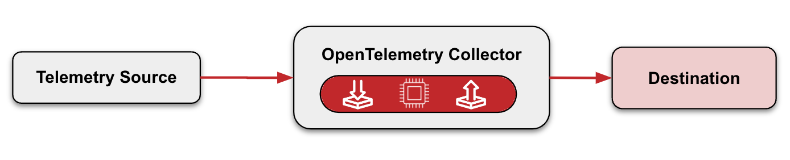
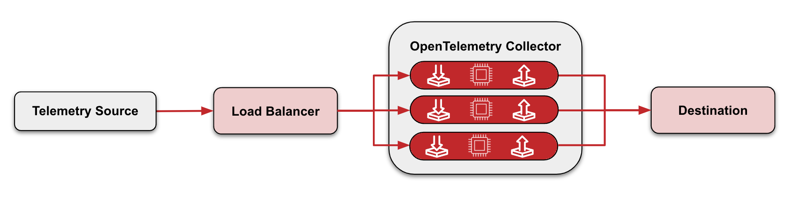

The [OpenTelemetry Collector](/docs/collector) is one of my favorite
OpenTelemetry (OTel) components. It’s a flexible and powerful data pipeline
which allows you to ingest OTel data from one or more sources, transform it
(including batching, filtering, and masking), and export it to one or more
observability backends for analysis. It’s vendor-neutral. It’s extensible,
meaning that you can create your own custom components for it. What’s there not
to like?

Unfortunately, as it happens with many tools out there, it is also very easy to
fall into some bad habits. Today, I will dig into five OpenTelemetry Collector
antipatterns, and how to avoid them. Let’s get started!

## Antipatterns

### 1- Improper use of Collector deployment modes

It’s not just enough to use a Collector. It’s also about _how_ your Collectors
are deployed within your organization. That’s right - Collector*s*, plural.
Because one is often not enough.

There are two deployment modes for Collectors: agent mode and gateway mode, and
both are needed.

In [agent mode](/docs/collector/deployment/agent/), the Collector sits next to
the application or on the same host as the application.

In [gateway mode](/docs/collector/deployment/gateway/), telemetry data is sent
to a load balancer, which then determines how to distribute the load amongst a
pool of Collectors. Because you have a pool of Collectors, should one Collector
in that pool fail, one of the other Collectors in the pool can take over. This
keeps data flowing to your destination sans disruptions. Gateway mode is
commonly deployed per cluster, data center, or region.

So which should you use? Both agent and gateway.

If you’re collecting telemetry data for your application, place a Collector
agent alongside your application. If you’re collecting data for infrastructure,
place a Collector agent alongside your infrastructure. Whatever you do, don’t
collect telemetry for all of your infrastructure and applications using a single
Collector. That way, if one Collector fails, the rest of your telemetry
collection is unaffected.

The telemetry from your Collector agents can then be sent to a Collector
gateway. Because the gateway sits behind a load balancer, you don’t have a
single point of failure for exporting telemetry data, typically to your
observability backend.

_Bottom line:_ Having the right Collector deployment configuration to send data
to your observability backend ensures higher availability of your telemetry
collection infrastructure.

### 2- Not monitoring your Collectors

Deploying multiple Collector agents and a Collector gateway is great, but it’s
not good enough. Wouldn’t it be nice to know when one of your Collectors is
malfunctioning, or when data is being dropped? That way, you can take action
before things start to escalate. This is where monitoring your Collectors can be
very useful.

But how does one monitor a Collector? The OTel Collector already emits
[metrics for the purposes of its own monitoring](/docs/collector/internal-telemetry/#use-internal-telemetry-to-monitor-the-collector).
These can then be sent to your Observability backend for monitoring.

### 3- Not using the right Collector Distribution (or not building your own distribution)

There are two official distributions of the OpenTelemetry Collector:
[Core](https://github.com/open-telemetry/opentelemetry-collector), and
[Contrib](https://github.com/open-telemetry/opentelemetry-collector-contrib).

The Core distribution is a bare-bones distribution of the Collector for OTel
developers to develop and test. It contains a base set of
[extensions](/docs/collector/configuration/#service-extensions),
[connectors](/docs/collector/configuration/#connectors),
[receivers](/docs/collector/configuration/#receivers),
[processors](/docs/collector/configuration/#processors), and
[exporters](/docs/collector/configuration/#exporters).

The Contrib distribution is for non-OTel developers to experiment and learn. It
also extends the Core distribution, and includes components created by
third-parties (including vendors and individual community members), that are
useful to the OpenTelemetry community at large.

Neither Core nor Contrib alone are meant to be part of your production workload.
Using just Core by itself is too bare-bones and wouldn’t suit an organization’s
needs. (Though its components are absolutely needed!) And although many
OpenTelemetry practitioners, deploy Contrib in their respective organizations,
it has many components, and you likely won’t need every single exporter,
receiver, processor, connector, and extension. That would be overkill, and your
Collector instance ends up needlessly bloated, potentially increasing the attack
surface.

But how do you pick and choose the components that you need? The answer is to
build your own distribution, and you can do that using a tool called the
[OpenTelemetry Collector Builder](/docs/collector/custom-collector/) (OCB). In
addition, at some point, you may need to create your own custom Collector
component, such as a processor or exporter. The OCB allows you to integrate your
custom components AND pick and choose the Contrib components that you need.

It is also worth mentioning that some vendors build their own
[Collector distributions](/ecosystem/distributions/). These are OTel Collector
distributions that are curated to Collector components that are specific to that
vendor. They may be a combination of custom, vendor-developed components, and
curated Collector Contrib components. Using vendor-specific distributions
ensures that you are using just the Collector components that you need, again
reducing overall bloat.

_Bottom line:_ Using the right distribution reduces bloat and allows you to
include only the Collector components that you need.

### 4- Not updating your Collectors

This one’s short and sweet. Keeping software up-to-date is important, and the
Collector is no different! By regularly updating the Collector, it allows you to
stay up-to-date with the latest version so that you can take advantage of new
features, bug fixes, performance improvements, and security fixes.

### 5- Not using the OpenTelemetry Collector where appropriate

OpenTelemetry allows you to send telemetry signals from your application to an
observability backend in one of two ways:

- [Directly from the application](/docs/collector/deployment/no-collector/)
- [Via the OpenTelemetry Collector](/docs/collector/)

Sending telemetry data “direct from application” for non-production systems is
all well and good if you’re getting started with OpenTelemetry, but it is
neither suited nor recommended to use this approach for production systems.
Instead, the
[OpenTelemetry docs recommend using the OpenTelemetry Collector](/docs/collector/#when-to-use-a-collector).
How come?

[Per the OTel Docs](/docs/collector/#when-to-use-a-collector), the Collector
“allows your service to offload data quickly and the collector can take care of
additional handling like retries, batching, encryption or even sensitive data
filtering.”

Check out some additional Collector benefits:

- **Collectors can enhance the quality of the telemetry emitted by an
  application while also minimizing costs.** For example: sampling spans to
  reduce costs, enriching telemetry with extra metadata, and generating new
  telemetry, such as metrics derived from spans.
- **Using a Collector to ingest telemetry data makes it easy to change to a new
  backend or export the data in a different format.** If we want to change how
  telemetry is being processed or exported, that change happens in one place
  (the Collector!), as opposed to making the same change for multiple
  applications in your organization.
- **Collectors allow you to receive data of various formats and translate to the
  desired format for export.** This can be very handy when transitioning from
  some other telemetry solution to OTel.
- **Collectors allow you to ingest non-application telemetry.** This includes
  logs and non-app metrics from infrastructure like Azure, Prometheus, and
  Cloudwatch.

That being said, there are some use-cases where folks don't want or can't use a
Collector. For instance, when collecting data at the edge from IOT devices, it
might be better to send data directly to their observability backend instead of
a local Collector, given that resources on that edge might be limited.

_Bottom line:_ As a general rule, using the OpenTelemetry Collector gives you
additional flexibility for managing your telemetry data.

## Final Thoughts

The OpenTelemetry Collector is a powerful and flexible tool for ingesting,
manipulating, and exporting OpenTelemetry data. By using it to its full
potential and by avoiding these five pitfalls, your organization can be well on
its way towards achieving observability greatness.
