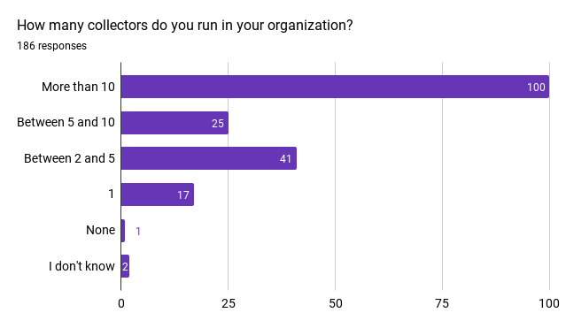
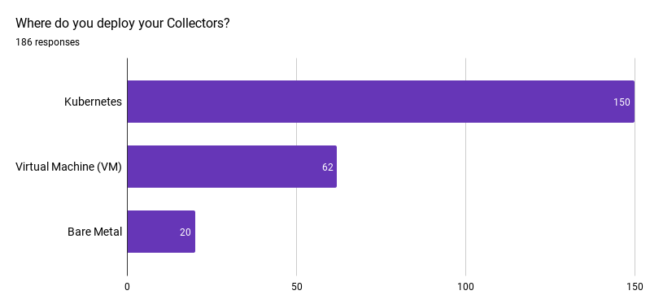
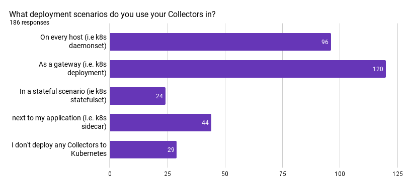
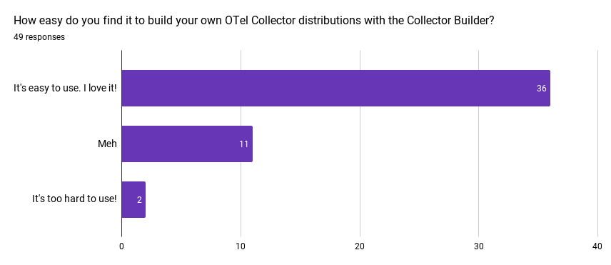
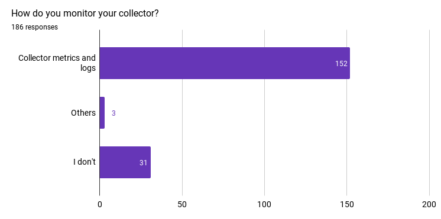
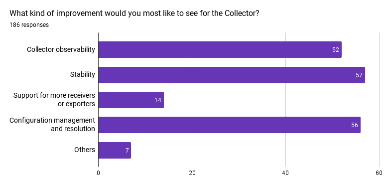

The [OpenTelemetry (OTel) Collector](/docs/collector/) has become a cornerstone
tool for observing and monitoring modern software applications. Recently, the
End User SIG conducted a survey to gather feedback from users about their
experiences with the OTel Collector. While we acknowledge that the 186 responses
we received may not be statistically significant, they represent a great start
and provide valuable insights. These insights include details about users’
deployment practices and implementation challenges, which are instrumental in
helping to drive the OTel Collector’s future direction.

## Key Takeaways

- Companies typically have medium to large collector deployments:
  - \>5 Collectors: 125/186
  - \>10 Collectors: 100/186
- Building custom binaries/distributions of the Collector is more popular than
  expected (61/186), with most people using the
  [OTel Collector Builder](https://github.com/open-telemetry/opentelemetry-collector-builder)
  to do so (49/61)
- The vast majority deploy the Collector on Kubernetes (150/186)
- There's more desire for stability (59), self-observability (53), and config
  management (59), than for new components (14)

## Detailed Insights

### Deployment Scale and Environment

Our findings indicate robust use of the OTel Collector at scale, with
53.8%(100/186) of respondents deploying more than 10 collectors, 13.4%(25/186)
running between 5 and 10 collectors, and 22%(41/186) running between 2 and 5
collectors.

Kubernetes is the leading platform for Collector deployment (80.6%), followed by
virtual machines (33.3%) and bare metal (10.8%).

### Usage Scenarios

The OTel Collector is primarily used as a gateway (64.5%), demonstrating its
pivotal role in aggregating telemetry data from various sources. Daemonsets
(51.6%) and sidecars (23.7%) are also popular deployment models, showcasing the
flexibility of the OTel Collector in different operational contexts.

### Customization and Configuration

A surprising number of people build their own distributions of the Collector
(61/186), indicating that providing a composable Collector is important for the
community. Most people who do build their own Collector distros use the
[OTel Collector Builder (OCB)](https://github.com/open-telemetry/opentelemetry-collector-builder)
(49/61). Of the 49 respondents who leverage the OCB, most were able to figure it
out, with only 2 respondents stating that it’s too hard to use.

### Monitoring and Observability

When it comes to monitoring the Collectors, a vast majority of respondents rely
on Collector metrics and logs (81.7%), and only a few don't monitor their
Collector(s) at all (16.6%). When we peered deeper into the data, we found that
of the 125 respondents with more than 5 Collectors, only 15 are not monitoring
their Collectors, and of the 100 respondents with more than 10 Collectors, only
9 are not monitoring their Collectors. This seems to indicate that users take
monitoring their Collectors seriously once they reach a certain maturity with
their Collector deployments.

### OTel Components Usage

The OTel Collector's flexibility is vividly illustrated by the wide array of
exporters, receivers, processors, connectors, and extensions that are used
across various environments. This highlights the Collector's capability to
integrate with a vast range of tools and systems.

The top components according to our survey results are as follows:

### Exporters

1. [otlpexporter](https://github.com/open-telemetry/opentelemetry-collector/tree/main/exporter/otlpexporter)
2. [prometheusremotewriteexporter](https://github.com/open-telemetry/opentelemetry-collector-contrib/blob/v0.117.0/exporter/prometheusremotewriteexporter/README.md)
3. [prometheusexporter](https://github.com/open-telemetry/opentelemetry-collector-contrib/blob/v0.117.0/exporter/prometheusexporter/README.md)
4. [lokiexporter](https://github.com/open-telemetry/opentelemetry-collector-contrib/blob/v0.117.0/exporter/lokiexporter/README.md)
5. [debugexporter](https://github.com/open-telemetry/opentelemetry-collector/tree/main/exporter/debugexporter)

### Receivers

1. [otlpreceiver](https://github.com/open-telemetry/opentelemetry-collector/tree/main/receiver/otlpreceiver)
2. [prometheusreceiver](https://github.com/open-telemetry/opentelemetry-collector-contrib/blob/v0.117.0/receiver/prometheusreceiver/README.md)
3. [filelogreceiver](https://github.com/open-telemetry/opentelemetry-collector-contrib/tree/main/receiver/filelogreceiver)
4. [hostmetricsreceiver](https://github.com/open-telemetry/opentelemetry-collector-contrib/blob/v0.117.0/receiver/hostmetricsreceiver/README.md)
5. [k8sclusterreceiver](https://github.com/open-telemetry/opentelemetry-collector-contrib/blob/v0.117.0/receiver/k8sclusterreceiver/README.md)

### Processors

1. [batchprocessor](https://github.com/open-telemetry/opentelemetry-collector/tree/main/processor/batchprocessor)
2. [attributesprocessor](https://github.com/open-telemetry/opentelemetry-collector-contrib/blob/v0.117.0/processor/attributesprocessor/README.md)
3. [filterprocessor](https://github.com/open-telemetry/opentelemetry-collector-contrib/blob/v0.117.0/processor/filterprocessor/README.md)
4. [memorylimiterprocessor](https://github.com/open-telemetry/opentelemetry-collector/tree/main/processor/memorylimiterprocessor)
5. [k8sattributesprocessor](https://github.com/open-telemetry/opentelemetry-collector-contrib/blob/v0.117.0/processor/k8sattributesprocessor/README.md)

### Connectors

1. [spanmetricsconnector](https://github.com/open-telemetry/opentelemetry-collector-contrib/blob/v0.117.0/connector/spanmetricsconnector/README.md)
2. [servicegraphconnector](https://github.com/open-telemetry/opentelemetry-collector-contrib/blob/v0.117.0/connector/servicegraphconnector/README.md)
3. [routingconnector](https://github.com/open-telemetry/opentelemetry-collector-contrib/blob/v0.117.0/processor/routingprocessor/README.md)
4. [countconnector](https://github.com/open-telemetry/opentelemetry-collector-contrib/blob/v0.117.0/connector/countconnector/README.md)
5. [datadogconnector](https://github.com/open-telemetry/opentelemetry-collector-contrib/blob/v0.117.0/exporter/datadogexporter/README.md)

### Extensions

1. [healthcheckextension](https://github.com/open-telemetry/opentelemetry-collector-contrib/blob/v0.117.0/extension/healthcheckextension/README.md)
2. [basicauthextension](https://github.com/open-telemetry/opentelemetry-collector-contrib/blob/v0.117.0/extension/basicauthextension/README.md)
3. [pprofextension](https://github.com/open-telemetry/opentelemetry-collector-contrib/blob/v0.117.0/extension/pprofextension/README.md)
4. [bearertokenauthextension](https://github.com/open-telemetry/opentelemetry-collector-contrib/blob/v0.117.0/extension/bearertokenauthextension/README.md)
5. [oauth2clientauthextension](https://github.com/open-telemetry/opentelemetry-collector-contrib/blob/v0.117.0/extension/oauth2clientauthextension/README.md)

 

For a more detailed look at the specific exporters, receivers, processors,
connectors, and extensions in use, you can check out the
[raw results](https://github.com/open-telemetry/sig-end-user/blob/main/end-user-surveys/otel-collector/otel-collector-survey.csv).
The data provides a clear view of the popular choices within the community as
well as the niche configurations that exemplify the customizability of the OTel
Collector.

### Areas for Improvement

Respondents were clear about their desire for enhancements in stability (30.6%),
configuration management and resolution (30.1%), and self-observability (28%),
versus wanting new components (<8%)

The
[OTel Collector survey results](https://github.com/open-telemetry/sig-end-user/blob/main/end-user-surveys/otel-collector/otel-collector-survey.csv)
offer a snapshot of the current state of Collector deployment and utilization.
It's evident that while the OTel Collector is widely adopted and highly
customizable, there are also opportunities to make it more user-friendly and
robust.

## Keep in touch

Thanks to everyone who participated in the survey! We rely on your feedback to
help guide the future development of OpenTelemetry and to ensure it continues to
meet your evolving needs.

We will post upcoming surveys in the following avenues:
[#otel-sig-end-user Slack channel](https://cloud-native.slack.com/archives/C01RT3MSWGZ)
– you can also reach out to us here!
[End user resources page](/community/end-user/)
