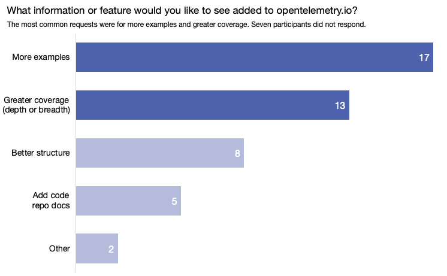

The OpenTelemetry End-User SIG recently surveyed the community to find out how
user-friendly OpenTelemetry’s documentation is. In an earlier survey, two-thirds
of respondents named comprehensive documentation as a top resource they wished
they’d had when getting started with OpenTelemetry. So we decided to dig a
little deeper. The Docs Usability Survey asked users where they go for OTel
documentation, what they’d like to see more of in the docs, and how they rate
the current state of the docs. We received 48 responses, which we'll use to
focus our documentation efforts and help us improve in key areas.

Check out the results!

## Key takeaways

- Folks want more visual aids like diagrams and screenshots.
- Of the three types of documentation we asked about (component concepts,
  installation instructions, and troubleshooting), the troubleshooting docs need
  the most work.
- When asked what information they’d most like to see added to OTel’s docs, the
  top answers were more examples and more coverage, both in depth and breadth.
- The Collector docs were the most consulted docs set based on number of
  ratings.
- The Java documentation was the overall highest rated docs, after normalization
  and weighting, while the Swift docs received the overall lowest rating
- Among the six most popular docs sets, the JavaScript docs received the lowest
  rating.

## Detailed insights

### About the respondents

- 79% are using OTel in production.
- 21% work for an observability or APM vendor.
- 98% have previous knowledge of observability: intermediate (60%) or expert
  (38%).

#### Q: What source do you primarily rely on when you're looking for information about OpenTelemetry?

- Overall, the majority of respondents (52%) rely on the opentelemetry.io
  documentation.
- Respondents early in their observability practice (beginner and intermediate)
  are more likely to use the opentelemetry.io documentation.
- Expert observability practitioners prefer the code repository documentation.

### Documentation wish list

#### Q: What features or information would you like to see added to opentelemetry.io that aren't currently available?

We asked respondents to describe in their own words what they’d like to see
added to the opentelemetry.io documentation. We loosely grouped their responses
into six categories. Some answers fell in more than one category. You can also
read the
[full responses](https://docs.google.com/spreadsheets/d/1kpJQYiEGtpZorICbl-QfYL3mKfeoRLiUywvKcV8fcNA/edit?resourcekey=&gid=439437959#gid=439437959).

- More examples: 17 (35%)
- Deeper or broader coverage: 13 (27%)
- Better structure: 8 (17%)
- Add code repository docs: 5 (10%)
- Other: 2 (4%)
- No response: 7 (15%)

#### Q: Would more visual aids (e.g., diagrams and screenshots) explaining OpenTelemetry concepts be helpful?

An overwhelming 81% said yes: they want more visual aids.

### Current state of the docs

#### Q: How well do the current docs at opentelemetry.io explain the different components of OpenTelemetry?

Most respondents felt the component conceptual documentation was average, with a
top score of 3.

#### Q: How straightforward and user-friendly are the installation instructions for OpenTelemetry?

Most respondents found OTel instructions better than average, with a top score
of 4. Respondents with intermediate-level observability knowledge rated them
higher than experts: 55% of intermediates rated the installation instructions 4
or 5, compared with only 17% of experts.

#### Q: How comprehensive are the troubleshooting sections?

Most respondents believe that this section of docs needs work. Only 15% rated
the troubleshooting docs 4 or 5, and they were all intermediate-level
respondents. None of the expert-level respondents rated the troubleshooting docs
above a 3.

#### Q: How would you rate your experience using the current OTel documentation for the following languages and components?

Respondents were asked to rate only the documentation that applied to them, so
we can infer based on their responses which docs sets are the most used.

- The Collector documentation is the most used: 77% of respondents rated it.
- The next five documentation sets are close in popularity, with 50 to 67% of
  respondents rating them.

Here are the tabulated ratings for all languages and components. When the
results are normalized and weighted, we can see additional insights:

- The Java documentation has the highest overall rating.
- The Swift documentation has the lowest overall rating.

If we combine these insights, we can see that the documentation used by the most
people and needing the most work is the JavaScript documentation.

## Learn more

For a more detailed look at the survey, you can see the
[full results](https://docs.google.com/spreadsheets/d/1kpJQYiEGtpZorICbl-QfYL3mKfeoRLiUywvKcV8fcNA/edit?resourcekey=&gid=439437959#gid=439437959).

## Keep in touch

Thanks to everyone who participated in the survey! We rely on your feedback to
help guide the future development of OpenTelemetry and to ensure it continues to
meet your evolving needs. You can keep in touch and learn about upcoming surveys
in the following places:

- [#otel-sig-end-user Slack channel](https://cloud-native.slack.com/archives/C01RT3MSWGZ)
- [#otel-comms Slack channel](https://cloud-native.slack.com/archives/C02UN96HZH6)
- [End user resources page](/community/end-user/)
