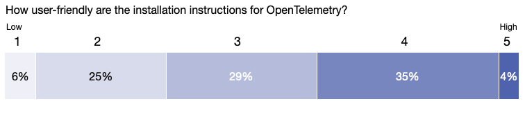
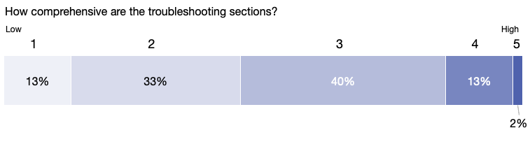

[The OpenTelemetry End-User SIG](/community/end-user/) recently surveyed the
community to find out how user-friendly [OpenTelemetry's documentation](/docs/)
is. In an earlier survey, two-thirds of respondents named comprehensive
documentation as a top resource they wished they'd had when getting started with
OpenTelemetry. So we decided to dig a little deeper.

The Docs Usability Survey asked users where they go for OTel documentation, what
they'd like to see more of in the docs, and how they rate the current state of
the docs. We received 48 responses, which we'll use to focus our documentation
efforts and help us improve in key areas.

A big thank you to everyone who participated in the survey! Let's review the
results.

## Key takeaways

- Respondents expressed a desire for **more visual aids**, such as diagrams and
  screenshots.
- Of the three types of documentation we asked about (component concepts,
  installation instructions, and troubleshooting), the **troubleshooting docs**
  were identified as needing the most improvement.
- When asked about the information they’d most like to see added to OTel's docs,
  the top responses were **more examples** and **expanded coverage**, both in
  depth and breadth.
- The [Collector](/docs/collector/) docs emerged as the most frequently
  consulted resource, a finding that aligns with the page view analysis in the
  SIG Communications'
  [year-end review](../year-in-review/#which-pages-were-the-most-popular).
- After normalization and weighting, the [Java](/docs/languages/java/)
  documentation received the **highest overall rating**, reflecting the positive
  impact of recent improvements to its
  [organization](../year-in-review/#ia-improvements). Conversely, the
  [Swift](/docs/languages/swift/) docs received the lowest overall rating.
- Among the six most popular documentation sets, the
  [JavaScript](/docs/languages/js/) docs received the **lowest rating**.

## Detailed insights

### About the respondents

- 79% are using OTel in production.
- 21% work for an observability or APM vendor.
- 98% have previous knowledge of observability: intermediate (60%) or expert
  (38%).

#### Q: What source do you primarily rely on when you're looking for information about OpenTelemetry?

- Overall, the majority of respondents (52%) rely on the [opentelemetry.io]
  documentation.
- Respondents early in their observability practice (beginner and intermediate)
  are more likely to use the [opentelemetry.io] documentation.
- Expert observability practitioners prefer the code repository documentation.

[opentelemetry.io]: /docs/

> **Respondents who use [opentelemetry.io] as their primary information**
> source _By level of observability knowledge_
>
> | Beginners | Intermediates | Experts |
> | :-------: | :-----------: | :-----: |
> |   100%    |      62%      |   44%   |

### Documentation wish list

#### Q: What features or information would you like to see added to opentelemetry.io that aren't currently available?

We asked respondents to describe in their own words what they'd like to see
added to the [opentelemetry.io] documentation. We loosely grouped their
responses into six categories. Some answers fell in more than one category. For
full responses, see [Docs Usability Survey Responses].

[Docs Usability Survey Responses]:
  https://docs.google.com/spreadsheets/d/1kpJQYiEGtpZorICbl-QfYL3mKfeoRLiUywvKcV8fcNA

- More examples: 17 (35%)
- Deeper or broader coverage: 13 (27%)
- Better structure: 8 (17%)
- Add code repository docs: 5 (10%)
- Other: 2 (4%)
- No response: 7 (15%)

#### Q: Would more visual aids (e.g., diagrams and screenshots) explaining OpenTelemetry concepts be helpful?

An overwhelming 81% said yes: they want more visual aids.

### Current state of the docs

#### Q: How well do the current docs at opentelemetry.io explain the different components of OpenTelemetry?

Most respondents felt the component conceptual documentation was average, with a
top score of 3.

#### Q: How straightforward and user-friendly are the installation instructions for OpenTelemetry?

Most respondents found OTel instructions better than average, with a top score
of 4. Respondents with intermediate-level observability knowledge rated them
higher than experts: 55% of intermediates rated the installation instructions 4
or 5, compared with only 17% of experts.

#### Q: How comprehensive are the troubleshooting sections?

Most respondents believe that this section of docs needs work. Only 15% rated
the troubleshooting docs 4 or 5, and they were all intermediate-level
respondents. None of the expert-level respondents rated the troubleshooting docs
above a 3.

#### Q: How would you rate your experience using the current OTel documentation for the following languages and components?

Respondents were asked to rate only the documentation that applied to them, so
we can infer based on their responses which docs sets are the most used.

- The Collector documentation is the most used: 77% of respondents rated it.
- The next five documentation sets are close in popularity, with 50 to 67% of
  respondents rating them.

Here are the tabulated ratings for all languages and components. When the
results are normalized and weighted, we can see additional insights:

- The Java documentation has the highest overall rating.
- The Swift documentation has the lowest overall rating.

> **How would you rate your experience using the current OTel documentation for
> the following languages and components?**
>
> | Language or component | Poor | Okay | Great | Total responses | Normalized & weighted |
> | :-------------------- | :--: | :--: | :---: | :-------------: | :-------------------: |
> | Java                  |  3   |  16  |   8   |       27        |        7.3333         |
> | PHP                   |  1   |  4   |   2   |        7        |        7.1429         |
> | GO                    |  6   |  12  |   9   |       27        |        7.1111         |
> | Collector             |  9   |  17  |  11   |       37        |        6.8108         |
> | Python                |  6   |  17  |   8   |       31        |        6.7742         |
> | Kubernetes            |  6   |  20  |   6   |       32        |        6.3750         |
> | C++                   |  0   |  7   |   0   |        7        |        6.0000         |
> | JavaScript            |  3   |  19  |   2   |       24        |        6.0000         |
> | Ruby                  |  1   |  5   |   1   |        7        |        6.2857         |
> | Rust                  |  4   |  4   |   2   |       10        |        5.6000         |
> | .NET                  |  4   |  8   |   2   |       14        |        5.7143         |
> | Erlang                |  1   |  6   |   0   |        7        |        5.4286         |
> | FaaS                  |  5   |  7   |   0   |       12        |        4.3333         |
> | Swift                 |  3   |  3   |   0   |        6        |        4.0000         |
> | **Total**             |  52  | 145  |  51   |                 |                       |

If we combine these insights, we can see that the documentation used by the most
people that needs the most work is the JavaScript documentation.

> **Where should we focus our improvement efforts?**  _JavaScript is one of
> the six most-used docs sets, but its rating is the lowest._
>
> | Language or component | Poor | Okay | Great | Total responses | Normalized & weighted |
> | :-------------------- | :--: | :--: | :---: | :-------------: | :-------------------: |
> | GO                    |  6   |  12  |   9   |       27        |        7.1111         |
> | Java                  |  3   |  16  |   8   |       27        |        7.3333         |
> | JavaScript            |  3   |  19  |   2   |       24        |        6.0000         |
> | Python                |  6   |  17  |   8   |       31        |        6.7742         |
> | Collector             |  9   |  17  |  11   |       37        |        6.8108         |
> | Kubernetes            |  6   |  20  |   6   |       32        |        6.3750         |

## Learn more

For detailed survey results, see [Docs Usability Survey Responses].

## Your feedback is essential

Thanks again to everyone who participated in the survey! Your feedback is
crucial for guiding the future development of OpenTelemetry and ensuring it
continues to meet your evolving needs. Stay connected and learn about upcoming
surveys through the following channels:

- [#otel-sig-end-user Slack channel](https://cloud-native.slack.com/archives/C01RT3MSWGZ)
- [#otel-comms Slack channel](https://cloud-native.slack.com/archives/C02UN96HZH6)
- [End user resources page](/community/end-user/)
