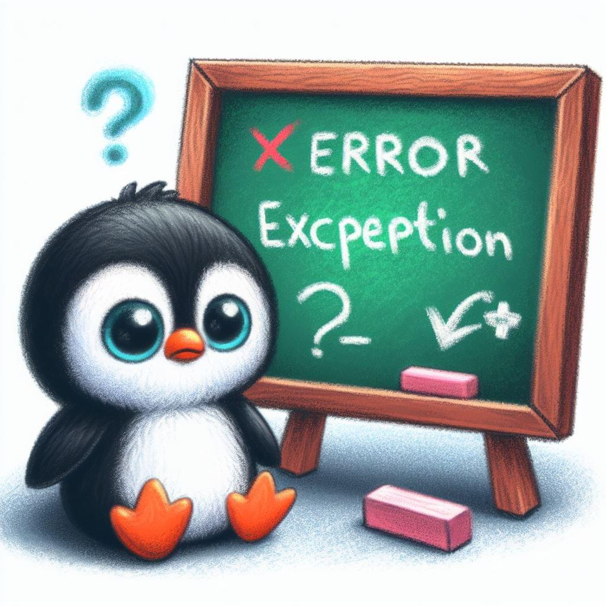
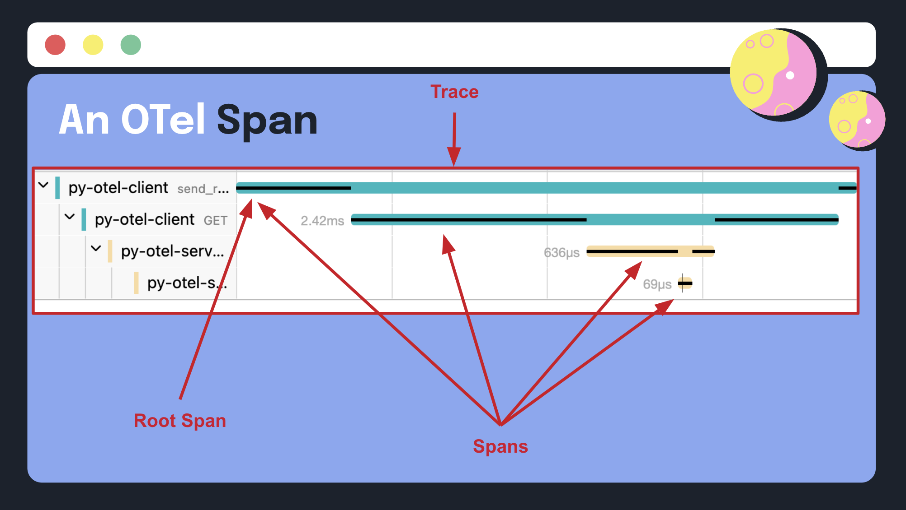
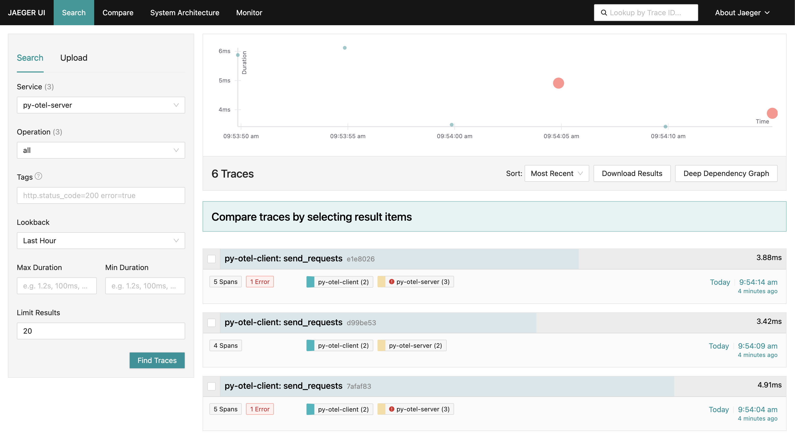
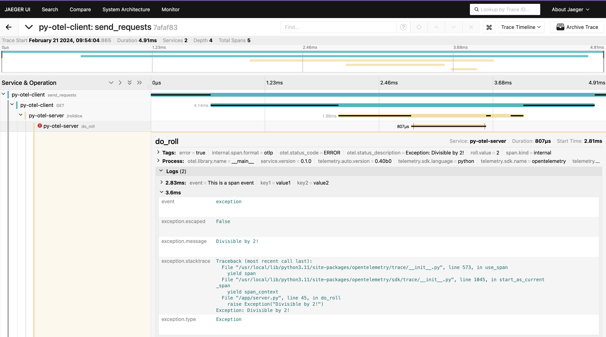

Depending on the language you’re used to developing in, you may have certain
ideas about what an error is, as well as what constitutes an exception and how
it should be handled. For example, Go doesn't have exceptions, partly to
discourage programmers from labeling too many ordinary errors as exceptional. On
the other hand, languages such as Java and Python provide built-in support for
throwing and catching exceptions.

When different languages disagree about what errors or exceptions are and how to
handle them, what do you use when you need standardized telemetry and error
reporting across microservices written in those languages? OpenTelemetry is the
tool with which we'll address the following, and more:

- How an error is visualized in a backend might not be where you think it’ll be,
  or how you expect it to look.
- How span kind affects error reporting.
- Errors reported by spans versus logs.

## Errors versus exceptions

Before we get into how OTel deals with errors and exceptions, let’s establish
what they are, and how they differ from each other. While there are variations
on the definitions of these terms, we’ve landed on the following ones, which
we’ll be using in this article. Note that this is **not** official OTel
language; they are general industry definitions:

An **error** is an unexpected issue in a program that hinders its execution.
Examples include syntax errors, such as a missing semicolon or incorrect
indentation, and runtime errors, resulting from errors in logic.

An **exception** is a type of runtime error that disrupts the normal flow of a
program. Examples include dividing by zero or accessing an invalid memory
address.

Some languages, such as Python and JavaScript, treat errors and exceptions as
synonyms; others, such as PHP and Java, do not. Understanding the distinction
between errors and exceptions is crucial for effective error handling, because
it empowers you to adopt more nuanced strategies for handling and recovering
from failures in your applications.

## Handling errors in OTel

So how does OTel deal with all these conceptual differences across languages?
This is where the [specification](/docs/specs/otel/) (or “spec” for short) comes
in. The spec provides a blueprint for developers working on various parts of the
project, and standardizes implementation across all languages.

Since language APIs and SDKs are implementations of the spec, there are general
rules against implementing anything that isn’t covered in the spec. This
provides a guiding principle to help organize contributions to the project. In
practice, there are a few exceptions; for example, a language might prototype a
new feature as part of adding it to the spec, but the feature may be published
(usually as alpha or experimental) before the corresponding language is added.

Another exception is when a language might decide to diverge from the spec.
Although it is generally not advised, sometimes there are strong
language-specific reasons to do something different. In this way, the spec
allows for some flexibility for each language to implement features as
idiomatically as possible. For example, most languages have implemented
`RecordException` (for example,
[Python](https://opentelemetry-python.readthedocs.io/en/latest/_modules/opentelemetry/sdk/trace.html#Span.record_exception)),
while Go has implemented
[`RecordError`](https://github.com/open-telemetry/opentelemetry-go/blob/main/sdk/trace/span.go),
which does the same thing.

You can view this
[compliance matrix](https://github.com/open-telemetry/opentelemetry-specification/blob/main/spec-compliance-matrix.md)
of the spec across all languages, but you’ll get the most updated info by
checking the individual language repository. Now we can begin figuring out how
to handle errors in OTel, starting with how to report them:

- Spans
- Logs

### Errors in spans

In OTel, spans are the building blocks of distributed traces, representing
individual units of work within a distributed system. Spans are related to each
other and to a trace through context. Put simply, context is the glue that turns
a pack of data into a unified trace. Context propagation allows us to pass
information across multiple systems, therefore tying them together. Traces can
tell us all sorts of things about our applications through metadata and span
events.

### Enhancing spans with metadata

OTel enables you to enhance spans with metadata
([attributes](/docs/concepts/signals/traces/#attributes)) in the form of
key-value pairs. By attaching relevant information to spans, such as user IDs,
request parameters, or environment variables, you can gain deeper insights into
the circumstances surrounding an error and quickly identify its root cause. This
metadata-rich approach to error handling can significantly reduce the time and
effort required to diagnose and resolve issues, ultimately improving the
reliability and maintainability of your applications.

Spans also have a [span kind](/docs/concepts/signals/traces/#span-kind) field,
which gives us some additional metadata that can help developers troubleshoot
errors. OTel defines several span kinds, each of which has unique implications
for error reporting:

- **client**: For outgoing synchronous remote calls (for example, outgoing HTTP
  request or DB call)
- **server**: For incoming synchronous remote calls (for example, incoming HTTP
  request or remote procedure call)
- **internal**: For operations that do not cross process boundaries (for
  example, instrumenting a function call)
- **producer**: For the creation of a job which may be asynchronously processed
  later (for example, job inserted into a job queue)
- **consumer**: For the processing of a job created by a producer, which may
  start long after the producer span has ended

Span kind is determined automatically by the instrumentation libraries used.

Spans can be further enhanced with
[span status](/docs/concepts/signals/traces/#span-status). By default, span
status is marked as `Unset` unless otherwise specified. You can mark a span
status as `Error` if the resulting span depicts an error, and `Ok` if the
resulting span is error-free.

### Enhancing spans with span events

A [span event](/docs/concepts/signals/traces/#span-events) is a structured log
message embedded within a span. Span events help enhance spans by providing
descriptive information about a span.
[Span events can also have attributes of their own](/docs/languages/ruby/instrumentation/#add-span-events).

Earlier, we mentioned a method called `RecordException`. Per
[the spec](/docs/specs/otel/trace/api/#record-exception) (emphasis our own), “To
facilitate recording an exception languages SHOULD provide a RecordException
method **if the language uses exceptions**… The signature of the method is to be
determined by each language and can be overloaded as appropriate.”

Since Go doesn’t support the “conventional” concept of exceptions, it instead
supports
[`RecordError`](https://github.com/open-telemetry/opentelemetry-go/blob/main/sdk/trace/span.go#L445-L467),
which essentially does the same thing idiomatically. You have to make an
additional call to set its status to `Error` if that’s what it should be, as it
won’t automatically be set to that. Similarly, `RecordException` can be used to
record span events without setting the span’s status to `Error`, which means you
can use it to record any additional data about a span.

By decoupling the span status from being automatically set to `Error` when a
span exception occurs, you can support the use case where you can have an
exception event with a status of `Ok` or `Unset`. This gives instrumentation
authors the most flexibility.

### Errors in logs

In OTel, a log is a structured, timestamped message emitted by a service or
other component. The recent addition of logs to OTel gives us yet another way of
reporting errors. Logs have traditionally had different severity levels for
representing the type of message being emitted such as `DEBUG`, `INFO`,
`WARNING`, `ERROR`, and `CRITICAL`.

OTel allows for the correlation of logs to traces, in which a log message can be
associated to a span within a trace, via trace context correlation. Hence,
looking for a log message with a log level of `ERROR` or `CRITICAL` can yield
further information of what led to that error, by pulling up the correlated
trace.

To record an error on a log, either `exception.type` or `exception.message` is
required, while `exception.stacktrace` is recommended. For more information, see
[Semantic Conventions for Exceptions in Logs](/docs/specs/semconv/exceptions/exceptions-logs/).

## Logs or spans to capture errors?

After all this, you might be wondering which signal to use to capture errors:
spans or logs? The answer is: "It depends!" Perhaps your team primarily uses
traces; perhaps it primarily uses logs.

Spans can be great for capturing errors, because if the operation errors out,
marking a span as an error makes it stand out and therefore easier to spot. On
the other hand, if you’re not filtering or tail sampling your traces and your
system is producing thousands of spans per minute, you could miss errors that
aren’t occurring frequently, but that still need to be handled.

What about using span events versus logs? Again, this depends. It may be
convenient to use span events, because when a span status is set to `Error`, a
span event with the exception message (and other metadata you may wish to
capture) is automatically created.

Another consideration is your observability backend. Does your backend render
both logs and traces? How easily queryable or discoverable are your logs, spans,
and span events? Is logs and trace correlation supported?

## Visualizing errors in different backends

While OTel provides us with the raw telemetry data emitted by our systems, it
doesn’t provide data visualization or interpretation. This is done by an
observability backend. Because OTel is vendor-neutral, it means that the same
information emitted can be visualized and interpreted by different backends
without re-instrumenting your application.

### Jaeger

Let’s take a look at what an OTel error looks like in
[Jaeger](https://www.jaegertracing.io/). The error data was generated by the
code in [this repository](https://github.com/avillela/otel-errors-talk). Here is
a trace view for the service
[py-otel-server](https://github.com/avillela/otel-errors-talk/blob/main/src/python/server.py).
As you can see below, the error spans show up as red dots:

And if we drill down and zero in on the error span, we can click into `Logs`,
which is how span events are expressed in Jaeger, and view the information that
was captured on it:

The span is clearly marked as error, and includes a span event with the
exception captured. Jaeger expresses the span event as a log, but does not
visualize logs outside of spans.

### Proprietary backends

If you’ve been using a proprietary agent to monitor your applications and have
recently migrated to OTel, you might notice that an OTel error may not be
expressed the way you expect in your observability backend, as compared to the
same error captured by the proprietary agent. This is most likely due to the
fact that OTel simply models errors differently than how vendors have been
modeling them.

As a broad example, vendors might have their own notion of what constitutes a
logical unit of work in an application. You may be familiar with the term
`transaction`, which means something slightly different from vendor to vendor.
In OTel, this is represented by a trace. You’ve likely noticed differences in
your data visualization experiences as vendors make their own adjustments to
their platforms to accommodate OTLP as a first-class citizen data type.

As a more specific example, OTel’s notion of span kinds may affect how your OTel
error is expressed in your backend. For instance, if you have a trace that has
one exception and it’s on an internal span with its status set to `Error`, you
should see the trace marked with an error, but it may not be counted toward your
overall app error rate. This is because the vendor might have an opinion that
only errors on entry point spans (server spans) and consumer spans should be
counted toward your error rate.

If your backend supports trace and log correlation, you should be able to
navigate to the associated trace from the log, and vice versa. Furthermore,
while Jaeger visualizes span events as logs, some vendors might synthesize span
events as its own data type instead of as a log data type, which would impact
the way you query that data.

## Conclusion

We’ve just explored the challenges of handling errors and exceptions across
different programming languages within a microservices architecture, and
introduced OTel as a solution for standardized telemetry and error reporting.
The OTel specification serves as a blueprint for standardizing error handling
across various languages, providing guidelines for implementation, but allowing
for a degree of flexibility.

You can record errors on spans by making use of your language SDK’s
`RecordException` or its equivalent, and enrich the span events further by
adding custom attributes. You can also record errors on logs by adding
`exception.type` or `exception.message`, and capture the stack trace by adding
`exception.stacktrace` to yield further information about what happened.

Once that data is in your observability backend, if you have previously used
their proprietary monitoring agent, you might notice that there is a difference
in how OTel-instrumented errors are visualized versus how the agent-instrumented
errors were visualized. This is mainly because OTel models errors differently
than vendors might have previously done.

By leveraging OTel's capabilities to record errors through logs and spans and to
enhance them with metadata, you can gain deeper insights into your applications'
behavior and more effectively troubleshoot issues. You'll be better equipped to
build and maintain resilient, reliable, and high-performing software
applications in today's dynamic and demanding environments. To learn more, see
[Error handling in OpenTelemetry](/docs/specs/otel/error-handling/).

_A version of this article was
[originally posted](https://newrelic.com/blog/how-to-relic/dude-wheres-my-error)
on the New Relic blog._
