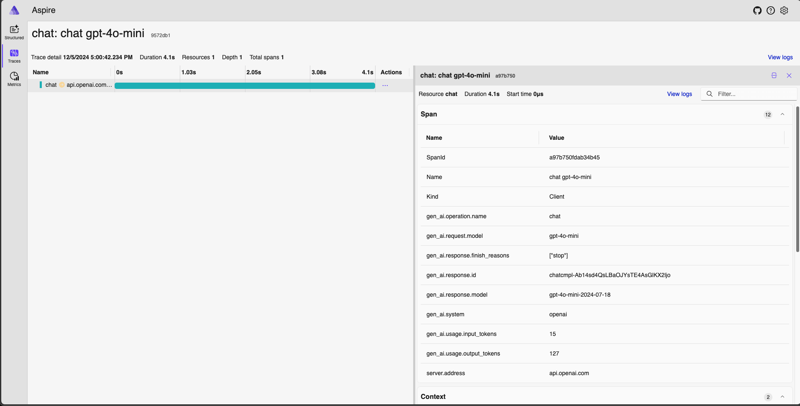
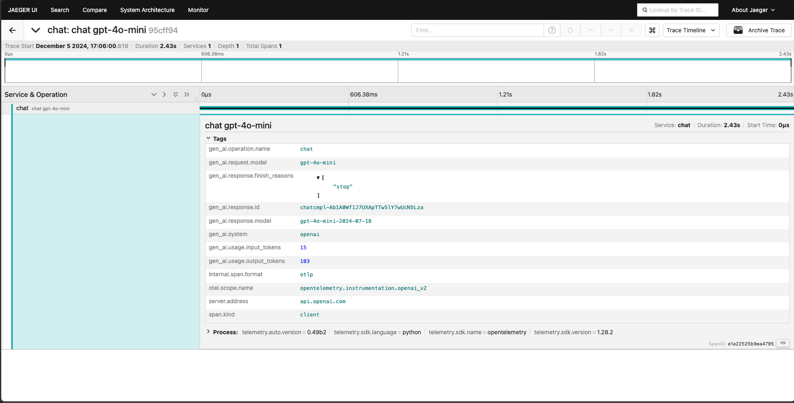
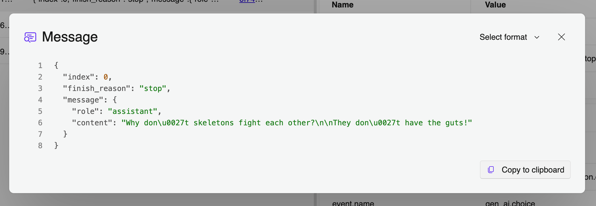

As organizations increasingly adopt Large Language Models (LLMs) and other
generative AI technologies, ensuring reliable performance, efficiency, and
safety is essential to meet user expectations, optimize resource costs, and
safeguard against unintended outputs. Effective observability for AI operations,
behaviors, and outcomes can help meet these goals. OpenTelemetry is being
enhanced to support these needs specifically for generative AI.

Two primary assets are in development to make this possible: **Semantic
Conventions** and **Instrumentation Libraries**. The first instrumentation
library targets the
[OpenAI Python API library](https://pypi.org/project/openai/).

[**Semantic Conventions**](/docs/concepts/semantic-conventions/) establish
standardized guidelines for how telemetry data is structured and collected
across platforms, defining inputs, outputs, and operational details. For
generative AI, these conventions streamline monitoring, troubleshooting, and
optimizing AI models by standardizing attributes such as model parameters,
response metadata, and token usage. This consistency supports better
observability across tools, environments, and APIs, helping organizations track
performance, cost, and safety with ease.

The
[**Instrumentation Library**](/docs/specs/otel/overview/#instrumentation-libraries)
is being developed within the
[OpenTelemetry Python Contrib](https://github.com/open-telemetry/opentelemetry-python-contrib)
under
[instrumentation-genai](https://github.com/open-telemetry/opentelemetry-python-contrib/tree/main/instrumentation-genai)
project to automate telemetry collection for generative AI applications. The
first release is a Python library for instrumenting OpenAI client calls. This
library captures spans and events, gathering essential data like model inputs,
response metadata, and token usage in a structured format.

## Key Signals for Generative AI

The [Semantic Conventions for Generative AI](/docs/specs/semconv/gen-ai/) focus
on capturing insights into AI model behavior through three primary signals:
[Traces](/docs/concepts/signals/traces/),
[Metrics](/docs/concepts/signals/metrics/), and
[Events](https://github.com/open-telemetry/opentelemetry-specification/blob/v1.40.0/specification/logs/event-api.md).

Together, these signals provide a comprehensive monitoring framework, enabling
better cost management, performance tuning, and request tracing.

### Traces: Tracing Model Interactions

Traces track each model interaction's lifecycle, covering input parameters (for
example, temperature, top_p) and response details like token count or errors.
They provide visibility into each request, aiding in identifying bottlenecks and
analyzing the impact of settings on model output.

### Metrics: Monitoring Usage and Performance

Metrics aggregate high-level indicators like request volume, latency, and token
counts, essential for managing costs and performance. This data is particularly
critical for API-dependent AI applications with rate limits and cost
considerations.

### Events: Capturing Detailed Interactions

Events log detailed moments during model execution, such as user prompts and
model responses, providing a granular view of model interactions. These insights
are invaluable for debugging and optimizing AI applications where unexpected
behaviors may arise.

{}

Note that we decided to use [events emitted] with the
[Logs API](/docs/specs/otel/logs/api/) specification in the Semantic Conventions
for Generative AI. Events allows for us to define specific
[semantic conventions](/docs/specs/semconv/general/events/) for the user prompts
and model responses that we capture. This addition to the API is in development
and considered unstable.

[events emitted]:
  https://github.com/open-telemetry/opentelemetry-specification/blob/v1.40.0/specification/logs/api.md#emit-an-event

{}

### Extending Observability with Vendor-Specific Attributes

The Semantic Conventions also define vendor-specific attributes for platforms
like OpenAI and Azure Inference API, ensuring telemetry captures both general
and provider-specific details. This added flexibility supports multi-platform
monitoring and in-depth insights.

## Building the Python Instrumentation Library for OpenAI

This Python-based library for OpenTelemetry captures key telemetry signals for
OpenAI models, providing developers with an out-of-the-box observability
solution tailored to AI workloads. The library,
[hosted within the OpenTelemetry Python Contrib repository](https://github.com/open-telemetry/opentelemetry-python-contrib/tree/opentelemetry-instrumentation-openai-v2%3D%3D2.0b0/instrumentation-genai/opentelemetry-instrumentation-openai-v2),
automatically collects telemetry from OpenAI model interactions, including
request and response metadata and token usage.

As generative AI applications grow, additional instrumentation libraries for
other languages will follow, extending OpenTelemetry support across more tools
and environments. The current library's focus on OpenAI highlights its
popularity and demand within AI development, making it a valuable initial
implementation.

### Example Usage

Here's an example of using the OpenTelemetry Python library to monitor a
generative AI application with the OpenAI client.

Install the OpenTelemetry dependencies:

```shell
pip install opentelemetry-distro
opentelemetry-bootstrap -a install
```

Set the following environment variables, updating the endpoint and protocol as
appropriate:

```shell
OPENAI_API_KEY=<replace_with_your_openai_api_key>

OTEL_EXPORTER_OTLP_ENDPOINT=http://localhost:4318
OTEL_EXPORTER_OTLP_PROTOCOL=http/protobuf
OTEL_SERVICE_NAME=python-opentelemetry-openai
OTEL_LOGS_EXPORTER=otlp_proto_http
OTEL_PYTHON_LOGGING_AUTO_INSTRUMENTATION_ENABLED=true
# Set to false or remove to disable log events
OTEL_INSTRUMENTATION_GENAI_CAPTURE_MESSAGE_CONTENT=true
```

Then include the following code in your Python application:

```python
import os
from openai import OpenAI

client = OpenAI()
chat_completion = client.chat.completions.create(
    model=os.getenv("CHAT_MODEL", "gpt-4o-mini"),
    messages=[
        {
            "role": "user",
            "content": "Write a short poem on OpenTelemetry.",
        },
    ],
)
print(chat_completion.choices[0].message.content)
```

And then run the example using `opentelemetry-instrument`:

```shell
opentelemetry-instrument python main.py
```

If you do not have a service running to collect telemetry, you can export to the
console using the following:

```shell
opentelemetry-instrument --traces_exporter console --metrics_exporter console python main.py
```

There is a complete example
[available here](https://github.com/open-telemetry/opentelemetry-python-contrib/tree/main/instrumentation-genai/opentelemetry-instrumentation-openai-v2/examples/).

With this simple instrumentation, one can begin capture traces from their
generative AI application. Here is an example from the
[Aspire Dashboard](https://learn.microsoft.com/dotnet/aspire/fundamentals/dashboard/standalone?tabs=bash)
for local debugging.

To start Jaeger, run the following `docker` command and open your web browser
the `localhost:18888`:

```shell
docker run --rm -it -d -p 18888:18888 -p 4317:18889 -p 4318:18890 --name aspire-dashboard mcr.microsoft.com/dotnet/aspire-dashboard:9.0
```



Here is a similar trace captured in
[Jaeger](https://www.jaegertracing.io/docs/1.63/getting-started/#all-in-one).

To start Jaeger, run the following `docker` command and open your web browser
the `localhost:16686`.

```shell
docker run --rm -it -d -p 16686:16686 -p 4317:4317 -p 4318:4318 --name jaeger jaegertracing/all-in-one:latest
```



It's also easy to capture the content history of the chat for debugging and
improving your application. Simply set the environment variable
`OTEL_INSTRUMENTATION_GENAI_CAPTURE_MESSAGE_CONTENT` as follows:

```shell
export OTEL_INSTRUMENTATION_GENAI_CAPTURE_MESSAGE_CONTENT=True
```

This will turn on content capture which collects OpenTelemetry events containing
the payload:



## Join Us in Shaping the Future of Generative AI Observability

Community collaboration is key to OpenTelemetry's success. We invite developers,
AI practitioners, and organizations to contribute, share feedback, or
participate in discussions. Explore the OpenTelemetry Python Contrib project,
contribute code, or help shape observability for AI as it continues to evolve.

We now have contributors from [Amazon](https://aws.amazon.com/),
[Elastic](https://www.elastic.co/), [Google](https://www.google.com/),
[IBM](https://www.ibm.com), [Langtrace](https://www.langtrace.ai/),
[Microsoft](https://www.microsoft.com/), [OpenLIT](https://openlit.io/),
[Scorecard](https://www.scorecard.io/), [Traceloop](https://www.traceloop.com/),
and more!

You are welcome to join the community! More information can be found at the
[Generative AI Observability project page](https://github.com/open-telemetry/community/blob/main/projects/gen-ai.md).

_A version of this article also [appears on the CNCF blog][]._

[appears on the CNCF blog]: <{}>
