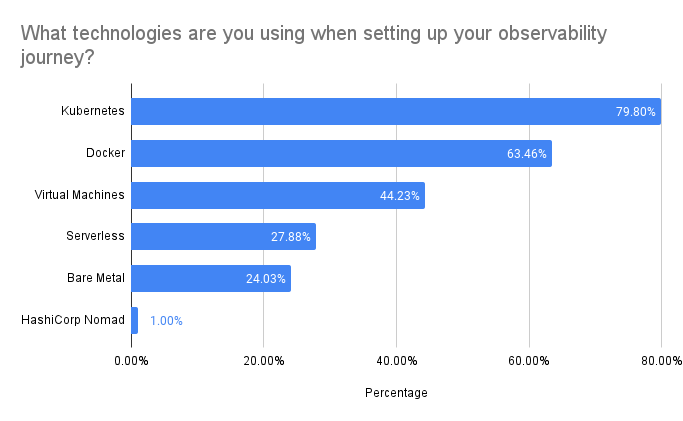
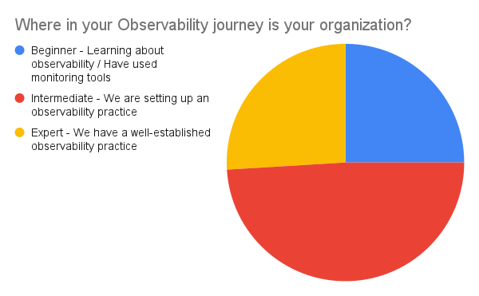
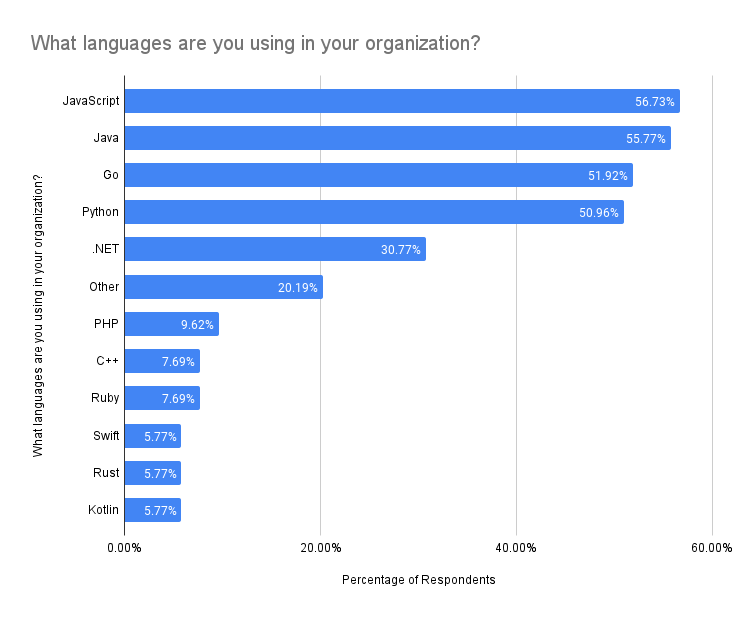
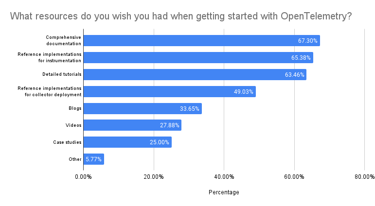
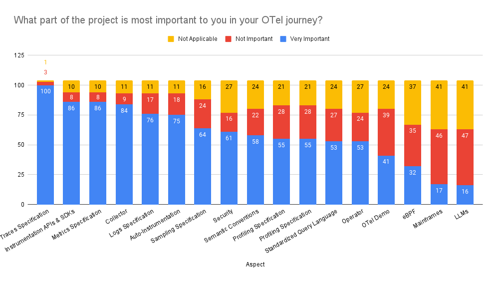

Getting started with new technologies can be hard, which is why we try to meet
our end-users where they are. As a part of that goal, 
[the OpenTelemetry End-User SIG](/community/end-user/) recently surveyed the
community to find out how we can best help our users get started with
OpenTelemetry. The 104 responses we received will help drive improvements in
enablement content from the community as well as vendors.

Check out the results!

## Key takeaways

- No matter their level of OTel experience, folks would like to see the
  following:
  1. Comprehensive documentation (67.3% of respondents)
  2. Reference implementations for instrumentation (65.3% of respondents)
  3. Detailed tutorials (63.4% of respondents)
- Respondents are mostly working with containerization technologies, with 79.8% of respondents
  using Kubernetes and 63.5% of respondents using Docker
- Over 83% of respondents stated that the Traces Specification, Instrumentation
  APIs and SDKs, and Metrics Specification are the most important aspects of their OTel
  journey.

## Detailed insights

### Q: What technologies are you using when setting up your observability journey?

Out of 104 respondents, most are working with containers: 79.8% are using Kubernetes and 63.5% are using Docker.

### Q: Where in your observability journey is your organization?

Out of 104 respondents:

- 25% are beginners and they are learning about observability or have used
  monitoring tools.
- 49% are intermediates and are setting up observability practice.
- 26% are experts and have a well-established observability practice.

### Q: What languages are you using in your organization?

[JavaScript](/docs/languages/js/), [Java](/docs/languages/java/),
[Go](/docs/languages/go/), and [Python](/docs/languages/python/) are the most
widely used languages. They are being utilized by over 50% of the respondents.

[Other languages](/docs/languages/other/) used included Scala, TypeScript,
[Erlang/Elixir](docs/languages/erlang/), Perl, R, Lua, Matlab, Julia, Haskell, COBOL, Kotlin, and SAS.

### Q: What resources do you wish you had when getting started with OpenTelemetry?

Depending on where in their observability journey they are, respondents prefer different
resources:

- Those who are learning about observability and those who are setting up an
  observability practice would like to see comprehensive documentation and detailed tutorials
  and videos.
- Those who have a well-established observability practice prefer reference
  implementations for instrumentation as well as comprehensive documentation.

### Q: What part of the project is most important to you in your OTel journey?

Most respondents stated that [Traces Specification,](docs/specs/otel/trace/api/) [Instrumentation APIs and SDKs](/docs/languages/),
and [Metrics Specification](/docs/specs/otel/metrics/api/) are most important to them.

## Learn more

For a more detailed look at the survey results, you can check out the
[results](https://github.com/open-telemetry/sig-end-user/tree/main/end-user-surveys/getting-started).

## Keep in touch

Thanks to everyone who participated in the survey! We rely on your feedback to
help guide the future development of OpenTelemetry and to ensure it continues to
meet your evolving needs. We will post upcoming surveys in the following
avenues:

- [#otel-sig-end-user Slack channel](https://cloud-native.slack.com/archives/C01RT3MSWGZ)
  – you can also reach out to us here!
- [End user resources page](/community/end-user/).
