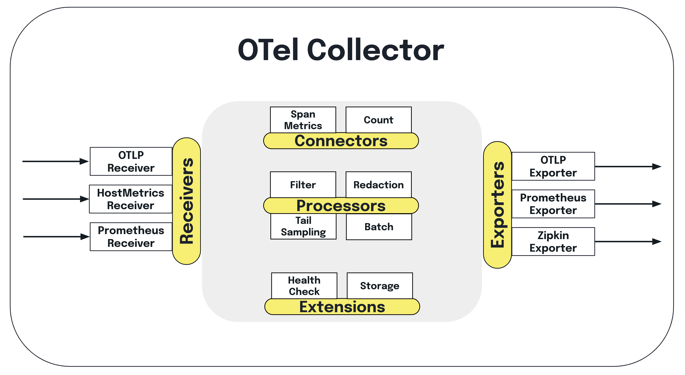
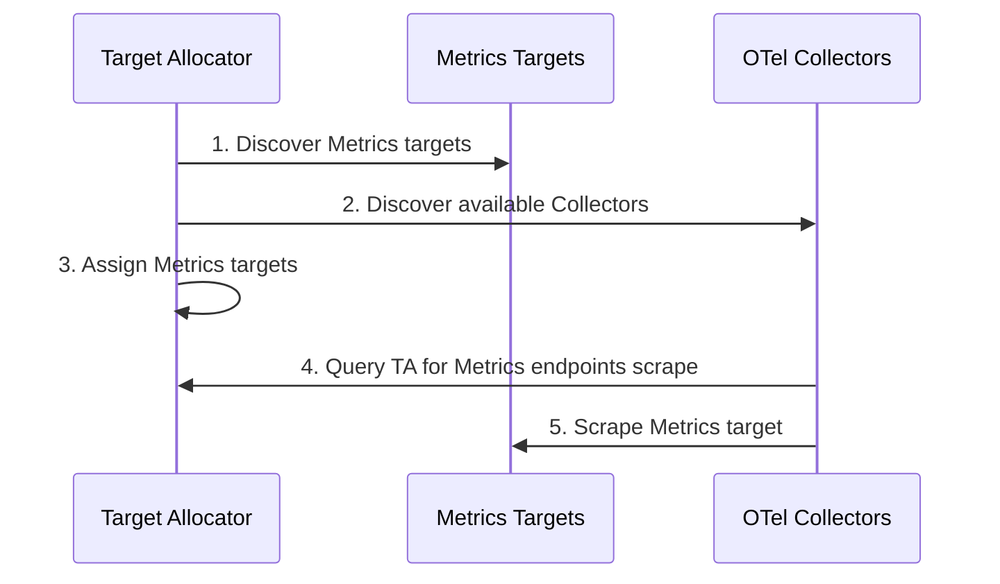
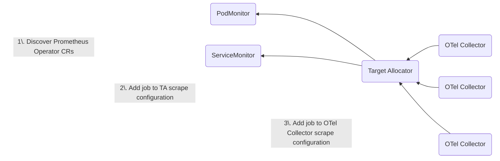

Tools such as [Prometheus](https://prometheus.io/) and
[OpenTelemetry](/docs/what-is-opentelemetry/) help us monitor the health,
performance, and availability of our complex distributed systems. Both are open
source projects under the
[Cloud Native Computing Foundation (CNCF)](https://www.cncf.io/) umbrella – but
what role does each play in observability?

OpenTelemetry (OTel for short), is a vendor-neutral open standard for
instrumenting, generating, collecting, and exporting telemetry data. Prometheus
is a fixture of the observability landscape, widely relied upon for monitoring
and alerting within organizations.

While both Prometheus and OTel emit metrics, there is a lot to cover on the
differences and similarities, and is out of scope for this article. Rather, we
want to show you how OTel supports Prometheus, specifically in a Kubernetes
environment. You'll learn:

- How the OTel Collector's
  [Prometheus Receiver](https://github.com/open-telemetry/opentelemetry-collector-contrib/tree/main/receiver/prometheusreceiver)
  can be used to ingest Prometheus metrics.
- Alternative methods for Prometheus metric collection through OTel-native
  options such as the K8s cluster receiver and Kubelet stats receiver.

We'll also do a technical dive into the OTel Operator's Target Allocator (TA)
and learn:

- How it can be used for Prometheus service discovery.
- How it ensures even distribution of Prometheus targets.

## OTel and Prometheus

Since OTel is primarily focused on the instrumentation part of observability, it
doesn't provide a backend for storing telemetry; you have to forward the data to
a backend vendor for storage, alerting, and querying.

Prometheus, on the other hand, provides a time-series data store you can use for
your metrics, in addition to instrumentation clients. You can view graphs and
charts, set up alerts, and query your data via their web user interface. It also
encompasses a data format, known as
[Prometheus text-based exposition format](https://prometheus.io/docs/instrumenting/exposition_formats/#exposition-formats).

Prometheus _data_ is stored as a dimensional time-series, meaning that the data
has attributes (for example, labels or dimensions) and a timestamp.

The Prometheus _server_ collects Prometheus metrics data from targets defined in
a configuration file. A target is an endpoint that exposes metrics for the
Prometheus server to store.

Prometheus is so ubiquitous in the monitoring space that many tools natively
emit metrics in Prometheus format, including
[Kubernetes](https://kubernetes.io/docs/concepts/cluster-administration/system-metrics/)
and
[HashiCorp's Nomad](https://developer.hashicorp.com/nomad/docs/operations/monitoring-nomad).
And for those that don’t, there are a number of vendor- and community-built
[Prometheus exporters](https://prometheus.io/docs/instrumenting/exporters/) to
aggregate and import data into Prometheus.

While you can use Prometheus to monitor a variety of infrastructure and
application metrics, one of its most popular use cases is to monitor Kubernetes.
This is the aspect of Prometheus monitoring that we will focus on in this
article.

## Prometheus metrics with OpenTelemetry

In this section, you'll learn about a couple of OTel Collector components that
demonstrate the interoperability between OTel and Prometheus.

First, let’s do a quick refresher on the [Collector](/docs/collector/) – it’s an
OTel component that can be used to collect telemetry from multiple sources and
export data to multiple destinations. The Collector also handles telemetry
processing, such as modifying data attributes and scrubbing personally
identifiable information. For example, you can use Prometheus SDKs to generate
metrics, ingest them with the Collector, do some processing (if desired) and
then forward them to your chosen backend.



The
[Prometheus receiver](https://github.com/open-telemetry/opentelemetry-collector-contrib/tree/main/receiver/prometheusreceiver)
allows you to collect metrics from any software that exposes Prometheus metrics.
It serves as a drop-in replacement for Prometheus to scrape your services, and
supports the
[full set](https://github.com/prometheus/prometheus/blob/v2.28.1/docs/configuration/configuration.md#scrape_config)
of configurations in `scrape_config`.

If you are interested in
[exemplars](/docs/specs/otel/metrics/data-model/#exemplars), which is a recorded
value that associates OTel context with a metric event, you can also use the
Prometheus receiver. Note that exemplars are currently only available in
[OpenMetrics](/docs/specs/otel/compatibility/prometheus_and_openmetrics/)
format.

Something to consider with this component is that it is under active
development; as such, it has several
[limitations](https://github.com/open-telemetry/opentelemetry-collector-contrib/blob/main/receiver/prometheusreceiver/README.md#%EF%B8%8F-warning),
including that it’s a stateful component. Additionally, it is not recommended to
use this component when multiple replicas of the Collector are run _without the
target allocator_, because in this state:

- The Collector is unable to auto-scale the scraping
- If the replicas are running with the same config, it will scrape the targets
  multiple times
- You will need to configure each replica with a different scraping config if
  you want to manually shard the scraping

For exporting metrics from the OTel Collector to Prometheus, you have the
following options: the
[Prometheus exporter](https://github.com/open-telemetry/opentelemetry-collector-contrib/tree/main/exporter/prometheusexporter#prometheus-exporter),
and the
[Prometheus Remote Write exporter](https://github.com/open-telemetry/opentelemetry-collector-contrib/blob/main/exporter/prometheusremotewriteexporter/README.md).
You can also use the
[OTLP HTTP exporter](https://github.com/open-telemetry/opentelemetry-collector/tree/main/exporter/otlphttpexporter),
which comes with the Collector by default, and use Prometheus' native OTLP
endpoint. Note that
[Prometheus also now supports OTLP natively](https://prometheus.io/blog/2024/03/14/commitment-to-opentelemetry/).

The Prometheus exporter allows you to ship data in the Prometheus format, which
is then scraped by a Prometheus server. It's used to report metrics via the
Prometheus scrape HTTP endpoint. You can learn more by trying out this
[example](https://github.com/open-telemetry/opentelemetry-go-contrib/tree/main/examples/prometheus).
However, the scraping won't really scale, as all the metrics are sent in a
single scrape.

To get around the scaling concern, you can alternatively use the Prometheus
Remote Write exporter, which allows you to push data to Prometheus from multiple
Collector instances with no issues. Since Prometheus also accepts remote write
ingestion, you can also use this exporter if you are generating OTel metrics and
want to ship them to a backend that is compatible with Prometheus remote write.

Note that the Prometheus Remote Write in the Prometheus Server doesn't currently
support metadata, such as Help and Type. For more information, check out
[issue #13163](https://github.com/prometheus/prometheus/issues/13163) as well as
[issue #12608](https://github.com/prometheus/prometheus/issues/12608). This will
be addressed in
[Prometheus Remote Write v2.0](https://prometheus.io/docs/specs/remote_write_spec_2_0/#io-prometheus-write-v2-request).

To learn more about the architecture of both exporters, see
[Use Prometheus Remote Write exporter](https://grafana.com/blog/2023/07/20/a-practical-guide-to-data-collection-with-opentelemetry-and-prometheus/#6-use-prometheus-remote-write-exporter).

## Using the Target Allocator

Scalability is a common challenge with Prometheus; that's the ability to
effectively maintain performance and resource allocation while managing an
increasing number of monitored targets and metrics. One option to help with this
is sharding the workload based on labels or dimensions,
[which means using multiple Prometheus instances to handle your metrics according to specific parameters](https://medium.com/wish-engineering/horizontally-scaling-prometheus-at-wish-ea4b694318dd).
This could help decrease the burden on individual instances. However, there are
two things to consider with this approach.

The first is that to get around querying sharded instances, you need a
management instance; this means that you need to have N+1 Prometheus instances,
where the +1’s memory is equal to N, thereby doubling your memory requests.
Secondly, Prometheus sharding requires that each instance scrape the target,
even if it’s going to be dropped.

Something to note is that if you can have a Prometheus instance with the
combined amount of memory of individual instances, there is not much benefit to
sharding, since you can scrape everything directly using the larger instance. A
reason that people shard is usually for some amount of fault tolerance. For
example, if one Prometheus instance is out of memory (OOM), then your entire
alerting pipeline won't be offline.

Luckily, the OTel Operator’s Target Allocator (TA) is able to help with some of
this. For instance, it can automatically drop any targets it knows won’t be
scraped. The TA also automatically shards the targets for you, whereas if you
shard with `hashmod` you'll need to
[update your config based on the number of replicas you have](https://www.robustperception.io/scaling-and-federating-prometheus/).
The TA also allows you to continue using resources like PodMonitor and
ServiceMonitor to continue collecting Prometheus metrics about your Kubernetes
infrastructure.

The Target Allocator is part of the OTel Operator. The
[OTel Operator](https://github.com/open-telemetry/opentelemetry-operator) is a
[Kubernetes Operator](https://kubernetes.io/docs/concepts/extend-kubernetes/operator/)
that:

- Manages the [OpenTelemetry Collector](/docs/collector/)
- Injects and configures
  [autoinstrumentation](https://www.honeycomb.io/blog/what-is-auto-instrumentation)
  into your pods

In fact, the Operator creates two new
[custom resource](https://kubernetes.io/docs/concepts/extend-kubernetes/api-extension/custom-resources/)
(CR) types in Kubernetes to support this functionality: the
[OpenTelemetry Collector CR](https://github.com/open-telemetry/opentelemetry-operator#getting-started),
and the
[Autoinstrumentation CR](https://github.com/open-telemetry/opentelemetry-operator#opentelemetry-auto-instrumentation-injection).

Today, we will be focusing on the Target Allocator. The TA is an optional
component of the Operator’s OTel Collector management capabilities.

In a nutshell, the Target Allocator is a mechanism for decoupling the service
discovery and metric collection functions of Prometheus in a way that allows
them to be scaled independently. The OTel Collector manages Prometheus Metrics
without needing to install Prometheus. The TA manages the configuration of the
Collector’s Prometheus Receiver.

The Target Allocator serves two functions:

- Even distribution of Prometheus targets among a pool of OTel Collectors
- Discovery of Prometheus custom resources

Let’s dig into each of these.

### Even distribution of Prometheus targets

The Target Allocator’s first job is to discover targets to scrape and OTel
Collectors to allocate targets to. It does so as follows:

1. The Target Allocator finds all of the metrics targets to scrape
2. The Target Allocator finds all of the available Collectors
3. The Target Allocator determines which Collectors scrape which metrics
4. The Collectors query the Target Allocator to find out what metrics to scrape
5. The Collectors scrape their assigned targets

This means that the OTel collectors -- not a Prometheus scraper -- collect the
metrics.

A **Target** is an endpoint that supplies Metrics for Prometheus to store. A
**Scrape** is the action of collecting Metrics through an HTTP request from a
targeted instance, parsing the response, and ingesting the collected samples to
storage.



### Discovery of Prometheus custom resources

The Target Allocator’s second job is to provide the discovery of Prometheus
Operator CRs, namely the
[ServiceMonitor and PodMonitor](https://github.com/open-telemetry/opentelemetry-operator/tree/main/cmd/otel-allocator#target-allocator).

In the past, all Prometheus scrape configurations had to be done via the
Prometheus Receiver. When the Target Allocator’s service discovery feature is
enabled, the TA simplifies the configuration of the Prometheus receiver, by
creating scrape configurations in the Prometheus receiver from the PodMonitor
and ServiceMonitor instances deployed in your cluster.



Even though Prometheus is not required to be installed in your Kubernetes
cluster to use the Target Allocator for Prometheus CR discovery, the TA does
require that the ServiceMonitor and PodMonitor be installed. These CRs are
bundled with Prometheus Operator; however, they can be installed standalone as
well. The easiest way to do this is to grab a copy of the individual
[PodMonitor YAML](https://github.com/prometheus-community/helm-charts/blob/main/charts/kube-prometheus-stack/charts/crds/crds/crd-podmonitors.yaml)
and
[ServiceMonitor YAML](https://github.com/prometheus-community/helm-charts/blob/main/charts/kube-prometheus-stack/charts/crds/crds/crd-servicemonitors.yaml)
custom resource definitions (CRDs).

OTel supports the PodMonitor and ServiceMonitor Prometheus resources because
these are widely-used in Kubernetes infrastructure monitoring. As a result, the
OTel Operator developers wanted to make it easy to add them to the OTel
ecosystem.

PodMonitor and ServiceMonitor are limited to collecting metrics from pods, and
are unable to scrape other endpoints, such as the kubelet. In that case, you
still have to rely on Prometheus scrape configs in the Collector’s
[Prometheus Receiver](https://github.com/open-telemetry/opentelemetry-collector-contrib/blob/main/receiver/prometheusreceiver/README.md).

### Configuration

The following is the YAML config for the OTel Collector CR. Note that this
Collector is running in a namespace called `opentelemetry`, but it can run in
whatever namespace you like.

The main components are:

- **mode:** This is one of four
  [OTel Collector deployment modes supported by the Operator](https://github.com/open-telemetry/opentelemetry-operator?tab=readme-ov-file#deployment-modes):
  Sidecar, Deployment, StatefulSet and DaemonSet.
- **targetallocator:** This is where you configure the Target Allocator. Note
  that the
  [Target Allocator only works for the Deployment, DaemonSet, and StatefulSet modes](https://www.youtube.com/watch?v=Uwq4EPaMJFM).
- **config:** This is where you configure the OTel Collector’s config YAML.

```yaml
apiVersion: opentelemetry.io/v1alpha1
kind: OpenTelemetryCollector
metadata:
  name: otelcol
  namespace: opentelemetry
spec:
  mode: statefulset
  targetAllocator:
    enabled: true
    serviceAccount: opentelemetry-targetallocator-sa
    prometheusCR:
      enabled: true
  config: |
    receivers:
      otlp:
        protocols:
          grpc:
          http:
      prometheus:
        config:
          scrape_configs:
          - job_name: 'otel-collector'
            scrape_interval: 30s
            static_configs:
            - targets: [ '0.0.0.0:8888' ]
        target_allocator:
          endpoint: http://otelcol-targetallocator
          interval: 30s
          collector_id: "${POD_NAME}"
…
```

To use the Target Allocator, you need to set `spec.targetallocator.enabled` to
`true`. (See previous note about supported modes.)

Next, you need to make sure that the Prometheus receiver of the deployed
Collector is made aware of the Target Allocator in the Collector config section
of the spec by setting the `target_allocator.endpoint`:

```yaml
receivers:
  prometheus:
    config:
      scrape_configs:
        - job_name: 'otel-collector'
          scrape_interval: 30s
          static_configs:
            - targets: ['0.0.0.0:8888']
    target_allocator:
      endpoint: http://otelcol-targetallocator
      interval: 30s
      collector_id: '${POD_NAME}'
```

The Target Allocator endpoint that the Prometheus receiver config is pointing to
is a concatenation of the OTel Collector’s name (`otelcol`, in our case) and the
`-targetallocator` suffix.

To use the Prometheus service discovery functionality, you’ll need to enable it
by setting `spec.targetallocator.prometheusCR.enabled` to `true`.

Finally, if you want to enable the Prometheus CR functionality of the Target
Allocator, you’ll need to define your own ServiceMonitor and PodMonitor
instances. The following is a sample ServiceMonitor definition that says, find
me a service with the label `app: my-app`, with an endpoint that’s a port named
`prom`, and scrape it every 15 seconds.

```yaml
apiVersion: monitoring.coreos.com/v1
kind: ServiceMonitor
metadata:
  name: sm-example
  namespace: opentelemetry
  labels:
    app.kubernetes.io/name: py-prometheus-app
    release: prometheus
spec:
  selector:
    matchLabels:
      app: my-app
  namespaceSelector:
    matchNames:
      - opentelemetry
  endpoints:
    - port: prom
      interval: 15s
```

The corresponding `Service` definition, which is just a standard
[Kubernetes Service](https://kubernetes.io/docs/concepts/services-networking/service/)
definition, is as follows:

```yaml
apiVersion: v1
kind: Service
metadata:
  name: py-prometheus-app
  namespace: opentelemetry
  labels:
    app: my-app
    app.kubernetes.io/name: py-prometheus-app
spec:
  selector:
    app: my-app
    app.kubernetes.io/name: py-prometheus-app
  ports:
    - name: prom
      port: 8080
```

Because the `Service` has a label called `app: my-app` and a port named `prom`,
it will get picked up by the ServiceMonitor.

You can either create separate ServiceMonitors for each service you wish to
monitor, or create a single ServiceMonitor to encompass all of your services.
The same applies for the PodMonitor.

Before the Target Allocator can start scraping, you need to set up Kubernetes
role-based access controls (RBAC). This means that you need to have a
[ServiceAccount](https://kubernetes.io/docs/tasks/configure-pod-container/configure-service-account/)
and corresponding cluster roles so that the Target Allocator has access to all
of the necessary resources to pull metrics from.

You can create your own ServiceAccount, and reference it as
`spec.targetAllocator.serviceAccount` in the OTel Collector CR. You’ll then need
to configure the
[ClusterRole](https://kubernetes.io/docs/reference/access-authn-authz/rbac/#role-and-clusterrole)
and
[ClusterRoleBinding](https://kubernetes.io/docs/reference/access-authn-authz/rbac/#rolebinding-and-clusterrolebinding)
for this service account.

If you omit the ServiceAccount configuration, the Target Allocator creates a
ServiceAccount automatically for you. The ServiceAccount’s default name is a
concatenation of the Collector name and the `-collector` suffix. By default,
this ServiceAccount has no defined policy, so you’ll need to create your own
[ClusterRole](https://kubernetes.io/docs/reference/access-authn-authz/rbac/#role-and-clusterrole)
and
[ClusterRoleBinding](https://kubernetes.io/docs/reference/access-authn-authz/rbac/#rolebinding-and-clusterrolebinding).

The following is an example RBAC configuration taken from the
[OTel Target Allocator readme](https://github.com/open-telemetry/opentelemetry-operator/tree/main/cmd/otel-allocator#rbac).
It includes the ServiceAccount, ClusterRole, and ClusterRoleBinding
configurations:

```yaml
apiVersion: v1
kind: ServiceAccount
metadata:
  name: opentelemetry-targetallocator-sa
  namespace: opentelemetry
---
apiVersion: rbac.authorization.k8s.io/v1
kind: ClusterRole
metadata:
  name: opentelemetry-targetallocator-role
rules:
  - apiGroups:
      - monitoring.coreos.com
    resources:
      - servicemonitors
      - podmonitors
    verbs:
      - '*'
  - apiGroups: ['']
    resources:
      - namespaces
    verbs: ['get', 'list', 'watch']
  - apiGroups: ['']
    resources:
      - nodes
      - nodes/metrics
      - services
      - endpoints
      - pods
    verbs: ['get', 'list', 'watch']
  - apiGroups: ['']
    resources:
      - configmaps
    verbs: ['get']
  - apiGroups:
      - discovery.k8s.io
    resources:
      - endpointslices
    verbs: ['get', 'list', 'watch']
  - apiGroups:
      - networking.k8s.io
    resources:
      - ingresses
    verbs: ['get', 'list', 'watch']
  - nonResourceURLs: ['/metrics']
    verbs: ['get']
---
apiVersion: rbac.authorization.k8s.io/v1
kind: ClusterRoleBinding
metadata:
  name: opentelemetry-targetallocator-rb
subjects:
  - kind: ServiceAccount
    name: opentelemetry-targetallocator-sa
    namespace: opentelemetry
roleRef:
  kind: ClusterRole
  name: opentelemetry-targetallocator-role
  apiGroup: rbac.authorization.k8s.io
```

Zooming in a bit on the previous
[ClusterRole](https://kubernetes.io/docs/reference/access-authn-authz/rbac/#role-and-clusterrole),
the following rules will provide the minimum access required for the Target
Allocator to query all the targets it needs based on any Prometheus
configurations:

```yaml
- apiGroups: ['']
  resources:
    - nodes
    - nodes/metrics
    - services
    - endpoints
    - pods
  verbs: ['get', 'list', 'watch']
- apiGroups: ['']
  resources:
    - configmaps
  verbs: ['get']
- apiGroups:
    - discovery.k8s.io
  resources:
    - endpointslices
  verbs: ['get', 'list', 'watch']
- apiGroups:
    - networking.k8s.io
  resources:
    - ingresses
  verbs: ['get', 'list', 'watch']
- nonResourceURLs: ['/metrics']
  verbs: ['get']
```

If you enable the `prometheusCR` (set
`spec.targetAllocator.prometheusCR.enabled` to `true`) in the
OpenTelemetryCollector CR, you will also need to define the following roles.
These give the Target Allocator access to the PodMonitor and ServiceMonitor CRs.
It also gives namespace access to the PodMonitor and ServiceMonitor.

```yaml
- apiGroups:
    - monitoring.coreos.com
  resources:
    - servicemonitors
    - podmonitors
  verbs:
    - '*'
- apiGroups: ['']
  resources:
    - namespaces
  verbs: ['get', 'list', 'watch']
```

## Additional OTel components for Kubernetes

This section covers additional OTel Collector components you can use to capture
Kubernetes metrics.

Receiving data:

- [Kubernetes Cluster Receiver](https://github.com/open-telemetry/opentelemetry-collector-contrib/tree/main/receiver/k8sclusterreceiver):
  collects cluster-level metrics and entity events from the
  [Kubernetes API server](https://kubernetes.io/docs/reference/command-line-tools-reference/kube-apiserver/)
- [Kubernetes Objects Receiver](https://github.com/open-telemetry/opentelemetry-collector-contrib/tree/main/receiver/k8sobjectsreceiver):
  collects (pull/watch) objects from the Kubernetes API server
- [Kubelet Stats Receiver](https://github.com/open-telemetry/opentelemetry-collector-contrib/tree/main/receiver/kubeletstatsreceiver):
  pulls metrics from the
  [Kubelet](https://kubernetes.io/docs/reference/command-line-tools-reference/kubelet/)
  and sends it down the metric pipeline for further processing
- [Host Metrics Receiver](https://github.com/open-telemetry/opentelemetry-collector-contrib/tree/main/receiver/hostmetricsreceiver):
  scrapes system metrics from hosts that make up the cluster

Processing data:

- [Kubernetes Attributes Processor](https://github.com/open-telemetry/opentelemetry-collector-contrib/tree/main/processor/k8sattributesprocessor):
  adds Kubernetes context, thereby
- enabling you to correlate application telemetry with your Kubernetes telemetry
- – considered one of the most important components for monitoring Kubernetes
- with OpenTelemetry

You can also use the Kubernetes attributes processor to set custom resource
attributes for traces, metrics, and logs using the Kubernetes labels and
annotations you’ve added to your pods and namespaces.

There are a few more Collector components you can implement to monitor
Kubernetes, including Kubernetes-specific ones as well as general-use
processors, such as the batch, memory limiter, and resource processors. To learn
more, see
[Important Components for Kubernetes](/docs/platforms/kubernetes/collector/components/).

After you’ve configured the components in your Collector config file, you need
to enable them within the [pipelines](/docs/collector/configuration/#pipelines)
section. A data pipeline enables you to
[collect](/docs/collector/configuration/#receivers),
[process](/docs/collector/configuration/#processors), and route data from any
source [to one destination or more](/docs/collector/configuration/#exporters).

## Pros and cons

The following are pros and cons of the setup we covered in this article.

**Pros:**

- Not having to maintain Prometheus as your data store, which means less
  infrastructure overall to maintain -- especially if you go with an all-in-one
  observability backend to ingest OTel data (traces, metrics, logs).
- While you would still have to maintain the ServiceMonitor and PodMonitor, it’s
  a lot less work than keeping the Prometheus Operator up-to-date.
- Allows you to end up with a full OTel solution while still obtaining your
  Prometheus metrics
- OTel can provide traces and logs in addition to metrics, as well as
  correlation of these signals, thus enhancing the observability of Kubernetes
  environments.
- OTel provides handy tools, such as the Target Allocator and OTel Collector
  components, to provide flexibility for configuration and deployment options.

**Cons:**

- Adopting and managing a new observability tool involves a steep learning curve
  for users unfamiliar with OTel concepts, components, and workflows.
- Users of PromQL, Prometheus’ powerful query language, can still use it **if**
  they send metrics to a Prometheus-compatible backend.
- OTel itself contains many moving parts, and presents its own challenges with
  scalability and adoption.
- Maturity and stability within OTel varies; Prometheus has a mature ecosystem.
- Additional computational and human resources needed to maintain OTel
  components.
- Managing and maintaining both Prometheus and OTel components introduces
  operational complexity in your monitoring infrastructure.

## Conclusion

Prometheus maintainers have also been further developing the interoperability
between the two projects from the Prometheus side to make it easier for it to be
the backend for OTLP metrics. For instance, Prometheus can now accept OTLP, and
soon, you’ll be able to use Prometheus exporters to export OTLP. So if you have
a service instrumented with a Prometheus SDK, you’ll be able to _push_ OTLP and
take advantage of the rich Prometheus exporter ecosystem for OTel users. The
maintainers are also working on adding support for delta temporality. This
[component](https://github.com/open-telemetry/opentelemetry-collector-contrib/issues/30479)
will aggregate delta samples to their respective cumulative counterparts. For
more about Prometheus' commitment to OTel, see
[Our commitment to OpenTelemetry](https://prometheus.io/blog/2024/03/14/commitment-to-opentelemetry/).

However you decide to use OTel to gather Prometheus metrics, ultimately what is
right for your organization depends on your business needs. Using the OTel
components discussed previously, you could convert all your metrics into the
Prometheus format, or you could convert your Prometheus metrics into OTLP.
Although Prometheus itself was not built for long-term data storage and presents
scaling challenges, there are open source projects such as
[Mimir](https://grafana.com/oss/mimir/),
[Thanos](https://thanos.io/v0.10/thanos/getting-started.md/), and
[Cortex](https://cortexmetrics.io/docs/guides/running-cortex-on-kubernetes/)
that can help with these concerns.

Whether or not you choose to implement these solutions in your organization,
it’s nice to know that there are additional options out there to lead you to
observability greatness with OTel and Prometheus.

_A version of this article was [originally posted][] to the New Relic blog._

[originally posted]: <{}>
