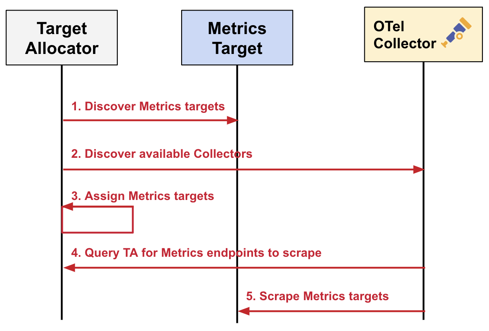
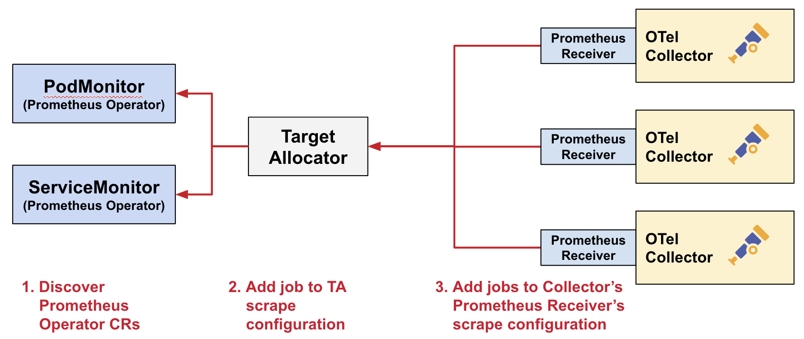

Tools such as [Prometheus](https://prometheus.io/) and [OpenTelemetry](/docs/what-is-opentelemetry/) 
help us monitor the health, performance, and 
availability of our complex distributed systems. Both are open source projects 
under the [Cloud Native Computing Foundation (CNCF)](https://www.cncf.io/) 
umbrella – but what role does each play in observability? 

OpenTelemetry (OTel for short), is a vendor-neutral open standard for 
instrumenting, generating, collecting, and exporting telemetry data.
Prometheus is a fixture of the observability landscape, widely relied upon 
for monitoring and alerting within organizations. 

While both Prometheus and OTel emit metrics, there is a lot to cover on the 
differences and similarities, and is out of scope for this article. Rather, we 
want to show you how OTel supports Prometheus, specifically in a Kubernetes 
environment. You'll learn:
* How the OTel Collector's [Prometheus Receiver](https://github.com/open-telemetry/opentelemetry-collector-contrib/tree/main/receiver/prometheusreceiver) can be used to ingest Prometheus 
metrics. 
* Alternative methods for Prometheus metric collection through OTel-native 
options such as the K8s cluster receiver and Kubelet stats receiver.

We'll also do a technical dive into the OTel Operator's Target Allocator (TA) 
and learn:
* How it can be used for Prometheus service discovery.
* How it ensures even distribution of Prometheus targets. 

## OTel and Prometheus

Since OTel is primarily focused on the instrumentation part of observability,
it doesn't provide a backend for storing telemetry; you have to forward the 
data to a backend vendor for storage, alerting, and querying. 

Prometheus, on the other hand, provides a time-series data store you can use 
for your metrics, in addition to instrumentation clients. You can view 
graphs and charts, set up alerts, and query your data via their web user 
interface. It also encompasses a data format, known as [Prometheus 
text-based exposition format](https://prometheus.io/docs/instrumenting/exposition_formats/#exposition-formats).

Prometheus _data_ is stored as a dimensional time-series, meaning that the data 
has attributes (for example, labels or dimensions) and a timestamp. 

The Prometheus _server_ collects Prometheus metrics data from targets defined in a 
configuration file. A target is an endpoint that exposes metrics for the 
Prometheus server to store.

Prometheus is so ubiquitous in the monitoring space that many tools natively 
emit metrics in Prometheus format, including [Kubernetes](https://kubernetes.io/docs/concepts/cluster-administration/system-metrics/) and [HashiCorp's Nomad](https://developer.hashicorp.com/nomad/docs/operations/monitoring-nomad). And for those that don’t, there are a number 
of vendor- and community-built [Prometheus exporters](https://prometheus.io/docs/instrumenting/exporters/) to aggregate and import data 
into Prometheus.

While you can use Prometheus to monitor a variety of infrastructure and 
application metrics, one of its most popular use cases is to monitor Kubernetes. 
This is the aspect of Prometheus monitoring that we will focus on in this 
article.

## Prometheus metrics with OpenTelemetry
In this section, you will learn about a couple of OTel Collector components that 
demonstrate the interoperability between OTel and Prometheus.  

First, let’s do a quick refresher on the [Collector](/docs/collector/) 
– it’s an OTel component that can be used to collect and export data from and to 
multiple sources and destinations, respectively. It also handles additional telemetry 
processing, such as modifying data attributes and scrubbing personally 
identifiable information. For example, you can use Prometheus SDKs to generate 
metrics, ingest them with the Collector, do some processing (if desired) and 
then forward them to your chosen backend. 


The [Prometheus receiver](/docs/kubernetes/collector/components/#prometheus-receiver) 
allows you to collect metrics from any software that 
exposes Prometheus metrics. It serves as a drop-in replacement for Prometheus to 
scrape your services, and supports the [full set](https://github.com/prometheus/prometheus/blob/v2.28.1/docs/configuration/configuration.md#scrape_config) of configurations in 
`scrape_config`. 

If you are interested in [exemplars](/docs/specs/otel/metrics/data-model/#exemplars), which is a recorded value that associates OTel context with a metric 
event, you can also use the Prometheus receiver to ingest them in the Prometheus 
format and convert it to OTLP format. This enables you to correlate traces with 
metrics. 

Something to consider with this component is that it is under active 
development; as such, it has several [limitations](https://github.com/open-telemetry/opentelemetry-collector-contrib/blob/main/receiver/prometheusreceiver/README.md#%EF%B8%8F-warning), including that it’s a stateful component. Additionally, it is recommended to not 
use this component when multiple replicas of the Collector are run, because in 
this state: 
* The Collector is unable to auto-scale the scraping 
* If the replicas are running with the same config, it will scrape the targets 
multiple times
* You will need to configure each replica with a different scraping config if 
you want to manually shard the scraping

For exporting metrics from the OTel Collector to Prometheus, you have two options: 
the [Prometheus exporter](https://github.com/open-telemetry/opentelemetry-collector-contrib/tree/main/exporter/prometheusexporter#prometheus-exporter), and the [Prometheus Remote Write exporter](https://github.com/open-telemetry/opentelemetry-collector-contrib/blob/main/exporter/prometheusremotewriteexporter/README.md).

The Prometheus exporter allows you to ship data in the Prometheus format, which is 
then scraped by a Prometheus server. It's used to report metrics via the Prometheus 
scrape HTTP endpoint. You can learn more by trying out this [example](https://github.com/open-telemetry/opentelemetry-go/tree/main/example/prometheus). However, the scraping won't really scale, as all the
metrics are sent in a single scrape. 

To get around the scaling concern, you can alternatively use the Prometheus Remote Write 
exporter, which allows you to push data to Prometheus from multiple Collector 
instances with no issues. Since Prometheus also accepts remote write ingestion, you 
can also use this exporter if you are generating OTel metrics and want to 
ship them to a backend that is compatible with Prometheus remote write. Learn more about 
the architecture of both exporters [here](https://grafana.com/blog/2023/07/20/a-practical-guide-to-data-collection-with-opentelemetry-and-prometheus/#6-use-prometheus-remote-write-exporter). 

## Using the Target Allocator 
A common challenge with Prometheus is that of scalability, which is the ability 
to effectively maintain performance and resource allocation while managing an 
increasing number of monitored targets and metrics. One option to help with this 
is **sharding** the workload based on labels or dimensions, [which means using multiple Prometheus instances to handle your metrics according to specific parameters](https://www.atatus.com/blog/prometheus-architecture-scalability/#:~:text=Key%20Limitations%20of%20Prometheus,-Long%2DTerm%20Storage&text=Scalability%3A%20Extremely%20big%20environments%20with,availability%2C%20which%20influences%20system%20resilience). This could help 
decrease the burden on individual instances. However, there are two things to 
consider with this approach.  

The first is that to get around querying sharded instances, you need a 
management instance; this means that you need to have N+1 Prometheus instances, 
where the +1’s memory is equal to N, thereby doubling your memory requests. 
Secondly, Prometheus sharding requires that each instance scrape the target, 
even if it’s going to be dropped. 

Luckily, the OTel Operator’s Target Allocator (TA) is able to help with 
some of this. For instance, it can automatically drop any targets it knows won’t 
be scraped. Plus, if you’re already collecting Prometheus metrics about your 
Kubernetes infrastructure, using the TA is a great option.

The Target Allocator is part of the OTel Operator. The OTel Operator is a [Kubernetes Operator](https://kubernetes.io/docs/concepts/extend-kubernetes/operator/) that:
* Manages the [OpenTelemetry Collector](/docs/collector/)
* Injects and configures [auto-instrumentation](https://www.honeycomb.io/blog/what-is-auto-instrumentation) into your pods

In fact, the Operator creates two new [custom resource](https://kubernetes.io/docs/concepts/extend-kubernetes/api-extension/custom-resources/) (CR) types in Kubernetes to 
support this functionality: the [OpenTelemetry Collector CR](https://github.com/open-telemetry/opentelemetry-operator#getting-started), and the [Auto-Instrumentation CR](https://github.com/open-telemetry/opentelemetry-operator#opentelemetry-auto-instrumentation-injection).

Today, we will be focusing on the Target Allocator. The TA is an optional 
component of the Operator’s OTel Collector management capabilities.

In a nutshell, the Target Allocator is a mechanism for decoupling the service 
discovery and metric collection functions of Prometheus in a way that allows 
them to be scaled independently. The OTel Collector manages Prometheus Metrics 
without needing to install Prometheus. The TA manages the configuration of the 
Collector’s Prometheus Receiver.

The Target Allocator serves two functions:
* Even distribution of Prometheus targets among a pool of OTel Collectors
* Discovery of Prometheus custom resources

Let’s dig into each of these.

#### Even distribution of Prometheus targets
The Target Allocator’s first job is to discover targets to scrape and OTel 
Collectors to allocate targets to. Then it can distribute the targets it 
discovers among the Collectors. The Collectors in turn query the TA for metrics 
endpoints to scrape, and then the Collectors’ Prometheus receivers scrape the 
metrics targets. This means that the OTel Collectors -- not a Prometheus scraper 
-- collect the metrics.

A **target** is an endpoint that supplies metrics for Prometheus to store.

A **scrape** is the action of collecting metrics through an HTTP request from a 
targeted instance, parsing the response, and ingesting the collected samples to 
storage.



#### Discovery of Prometheus custom resources
The Target Allocator’s second job is to provide the discovery of Prometheus 
Operator CRs, namely the [ServiceMonitor and PodMonitor](https://github.com/open-telemetry/opentelemetry-operator/tree/main/cmd/otel-allocator#target-allocator). 

In the past, all Prometheus scrape configurations had to be done via the 
[Prometheus Receiver](https://github.com/open-telemetry/opentelemetry-collector-contrib/blob/main/receiver/prometheusreceiver/README.md). When the Target Allocator’s service 
discovery feature is enabled, the TA simplifies the configuration of the 
Prometheus receiver, by creating scrape configurations in the Prometheus 
receiver from the `PodMonitor` and `ServiceMonitor` instances deployed in your 
cluster.



Even though Prometheus is not required to be installed in your Kubernetes 
cluster to use the Target Allocator for Prometheus CR discovery, the TA does 
require that the `ServiceMonitor` and `PodMonitor` be installed. These CRs are 
bundled with Prometheus Operator; however, they can be installed standalone as 
well. The easiest way to do this is to grab a copy of the individual 
[PodMonitor YAML](https://github.com/prometheus-community/helm-charts/blob/main/charts/kube-prometheus-stack/charts/crds/crds/crd-podmonitors.yaml) and 
[ServiceMonitor YAML](https://github.com/prometheus-community/helm-charts/blob/main/charts/kube-prometheus-stack/charts/crds/crds/crd-servicemonitors.yaml) custom resource 
definitions (CRDs).

OTel supports the `PodMonitor` and `ServiceMonitor` Prometheus resources because 
these are widely-used in Kubernetes infrastructure monitoring. As a result, the 
OTel Operator developers wanted to make it easy to add them to the OTel 
ecosystem.

Note that the `PodMonitor` and `ServiceMonitor` are not useful for 
cluster-wide metrics collection, such as for Kubelet metrics collection. In that 
case, you still have to rely on Prometheus scrape configs in the Collector’s 
[Prometheus Receiver](https://github.com/open-telemetry/opentelemetry-collector-contrib/blob/main/receiver/prometheusreceiver/README.md).

#### Configuration
The following is the YAML config for the OTel Collector CR. Note that this 
Collector is running in a namespace called `opentelemetry`, but it can run 
in whatever namespace you like. 

The main components are:
* **mode:** This is one of four [OTel Collector deployment modes supported by the Operator](https://github.com/open-telemetry/opentelemetry-operator?tab=readme-ov-file#deployment-modes): 
Sidecar, Deployment, StatefulSet and DaemonSet. 
* **targetallocator:** This is where you configure the Target Allocator. Note 
that the [Target Allocator only works for the Deployment, DaemonSet, and StatefulSet modes](https://www.youtube.com/watch?v=Uwq4EPaMJFM). 
* **config:** This is where the OTel Collector config resides.

```yaml
apiVersion: opentelemetry.io/v1alpha1
kind: OpenTelemetryCollector
metadata:
  name: otelcol
  namespace: opentelemetry
spec:
  mode: statefulset
  targetAllocator:
    enabled: true
    serviceAccount: opentelemetry-targetallocator-sa
    prometheusCR:
      enabled: true
  config: |
    receivers:
      otlp:
        protocols:
          grpc:
          http:
      prometheus:
        config:
          scrape_configs:
          - job_name: 'otel-collector'
            scrape_interval: 30s
            static_configs:
            - targets: [ '0.0.0.0:8888' ]
        target_allocator:
          endpoint: http://otelcol-targetallocator
          interval: 30s
          collector_id: "${POD_NAME}"
…
```

To use the Target Allocator, you need to set `spec.targetallocator.enabled` to 
`true`. (See previous note about supported modes.)

To use the Prometheus service discovery functionality, you’ll need to do two things:

First, you need to enable it by setting `spec.targetallocator.prometheusCR.enabled` 
to `true`.

Next, you need to make sure that the [Prometheus receiver](https://github.com/open-telemetry/opentelemetry-collector-contrib/blob/main/receiver/prometheusreceiver/README.md) 
of the deployed Collector is made aware of the Target Allocator in the Collector 
config section of the spec by setting the `target_allocator.endpoint`:

```yaml
    receivers:
      prometheus:
        config:
          scrape_configs:
          - job_name: 'otel-collector'
            scrape_interval: 30s
            static_configs:
            - targets: [ '0.0.0.0:8888' ]
        target_allocator:
          endpoint: http://otelcol-targetallocator
          interval: 30s
          collector_id: "${POD_NAME}"
```

The Target Allocator endpoint that the Prometheus receiver config is pointing to 
is a concatenation of the OTel Collector’s name (`otelcol`, in our case) and the 
`-targetallocator` suffix.

Finally, if you want to enable the Prometheus CR functionality of the Target 
Allocator, you’ll need to define your own `ServiceMonitor` and `PodMonitor` 
instances. The following is a sample `ServiceMonitor` definition that says, find me a 
service with the label `app: my-app`, with an endpoint that’s a port named 
`prom`, and scrape it every 15 seconds.

```yaml
apiVersion: monitoring.coreos.com/v1
kind: ServiceMonitor
metadata:
  name: sm-example
  namespace: opentelemetry
  labels:
    app.kubernetes.io/name: py-prometheus-app
    release: prometheus
spec:
  selector:
    matchLabels:
      app: my-app
  namespaceSelector:
      matchNames:
        - opentelemetry
  endpoints:
    - port: prom
      interval: 15s
```

The corresponding `Service` definition, which is just a standard [Kubernetes Service](https://kubernetes.io/docs/concepts/services-networking/service/) definition, is as 
follows:  

```yaml
apiVersion: v1
kind: Service
metadata:
  name: py-prometheus-app
  namespace: opentelemetry
  labels:
    app: my-app
    app.kubernetes.io/name: py-prometheus-app
spec:
  selector:
    app: my-app
    app.kubernetes.io/name: py-prometheus-app
  ports:
    - name: prom
      port: 8080
```

Because the `Service` has a label called `app: my-app` and a port named `prom`, 
it will get picked up by the `ServiceMonitor`.

You can either create separate `ServiceMonitors` for each service you wish to 
monitor, or create a single `ServiceMonitor` to encompass all of your services. 
The same applies for the `PodMonitor`.

Before the Target Allocator can start scraping, you need to set up Kubernetes 
role-based access controls. This means that you need to have a [`ServiceAccount`](https://kubernetes.io/docs/tasks/configure-pod-container/configure-service-account/) and 
corresponding cluster roles so that the Target Allocator has access to all of 
the necessary resources to pull metrics from.

You can create your own `ServiceAccount`, and reference it as 
`spec.targetAllocator.serviceAccount` in the OTel Collector CR. You’ll then need 
to configure the [`ClusterRole`](https://kubernetes.io/docs/reference/access-authn-authz/rbac/#role-and-clusterrole) and [`ClusterRoleBinding`](https://kubernetes.io/docs/reference/access-authn-authz/rbac/#rolebinding-and-clusterrolebinding) for this service 
account.

If you omit the `ServiceAccount` configuration, the Target Allocator creates a 
`ServiceAccount` automagically for you. The `ServiceAccount`’s default name is a 
concatenation of the Collector name and the `-collector` suffix. By default, 
this `ServiceAccount` has no defined policy, so you’ll need to create your own 
[`ClusterRole`](https://kubernetes.io/docs/reference/access-authn-authz/rbac/#role-and-clusterrole) 
and [`ClusterRoleBinding`](https://kubernetes.io/docs/reference/access-authn-authz/rbac/#rolebinding-and-clusterrolebinding).

The following is an example RBAC configuration taken from the [OTel Target Allocator readme](https://github.com/open-telemetry/opentelemetry-operator/tree/main/cmd/otel-allocator#rbac). It 
includes the `ServiceAccount`, `ClusterRole`, and `ClusterRoleBinding` 
configurations.

```yaml
apiVersion: v1
kind: ServiceAccount
metadata:
  name: opentelemetry-targetallocator-sa
  namespace: opentelemetry
---
apiVersion: rbac.authorization.k8s.io/v1
kind: ClusterRole
metadata:
  name: opentelemetry-targetallocator-role
rules:
- apiGroups:
  - monitoring.coreos.com
  resources:
  - servicemonitors
  - podmonitors
  verbs:
  - '*'
- apiGroups: [""]
  resources:
  - namespaces
  verbs: ["get", "list", "watch"]
- apiGroups: [""]
  resources:
  - nodes
  - nodes/metrics
  - services
  - endpoints
  - pods
  verbs: ["get", "list", "watch"]
- apiGroups: [""]
  resources:
  - configmaps
  verbs: ["get"]
- apiGroups:
  - discovery.k8s.io
  resources:
  - endpointslices
  verbs: ["get", "list", "watch"]
- apiGroups:
  - networking.k8s.io
  resources:
  - ingresses
  verbs: ["get", "list", "watch"]
- nonResourceURLs: ["/metrics"]
  verbs: ["get"]
---
apiVersion: rbac.authorization.k8s.io/v1
kind: ClusterRoleBinding
metadata:
  name: opentelemetry-targetallocator-rb
subjects:
  - kind: ServiceAccount
    name: opentelemetry-targetallocator-sa
    namespace: opentelemetry
roleRef:
  kind: ClusterRole
  name: opentelemetry-targetallocator-role
  apiGroup: rbac.authorization.k8s.io
```

Zooming in a bit on the [`ClusterRole`](https://kubernetes.io/docs/reference/access-authn-authz/rbac/#role-and-clusterrole), the following rules will provide the minimum access 
required for the Target Allocator to query all the targets it needs based on any 
Prometheus configurations:

```yaml
- apiGroups: [""]
  resources:
  - nodes
  - nodes/metrics
  - services
  - endpoints
  - pods
  verbs: ["get", "list", "watch"]
- apiGroups: [""]
  resources:
  - configmaps
  verbs: ["get"]
- apiGroups:
  - discovery.k8s.io
  resources:
  - endpointslices
  verbs: ["get", "list", "watch"]
- apiGroups:
  - networking.k8s.io
  resources:
  - ingresses
  verbs: ["get", "list", "watch"]
- nonResourceURLs: ["/metrics"]
  verbs: ["get"]
```

If you enable the `prometheusCR` (set `spec.targetAllocator.prometheusCR.enabled` 
to `true`) in the `OpenTelemetryCollector` CR, you will also need to define the 
following roles. These give the Target Allocator access to the `PodMonitor` and 
`ServiceMonitor` CRs. It also gives namespace access to the `PodMonitor` and 
`ServiceMonitor`.

```yaml
- apiGroups:
  - monitoring.coreos.com
  resources:
  - servicemonitors
  - podmonitors
  verbs:
  - '*'
- apiGroups: [""]
  resources:
  - namespaces
  verbs: ["get", "list", "watch"]
```

## Additional OTel components for Kubernetes

This section covers additional OTel Collector components you can use to capture 
Kubernetes metrics. 

Receiving data:
* [Kubernetes Cluster Receiver](https://github.com/open-telemetry/opentelemetry-collector-contrib/tree/main/receiver/k8sclusterreceiver): collects cluster-level metrics and 
entity events from the [Kubernetes API server](https://kubernetes.io/docs/reference/command-line-tools-reference/kube-apiserver/)
* [Kubernetes Objects Receiver](https://github.com/open-telemetry/opentelemetry-collector-contrib/tree/main/receiver/k8sobjectsreceiver): collects (pull/watch) objects from the 
Kubernetes API server
* [Kubelet Stats Receiver](https://github.com/open-telemetry/opentelemetry-collector-contrib/tree/main/receiver/kubeletstatsreceiver): pulls node, pod, container, and volume metrics 
from the API server on a [Kubelet](https://kubernetes.io/docs/reference/command-line-tools-reference/kubelet/) and sends it down the metric pipeline for further processing
* [Host Metrics Receiver](/docs/kubernetes/collector/components/#host-metrics-receiver): scrapes system metrics from hosts that make up the 
cluster

Processing data:
* [Kubernetes Attributes Processor](https://github.com/open-telemetry/opentelemetry-collector-contrib/tree/main/processor/k8sattributesprocessor): adds Kubernetes context, thereby 
* enabling you to correlate application telemetry with your Kubernetes telemetry 
* – considered one of the most important components for monitoring Kubernetes 
* with OpenTelemetry 

You can also use the Kubernetes attributes processor to set custom resource 
attributes for traces, metrics, and logs using the Kubernetes labels and 
annotations you’ve added to your pods and namespaces.

There are a few more Collector components you can implement to monitor 
Kubernetes, including Kubernetes-specific ones as well as general-use 
processors, such as the batch, memory limiter, and resource processors. You can 
read more about them [here](docs/kubernetes/collector/components/). 

After you’ve configured the components in your Collector config file, you need 
to enable them within the [pipelines](/docs/collector/configuration/#pipelines) section. A data pipeline enables you to [collect](/docs/collector/configuration/#receivers), [process](/docs/collector/configuration/#processors), 
and route data from any source [to one destination or more](/docs/collector/configuration/#exporters). 

## Pros and cons
However you decide to use OTel to gather Prometheus metrics, ultimately what is 
right for your organization depends on your business needs. Using the OTel 
components discussed previously, you could convert all your metrics into the 
Prometheus format, or you could convert your Prometheus metrics into OTLP. 
Although Prometheus itself was not built for long-term data storage and presents 
scaling challenges, there are products such as [Grafana Mimir](https://grafana.com/oss/mimir/), 
[Thanos](https://thanos.io/v0.10/thanos/getting-started.md/), and 
[Cortex](https://cortexmetrics.io/docs/guides/running-cortex-on-kubernetes/) 
that can help with these concerns. 

We’ve listed some pros and cons of the setup we covered in this article. 

Pros:
* Not having to maintain Prometheus as your data store, which means less 
infrastructure overall to maintain -- especially if you go with an all-in-one
observability backend to ingest OTel data (traces, metrics, logs)
* Not having to maintain the Prometheus Operator; while you would still have to 
maintain the `ServiceMonitor` and `PodMonitor`, it’s a lot less work than keeping 
the Operator up-to-date
* Allows you to end up with a full OTel solution while still obtaining your 
Prometheus metrics
* OTel can provide traces and logs in addition to metrics, as well as 
correlation of these signals,thus enhancing the observability of Kubernetes 
environments
* OTel provides handy tools, such as the Target Allocator and OTel Collector
components, to provide flexibility for configuration and deployment options 

Cons:
* Adopting and managing a new observability tool involves a steep learning curve 
for users unfamiliar with OTel concepts, components, and workflows
* If you are used to using PromQL, Prometheus’ powerful query language, you may 
have to learn how to use your backend’s query language
* OTel itself contains many moving parts, and presents its own challenges with 
scalability and adoption 
* Maturity and stability within OTel varies; Prometheus has a mature ecosystem 
* Additional computational and human resources needed to maintain OTel 
components 
* Managing and maintaining both Prometheus and OTel components introduces 
operational complexity in your monitoring infrastructure

## Conclusion

As you have just seen, you can leverage OTel capabilities to further support and 
enhance your Prometheus metrics, and using OTel provides different approaches 
for monitoring your Kubernetes cluster. 

The OTel Collector serves as a versatile component for gathering and exporting 
data across various sources and destinations, while also handling telemetry 
processing tasks such as data attribute modification and PII scrubbing. 
Utilizing Prometheus or OTel SDKs, metrics can be generated, processed, and 
forwarded to chosen backends through the Collector. 

The Prometheus receiver facilitates metric collection from any software exposing 
Prometheus metrics, serving as a drop-in replacement for Prometheus itself. 
However, it's important to note that the Prometheus receiver is still being 
developed and has limitations, particularly when dealing with statefulness and 
replica scaling. Additionally, exporters like the Prometheus exporter and 
Prometheus remote write exporter offer flexibility in shipping data in 
Prometheus format to compatible backends or storage systems, enabling seamless 
integration with Prometheus ecosystems and beyond.

Incorporating the OTel Target Allocator into your Kubernetes monitoring with 
Prometheus and OpenTelemetry offers benefits in terms of target allocation and 
load balancing not natively provided by Prometheus, along with service discovery 
and failover resilience. However, that must be balanced against the introduction 
of operational  complexity and overhead that come with it, along with potential 
resource consumption overhead. 

The OTel Collector also offers a range of components for gathering 
infrastructure metrics from specific Kubernetes elements. Additionally, it 
enables the correlation of application telemetry with Kubernetes data by 
incorporating Kubernetes metadata onto that telemetry.

Whether or not you choose to implement these solutions in your organization, 
it’s still nice to know that there are additional options out there to lead you 
to OTel and Prometheus greatness. 
