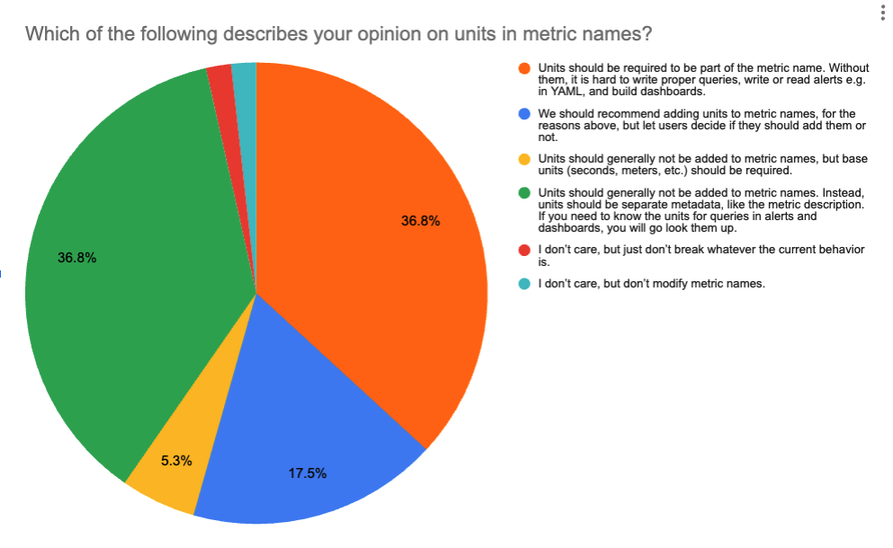

[Prometheus](https://prometheus.io/) and OpenTelemetry are two of the most
active and popular projects in the
[CNCF observability landscape](https://landscape.cncf.io/guide#observability-and-analysis--observability).
The two communities have been working together since the early days of
OpenTelemetry to improve the compatibility between the two projects. The
OpenTelemetry Prometheus SIG has been leading this effort, with the active
participation of maintainers from both OpenTelemetry and Prometheus.

At this point, there is a
[detailed, experimental specification](/docs/specs/otel/compatibility/prometheus_and_openmetrics/)
describing how to convert between the
[OpenTelemetry metrics data model](/docs/specs/otel/metrics/data-model/#opentelemetry-protocol-data-model)
and
[Prometheus metric formats](https://github.com/prometheus/docs/blob/main/docs/instrumenting/exposition_formats.md).
It has been used to implement Prometheus
[(pull) exporters for OpenTelemetry SDKs](https://pkg.go.dev/go.opentelemetry.io/otel/exporters/prometheus),
[OTLP export from Prometheus libraries](https://prometheus.github.io/client_java/otel/otlp/),
[OTLP ingestion for the Prometheus server](https://prometheus.io/docs/prometheus/2.55/feature_flags/#otlp-receiver),
and the OpenTelemetry Collector's
[Prometheus Receiver](https://github.com/open-telemetry/opentelemetry-collector-contrib/tree/main/receiver/prometheusreceiver),
[Prometheus Remote Write exporter](https://github.com/open-telemetry/opentelemetry-collector-contrib/tree/main/exporter/prometheusremotewriteexporter),
and
[Prometheus (pull) exporter](https://github.com/open-telemetry/opentelemetry-collector-contrib/tree/main/exporter/prometheusexporter).

One of the most challenging areas to reconcile is that OpenTelemetry metric
names are changed when exporting to Prometheus. Today, the OpenTelemetry
`http.server.request.duration` metric, with unit `s`, is translated to
`http_server_request_duration_seconds` in Prometheus. Some users are familiar
with the Prometheus naming conventions, and appreciate the consistency this
translation provides with existing metrics in the Prometheus ecosystem. Other
users are confused when querying for the original OpenTelemetry name does not
return any results.

Prometheus is working on support for UTF-8 characters in metric names as part of
its
[2024 roadmap](https://prometheus.io/blog/2024/03/14/commitment-to-opentelemetry/#support-utf-8-metric-and-label-names),
which potentially allows preserving dots in metric names. To better understand
what users want their Prometheus query experience to look like,
[the OTel x Prometheus Working Group](https://cloud-native.slack.com/archives/C01LSCJBXDZ)
[ran a survey](https://github.com/open-telemetry/sig-end-user/tree/main/end-user-surveys/otel-prom-interoperability)
with the help of the [OpenTelemetry End User SIG](/community/end-user/).
Deciding on the default translation approach is one of the last remaining
blockers for stabilizing the compatibility specification.

The
[survey received 86 responses (and 5 spam)](https://github.com/open-telemetry/sig-end-user/blob/main/end-user-surveys/otel-prom-interoperability/otel-prom-interoperability-survey.csv),
and contained many helpful pieces of feedback. Thank you to everyone that
participated!

## Overall takeaways

- A majority (60%) prefer leaving the dots in the metric name, rather than
  translating to underscores.
- A slight majority (54%) prefer having the unit in the name, but only 37% think
  it should be required.
- Respondents who prefer units in the metric name are likely to also prefer
  translating dots to underscores.
- The best predictors of the "units and underscores" group are Prometheus server
  experts and being an SRE.
- The best predictors of the "no units and dots" group are OpenTelemetry library
  experts and being a developer.

## Who took the survey

Survey respondents were mostly from large (>1000 employees) companies (52%) in
the Technology industry (71%). Respondents were more likely to consider
themselves experts with Prometheus-related topics than with
OpenTelemetry-related topics, and were evenly distributed across roles. Nearly
all respondents (>90%) stored metrics in the Prometheus server or another open
source Prometheus backend, and nearly all use PromQL to query their metrics.

## Sentiment on the Current State

Overall, respondents were neutral on the question of whether OpenTelemetry was
easy to use with Prometheus, and considered the current translation between
OpenTelemetry and Prometheus somewhat confusing. This was consistent regardless
of their opinions on units or delimiters.

## Dots and Underscores

OpenTelemetry [specifies](/docs/specs/semconv/general/naming/) that conventions
should use dots as the namespace delimiter, and underscores as the delimiter
between "multi-word-dot-delimited components" (for example,
`http.response.status_code`). On the other hand, Prometheus
[uses underscores](https://prometheus.io/docs/concepts/data_model/#metric-names-and-labels)
as its delimiter.

Currently, when exporting in Prometheus format from an OpenTelemetry SDK, all
dots are changed to underscores to comply with the Prometheus requirements. We
wanted to learn whether OpenTelemetry users who used these exporters preferred
to keep the dots in the original metric name, or liked the consistency with
existing Prometheus metrics of translating to underscores.

Of users who indicated they used OpenTelemetry for metrics, and PromQL as their
query language, 60% preferred keeping the original OpenTelemetry metric name
including dots, and 40% want metric names that match Prometheus conventions with
only underscores.

When we asked about specific example PromQL queries or alerts, the results
roughly aligned with the results above. Around 42% of users only selected
queries with dots, and around 39% only selected queries that had underscores.
The final 19% selected a mix of queries that included dots or underscores,
indicating they are likely OK with either approach.

## Units in Metric Names

OpenTelemetry [specifies](/docs/specs/semconv/general/metrics/#units) that units
should not generally be included in the metric name. Prometheus conventions
[recommend](https://prometheus.io/docs/practices/naming/#metric-names) that the
unit be included as a suffix of the metric name. OpenMetrics goes a step further
and
[requires this unit suffix](https://github.com/prometheus/OpenMetrics/blob/v1.0.0/specification/OpenMetrics.md#unit).
Currently, when exporting in Prometheus format from an OpenTelemetry SDK, the
unit is added as a suffix to the metric name.

Of users who indicated they used OpenTelemetry for metrics, and PromQL as their
query language, 37% thought units should be a required suffix for metric names,
and 46% thought units should not be added to metric names. The final 17%
preferred the unit in the metric name, but didn't think it should be required.

When we asked about specific example PromQL queries or alerts, the results were
somewhat more favorable to including the unit in the metric name compared with
the question above. Around 45% of users only selected queries that included the
unit, and around 28% only selected queries that excluded the unit. The final 27%
selected a mix of queries that included or excluded the unit, indicating they
are likely OK with either approach.

## Trends

### Correlation between Unit and Delimiter Preferences

Preferences generally split into two groups: Those that want to preserve the
original OpenTelemetry metric names, including dots, and without a unit suffix,
and those that prefer changing the name to match Prometheus conventions. 57% of
respondents who want to require units in metric names want to also want to
change dots to underscores. 77% of respondents who don't want units in metric
names prefer dots in metric names.

### Group Differences

The best predictors of a preference for units required in the name and changing
dots to underscores were having a role of SRE, and being an expert with the
Prometheus server configuration. For example, 88% of SRE respondents preferred
translating dots to underscores.

The best predictors of a preference for preserving the OpenTelemetry name with
dots, and without units were having the role of developer, and being an expert
with OpenTelemetry libraries. For example, 88% of developers preferred not
translating dots to underscores.

## Other feedback

The most common challenge for all respondents was the instability of
OpenTelemetry instrumentation, and confusion over the conversion logic.
Respondents who preferred OpenTelemetry's conventions listed Prometheus' current
lack of support for OpenTelemetry concepts (resource, scope, delta temporality,
and unit metadata) as their most significant challenge. Respondents who
preferred Prometheus' conventions listed OpenTelemetry's new concepts as
confusing, and were unhappy that OpenTelemetry had deviated from Prometheus'
existing conventions.

For the most part, this feedback aligns with the future plans in the
OpenTelemetry and Prometheus communities. The OpenTelemetry semantic conventions
SIG is working on stabilizing conventions for a wide variety of instrumentation.
The OpenTelemetry Prometheus interoperability SIG is working on incorporating
the results of this survey into the compatibility specification. The Prometheus
community has
[ambitious plans](https://prometheus.io/blog/2024/03/14/commitment-to-opentelemetry/)
to add support for OpenTelemetry concepts.

## Keep in touch

Thanks again to everyone who participated in the survey! We rely on your
feedback to help guide the future development of OpenTelemetry and to ensure it
continues to meet your evolving needs. We will post upcoming surveys in the
following avenues:

- [#otel-sig-end-user Slack channel](https://cloud-native.slack.com/archives/C01RT3MSWGZ)
  – you can also reach out to us here!
- [End user resources page](/community/end-user/)

You can provide further feedback or participate in discussions concerning
OpenTelemetry and Prometheus interoperability in the
[#otel-prometheus-wg Slack channel](https://cloud-native.slack.com/archives/C01LSCJBXDZ).
