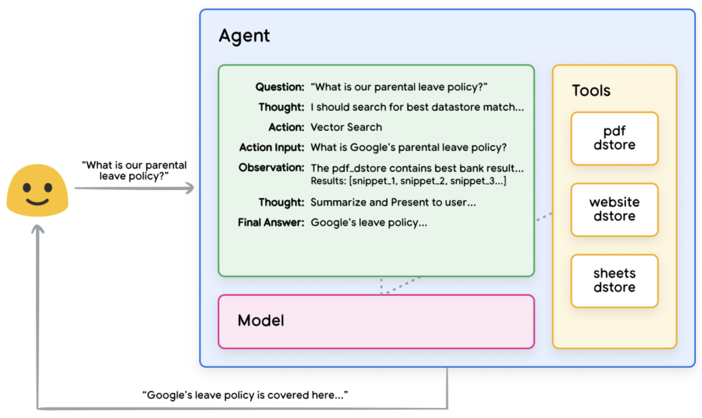
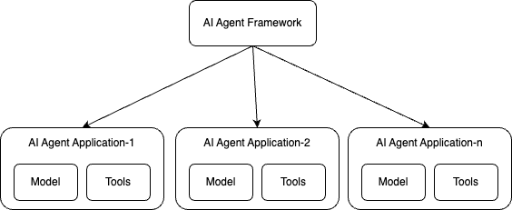

## 2025: Year of AI agents

AI Agents are becoming the next big leap in artificial intelligence in 2025.
From autonomous workflows to intelligent decision making, AI Agents will power
numerous applications across industries. However, with this evolution comes the
critical need for AI agent observability, especially when scaling these agents
to meet enterprise needs. Without proper monitoring, tracing, and logging
mechanisms, diagnosing issues, improving efficiency, and ensuring reliability in
AI agent-driven applications will be challenging.

### What is an AI agent

An AI agent is an application that uses a combination of LLM capabilities, tools
to connect to the external world, and high-level reasoning to achieve a desired
end goal or state; Alternatively, agents can also be treated as systems where
LLMs dynamically direct their own processes and tool usage, maintaining control
over how they accomplish tasks.

<small>_Image credit_:
[Google AI Agent Whitepaper](https://www.kaggle.com/whitepaper-agents).</small>

For more information about AI agents, see:

- [Google: What is an AI agent?](https://cloud.google.com/discover/what-are-ai-agents)
- [IBM: What are AI agents?](https://www.ibm.com/think/topics/ai-agents)
- [MicroSoft: AI agents — what they are, and how they’ll change the way we work](https://news.microsoft.com/source/features/ai/ai-agents-what-they-are-and-how-theyll-change-the-way-we-work/)
- [AWS: What are AI Agents?](https://aws.amazon.com/what-is/ai-agents/)
- [Anthropic: Building effective agents](https://www.anthropic.com/research/building-effective-agents)

### Observability and beyond

Typically, telemetry from applications is used to monitor and troubleshoot them.
In the case of an AI agent, given its non-deterministic nature, telemetry is
also used as a feedback loop to continuously learn from and improve the quality
of the agent by using it as input for evaluation tools.

Given that observability and evaluation tools for GenAI come from various
vendors, it is important to establish standards around the shape of the
telemetry generated by agent apps to avoid lock-in caused by vendor or framework
specific formats.

## Current state of AI agent observability

As AI agent ecosystems continue to mature, the need for standardized and robust
observability has become more apparent. While some frameworks offer built-in
instrumentation, others rely on integration with observability tools. This
fragmented landscape underscores the importance of the
[GenAI observability project](https://github.com/open-telemetry/community/blob/main/projects/gen-ai.md)
and OpenTelemetry’s emerging semantic conventions, which aim to unify how
telemetry data is collected and reported.

### Understanding AI agent application vs. AI agent framework

It is crucial to distinguish between **AI agent application** and **AI agent
frameworks**:

- **AI agent application** refer to individual AI-driven entities that perform
  specific tasks autonomously.
- **AI agent framework** provide the necessary infrastructure to develop,
  manage, and deploy AI agents often in a more streamlined way than building an
  agent from scratch. Examples include the following:
  [IBM Bee AI](https://github.com/i-am-bee),
  [IBM wxFlow](https://github.com/IBM/wxflows/),
  [CrewAI](https://www.crewai.com/),
  [AutoGen](https://microsoft.github.io/autogen/dev/),
  [Semantic Kernel](https://github.com/microsoft/semantic-kernel),
  [LangGraph](https://www.langchain.com/langgraph),
  [PydanticAI](https://ai.pydantic.dev/) and more.

### Establishing a standardized semantic convention

Today, the
[GenAI observability project](https://github.com/open-telemetry/community/blob/main/projects/gen-ai.md)
within OpenTelemetry is actively working on defining semantic conventions to
standardize AI agent observability. This effort is primarily driven by:

- **Agent application semantic convention** – A draft AI agent application
  semantic convention has already been established and finalized as part of the
  discussions in the
  [OpenTelemetry semantic conventions repository](https://github.com/open-telemetry/semantic-conventions/issues/1732).
  The initial AI agent semantic convention is based on
  [Google's AI agent white paper](https://www.kaggle.com/whitepaper-agents),
  providing a foundational framework for defining observability standards.
  Moving forward, we will continue to refine and enhance this initial convention
  to make it more robust and comprehensive.
- **Agent framework semantic convention** – Now, the focus has shifted towards
  defining a common semantic convention for all AI agent frameworks. This effort
  is being discussed in
  [this OpenTelemetry issue](https://github.com/open-telemetry/semantic-conventions/issues/1530)
  and aims to establish a standardized approach for frameworks such as IBM Bee
  Stack, IBM wxFlow, CrewAI, AutoGen, LangGraph, and others. Additionally,
  different AI Agent frameworks will be able to define their own Framework
  Vendor Specific Semantic Convention while adhering to the common standard.

By establishing these conventions, we ensure that AI agent frameworks can report
standardized metrics, traces, and logs, making it easier to integrate
observability solutions and compare performance across different frameworks.

Note: Experimental conventions already exist in OpenTelemetry for models at
[GenAI semantic convention](/docs/specs/semconv/gen-ai/).

### Instrumentation approaches

In order to make a system observable, it must be instrumented: That is, code
from the system’s components must
[emit traces, metrics, and logs](/docs/concepts/instrumentation/).

Different AI agent frameworks have varying approaches to implementing
observability, mainly categorized into two options:

#### Option 1: Baked-in instrumentation

The first option is to implement built-in instrumentation that emits telemetry
using OpenTelemetry semantic conventions. This means observability is a native
feature, allowing users to seamlessly track agent performance, task execution,
and resource utilization. Some AI agent frameworks, such as CrewAI, follow this
pattern.

As a developer of an agent framework, here are some pros and cons of this
baked-in instrumentation:

- Pros
  - You can take on the maintenance overhead of keeping the instrumentation for
    telemetry up-to-date.
  - Simplifies adoption for users unfamiliar with OpenTelemetry configuration.
  - Keep new features secret while providing instrumentation for them on the day
    of release.
- Cons
  - Adds bloat to the framework for users who do not need observability
    features.
  - Risk of version lock-in if the framework’s OpenTelemetry dependencies lag
    behind upstream updates.
  - Less flexibility for advanced users who prefer custom instrumentation.
  - You may not get feedback/review from OTel contributors familiar with current
    semantic conventions.
  - Your instrumentation may lag with respect to best practices/conventions (not
    just the version of the OTel library dependencies).
- Some best practices to follow if you consider this approach:
  - Provide a configuration setting that lets users easily enable or disable
    telemetry collection from your framework's built-in instrumentation.
  - Plan ahead of users wanting to use other external instrumentation packages
    and avoid collision.
  - Consider listing your agent framework in the
    [OpenTelemetry registry](/ecosystem/registry/) if you choose this path.
- As a developer of an agent application, you may want to choose an agent
  framework with baked-in instrumentation if…
  - Minimal dependencies on external packages in your agent app code.
  - Out-of-the-box observability without manual setup.

#### Option 2: Instrumentation via OpenTelemetry

This option is to publish OpenTelemetry instrumentation libraries to some GitHub
repositories. These instrumentation libraries can be imported into agents and
configured to emit telemetry per OpenTelemetry semantic conventions.

For publishing instrumentation with OpenTelemetry, there are two options:

- Option 1: External instrumentation in your own repository/package, like
  [Traceloop OpenTelemetry Instrumentation](https://github.com/traceloop/openllmetry/tree/main/packages),
  [Langtrace OpenTelemetry Instrumentation](https://github.com/Scale3-Labs/langtrace-python-sdk/tree/main/src/langtrace_python_sdk/instrumentation)
  etc.
- Option 2: External instrumentation in OpenTelemetry owned repository, like
  [instrumentation-genai](https://github.com/open-telemetry/opentelemetry-python-contrib/tree/main/instrumentation-genai)
  etc.

Both options work well, but the long term goal is to host the code in
OpenTelemetry owned repositories, like Traceloop is trying to
[donate the instrumentation code](https://github.com/open-telemetry/community/issues/2571)
to OpenTelemetry now.

As a developer of an agent framework, here are some pros and cons of
instrumentation with OpenTelemetry:

- Pros
  - Decouples observability from the core framework, reducing bloat.
  - Leverages OpenTelemetry’s community-driven maintenance for instrumentation
    updates.
  - Allows users to mix and match contrib libraries for their specific needs
    (e.g., cloud providers, LLM vendors).
  - More likely to leverage best practices around semantic conventions and
    zero-code instrumentation
- Cons
  - Risk of fragmentation if users rely on incompatible or outdated contrib
    packages for both install time and runtime.
  - Development velocity slows down when there are too many PRs in the
    OpenTelemetry review queue.
- Best practices for this approach:
  - Ensure compatibility with popular OpenTelemetry contrib libraries (e.g., LLM
    vendors, vector DBs).
  - Provide clear documentation on recommended contrib packages and
    configuration examples.
  - Avoid reinventing the wheel; align with existing OpenTelemetry standards.
- As a developer of an agent application, you may want to choose an agent
  framework with baked-in instrumentation if…
  - You need fine-grained control over telemetry sources and destinations.
  - Your use case requires integrating observability with niche or custom tools.

**NOTE:** Regardless of the approach taken, it is essential that all AI agent
frameworks adopt the AI agent framework semantic convention to ensure
interoperability and consistency in observability data.

## Future of AI agent observability

Looking ahead, AI agent observability will continue to evolve with:

- **More robust semantic conventions** to cover edge cases and emerging AI agent
  frameworks.
- **A unified AI agent framework semantic convention** to ensure
  interoperability across different frameworks while allowing flexibility for
  vendor-specific extensions.
- **Continuous improvements to the AI agent semantic convention** to refine the
  initial standard and address new challenges as AI agents evolve.
- **Improved tooling** for monitoring, debugging, and optimizing AI agents.
- **Tighter integration with AI model observability** to provide end-to-end
  visibility into AI powered applications.

## Role of OpenTelemetry's GenAI SIG

The
[GenAI Special Interest Group (SIG) in OpenTelemetry](https://github.com/open-telemetry/community/blob/main/projects/gen-ai.md)
is actively defining [GenAI semantic conventions](/docs/specs/semconv/gen-ai/)
that cover key areas such as:

- LLM or model semantic conventions
- VectorDB semantic conventions
- AI agent semantic conventions (a critical component within the broader GenAI
  semantic convention)

In addition to conventions, the SIG has also expanded its scope to provide
instrumentation coverage for agents and models in Python and other languages. As
AI Agents become increasingly sophisticated, observability will play a
fundamental role in ensuring their reliability, efficiency, and trustworthiness.
Establishing a standardized approach to AI Agent observability requires
collaboration, and we invite contributions from the broader AI community.

We look forward to partnering with different AI agent framework communities to
establish best practices and refine these standards together. Your insights and
contributions will help shape the future of AI observability, fostering a more
transparent and effective AI ecosystem.

Don’t miss this opportunity to help shape the future of industry standards for
GenAI Observability! Join us on the [CNCF Slack](https://slack.cncf.io)
`#otel-genai-instrumentation` channel, or by attending a
[GenAI SIG meeting](https://github.com/open-telemetry/community/blob/main/projects/gen-ai.md#meeting-times).
