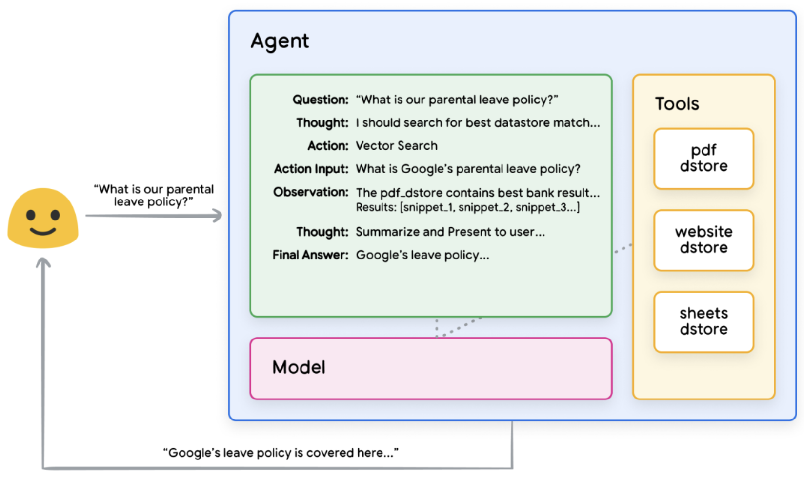

## 2025: The Year of AI Agents

As we move towards 2025, AI Agents are becoming the next big leap in artificial
intelligence. From autonomous workflows to intelligent decision-making, AI
Agents will power numerous applications across industries. However, with this
evolution comes the critical need for AI Agent Observability - especially when
scaling these agents to meet enterprise needs. Without proper monitoring,
tracing, and logging mechanisms, diagnosing issues, improving efficiency, and
ensuring reliability in AI Agent-driven applications will be challenging.

### What is an AI Agent

An AI agent is an application that uses a combination of a generative model’s
capabilities, tools to connect to the external world, and high-level reasoning
to achieve a desired end goal or state.

You can also refer to following to get more detail for AI agents:

- [Google: What is an AI agent?](https://cloud.google.com/discover/what-are-ai-agents)
- [IBM: What are AI agents?](https://www.ibm.com/think/topics/ai-agents)
- [MicroSoft: AI agents — what they are, and how they’ll change the way we work](https://news.microsoft.com/source/features/ai/ai-agents-what-they-are-and-how-theyll-change-the-way-we-work/)
- [AWS: What are AI Agents?](https://aws.amazon.com/what-is/ai-agents/)

### Observability and Beyond

Typically, telemetry from applications is used to monitor and troubleshoot
them - in AI agents’ case, given its non-deterministic nature, telemetry is also
used as a feedback loop to continuously learn from and improve the quality of
the agent by using it as input for evaluation tools.

Given both observability and evaluation tools for GenAI are from various
vendors, it is important to establish standards around the shape of the
telemetry generated by agent apps to avoid lock-in caused by vendor or framework
specific formats.

## The Current State of AI Agent Observability

### Understanding AI Agent applications vs. AI Agent Frameworks

It is crucial to distinguish between **AI Agent Application** and **AI Agent
Frameworks**:

- **AI Agent applications** refer to individual AI-driven entities that perform
  specific tasks autonomously.
- **AI Agent Frameworks** provide the necessary infrastructure to develop,
  manage, and deploy AI Agents often in a more streamlined way than building an
  agent from scratch. Examples include IBM Bee Stack, IBM wxFlow, CrewAI,
  AutoGen, LangGraph, PydanticAI and more.

### Establishing a Standardized Semantic Convention

Today, the
[GenAI observability project](https://github.com/open-telemetry/community/blob/main/projects/gen-ai.md)
within OpenTelemetry is actively working on defining semantic conventions to
standardize AI Agent observability. This effort is primarily driven by:

- **Agent Semantic Convention** – A draft AI Agent Semantic Convention has
  already been established and finalized as part of the discussions in the
  [OpenTelemetry semantic conventions repository](https://github.com/open-telemetry/semantic-conventions/issues/1732).
  The initial AI Agent Semantic Convention is based on
  [Google's AI Agent white paper](https://www.kaggle.com/whitepaper-agents),
  providing a foundational framework for defining observability standards.
  Moving forward, we will continue to refine and enhance this initial convention
  to make it more robust and comprehensive.
- **Agent Framework Semantic Convention** – Now, the focus has shifted towards
  defining a common semantic convention for all AI Agent frameworks. This effort
  is being discussed in
  [this OpenTelemetry issue](https://github.com/open-telemetry/semantic-conventions/issues/1530)
  and aims to establish a standardized approach for frameworks such as IBM Bee
  Stack, IBM wxFlow, CrewAI, AutoGen, LangGraph, and others. Additionally,
  different AI Agent frameworks will be able to define their own Framework
  Vendor Specific Semantic Convention while adhering to the common standard.

By establishing these conventions, we ensure that AI Agent frameworks can report
standardized metrics, traces, and logs, making it easier to integrate
observability solutions and compare performance across different frameworks.

Note: Experimental conventions already exist in OpenTelemetry for models at
[GenAI Semantic Convention](/docs/specs/semconv/gen-ai/).

### Instrumentation Approaches for AI Agent Frameworks

In order to make a system observable, it must be instrumented: That is, code
from the system’s components must
[emit traces, metrics, and logs](/docs/concepts/instrumentation/).

Different AI Agent frameworks have varying approaches to implementing
observability, mainly categorized into two options:

#### Option 1: Baked-in Instrumentation

The first option is to implement built-in instrumentation that emits telemetry
using OpenTelemetry semantic conventions. This means observability is a native
feature, allowing users to seamlessly track agent performance, task execution,
and resource utilization. Some AI Agent frameworks, such as CrewAI, follow this
pattern.

As a developer of an agent framework, here are some pros and cons of this
baked-in instrumentation:

- Pros
  - You can take on the maintenance overhead of keeping the instrumentation for
    telemetry up-to-date.
  - Simplifies adoption for users unfamiliar with OpenTelemetry configuration.
- Cons
  - Adds bloat to the framework for users who do not need observability
    features.
  - Risk of version lock-in if the framework’s OpenTelemetry dependencies lag
    behind upstream updates.
  - Less flexibility for advanced users who prefer custom instrumentation.
- Some best practices to follow if you consider this approach:
  - Consider X as the mechanism through which you allow users of your framework
    to toggle emitting telemetry from the baked-instrumentation on/off.
  - Plan ahead of users wanting to use other external instrumentation packages
    and avoid collision.
  - Consider listing your agent framework in the OpenTelemetry registry if you
    choose this path.
- As a developer of an agent application, you may want to choose an agent
  framework with baked-in instrumentation if you prefer…
  - Minimal dependencies on external packages in your agent app code
  - Out-of-the-box observability without manual setup.

#### Option 2: Instrumentation via OpenTelemetry contrib

The second option is to publish language-specific libraries to the OpenTelemetry
contrib libraries (ex:
[opentelemetry-instrumentation-vertexai](https://github.com/open-telemetry/opentelemetry-python-contrib/tree/main/instrumentation-genai/opentelemetry-instrumentation-vertexai)).
These libraries can be imported into agents and configured to emit telemetry per
OpenTelemetry semantic conventions.

As a developer of an agent framework, here are some pros and cons of this
baked-in instrumentation:

- Pros
  - Decouples observability from the core framework, reducing bloat.
  - Leverages OpenTelemetry’s community-driven maintenance for instrumentation
    updates.
  - Allows users to mix and match contrib libraries for their specific needs
    (e.g., cloud providers, LLM vendors).
- Cons
  - Users must manually install and configure contrib libraries, increasing
    setup complexity.
  - Risk of fragmentation if users rely on incompatible or outdated contrib
    packages.
  - Less control over telemetry quality and coverage compared to baked-in
    approaches.
- Best practices for this approach:
  - Ensure compatibility with popular OpenTelemetry contrib libraries (e.g., LLM
    vendors, vector DBs).
  - Provide clear documentation on recommended contrib packages and
    configuration examples.
  - Avoid reinventing the wheel; align with existing OpenTelemetry standards.
- As a developer of an agent application, you may want to choose an agent
  framework with baked-in instrumentation if you prefer…
  - You need fine-grained control over telemetry sources and destinations.
  - Your use case requires integrating observability with niche or custom tools.

**NOTE:** Regardless of the approach taken, it is essential that all AI Agent
frameworks adopt the AI Agent Framework Semantic Convention to ensure
interoperability and consistency in observability data.

## The Future of AI Agent Observability

Looking ahead, AI Agent observability will continue to evolve with:

- **More robust semantic conventions** to cover edge cases and emerging AI Agent
  frameworks.
- **A unified AI Agent Framework Semantic Convention** to ensure
  interoperability across different frameworks while allowing flexibility for
  vendor-specific extensions.
- **Continuous improvements to the AI Agent Semantic Convention** to refine the
  initial standard and address new challenges as AI Agents evolve.
- **Improved tooling** for monitoring, debugging, and optimizing AI Agents.
- **Tighter integration with AI model observability** to provide end-to-end
  visibility into AI-powered applications.

## The Role of OpenTelemetry's GenAI Special Interest Group

The **GenAI Special Interest Group (SIG) in OpenTelemetry** is actively defining
a set of **GenAI Semantic Conventions**, which encompasses several key areas:

- LLM or Model Semantic Conventions
- VectorDB Semantic Conventions
- AI Agent Semantic Conventions (a critical component within the broader GenAI
  Semantic Convention)

In addition to conventions, the SIG has also expanded its scope to provide
instrumentation coverage for agents and models in Python and other languages.As
AI Agents become increasingly sophisticated, observability will play a
fundamental role in ensuring their reliability, efficiency, and trustworthiness.
Establishing a standardized approach to AI Agent observability requires
collaboration, and we invite contributions from the broader AI community.

We look forward to partnering with different AI Agent framework communities to
establish best practices and refine these standards together. Your insights and
contributions will help shape the future of AI observability, fostering a more
transparent and effective AI ecosystem.

Don’t miss this opportunity to help shape the future of industry standards for
GenAI Observability! Join us on the CNCF Slack channel
**#otel-genai-instrumentation-wg** or by attending a
[GenAI SIG meeting](https://github.com/open-telemetry/community/blob/main/projects/gen-ai.md#meeting-times).
