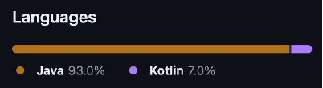
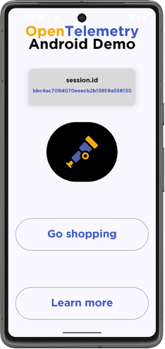
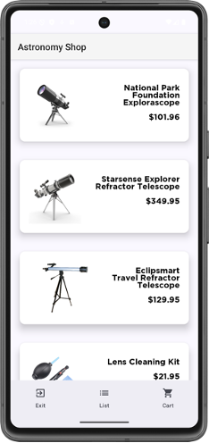
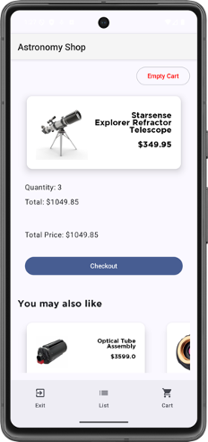

**TL;DR – We want your
[feedback](https://github.com/open-telemetry/opentelemetry-android/issues/1257)
about the OpenTelemetry Android agent API before it stabilizes.**

Great news! The OpenTelemetry Android SIG is actively working on stabilizing the
main initialization and configuration APIs in order to prepare for a 1.0.0
stable release. What does this mean for the mobile RUM developer? Are you
interested in helping out? Read on to learn more.

## Where we came from

Two years ago, OpenTelemetry Android was a newborn – warmly received by the
community as a
[donation](https://github.com/open-telemetry/community/issues/1400) from Splunk.
It consisted of a
[GitHub repository](https://github.com/open-telemetry/opentelemetry-android)
with a single monolithic module that published a single monolithic artifact. It
was layered on top of the
[opentelemetry-java](https://github.com/open-telemetry/opentelemetry-java) APIs
and SDK, and it was primarily written in Java. This was a robust start to the
project that garnered rapid early interest. Even back then, it was already being
used in production deployments.

The community rallied, and we assembled a crew of maintainers and approvers
(across 4 different vendors) to shepherd the code and guide continuous
improvement of the project.

## What we have accomplished

It didn’t take long for us to identify some areas for improvement, and we’ve
made some considerable progress over the last 1250+ pull requests from more than
40 contributors! If you’re one of those 40 – thank you – your help is sincerely
appreciated. ❤️

Here’s a summary of the major enhancements from the last two years.

### Modularization

The monolithic structure of the project initially proved to be cumbersome. It
increased binary size and mostly tried to include all features for all users.
The flat package structure made it challenging for users to understand which
parts were API surface and which parts were internal. Before long, we undertook
a modularization effort that split to project into a graph of collaborating,
single-purpose modules that publish their own individual artifacts. This clearer
separation of concerns was a major win!

In addition to publishing separate modules, we also
[publish a bill-of-materials (bom)](https://central.sonatype.com/artifact/io.opentelemetry.android/opentelemetry-android-bom),
which can be used by developers to keep the versions of these many modules in
sync.

### New instrumentation

Through community contributions, the OpenTelemetry Android project gained a
number of useful new instrumentation libraries. These include:

- [android-log](https://github.com/open-telemetry/opentelemetry-android/tree/main/instrumentation/android-log) -
  the ability to generate OTel log records from idiomatic Android `Log.x(...)`
  calls.
- [httpurlconnection](https://github.com/open-telemetry/opentelemetry-android/tree/main/instrumentation/httpurlconnection) -
  tracing instrumentation for this runtime-supplied HTTP client with a lot of
  history.
- [view-click](https://github.com/open-telemetry/opentelemetry-android/tree/main/instrumentation/view-click)
  – generates click events for user presses on Android Views.
- [compose-click](https://github.com/open-telemetry/opentelemetry-android/tree/main/instrumentation/compose/click)
  – generates click events for user presses within Jetpack Compose components
- [sessions](https://github.com/open-telemetry/opentelemetry-android/tree/main/instrumentation/sessions)
  – generates events when the session lifecycle changes

### Auto-instrumentation

Unlike its cousin the
[OpenTelemetry Java agent](https://github.com/open-telemetry/opentelemetry-java-instrumentation),
the Android agent is unable to do bytecode weaving to instrument classes at
runtime, due to platform restrictions. The ability to have your code
automatically instrumented for you is super powerful, though, and users often
prefer instrumentation without making code changes.

Some instrumentation can now be applied with a gradle plugin at build time,
without the need for manual code changes or the explicit use of OpenTelemetry
wrapper classes. At the time of this writing, this includes the Android log
instrumentation and the HTTP client instrumentation, and we expect more
auto-instrumentation in the future.

### Documentation

We recently completed an initiative to create
[documentation for each instrumentation module](https://github.com/open-telemetry/opentelemetry-android/issues/742).
This provides users with a way to quickly determine what telemetry will be
generated by each instrumentation module. It also includes instructions for
users who may want to leverage the instrumentation on its own, without the
agent.

### Events/Semconv

In the mobile world, user generated events are everywhere. Real User Monitoring
(RUM) often shows user behavior as a series of events within a session. When
OpenTelemetry Android first began, the
[OpenTelemetry events signal](/docs/specs/semconv/general/events/) was in its
infancy, and all events were clumsily modeled as zero-duration Spans.
Furthermore, there were very few semantic conventions in this domain, and span
names and attributes didn’t follow common OpenTelemetry conventions, like dots
and namespaces.

A handful of the OpenTelemetry contributors have been involved in the definition
of semantic conventions for Android, mobile, and general client use cases. These
have been adopted by the Android project, and zero-duration Spans are now
correctly modeled as events.

### Migration to Kotlin

Kotlin is the primary language used by contemporary Android developers. Although
Kotlin has reasonable interoperability with Java APIs/libraries, users expect
Kotlin first. At the start of OpenTelemetry Android, the vast majority of code
was in Java, with only a small bit in Kotlin. For example, in April 2024 (the
first sample taken by the
[Wayback Machine](https://web.archive.org/web/20250000000000*/https://github.com/open-telemetry/opentelemetry-android)):

Although this is still an ongoing effort, we have made considerable progress.
Fast forward to today, September 2025:

### Demo app

To demonstrate how to integrate OpenTelemetry Android with your mobile
applications, we have created a new sample app. This demo app is modeled closely
after the
[OpenTelemetry Demo](https://github.com/open-telemetry/opentelemetry-demo)
Astronomy Shop and is
[included in the Android GitHub repository](https://github.com/open-telemetry/opentelemetry-android/tree/main/demo-app).
In addition to demonstrating how to set up the agent and install
instrumentation, the demo app also has features that generate off-the-shelf logs
and tracing telemetry.

 

To demonstrate some more realistic mobile concerns, there are also features that
intentionally cause problems, such as slow rendering and crashing the app.

## Looking ahead

[We want your feedback on the agent API!](https://github.com/open-telemetry/opentelemetry-android/issues/1257)

We have reached a point where it is time to start thinking about the next phase
of OpenTelemetry Android: Stability. After many PRs, much discussion,
refactoring, deliberation, and continuous refinement, we believe we are
approaching an initialization API that we are happy to maintain as “stable” for
the life of a 1.x lineage.

The October 2025 release will be our first release candidate: `1.0.0-rc1`.

Starting with this version, all artifacts will be published with an `-alpha`
suffix, except for the android-agent. This `-alpha` suffix helps to clearly
communicate which modules are still alpha and subject to user-facing API
changes. All instrumentation modules will remain “alpha”, and the telemetry
generated will remain in “development” until the relevant semconv stabilizes.

We believe that the `android-agent` is the primary way that most Android
developers will interact with this OTel instrumentation. As such, we feel like
we have reached a point where:

- The APIs are convenient to use
- The APIs cover 90% of common uses
- Nonstandard use cases and expert customizations are still possible

This is where you come in! We need you to earnestly try out the android-agent
and
[provide feedback](https://github.com/open-telemetry/opentelemetry-android/issues/1257)
on the `OpenTelemetryRumInitializer` API. We genuinely appreciate all feedback
and will use your feedback while applying the final polish to this API and
before making our final “stable” determination. Thanks for reading this, and we
look forward to hearing from you.
